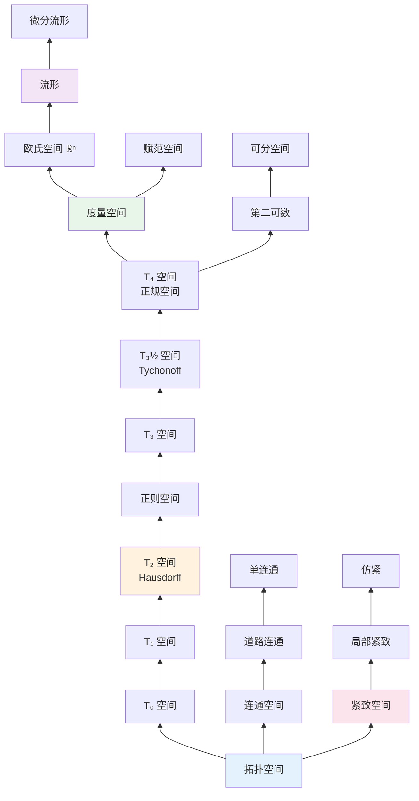

msc_primary: "54A05"
msc_secondary: ['54D10', '54D15', '54D30']
concept_type: "概念可视化"
visualization_type: "关系图、分类图"
---

# 拓扑空间类型关系图

## 描述

本可视化展示各种拓扑空间类型之间的包含关系与蕴含关系，帮助理解从一般拓扑空间到特殊拓扑空间（如度量空间、紧致空间）的分类体系。

## 数学概念

拓扑空间是几何学和代数学的交汇点，研究在连续变形下保持不变的性质。不同类型的拓扑空间具有不同的分离性、紧致性和连通性。

## 可视化代码

### 拓扑空间分类层次图



### 分离公理关系图

```mermaid
graph LR
    subgraph 分离公理链
    T0[T₀: Kolmogorov<br/>∀x≠y, ∃开集含其一]<br/>↓<br/>T1[T₁: Fréchet<br/>点都是闭集]<br/>↓<br/>T2[T₂: Hausdorff<br/>∀x≠y, 有不相交邻域]<br/>↓<br/>T25[T₂½: 完全Hausdorff]<br/>↓<br/>T3[T₃: 正则Hausdorff]<br/>↓<br/>T35[T₃½: Tychonoff<br/>完全正则]<br/>↓<br/>T4[T₄: 正规Hausdorff<br/>不相交闭集可分离]<br/>↓<br/>T5[T₅: 完全正规]<br/>↓<br/>T6[T₆: 完美正规]
    end

    style T0 fill:#e3f2fd
    style T2 fill:#fff3e0
    style T4 fill:#e8f5e9

```

### ASCII拓扑空间分类表

```

拓扑空间分类体系
═══════════════════════════════════════════════════════════════

分离公理谱系:
───────────────────────────────────────────────────────────────
T₀ (Kolmogorov)     任意两点至少一个有不包含另一点的邻域
        ↓
T₁ (Fréchet)        单点集是闭集
        ↓
T₂ (Hausdorff)      任意两点有不相交的邻域
        ↓
T₃ (正则)           T₁ + 点与不含它的闭集可分离
        ↓
T₃½ (Tychonoff)     T₁ + 点与闭集可用连续函数分离
        ↓
T₄ (正规)           T₁ + 不相交闭集可分离
        ↓
T₅ (完全正规)       任意子空间都是T₄
        ↓
T₆ (完美正规)       闭集是连续函数的零点集
───────────────────────────────────────────────────────────────

紧致性层次:
═══════════════════════════════════════════════════════════════
┌─────────────────┐    ┌─────────────────┐    ┌─────────────┐
│   紧致 Compact  │───→│ 序列紧致 SeqCmp │───→│极限点紧致 LPS│
│  (任意开覆盖有   │    │ (任意序列有     │    │ (任意无穷子集│
│   有限子覆盖)    │    │  收敛子序列)    │    │  有极限点)   │
└────────┬────────┘    └─────────────────┘    └─────────────┘
         │
         ↓
┌─────────────────┐
│  局部紧致 LocCmp │
│ (每点有紧邻域)   │
└─────────────────┘

在度量空间中，上述概念全部等价！
═══════════════════════════════════════════════════════════════

连通性层次:
───────────────────────────────────────────────────────────────
┌─────────────┐     ┌─────────────┐     ┌─────────────┐
│   连通      │────→│  道路连通   │────→│   单连通    │
│(不能分解为   │     │(任意两点有   │     │(任意环路可   │
│不相交开集)   │     │道路连接)    │     │连续缩为一点) │
└─────────────┘     └─────────────┘     └──────┬──────┘
                                                │
                                                ↓
                                          ┌─────────────┐
                                          │   可缩      │
                                          │(可形变为单点) │
                                          └─────────────┘

```

## 参考

1. Munkres, J. (2000). Topology. Pearson.
2. Kelley, J. L. (1975). General Topology. Springer.
