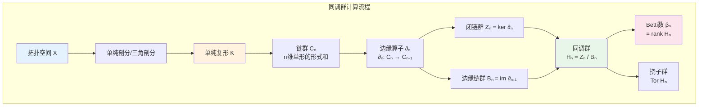
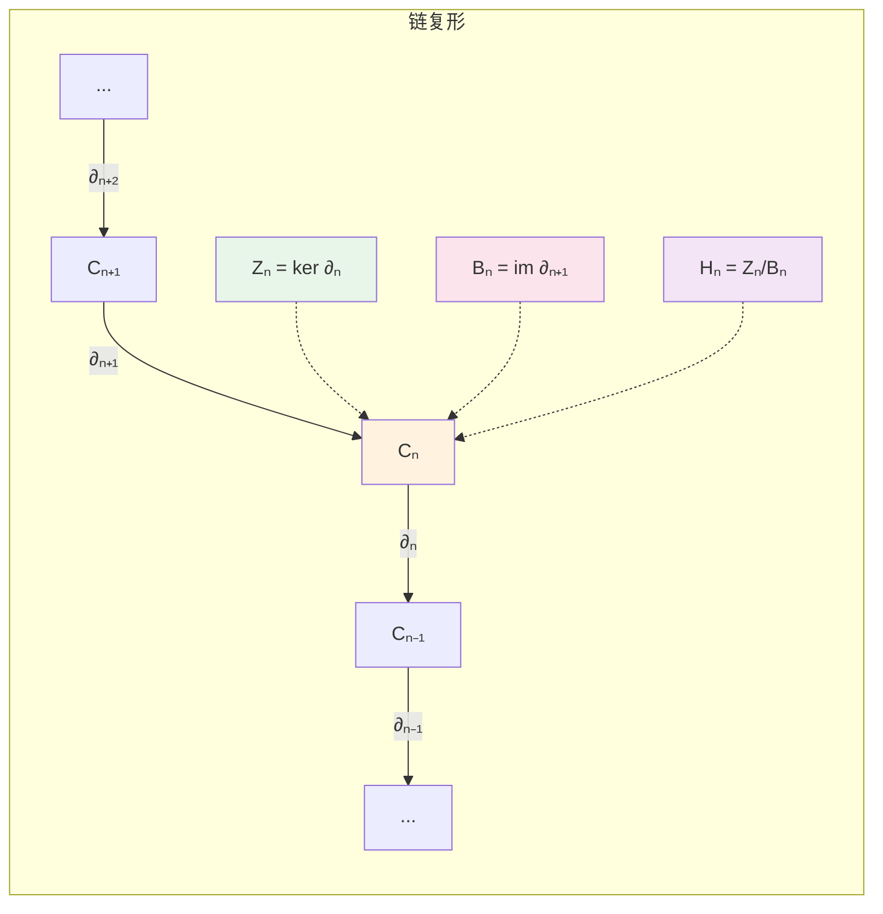

msc_primary: "55N10"
msc_secondary: ['55U15']
concept_type: "概念可视化"
visualization_type: "流程图、计算链"
---

# 同调群计算流程图

## 描述

本可视化展示代数拓扑中同调群的计算流程，从单纯复形或拓扑空间出发，通过链复形、边缘算子到同调群的完整计算链条。

## 数学概念

同调群是代数拓扑的核心不变量，通过将拓扑问题转化为代数问题来研究空间的"洞"的结构。计算流程涉及链复形、边缘算子和同调群的定义。

## 可视化代码

### 同调计算流程图



### 链复形序列



### ASCII计算流程

```

同调群计算流程
═══════════════════════════════════════════════════════════════

步骤1: 从空间到复形
───────────────────────────────────────────────────────────────
    拓扑空间 X  ──三角剖分──→  单纯复形 K
    
    例子: 环面 T²
    
        ┌─────────┐
       ╱│       ╱│
      ╱ │      ╱ │
     ┌──┼─────┐  │     ──三角剖分──→     由三角形拼成的环面
     │  └─────┼──┘
     │ ╱      │ ╱
     │╱       │╱
     └────────┘

步骤2: 链群
───────────────────────────────────────────────────────────────
    Cₙ(K) = n维单形的形式和
    
    C₀ = ⟨v₀, v₁, v₂, ...⟩  (顶点)
    C₁ = ⟨e₀, e₁, e₂, ...⟩  (边)
    C₂ = ⟨σ₀, σ₁, σ₂, ...⟩  (面)

步骤3: 边缘算子
───────────────────────────────────────────────────────────────
    ∂ₙ: Cₙ → Cₙ₋₁
    
    例子: 三角形 [v₀,v₁,v₂]
    
    ∂₂[v₀,v₁,v₂] = [v₁,v₂] - [v₀,v₂] + [v₀,v₁]
                  = 三条有向边之和
    
    关键性质: ∂ₙ₋₁ ∘ ∂ₙ = 0  (边缘的边缘为零)

步骤4: 同调群
───────────────────────────────────────────────────────────────
    
    Hₙ(K) = ker ∂ₙ / im ∂ₙ₊₁
          = Zₙ / Bₙ
          
    其中:
    • Zₙ = ker ∂ₙ = {n维闭链}    (无边缘的链)
    • Bₙ = im ∂ₙ₊₁ = {n维边缘链}  (是n+1维链的边缘)
    
    同调类 = 闭链的等价类 [z] = z + Bₙ

计算结果: 环面 T² 的同调
═══════════════════════════════════════════════════════════════
┌─────────┬─────────────┬─────────────────────────────────────┐
│ Hₙ(T²)  │  群结构      │ 几何意义                            │
├─────────┼─────────────┼─────────────────────────────────────┤
│ H₀      │  ℤ          │ 1个连通分支                         │
│ H₁      │  ℤ ⊕ ℤ      │ 2个独立的一维洞（经圈和纬圈）        │
│ H₂      │  ℤ          │ 1个二维洞（内部）                    │
│ Hₙ      │  0 (n≥3)    │ 高维无洞                            │
└─────────┴─────────────┴─────────────────────────────────────┘

重要空间的同调群:
───────────────────────────────────────────────────────────────
• Hₙ(Sⁿ) = ℤ (n=0,n), 0 (其他)
• Hₙ(S¹) = ℤ (n=0,1), 0 (其他)
• Hₙ(ℝPⁿ) = ℤ (n=0), ℤ/2 (奇数<n), 0 (偶数>0)
• Hₙ(Tⁿ) = ℤ^{C(n,k)} (k维同调)

```

### Mayer-Vietoris序列

```mermaid
graph TB
    subgraph Mayer-Vietoris正合列
    A[Hₙ₊₁(X)] -->|i*| B[Hₙ₊₁(U)⊕Hₙ₊₁(V)]
    B -->|j*| C[Hₙ₊₁(U∩V)]
    C -->|∂| D[Hₙ(X)]
    D -->|i*| E[Hₙ(U)⊕Hₙ(V)]
    E -->|j*| F[...]

    end
    
    style C fill:#fff3e0
    style D fill:#e8f5e9

```

## 参考

1. Hatcher, A. (2002). Algebraic Topology. Cambridge.
2. Munkres, J. (1984). Elements of Algebraic Topology. Addison-Wesley.
3. Rotman, J. J. (1988). An Introduction to Algebraic Topology. Springer.
