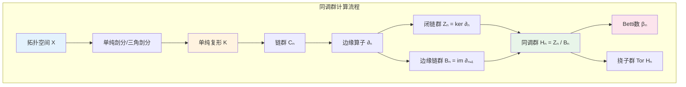

# 同调群计算流程图

## 1. 单纯复形与三角剖分

**定义 1.1（单纯形）**. 设 $v_0, \dots, v_k \in \mathbb{R}^N$ 仿射无关。$k$-单形 $[v_0, \dots, v_k]$ 为这些点的凸包：
$$\Delta^k = \left\{\sum_{i=0}^k t_i v_i : t_i \geq 0, \sum t_i = 1\right\}.$$

**定义 1.2（单纯复形）**. 单纯复形 $K$ 是 $\mathbb{R}^N$ 中单形的集合，满足：
- $K$ 中每个单形的面都在 $K$ 中；
- $K$ 中任意两个单形的交为空或为一个公共面。

$K$ 的**几何实现** $|K|$ 是 $K$ 中所有单形的并，配备子空间拓扑。

**定理 1.3（三角剖分存在性）**. 任何光滑紧流形都可三角剖分（存在同胚于该流形的单纯复形）。

## 2. 链复形与边缘算子

**定义 2.1（链群）**. 设 $K$ 为单纯复形。$n$-维链群 $C_n(K)$ 是以 $K$ 的 $n$-单形为基的自由 Abel 群：
$$C_n(K) = \left\{\sum_i n_i \sigma_i : n_i \in \mathbb{Z}, \sigma_i \text{ 为 } n\text{-单形}\right\}.$$

**定义 2.2（边缘算子）**. 边缘算子 $\partial_n: C_n(K) \to C_{n-1}(K)$ 定义为
$$\partial_n([v_0, \dots, v_n]) = \sum_{i=0}^n (-1)^i [v_0, \dots, \hat{v}_i, \dots, v_n],$$
其中 $\hat{v}_i$ 表示删去 $v_i$。

**定理 2.3**.$\partial_{n-1} \circ \partial_n = 0$（边缘的边缘为零）。

*证明*. 对 $n$-单形直接计算：
$$\partial_{n-1}\partial_n([v_0, \dots, v_n]) = \sum_{j < i} (-1)^{i+j} [\dots, \hat{v}_j, \dots, \hat{v}_i, \dots] + \sum_{j > i} (-1)^{i+j-1} [\dots, \hat{v}_i, \dots, \hat{v}_j, \dots].$$
两项相消。$\square$

## 3. 同调群

**定义 3.1（同调群）**. 由 $\partial^2 = 0$，有 $\operatorname{im}\partial_{n+1} \subseteq \ker\partial_n$。第 $n$ 个同调群定义为
$$H_n(K) = \frac{\ker\partial_n}{\operatorname{im}\partial_{n+1}} = \frac{Z_n(K)}{B_n(K)},$$
其中 $Z_n = \ker\partial_n$ 为**闭链群**，$B_n = \operatorname{im}\partial_{n+1}$ 为**边缘链群**。

同调类 $[z] = z + B_n$ 表示闭链 $z$ 在模去边缘后的等价类。

**定义 3.2（Betti 数）**. $n$-维 Betti 数 $\beta_n = \operatorname{rank} H_n(K)$，即 $n$ 维"洞"的个数。

## 4. 重要空间的同调

**例子 4.1（球面 $S^n$）**. 
$$H_k(S^n) = \begin{cases} \mathbb{Z} & k = 0, n, \\ 0 & \text{其他}. \end{cases}$$
$\beta_0 = 1$（连通），$\beta_n = 1$（$n$ 维洞）。

**例子 4.2（环面 $T^2 = S^1 \times S^1$）**.
$$H_k(T^2) = \begin{cases} \mathbb{Z} & k = 0, 2, \\ \mathbb{Z}^2 & k = 1, \\ 0 & k \geq 3. \end{cases}$$
$\beta_1 = 2$：经圈和纬圈两个独立的一维洞；$\beta_2 = 1$：二维洞（内部）。

**例子 4.3（实射影平面 $\mathbb{R}P^2$）**.
$$H_k(\mathbb{R}P^2) = \begin{cases} \mathbb{Z} & k = 0, \\ \mathbb{Z}/2\mathbb{Z} & k = 1, \\ 0 & k \geq 2. \end{cases}$$
一维同调有挠元，反映不可定向性。

## 5. Mayer-Vietoris 序列

**定理 5.1（Mayer-Vietoris）**. 设 $X = A \cup B$，$A, B$ 开。则存在正合列
$$\cdots \to H_n(A \cap B) \xrightarrow{(i_*, j_*)} H_n(A) \oplus H_n(B) \xrightarrow{k_* - l_*} H_n(X) \xrightarrow{\partial} H_{n-1}(A \cap B) \to \cdots$$

*直观*. Mayer-Vietoris 序列将大空间的同调计算分解为子空间同调的拼接，是计算同调的有力工具。

## 6. 可视化：同调计算流程

## 7. 参考

1. Hatcher, A. (2002). *Algebraic Topology*. Cambridge University Press.
2. Munkres, J. (1984). *Elements of Algebraic Topology*. Addison-Wesley.
3. Rotman, J. J. (1988). *An Introduction to Algebraic Topology*. Springer.
