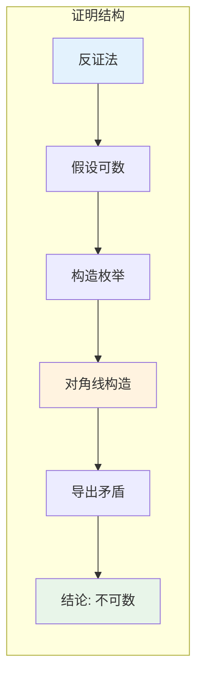

msc_primary: "03E10"
msc_secondary: ['03E99']
concept_type: "证明可视化"
visualization_type: "表格、对角线构造"
---

# 康托尔对角线证明可视化

## 描述

本可视化展示康托尔著名的对角线论证，证明实数集不可数。这是集合论中最优雅和重要的证明之一。

## 数学概念

**定理**: 实数区间[0,1]是不可数集。

**证明思路**: 假设[0,1]可数，则可将其元素枚举为序列。通过构造一个与所有枚举项都不同的实数，导出矛盾。

## 可视化代码

### 对角线论证流程

```mermaid
graph TB
    subgraph 康托尔对角线论证
    A[假设[0,1]可数] --> B[枚举所有实数<br/>r₁, r₂, r₃, ...]
    B --> C[写成小数展开]
    C --> D[构造新数 d]
    D --> E[d的第n位 ≠ rₙ的第n位]
    E --> F[d ≠ 所有 rₙ]
    F --> G[矛盾！]
    G --> H[[0,1]不可数]
    end
    
    style A fill:#e3f2fd
    style D fill:#fff3e0
    style F fill:#fce4ec
    style H fill:#e8f5e9

```

### ASCII对角线构造

```

康托尔对角线论证
═══════════════════════════════════════════════════════════════

假设 [0,1] 可数，则可枚举为 r₁, r₂, r₃, ...

写成小数展开:
┌─────────────────────────────────────────────────────────────┐
│                                                             │
│   r₁ = 0 . a₁₁ a₁₂ a₁₃ a₁₄ a₁₅ ...                         │
│            ↓                                                │
│   r₂ = 0 . a₂₁ a₂₂ a₂₃ a₂₄ a₂₅ ...                         │
│                 ↓                                           │
│   r₃ = 0 . a₃₁ a₃₂ a₃₃ a₃₄ a₃₅ ...                         │
│                      ↓                                      │
│   r₄ = 0 . a₄₁ a₄₂ a₄₃ a₄₄ a₄₅ ...                         │
│                           ↓                                 │
│   r₅ = 0 . a₅₁ a₅₂ a₅₃ a₅₄ a₅₅ ...                         │
│                                                             │
│   ...                                                       │
│                                                             │
│   ↓ 对角线元素: a₁₁, a₂₂, a₃₃, a₄₄, a₅₅, ...               │
│                                                             │
└─────────────────────────────────────────────────────────────┘

构造新数 d = 0 . d₁ d₂ d₃ d₄ d₅ ...

规则: dₙ ≠ aₙₙ (对角线元素)

例如: dₙ = { 1  if aₙₙ ≠ 1
           { 2  if aₙₙ = 1

关键结论:
═══════════════════════════════════════════════════════════════

   d ≠ r₁ 因为 d₁ ≠ a₁₁  (第一位不同)
   d ≠ r₂ 因为 d₂ ≠ a₂₂  (第二位不同)
   d ≠ r₃ 因为 d₃ ≠ a₃₃  (第三位不同)
   ...
   d ≠ rₙ 因为 dₙ ≠ aₙₙ  (第n位不同)
   ...

   因此 d 不在枚举中！

   ┌───────────────────────────────────────────────────────┐
   │  这与"枚举包含所有实数"矛盾！                          │
   │  故 [0,1] 不可数。                                     │
   └───────────────────────────────────────────────────────┘

证明的精髓:
───────────────────────────────────────────────────────────────
┌─────────────────────────────────────────────────────────────┐
│  1. 假设可数 → 可以列成表                                   │
│  2. 对角线构造 → 制造不在表中的元素                         │
│  3. 矛盾 → 假设错误 → 不可数                                │
│                                                             │
│  核心洞察: 无论你怎么列举，我总能构造一个不在其中的元素     │
└─────────────────────────────────────────────────────────────┘

推广: 幂集定理
═══════════════════════════════════════════════════════════════

同样的对角线方法证明: 对任意集合A，|A| < |P(A)|

证明: 假设存在双射 f: A → P(A)

构造 B = { x ∈ A : x ∉ f(x) }

若 B = f(b) 对某个 b ∈ A，则:
  b ∈ B ⟺ b ∉ f(b) = B  (矛盾！)

因此不存在这样的双射。

```

### 证明结构图



## 参考

1. Cantor, G. (1891). Über eine elementare Frage der Mannigfaltigkeitslehre.
2. Halmos, P. R. (1960). Naive Set Theory. Van Nostrand.
3. Rudin, W. (1976). Principles of Mathematical Analysis. McGraw-Hill.
