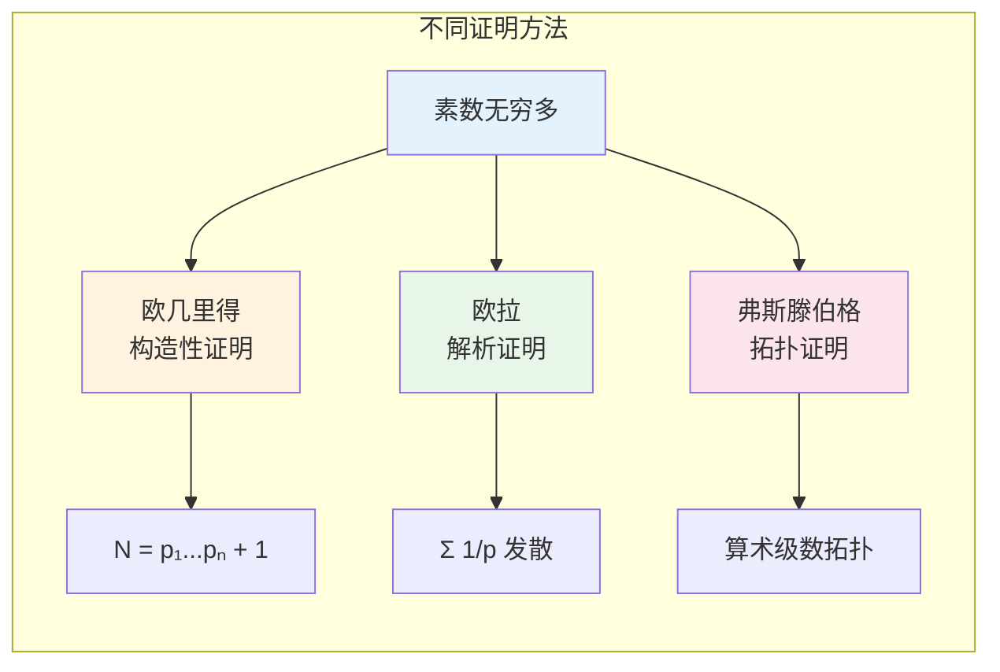

msc_primary: "11A41"
msc_secondary: ['11A05']
concept_type: "证明可视化"
visualization_type: "流程图、构造证明"
---

# 素数无穷多 - 欧几里得证明可视化

## 描述

本可视化展示欧几里得在《几何原本》中证明素数无穷多的经典论证。这是数学史上最优雅、最经典的证明之一。

## 数学概念

**定理**: 素数有无穷多个。

**欧几里得证明**: 假设素数有限，构造一个数导出矛盾。

## 可视化代码

### 欧几里得证明流程

```mermaid
graph TB
    subgraph 欧几里得证明素数无穷
    A[假设素数有限] --> B[列出所有素数<br/>p₁, p₂, ..., pₙ]
    B --> C[构造数 N<br/>N = p₁p₂...pₙ + 1]
    C --> D[N被某素数p整除]
    D --> E[p | N 且 p | p₁p₂...pₙ]
    E --> F[p | (N - p₁p₂...pₙ)]
    F --> G[p | 1]

    G --> H[矛盾！]
    H --> I[素数无穷多]
    end
    
    style A fill:#e3f2fd
    style C fill:#fff3e0
    style G fill:#fce4ec
    style I fill:#e8f5e9

```

### ASCII构造过程

```

欧几里得证明 —— 素数无穷多
═══════════════════════════════════════════════════════════════

假设素数只有有限个: p₁, p₂, ..., pₙ

构造新数:
┌─────────────────────────────────────────────────────────────┐
│                                                             │
│   N = p₁ × p₂ × p₃ × ... × pₙ + 1                          │
│                                                             │
│   即: N = (所有已知素数的乘积) + 1                         │
│                                                             │
└─────────────────────────────────────────────────────────────┘

关键论证:
━━━━━━━━━━━━━━━━━━━━━━━━━━━━━━━━━━━━━━━━━━━━━━━━━━━━━━━━━━━━━

1. N > 1，所以 N 有素因子 p

2. p 必为 p₁, p₂, ..., pₙ 中的一个 (假设这些是全部素数)

3. 因此 p | p₁p₂...pₙ  (p整除乘积)

4. 又 p | N  (p是N的因子)

5. 所以 p | (N - p₁p₂...pₙ) = 1

6. 即 p | 1，但素数 p ≥ 2，矛盾！

具体例子演示:
───────────────────────────────────────────────────────────────

假设素数只有: 2, 3, 5

构造: N = 2×3×5 + 1 = 31

31 是素数！不在原列表中。

再试: 假设素数只有: 2, 3, 5, 7, 11, 13

构造: N = 2×3×5×7×11×13 + 1 = 30031

30031 = 59 × 509  (合数)

但 59 和 509 都是新素数！

无论N是素数还是合数，总能找到不在原列表中的素数。

证明的精髓:
═══════════════════════════════════════════════════════════════
┌─────────────────────────────────────────────────────────────┐
│  核心思想:                                                  │
│  "所有已知素数的乘积 + 1" 这个数，                          │
│  要么本身是素数（新素数），                                  │
│  要么含有新的素因子（不在原列表中）。                        │
│                                                             │
│  因此，素数列表永远不可能完整。                              │
└─────────────────────────────────────────────────────────────┘

历史注记:
───────────────────────────────────────────────────────────────
• 欧几里得《几何原本》命题IX.20 (约公元前300年)
• 被认为是最美丽的数学证明之一
• 启发了无数推广和变体

```

### 证明变体对比



## 参考

1. Euclid. Elements, Book IX, Proposition 20.
2. Hardy, G. H., & Wright, E. M. (2008). An Introduction to the Theory of Numbers. Oxford.
3. Aigner, M., & Ziegler, G. M. (2010). Proofs from THE BOOK. Springer.
