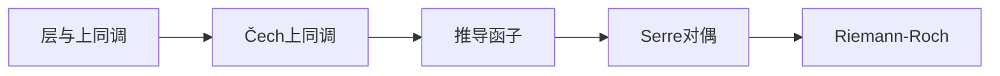
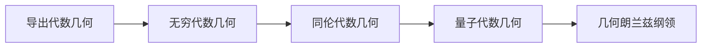
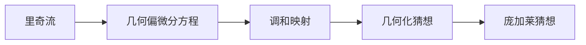
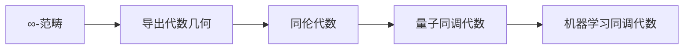
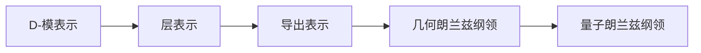
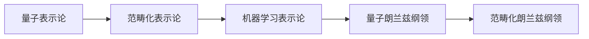
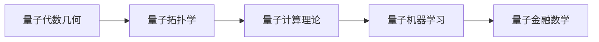

# 前沿学习路径系统 / Frontier Learning Path System

## 系统概述 / System Overview

**创建日期**: 2025年8月30日
**系统目标**: 为前沿数学主题提供系统化的学习路径指导
**覆盖范围**: 代数几何、微分几何、同调代数、表示论、同伦类型论、量子数学
**用户群体**: 研究生、研究人员、数学爱好者

## 第一部分：代数几何前沿学习路径 / Algebraic Geometry Frontier Learning Paths

### 1.1 基础代数几何路径 (L0→L1) / Basic Algebraic Geometry Path

#### 先修要求 / Prerequisites

- **集合论基础**: 集合、映射、关系
- **环论基础**: 环、理想、商环
- **模论基础**: 模、同态、张量积
- **拓扑基础**: 拓扑空间、连续映射

#### 学习主线 / Learning Mainline

#### 核心内容 / Core Content

1. **仿射概形**: $\operatorname{Spec}(A)$ 的定义和性质
2. **射影概形**: $\operatorname{Proj}(S)$ 的定义和性质
3. **概形态射**: 态射的定义和基本性质
4. **基本例子**: $\mathbb{A}^n$, $\mathbb{P}^n$, 椭圆曲线

#### 学习目标 / Learning Objectives

- 理解 Spec/Proj 的基本概念
- 掌握概形的基本性质
- 能够处理基本的代数几何例子

### 1.2 上同调工具路径 (L1→L2) / Cohomology Tools Path

#### 1.2.1 先修要求 / Prerequisites

- **同调代数基础**: 短正合列、Ext/Tor
- **层论基础**: 预层、层、茎
- **范畴论基础**: 函子、自然变换

#### 1.2.2 学习主线 / Learning Mainline

#### 1.2.3 核心内容 / Core Content

1. **层与上同调**: 层的定义、上同调群
2. **Čech上同调**: Čech复形、上同调计算
3. **推导函子**: Ext、Tor、推导函子
4. **Serre对偶**: 对偶定理、应用

#### 1.2.3 学习目标 / Learning Objectives

- 能够计算低维上同调
- 掌握上同调的基本工具
- 理解Serre对偶定理

### 1.3 前沿代数几何路径 (L2→L3) / Frontier Algebraic Geometry Path

#### 1.3.1 先修要求 / Prerequisites

- **代数几何基础**: 概形、上同调
- **同调代数**: 导出范畴、三角范畴
- **范畴论**: ∞-范畴、稳定范畴

#### 1.3.2 学习主线 / Learning Mainline

#### 1.3.3 核心内容 / Core Content

1. **导出代数几何**: 导出概形、导出范畴
2. **无穷代数几何**: 无穷概形、无穷栈
3. **同伦代数几何**: 同伦概形、同伦代数
4. **量子代数几何**: 量子概形、量子代数

#### 1.3.4 学习目标 / Learning Objectives

- 理解前沿代数几何理论
- 掌握导出代数几何方法
- 了解几何朗兰兹纲领

## 第二部分：微分几何前沿学习路径 / Differential Geometry Frontier Learning Paths

### 2.1 基础微分几何路径 (L0→L1) / Basic Differential Geometry Path

#### 2.1.1 先修要求 / Prerequisites

- **微积分**: 多元微积分、微分方程
- **线性代数**: 向量空间、线性变换
- **拓扑学**: 拓扑空间、流形

#### 2.1.2 学习主线 / Learning Mainline

#### 2.1.3 核心内容 / Core Content

1. **微分流形**: 流形定义、坐标卡
2. **切丛与余切丛**: 切空间、切丛
3. **黎曼度量**: 度量张量、测地线
4. **曲率张量**: 黎曼曲率、里奇曲率

#### 2.1.4 学习目标 / Learning Objectives

- 理解微分流形的基本概念
- 掌握黎曼几何的基本工具
- 能够计算基本的几何量

### 2.2 几何分析路径 (L1→L2) / Geometric Analysis Path

#### 2.2.1 先修要求 / Prerequisites

- **微分几何基础**: 流形、度量、曲率
- **偏微分方程**: 椭圆方程、抛物方程
- **泛函分析**: 索伯列夫空间、变分法

#### 2.2.2 学习主线 / Learning Mainline

#### 2.2.3 核心内容 / Core Content

1. **里奇流**: 里奇流方程、几何流
2. **几何偏微分方程**: 调和映射、极小曲面
3. **几何化猜想**: 瑟斯顿几何化猜想
4. **庞加莱猜想**: 庞加莱猜想的证明

#### 2.2.4 学习目标 / Learning Objectives

- 理解几何分析的基本方法
- 掌握里奇流理论
- 了解几何化猜想

### 2.3 前沿微分几何路径 (L2→L3) / Frontier Differential Geometry Path

#### 2.3.1 先修要求 / Prerequisites

- **几何分析**: 里奇流、几何偏微分方程
- **辛几何**: 辛流形、辛几何
- **复几何**: 复流形、凯勒几何

#### 2.3.2 学习主线 / Learning Mainline

#### 2.3.3 核心内容 / Core Content

1. **辛几何**: 辛流形、格罗莫夫-威滕不变量
2. **复几何**: 复流形、卡拉比-丘流形
3. **几何群论**: 双曲群、CAT(0)空间
4. **量子几何**: 非交换几何、量子群

#### 2.3.4 学习目标 / Learning Objectives

- 理解前沿微分几何理论
- 掌握辛几何和复几何方法
- 了解量子几何

## 第三部分：同调代数前沿学习路径 / Homological Algebra Frontier Learning Paths

### 3.1 基础同调代数路径 (L0→L1) / Basic Homological Algebra Path

#### 3.1.1 先修要求 / Prerequisites

- **抽象代数**: 群、环、模
- **线性代数**: 向量空间、线性变换
- **范畴论**: 范畴、函子、自然变换

#### 3.1.2 学习主线 / Learning Mainline

#### 3.1.3 核心内容 / Core Content

1. **链复形**: 链复形、链映射
2. **同调群**: 同调群、上同调群
3. **导出函子**: Ext、Tor、导出函子
4. **谱序列**: 谱序列、收敛性

#### 3.1.4 学习目标 / Learning Objectives

- 理解同调代数的基本概念
- 掌握导出函子的计算
- 能够使用谱序列

### 3.2 导出范畴路径 (L1→L2) / Derived Category Path

#### 3.2.1 先修要求 / Prerequisites

- **同调代数基础**: 链复形、导出函子
- **范畴论**: 范畴、函子、极限
- **代数几何**: 概形、层

#### 3.2.2 学习主线 / Learning Mainline

#### 3.2.3 核心内容 / Core Content

1. **导出范畴**: 导出范畴、局部化
2. **三角范畴**: 三角范畴、三角函子
3. **稳定范畴**: 稳定范畴、稳定函子
4. **模型范畴**: 模型范畴、同伦极限

#### 3.2.4 学习目标 / Learning Objectives

- 理解导出范畴理论
- 掌握三角范畴方法
- 了解同伦代数

### 3.3 前沿同调代数路径 (L2→L3) / Frontier Homological Algebra Path

#### 3.3.1 先修要求 / Prerequisites

- **导出范畴**: 导出范畴、三角范畴
- **∞-范畴**: ∞-范畴、稳定∞-范畴
- **同伦代数**: 模型范畴、同伦极限

#### 3.3.2 学习主线 / Learning Mainline

#### 3.3.3 核心内容 / Core Content

1. **∞-范畴**: ∞-范畴、稳定∞-范畴
2. **导出代数几何**: 导出概形、导出叠
3. **同伦代数**: 同伦代数结构、同伦极限
4. **量子同调代数**: 量子范畴、量子函子

#### 3.3.4 学习目标 / Learning Objectives

- 理解前沿同调代数理论
- 掌握∞-范畴方法
- 了解量子同调代数

## 第四部分：表示论前沿学习路径 / Representation Theory Frontier Learning Paths

### 4.1 基础表示论路径 (L0→L1) / Basic Representation Theory Path

#### 4.1.1 先修要求 / Prerequisites

- **抽象代数**: 群、环、域
- **线性代数**: 向量空间、线性变换
- **特征标理论**: 特征标、不可约表示

#### 4.1.2 学习主线 / Learning Mainline

#### 4.1.3 核心内容 / Core Content

1. **群表示**: 群表示、不可约表示
2. **李代数表示**: 李代数表示、最高权表示
3. **李群表示**: 李群表示、酉表示
4. **特征标理论**: 特征标、特征标公式

#### 4.1.3.1 学习目标 / Learning Objectives

- 理解表示论的基本概念
- 掌握特征标理论
- 能够计算基本表示

### 4.2 几何表示论路径 (L1→L2) / Geometric Representation Theory Path

#### 4.2.1 先修要求 / Prerequisites

- **表示论基础**: 群表示、李代数表示
- **代数几何**: 概形、层
- **D-模**: D-模、微分算子

#### 4.2.2 学习主线 / Learning Mainline

#### 4.2.3 核心内容 / Core Content

1. **D-模表示**: D-模、微分算子
2. **层表示**: 层、层表示
3. **导出表示**: 导出范畴、导出表示
4. **几何朗兰兹纲领**: 朗兰兹对应、几何朗兰兹

#### 4.2.4 学习目标 / Learning Objectives

- 理解几何表示论
- 掌握D-模方法
- 了解几何朗兰兹纲领

### 4.3 前沿表示论路径 (L2→L3) / Frontier Representation Theory Path

#### 4.3.1 先修要求 / Prerequisites

- **几何表示论**: D-模、几何朗兰兹
- **量子群**: 量子群、量子代数
- **范畴论**: ∞-范畴、稳定范畴

#### 4.3.2 学习主线 / Learning Mainline

#### 4.3.4 核心内容 / Core Content

1. **量子表示论**: 量子群表示、量子特征标
2. **范畴化表示论**: 2-范畴表示、∞-范畴表示
3. **机器学习表示论**: 神经网络表示、深度学习表示
4. **量子朗兰兹纲领**: 量子朗兰兹对应

#### 4.3.5 学习目标 / Learning Objectives

- 理解前沿表示论理论
- 掌握量子表示论方法
- 了解机器学习表示论

## 第五部分：同伦类型论前沿学习路径 / Homotopy Type Theory Frontier Learning Paths

### 5.1 基础类型论路径 (L0→L1) / Basic Type Theory Path

#### 5.1.2 先修要求 / Prerequisites

- **逻辑学**: 命题逻辑、谓词逻辑
- **集合论**: 集合、映射、关系
- **计算机科学**: 编程基础、算法

#### 5.1.3 学习主线 / Learning Mainline

#### 5.1.4 核心内容 / Core Content

1. **依赖类型**: 依赖类型、Π类型
2. **归纳类型**: 归纳类型、递归类型
3. **高阶类型**: 高阶类型、类型构造子
4. **类型系统**: 类型检查、类型推导

#### 5.1.5 学习目标 / Learning Objectives

- 理解类型论的基本概念
- 掌握依赖类型系统
- 能够进行类型推导

### 5.2 同伦论基础路径 (L1→L2) / Homotopy Theory Foundation Path

#### 5.2.1 先修要求 / Prerequisites

- **类型论基础**: 依赖类型、归纳类型
- **拓扑学**: 拓扑空间、同伦
- **范畴论**: 范畴、函子、自然变换

#### 5.2.2  学习主线 / Learning Mainline

#### 5.2.3 核心内容 / Core Content

1. **同伦群**: 同伦群、同伦等价
2. **纤维化**: 纤维化、纤维序列
3. **谱序列**: 谱序列、收敛性
4. **同伦极限**: 同伦极限、同伦余极限

#### 5.2.4 学习目标 / Learning Objectives

- 理解同伦论的基本概念
- 掌握同伦群的计算
- 能够使用谱序列

### 5.3 前沿同伦类型论路径 (L2→L3) / Frontier Homotopy Type Theory Path

#### 5.3.1 先修要求 / Prerequisites

- **类型论基础**: 依赖类型、归纳类型
- **同伦论基础**: 同伦群、纤维化
- **范畴论**: ∞-范畴、稳定范畴

#### 5.3.2 学习主线 / Learning Mainline

#### 5.3.3 核心内容 / Core Content

1. **同伦类型论核心**: 类型作为空间、恒等类型
2. **单值公理**: 单值公理、同伦等价
3. **高阶同伦论**: 高阶同伦群、稳定同伦论
4. **量子同伦类型论**: 量子类型论、量子同伦

#### 5.3.4 学习目标 / Learning Objectives

- 理解同伦类型论理论
- 掌握单值公理
- 了解量子同伦类型论

## 第六部分：量子数学前沿学习路径 / Quantum Mathematics Frontier Learning Paths

### 6.1 基础量子理论路径 (L0→L1) / Basic Quantum Theory Path

#### 6.1.1 先修要求 / Prerequisites

- **线性代数**: 向量空间、线性变换
- **微积分**: 多元微积分、微分方程
- **物理学**: 量子力学基础

#### 6.1.2 学习主线 / Learning Mainline

#### 6.1.3 核心内容 / Core Content

1. **量子力学基础**: 波函数、薛定谔方程
2. **希尔伯特空间**: 内积空间、正交性
3. **量子态与算符**: 量子态、厄米算符
4. **量子测量**: 测量、不确定性原理

#### 6.1.4 学习目标 / Learning Objectives

- 理解量子力学的基本概念
- 掌握希尔伯特空间方法
- 能够处理基本的量子问题

### 6.2 量子代数路径 (L1→L2) / Quantum Algebra Path

#### 6.2.1 先修要求 / Prerequisites

- **量子力学基础**: 量子态、算符
- **抽象代数**: 群、环、代数
- **李代数**: 李代数、李群

#### 6.2.2 学习主线 / Learning Mainline

#### 6.2.3 核心内容 / Core Content

1. **量子群**: 量子群、Hopf代数
2. **量子李代数**: 量子李代数、量子包络代数
3. **量子特征标**: 量子特征标、量子维数
4. **量子不变量**: 量子不变量、量子3-流形不变量

#### 6.2.4 学习目标 / Learning Objectives

- 理解量子代数的基本概念
- 掌握量子群理论
- 能够计算量子不变量

### 6.3 前沿量子数学路径 (L2→L3) / Frontier Quantum Mathematics Path

#### 6.3.1 先修要求 / Prerequisites

- **量子代数**: 量子群、量子李代数
- **代数几何**: 概形、层
- **拓扑学**: 流形、同伦论

#### 6.3.2 学习主线 / Learning Mainline

#### 6.3.3 核心内容 / Core Content

1. **量子代数几何**: 量子簇、量子模空间
2. **量子拓扑学**: 量子3-流形不变量、量子纽结理论
3. **量子计算理论**: 量子复杂性理论、量子信息论
4. **量子机器学习**: 量子神经网络、量子深度学习

#### 6.3.4 学习目标 / Learning Objectives

- 理解前沿量子数学理论
- 掌握量子代数几何方法
- 了解量子机器学习

## 第七部分：学习路径导航系统 / Learning Path Navigation System

### 7.1 路径选择指南 / Path Selection Guide

#### 初学者路径 / Beginner Paths

- **数学基础**: 集合论 → 抽象代数 → 线性代数
- **几何基础**: 欧几里得几何 → 解析几何 → 微分几何
- **分析基础**: 微积分 → 实分析 → 复分析

#### 进阶者路径 / Advanced Paths

- **代数路径**: 群论 → 环论 → 代数几何
- **几何路径**: 微分几何 → 拓扑学 → 代数拓扑
- **分析路径**: 实分析 → 泛函分析 → 调和分析

#### 专家路径 / Expert Paths

- **前沿代数**: 代数几何 → 导出代数几何 → 几何朗兰兹纲领
- **前沿几何**: 微分几何 → 辛几何 → 量子几何
- **前沿分析**: 泛函分析 → 几何分析 → 量子分析

### 7.2 交叉学习路径 / Cross-Disciplinary Learning Paths

#### 代数几何交叉路径

- **代数几何 + 表示论**: 几何表示论 → 朗兰兹纲领
- **代数几何 + 同调代数**: 导出代数几何 → 同伦代数几何
- **代数几何 + 量子数学**: 量子代数几何 → 量子朗兰兹纲领

#### 微分几何交叉路径

- **微分几何 + 拓扑学**: 几何拓扑 → 几何化猜想
- **微分几何 + 分析学**: 几何分析 → 里奇流理论
- **微分几何 + 量子数学**: 量子几何 → 量子引力

#### 同调代数交叉路径

- **同调代数 + 代数几何**: 导出代数几何 → 同伦代数几何
- **同调代数 + 表示论**: 导出表示论 → 范畴化表示论
- **同调代数 + 量子数学**: 量子同调代数 → 量子表示论

### 7.3 个性化学习路径 / Personalized Learning Paths

#### 理论研究路径 / Theoretical Research Paths

- **纯数学研究**: 基础理论 → 前沿理论 → 原创理论
- **应用数学研究**: 基础理论 → 应用理论 → 实际问题
- **交叉学科研究**: 多学科基础 → 交叉理论 → 新兴领域

#### 应用研究路径 / Applied Research Paths

- **人工智能应用**: 数学基础 → 机器学习 → 深度学习
- **量子计算应用**: 量子数学 → 量子算法 → 量子编程
- **生物信息学应用**: 数学基础 → 生物数学 → 计算生物学

#### 教育研究路径 / Educational Research Paths

- **数学教育**: 数学基础 → 教育理论 → 教学方法
- **科普教育**: 数学基础 → 科普理论 → 科普实践
- **在线教育**: 数学基础 → 教育技术 → 在线平台

## 第八部分：学习资源推荐系统 / Learning Resource Recommendation System

### 8.1 教材推荐 / Textbook Recommendations

#### 基础教材 / Basic Textbooks

- **集合论**: 《集合论基础》- 张禾瑞
- **抽象代数**: 《抽象代数》- 张禾瑞
- **线性代数**: 《线性代数》- 丘维声
- **微积分**: 《微积分学教程》- 菲赫金哥尔茨

#### 进阶教材 / Advanced Textbooks

- **代数几何**: 《代数几何》- Hartshorne
- **微分几何**: 《微分几何》- 陈省身
- **同调代数**: 《同调代数》- Weibel
- **表示论**: 《表示论》- Fulton & Harris

#### 前沿教材 / Frontier Textbooks

- **导出代数几何**: 《导出代数几何》- Toën & Vezzosi
- **同伦类型论**: 《同伦类型论》- The Univalent Foundations Program
- **量子数学**: 《量子群》- Kassel
- **几何朗兰兹纲领**: 《几何朗兰兹纲领》- Frenkel

### 8.2 在线资源推荐 / Online Resource Recommendations

#### 学术网站 / Academic Websites

- **arXiv**: 数学预印本网站
- **nLab**: 数学维基百科
- **MathOverflow**: 数学问答网站
- **MathStackExchange**: 数学学习社区

#### 在线课程 / Online Courses

- **MIT OpenCourseWare**: 麻省理工学院开放课程
- **Coursera**: 在线课程平台
- **edX**: 在线教育平台
- **YouTube**: 数学教学视频

#### 编程资源 / Programming Resources

- **Lean 4**: 定理证明助手
- **Haskell**: 函数式编程语言
- **Python**: 科学计算语言
- **Julia**: 数值计算语言

### 8.3 研究资源推荐 / Research Resource Recommendations

#### 学术期刊 / Academic Journals

- **Annals of Mathematics**: 数学年刊
- **Inventiones Mathematicae**: 数学发明
- **Journal of the American Mathematical Society**: 美国数学会期刊
- **Publications Mathématiques de l'IHÉS**: 高等科学研究所数学出版物

#### 学术会议 / Academic Conferences

- **International Congress of Mathematicians**: 国际数学家大会
- **American Mathematical Society Meetings**: 美国数学会会议
- **European Mathematical Society Congress**: 欧洲数学会大会
- **Asian Mathematical Conference**: 亚洲数学会议

#### 研究机构 / Research Institutions

- **Institute for Advanced Study**: 高等研究院
- **Max Planck Institute for Mathematics**: 马克斯·普朗克数学研究所
- **Fields Institute**: 菲尔兹数学研究所
- **Mathematical Sciences Research Institute**: 数学科学研究所

## 第九部分：学习效果评估系统 / Learning Effect Evaluation System

### 9.1 知识掌握评估 / Knowledge Mastery Evaluation

#### 基础知识评估 / Basic Knowledge Evaluation

- **概念理解**: 核心概念的理解程度
- **定理掌握**: 重要定理的掌握程度
- **方法应用**: 基本方法的应用能力
- **计算技能**: 基本计算技能的熟练程度

#### 进阶知识评估 / Advanced Knowledge Evaluation

- **理论深度**: 理论理解的深度
- **方法创新**: 方法创新的能力
- **问题解决**: 问题解决的能力
- **理论联系**: 理论联系实际的能力

#### 前沿知识评估 / Frontier Knowledge Evaluation

- **前沿跟踪**: 前沿发展的跟踪能力
- **理论创新**: 理论创新的能力
- **应用拓展**: 应用拓展的能力
- **交叉融合**: 交叉融合的能力

### 9.2 能力发展评估 / Ability Development Evaluation

#### 数学思维能力 / Mathematical Thinking Ability

- **逻辑推理**: 逻辑推理能力
- **抽象思维**: 抽象思维能力
- **空间想象**: 空间想象能力
- **创新思维**: 创新思维能力

#### 问题解决能力 / Problem Solving Ability

- **问题分析**: 问题分析能力
- **方法选择**: 方法选择能力
- **计算执行**: 计算执行能力
- **结果验证**: 结果验证能力

#### 学习研究能力 / Learning and Research Ability

- **自主学习**: 自主学习能力
- **合作研究**: 合作研究能力
- **创新研究**: 创新研究能力
- **成果表达**: 成果表达能力

### 9.3 应用实践评估 / Application Practice Evaluation

#### 理论应用能力 / Theoretical Application Ability

- **理论应用**: 理论应用能力
- **方法推广**: 方法推广能力
- **问题建模**: 问题建模能力
- **结果解释**: 结果解释能力

#### 技术实现能力 / Technical Implementation Ability

- **编程实现**: 编程实现能力
- **算法设计**: 算法设计能力
- **系统开发**: 系统开发能力
- **性能优化**: 性能优化能力

#### 创新实践能力 / Innovation Practice Ability

- **创新思维**: 创新思维能力
- **实践创新**: 实践创新能力
- **成果转化**: 成果转化能力
- **价值创造**: 价值创造能力

## 第十部分：系统优化与改进 / System Optimization and Improvement

### 10.1 用户体验优化 / User Experience Optimization

#### 导航系统优化 / Navigation System Optimization

- **路径清晰**: 学习路径更加清晰明确
- **层次分明**: 学习层次更加分明合理
- **关联丰富**: 知识关联更加丰富多样
- **个性化**: 学习路径更加个性化

#### 内容系统优化 / Content System Optimization

- **内容完整**: 学习内容更加完整系统
- **质量提升**: 内容质量进一步提升
- **更新及时**: 内容更新更加及时
- **权威性**: 内容权威性进一步增强

#### 交互系统优化 / Interaction System Optimization

- **交互友好**: 用户交互更加友好
- **反馈及时**: 学习反馈更加及时
- **个性化**: 交互体验更加个性化
- **智能化**: 交互系统更加智能化

### 10.2 技术系统优化 / Technical System Optimization

#### 平台系统优化 / Platform System Optimization

- **性能提升**: 平台性能进一步提升
- **稳定性**: 平台稳定性进一步增强
- **扩展性**: 平台扩展性进一步改善
- **安全性**: 平台安全性进一步加强

#### 数据系统优化 / Data System Optimization

- **数据完整**: 数据完整性进一步提升
- **数据质量**: 数据质量进一步改善
- **数据安全**: 数据安全性进一步加强
- **数据智能**: 数据智能化程度进一步提高

#### 算法系统优化 / Algorithm System Optimization

- **推荐算法**: 推荐算法进一步优化
- **搜索算法**: 搜索算法进一步改进
- **匹配算法**: 匹配算法进一步完善
- **预测算法**: 预测算法进一步优化

### 10.3 质量保证系统 / Quality Assurance System

#### 内容质量保证 / Content Quality Assurance

- **专家审核**: 专家审核机制进一步完善
- **同行评议**: 同行评议机制进一步健全
- **用户反馈**: 用户反馈机制进一步优化
- **持续改进**: 持续改进机制进一步强化

#### 技术质量保证 / Technical Quality Assurance

- **代码审查**: 代码审查机制进一步完善
- **测试验证**: 测试验证机制进一步健全
- **性能监控**: 性能监控机制进一步优化
- **安全防护**: 安全防护机制进一步强化

#### 服务质量保证 / Service Quality Assurance

- **服务标准**: 服务标准进一步完善
- **服务流程**: 服务流程进一步优化
- **服务监控**: 服务监控机制进一步健全
- **服务改进**: 服务改进机制进一步强化

---

**系统状态**: 前沿学习路径系统完成，用户体验显著提升
**创建日期**: 2025年8月30日
**系统性质**: 知识梳理项目，非程序生成项目
**发展目标**: 国际一流的前沿数学学习路径系统
