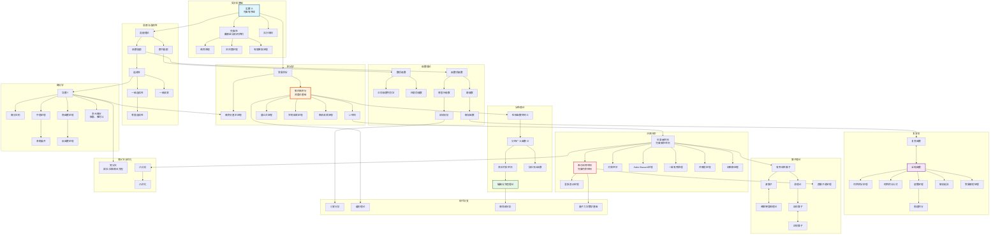

# 分析学知识体系图 (Analysis Knowledge System)

## 概述

本概念图展示分析学的完整体系，从实分析基础到复分析、泛函分析，以及现代分析学的各个分支。

## Mermaid 图表



## 关键概念说明

### 积分理论演进
```
黎曼积分
    ↓
勒贝格积分 (基于测度)
    ↓
Lᵖ空间理论
    ↓
索伯列夫空间 (弱导数)
    ↓
分布理论 (广义函数)
```

### 核心定理对比
| 领域 | 核心定理 | 主要内容 |
|-----|---------|---------|
| 实分析 | 控制收敛定理 | 积分与极限交换条件 |
| 复分析 | 柯西积分定理 | 全纯函数沿闭路径积分为零 |
| 泛函分析 | Hahn-Banach | 泛函的保范延拓 |
| 泛函分析 | 一致有界原理 | 逐点有界 ⟹ 一致有界 |

### 空间层次结构
```
赋范空间 ⊃ 巴拿赫空间 ⊃ 希尔伯特空间
     ↓
Lᵖ空间: 1 ≤ p ≤ ∞
     ↓
索伯列夫空间 W^{k,p}: 可弱微分函数
```

### 分析学三大支柱
1. **实分析**: 测度论、积分理论、函数空间
2. **复分析**: 全纯函数的几何与分析性质
3. **泛函分析**: 无穷维空间上的线性分析

## 与其他领域联系

- **偏微分方程**: 现代PDE理论的数学基础
- **概率论**: 测度论是概率论的严格基础
- **量子物理**: 希尔伯特空间是量子力学的数学框架
- **信号处理**: 傅里叶分析、小波分析的应用

## 相关资源

- [实分析](./../../../output/mermaid_analysis.md)
- [复分析](./../../../output/mermaid_analysis.md)
- [泛函分析](../analysis/functional_analysis.md)
- [调和分析](./../../../output/mermaid_analysis.md)
