# 数学分支总览图 (Mathematics Overview)

## 概述

本概念图展示现代数学的完整分支结构，从基础数学到应用数学，以及各分支之间的深刻联系。

## Mermaid 图表

```mermaid
graph TB
    subgraph 数学基础
        A[数理逻辑] --> B[集合论]<-->C[范畴论]
        B --> D[公理系统]<-->E[ZFC]<-->F[类型论]
        A --> G[证明论]<-->H[递归论]<-->I[模型论]
    end

    subgraph 代数学
        J[代数] --> K[群论]<-->L[环论]<-->M[域论]
        J --> N[线性代数]<-->O[表示论]
        J --> P[交换代数]<-->Q[同调代数]
        J --> R[李代数]<-->S[泛包络代数]
        K --> T[伽罗瓦理论]<-->U[代数方程可解性]
    end

    subgraph 数论
        V[数论] --> W[初等数论]<-->X[解析数论]
        V --> Y[代数数论]<-->Z[算术几何]
        V --> AA[超越数论]<-->AB[丢番图逼近]
        Y --> AC[类域论]<-->AD[朗兰兹纲领]
        Z --> AE[椭圆曲线]<-->AF[模形式]
    end

    subgraph 几何学
        AG[几何] --> AH[欧几里得几何]<-->AI[非欧几何]
        AG --> AJ[射影几何]<-->AK[仿射几何]
        AG --> AL[微分几何]<-->AM[黎曼几何]
        AL --> AN[辛几何]<-->AO[复几何]
        AM --> AP[广义相对论]
        AG --> AQ[代数几何]<-->AR[算术几何]
    end

    subgraph 拓扑学
        AS[拓扑] --> AT[点集拓扑]<-->AU[代数拓扑]
        AU --> AV[同调论]<-->AW[同伦论]
        AS --> AX[微分拓扑]<-->AY[几何拓扑]
        AU --> AZ[纽结理论]<-->BA[低维拓扑]
        AU --> BB[K理论]<-->BC[示性类]
    end

    subgraph 分析学
        BD[分析] --> BE[实分析]<-->BF[测度论]
        BD --> BG[复分析]<-->BH[调和分析]
        BD --> BI[泛函分析]<-->BJ[算子理论]
        BF --> BK[概率论]<-->BL[随机过程]
        BI --> BM[变分法]<-->BN[凸分析]
    end

    subgraph 微分方程
        BO[微分方程] --> BP[常微分方程]<-->BQ[偏微分方程]
        BQ --> BR[椭圆型]<-->BS[抛物型]<-->BT[双曲型]
        BO --> BU[动力系统]<-->BV[遍历理论]
        BQ --> BW[微局部分析]<-->BX[拟微分算子]
        BP --> BY[可积系统]<-->BZ[孤子理论]
    end

    subgraph 离散数学
        CA[离散数学] --> CB[组合数学]<-->CC[图论]
        CA --> CD[数理逻辑应用]<-->CE[理论计算机科学]
        CB --> CF[枚举组合]<-->CG[极值组合]<-->CH[概率组合]
        CC --> CI[网络理论]<-->CJ[算法图论]
        CE --> CK[计算复杂性]<-->CL[可计算性理论]
    end

    subgraph 应用数学
        CM[应用数学] --> CN[数值分析]<-->CO[科学计算]
        CM --> CP[优化理论]<-->CQ[运筹学]<-->CR[控制论]
        CM --> CS[数理统计]<-->CT[机器学习]
        CM --> CU[金融数学]<-->CV[精算科学]
        CO --> CW[有限元方法]<-->CX[谱方法]
    end

    subgraph 数学物理
        CY[数学物理] --> CZ[经典力学]<-->DA[哈密顿系统]
        CY --> DB[量子力学数学基础]<-->DC[泛函分析]
        CY --> DD[统计力学]<-->DE[统计场论]
        CY --> DF[量子场论]<-->DG[规范场论]
        DG --> DH[弦理论]<-->DI[镜像对称]
    end

    subgraph 交叉领域
        DJ[现代交叉] --> DK[代数拓扑应用]<-->DL[同伦论方法]
        DJ --> DM[几何分析]<-->DN[极小曲面]<-->DO[里奇流]
        DJ --> DP[算术几何]<-->DQ[费马大定理]
        DJ --> DR[朗兰兹纲领]<-->DS[表示论+数论+几何]
        DJ --> DT[非交换几何]<-->DU[量子群]
        DJ --> DV[随机矩阵]<-->DW[统计物理+数论]
    end

    subgraph 核心联系
        K -.->|李群| AL
        Q -.->|导出范畴| AQ
        AU -.->|层上同调| AQ
        BF -.->|测度论基础| BK
        AM -.->|纤维丛| DG
        AD -.->|自守表示| AF
        BI -.->|算子代数| DT
        DO -.->|庞加莱猜想| BA
    end

    style A fill:#e1f5ff,stroke:#01579b,stroke-width:2px
    style J fill:#fff3e0,stroke:#e65100,stroke-width:2px
    style AG fill:#f3e5f5,stroke:#6a1b9a,stroke-width:2px
    style BD fill:#ffebee,stroke:#c62828,stroke-width:2px
    style CM fill:#e8f5e9,stroke:#2e7d32,stroke-width:2px
    style DJ fill:#fce4ec,stroke:#ad1457,stroke-width:3px
```



## 关键概念说明

### 数学的三大支柱
```
         代数              几何              分析
          ↓                ↓                ↓
       结构研究          形状研究          变化研究
          ↘              ↓              ↙
                 现代数学统一框架
                        ↓
                 范畴论、朗兰兹纲领
```

### 数学分类体系 (MSC2020)
- **00-XX**: 一般数学
- **03-XX**: 数理逻辑与基础
- **05-XX**: 组合学
- **11-XX**: 数论
- **14-XX**: 代数几何
- **20-XX**: 群论及推广
- **26-XX**: 实函数
- **30-XX**: 复函数
- **34-XX**: 常微分方程
- **35-XX**: 偏微分方程
- **37-XX**: 动力系统
- **46-XX**: 泛函分析
- **53-XX**: 微分几何
- **54-XX**: 一般拓扑
- **55-XX**: 代数拓扑
- **60-XX**: 概率论
- **62-XX**: 统计学
- **68-XX**: 计算机科学
- **81-XX**: 量子理论

### 现代数学统一趋势
1. **几何化**: 代数几何方法渗透到数论、表示论
2. **范畴化**: 高阶范畴论提供统一语言
3. **算术化**: 算术几何连接数论与几何
4. **物理化**: 弦论、场论启发数学新结构

## 与其他学科联系

- **物理学**: 数学物理的前沿问题驱动数学发展
- **计算机科学**: 算法理论、密码学、人工智能
- **生物学**: 生物数学、系统生物学
- **经济学**: 博弈论、金融数学、计量经济学
- **工程学**: 控制论、信号处理、优化

## 相关资源

- [数学分类目录](../reference/msc2020.md)
- [现代数学前沿](../research/modern_frontiers.md)
- [数学统一性](../philosophy/unification.md)
