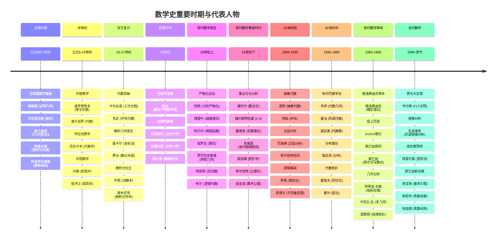
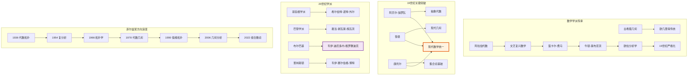

# 数学家时代分布图 (Mathematicians Timeline)

## 概述

本概念图展示数学史上重要数学家的时代分布及其贡献，从古希腊到现代，展现数学发展的历史脉络。

## Mermaid 图表



## 补充关系图



## 关键历史时期说明

### 三次数学危机
| 危机 | 时间 | 核心问题 | 解决方案 |
|-----|------|---------|---------|
| 第一次 | 公元前5世纪 | 无理数发现 | 实数理论 |
| 第二次 | 17-18世纪 | 无穷小量悖论 | 极限理论 |
| 第三次 | 19世纪末 | 罗素悖论 | 公理化集合论 |

### 数学中心转移
```
古希腊 (亚历山大) 
    ↓
阿拉伯世界 (巴格达)
    ↓
意大利 (文艺复兴)
    ↓
法国 (17-18世纪)
    ↓
德国 (19世纪-1933)
    ↓
美国 (二战后至今)
```

### 20世纪数学特征
1. **抽象化**: 从具体对象到抽象结构
2. **统一化**: 不同领域的深刻联系
3. **公理化**: 希尔伯特式的严格基础
4. **计算机辅助**: 四色定理证明、形式验证

## 相关资源

- [数学家传记](../history/mathematicians.md)
- [数学史年表](../history/timeline.md)
- [菲尔兹奖得主](../history/fields_medalists.md)
- [数学学派](../history/schools.md)
