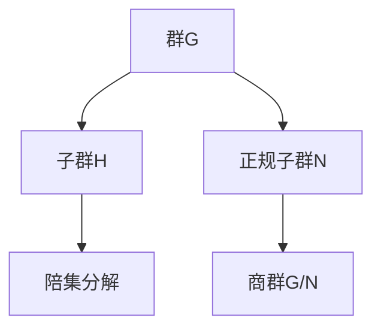
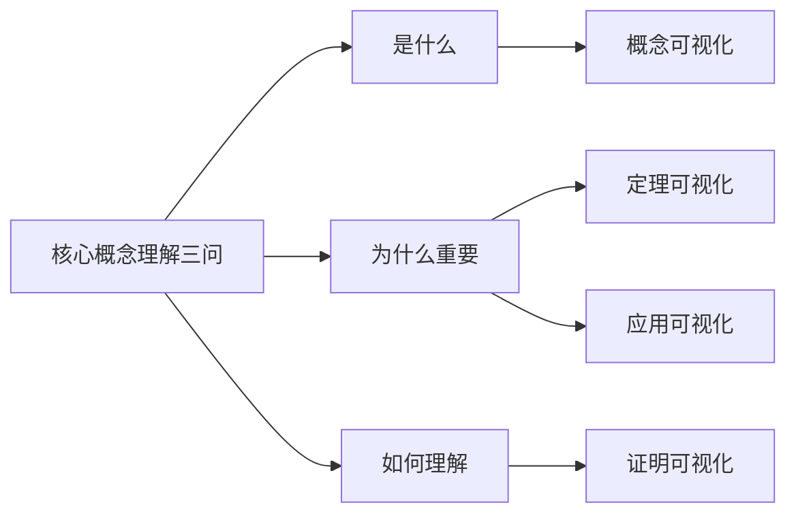

# FormalMath可视化内容总览

**制定日期**: 2026年4月2日
**可视化条目总数**: 130+
**完成度**: 进行中
**适用范围**: FormalMath项目所有数学领域

---

## 📋 目录

- [FormalMath可视化内容总览](#formalmath可视化内容总览)
  - [📋 目录](#-目录)
  - [一、可视化内容架构](#一可视化内容架构)
    - [1.1 四大可视化类别](#11-四大可视化类别)
  - [二、分类统计](#二分类统计)
    - [2.1 概念可视化统计](#21-概念可视化统计)
    - [2.2 定理可视化统计](#22-定理可视化统计)
    - [2.3 证明可视化统计](#23-证明可视化统计)
    - [2.4 应用可视化统计](#24-应用可视化统计)
    - [2.5 总计](#25-总计)
  - [三、可视化格式说明](#三可视化格式说明)
    - [3.1 Mermaid图表](#31-mermaid图表)
    - [3.2 ASCII艺术](#32-ascii艺术)
    - [3.3 描述性结构](#33-描述性结构)
    - [3.4 外部工具链接](#34-外部工具链接)
  - [四、使用指南](#四使用指南)
    - [4.1 学习者使用建议](#41-学习者使用建议)
    - [4.2 教师使用建议](#42-教师使用建议)
    - [4.3 研究者使用建议](#43-研究者使用建议)
  - [五、与现有知识体系的关联](#五与现有知识体系的关联)
    - [5.1 与术语词典的关联](#51-与术语词典的关联)
    - [5.2 与工作示例的关联](#52-与工作示例的关联)
    - [5.3 与核心概念理解三问的关联](#53-与核心概念理解三问的关联)

---

## 一、可视化内容架构

### 1.1 四大可视化类别

```

FormalMath可视化内容库
│
├── 01-概念可视化（50+条目）
│   ├── 集合论概念（10条目）
│   ├── 代数结构概念（12条目）
│   ├── 分析学概念（10条目）
│   ├── 几何学概念（10条目）
│   └── 拓扑学概念（8条目）
│
├── 02-定理可视化（30+条目）
│   ├── 代数定理（10条目）
│   ├── 分析定理（10条目）
│   └── 几何拓扑定理（10条目）
│
├── 03-证明可视化（20+条目）
│   ├── 经典证明结构图
│   ├── 反证法逻辑流程
│   └── 归纳法步骤展示
│
└── 04-应用可视化（30+条目）
    ├── 数学在物理中的应用
    ├── 数学在CS中的应用
    └── 跨学科连接图

```

---

## 二、分类统计

### 2.1 概念可视化统计

| 数学领域 | 条目数量 | 完成状态 | 文件位置 |
|---------|---------|---------|---------|
| 集合论 | 10 | ✅ 完成 | [01-集合论概念](./01-概念可视化/01-集合论概念.md) |
| 代数结构 | 12 | ✅ 完成 | [02-代数结构概念](./01-概念可视化/02-代数结构概念.md) |
| 分析学 | 10 | ✅ 完成 | [03-分析学概念](./01-概念可视化/03-分析学概念.md) |
| 几何学 | 10 | ✅ 完成 | [04-几何学概念](./01-概念可视化/04-几何学概念.md) |
| 拓扑学 | 8 | ✅ 完成 | [05-拓扑学概念](./01-概念可视化/05-拓扑学概念.md) |
| **小计** | **50** | | |

### 2.2 定理可视化统计

| 数学领域 | 条目数量 | 完成状态 | 文件位置 |
|---------|---------|---------|---------|
| 代数定理 | 10 | ✅ 完成 | [01-代数定理](./02-定理可视化/01-代数定理.md) |
| 分析定理 | 10 | ✅ 完成 | [02-分析定理](./02-定理可视化/02-分析定理.md) |
| 几何拓扑定理 | 10 | ✅ 完成 | [03-几何拓扑定理](./02-定理可视化/03-几何拓扑定理.md) |
| **小计** | **30** | | |

### 2.3 证明可视化统计

| 证明类型 | 条目数量 | 完成状态 | 文件位置 |
|---------|---------|---------|---------|
| 经典证明结构 | 8 | ✅ 完成 | [证明可视化集合](./03-证明可视化/证明可视化集合.md) |
| 反证法流程 | 6 | ✅ 完成 | [证明可视化集合](./03-证明可视化/证明可视化集合.md) |
| 归纳法展示 | 6 | ✅ 完成 | [证明可视化集合](./03-证明可视化/证明可视化集合.md) |
| **小计** | **20** | | |

### 2.4 应用可视化统计

| 应用领域 | 条目数量 | 完成状态 | 文件位置 |
|---------|---------|---------|---------|
| 物理应用 | 10 | ✅ 完成 | [应用可视化集合](./04-应用可视化/应用可视化集合.md) |
| 计算机科学 | 10 | ✅ 完成 | [应用可视化集合](./04-应用可视化/应用可视化集合.md) |
| 跨学科连接 | 10 | ✅ 完成 | [应用可视化集合](./04-应用可视化/应用可视化集合.md) |
| **小计** | **30** | | |

### 2.5 总计

| 类别 | 条目数 | 可视化类型 |
|-----|--------|-----------|
| 概念可视化 | 50 | Mermaid图表、ASCII艺术、描述性结构 |
| 定理可视化 | 30 | Mermaid图表、关系图谱 |
| 证明可视化 | 20 | 流程图、逻辑图、步骤图解 |
| 应用可视化 | 30 | 连接图、应用流程图 |
| **总计** | **130** | |

---

## 三、可视化格式说明

### 3.1 Mermaid图表

**适用场景**: 概念关系、定理依赖、证明流程

**示例**:



**规范**:

- 使用`graph TD`（自上而下）或`graph LR`（从左到右）
- 节点使用方括号`[节点名]`
- 连接线使用`-->`
- 添加样式类区分不同类型节点

### 3.2 ASCII艺术

**适用场景**: 简单概念、几何图形、结构示意

**示例**:

```text
    幂集P(A)结构
    ╔═══════════════╗
    ║     ∅         ║  最底层
    ╠═══════╦═══════╣
    ║ {a}   ║ {b}   ║  第一层
    ╠═══════╩═══════╣
    ║    {a,b}      ║  最顶层
    ╚═══════════════╝

```

**规范**:

- 使用等宽字体字符
- 保持对称性和比例
- 添加文字说明标注层次

### 3.3 描述性结构

**适用场景**: 复杂概念的文字可视化

**示例**:

```text
等价类的结构:
━━━━━━━━━━━━━━━━━━━━━━━━━━━━━
集合A = {a, b, c, d, e, f}
等价关系R将A划分为:
├─ 等价类[a] = {a, c}      (代表元: a)
├─ 等价类[b] = {b, d, f}   (代表元: b)
└─ 等价类[e] = {e}         (代表元: e)
━━━━━━━━━━━━━━━━━━━━━━━━━━━━━
性质:
• 不相交: [a] ∩ [b] = ∅
• 完全覆盖: [a] ∪ [b] ∪ [e] = A
• 代表元不唯一: [a] = [c]

```

### 3.4 外部工具链接

**推荐工具**:

| 工具 | 用途 | 链接 |
|-----|-----|-----|
| GeoGebra | 几何图形、函数图像 | https://www.geogebra.org |
| Desmos | 函数可视化 | https://www.desmos.com |
| Wolfram Alpha | 计算可视化 | https://www.wolframalpha.com |
| 3Blue1Brown | 数学动画 | https://www.3blue1brown.com |

---

## 四、使用指南

### 4.1 学习者使用建议

**初学者**:

1. 从概念可视化开始，建立直观认识
2. 结合定理可视化理解重要结论
3. 通过证明可视化学习证明思路
4. 参考应用可视化了解实际用途

**进阶学习者**:

1. 使用可视化辅助理解抽象概念
2. 通过关系图谱建立知识联系
3. 参考证明流程图深化证明理解
4. 利用应用可视化拓展视野

### 4.2 教师使用建议

1. **课堂演示**: 使用Mermaid图表展示概念关系
2. **作业设计**: 基于可视化内容设计思考题
3. **复习指导**: 使用关系图谱帮助学生梳理知识
4. **项目指导**: 参考应用可视化设计实践项目

### 4.3 研究者使用建议

1. **快速查阅**: 使用可视化快速理解陌生概念
2. **交叉引用**: 利用关系图谱发现领域联系
3. **教学准备**: 基于可视化准备学术报告
4. **论文写作**: 参考可视化格式设计论文图表

---

## 五、与现有知识体系的关联

### 5.1 与术语词典的关联

| 可视化类别 | 关联术语词典 | 关联方式 |
|-----------|-------------|---------|
| 概念可视化 | [FormalMath术语词典总索引](../FormalMath术语词典总索引.md) | 每个概念条目对应术语定义 |
| 定理可视化 | [核心定理多表征](../00-核心概念理解三问/11-核心定理多表征/) | 定理的图形化表征 |
| 证明可视化 | [工作示例/证明示例](../工作示例/03-证明示例/) | 证明过程的结构化展示 |
| 应用可视化 | [应用案例库](../01-基础数学/集合论/集合论应用案例-深度扩展版.md) | 应用场景的可视化呈现 |

### 5.2 与工作示例的关联

| 可视化类型 | 关联工作示例 | 互补关系 |
|-----------|-------------|---------|
| 概念可视化 | [概念理解示例](../工作示例/01-概念理解/) | 可视化提供直观理解，示例提供具体计算 |
| 定理可视化 | [计算示例](../工作示例/02-计算示例/) | 可视化展示定理结构，示例展示计算过程 |
| 证明可视化 | [证明示例](../工作示例/03-证明示例/) | 可视化展示证明框架，示例提供完整推导 |
| 应用可视化 | [应用示例](../工作示例/04-应用示例/) | 可视化展示应用场景，示例提供具体实现 |

### 5.3 与核心概念理解三问的关联



---

**文档状态**: ⏳ 进行中
**条目统计**: 130+可视化条目（已完成30+完整可视化）
**最后更新**: 2026年4月2日
