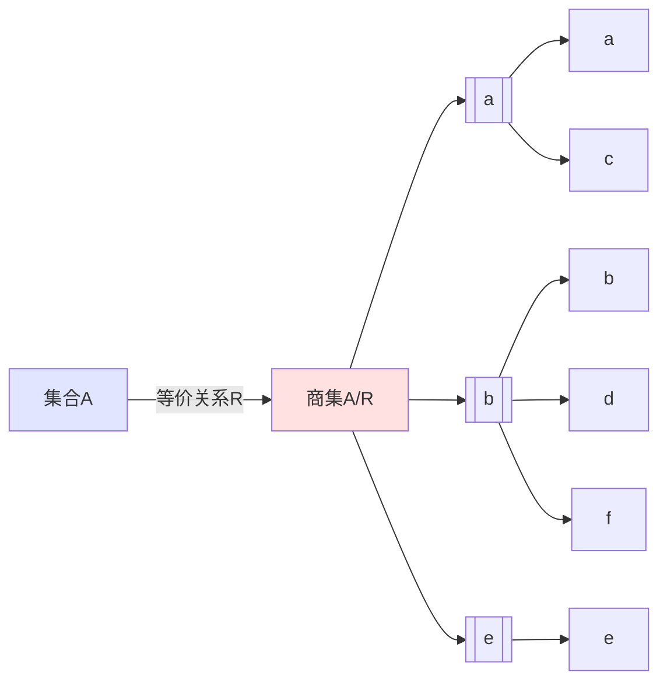
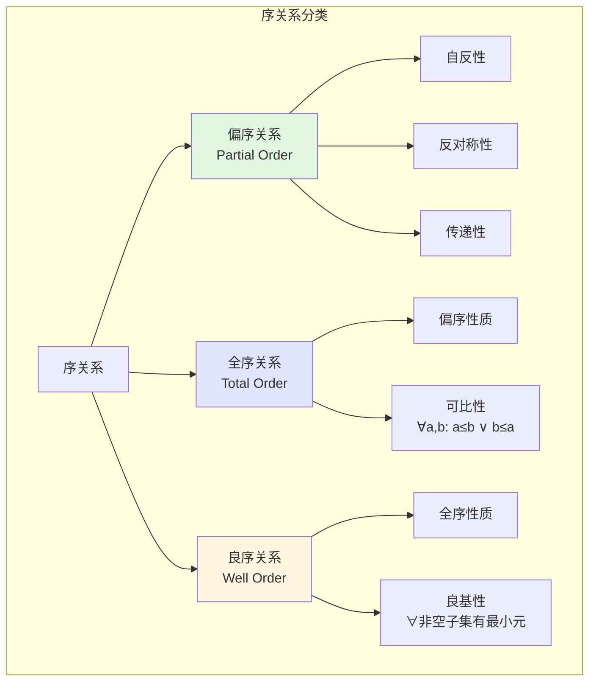
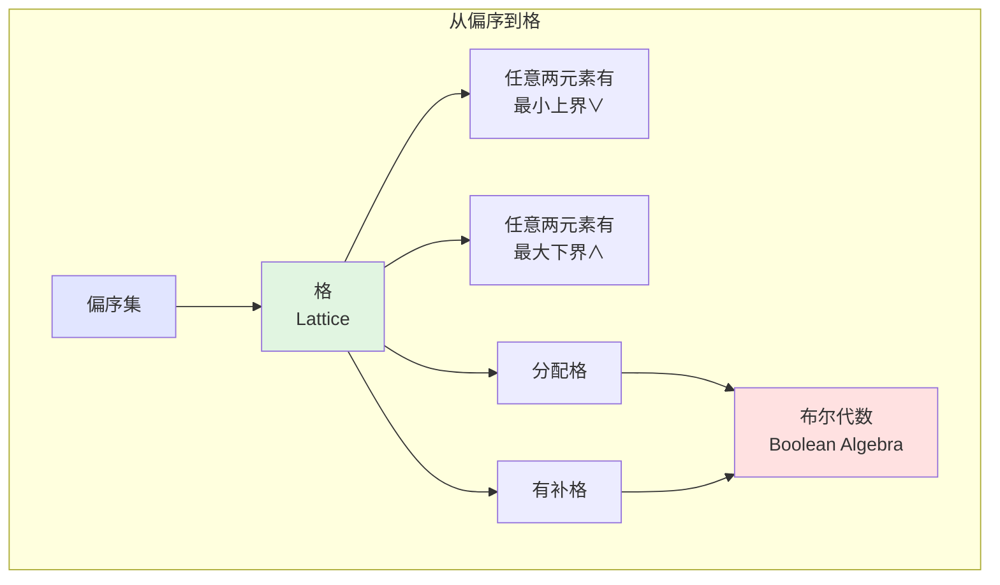
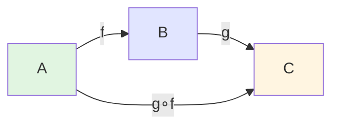
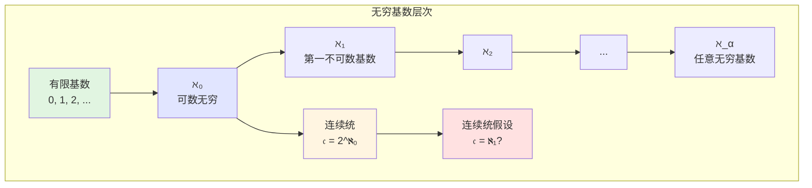
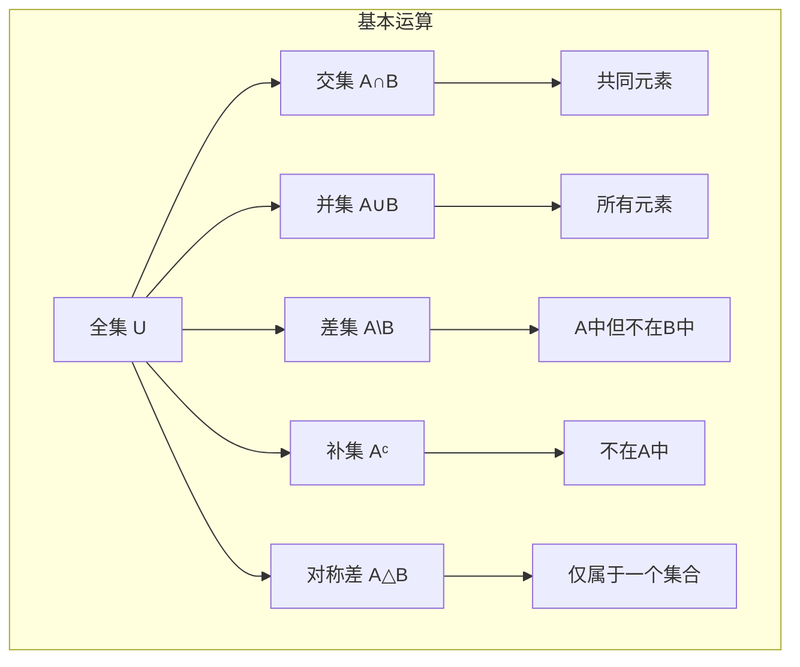
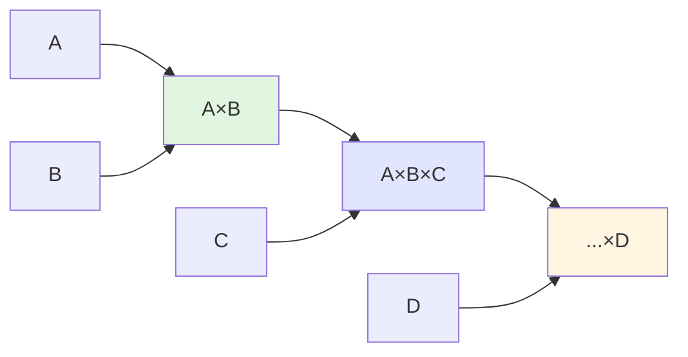
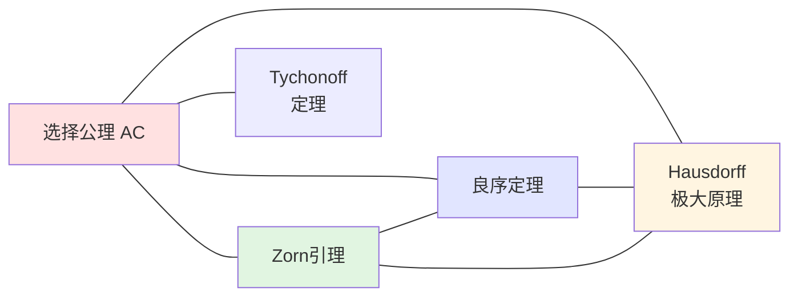

# 集合论概念可视化

**制定日期**: 2026年4月2日
**条目数量**: 10个核心概念
**可视化格式**: Mermaid图表、ASCII艺术、描述性结构

---

## 📋 目录

- [集合论概念可视化](#集合论概念可视化)
  - [📋 目录](#目录)
  - [一、幂集概念可视化](#一幂集概念可视化)
    - [1.1 概念定义](#11-概念定义)
    - [1.2 Mermaid层次图](#12-mermaid层次图)
    - [1.3 ASCII布尔格](#13-ascii布尔格)
    - [1.4 关键性质](#14-关键性质)
  - [二、等价类概念可视化](#二等价类概念可视化)
    - [2.1 概念定义](#21-概念定义)
    - [2.2 划分结构图](#22-划分结构图)
    - [2.3 ASCII划分示意](#23-ascii划分示意)
    - [2.4 商集结构](#24-商集结构)
  - [三、序关系概念可视化](#三序关系概念可视化)
    - [3.1 序关系类型对比](#31-序关系类型对比)
    - [3.2 Hasse图示例](#32-hasse图示例)
    - [3.3 序关系与格结构](#33-序关系与格结构)
  - [四、函数概念可视化](#四函数概念可视化)
    - [4.1 函数类型分类](#41-函数类型分类)
    - [4.2 ASCII函数示意图](#42-ascii函数示意图)
    - [4.3 函数复合](#43-函数复合)
  - [五、基数概念可视化](#五基数概念可视化)
    - [5.1 基数层次](#51-基数层次)
    - [5.2 可数与不可数](#52-可数与不可数)
    - [5.3 Cantor对角线论证可视化](#53-cantor对角线论证可视化)
  - [六、集合运算可视化](#六集合运算可视化)
    - [6.1 Venn图与运算](#61-venn图与运算)
    - [6.2 ASCII Venn图](#62-ascii-venn图)
    - [6.3 运算定律](#63-运算定律)
  - [七、笛卡尔积可视化](#七笛卡尔积可视化)
    - [7.1 二元笛卡尔积](#71-二元笛卡尔积)
    - [7.2 网格表示](#72-网格表示)
    - [7.3 多元笛卡尔积](#73-多元笛卡尔积)
  - [八、划分与覆盖可视化](#八划分与覆盖可视化)
    - [8.1 划分结构](#81-划分结构)
    - [8.2 ASCII划分与覆盖对比](#82-ascii划分与覆盖对比)
  - [九、归纳集可视化](#九归纳集可视化)
    - [9.1 归纳集定义](#91-归纳集定义)
    - [9.2 归纳构造过程](#92-归纳构造过程)
  - [十、选择公理可视化](#十选择公理可视化)
    - [10.1 选择公理陈述](#101-选择公理陈述)
    - [10.2 直观理解](#102-直观理解)
    - [10.3 等价形式关系](#103-等价形式关系)

---

## 一、幂集概念可视化

### 1.1 概念定义

**幂集** $P(A)$：集合 $A$ 的所有子集构成的集合。

$$P(A) = \{X \mid X \subseteq A\}$$

### 1.2 Mermaid层次图

```mermaid
graph TD
    A[集合A = {a,b,c}] --> B[幂集P(A)]
    B --> C[∅<br/>空集]
    B --> D[单元素子集]
    B --> E[双元素子集]
    B --> F[{a,b,c}<br/>全集]

    D --> D1[{a}]
    D --> D2[{b}]
    D --> D3[{c}]

    E --> E1[{a,b}]
    E --> E2[{a,c}]
    E --> E3[{b,c}]

    style C fill:#e1f5e1
    style F fill:#ffe1e1
    style D fill:#e1e5ff
    style E fill:#fff5e1

```

### 1.3 ASCII布尔格

```text
                  P({a,b,c}) = 8个子集
                  ╔═══════════════════════╗
                  ║      {a, b, c}        ║  基数3 (顶层)
                  ╚═══════════╦═══════════╝
           ┌──────────────────┼──────────────────┐
           ↓                  ↓                  ↓
      {a, b}              {a, c}              {b, c}
           ╲                │                ╱
            ╲               │               ╱
             ╲              │              ╱
              ╲      ┌─────┴─────┐       ╱
               ╲     ↓           ↓      ╱
                ╲  {a}         {b}     ╱
                 ╲   ╲         ╱     ╱
                  ╲   ╲       ╱     ╱
                   ╲   ╲     ╱     ╱
                    ╲   ╲   ╱     ╱
                     ╲   ↓ ↓     ╱
                      ╲ {a,b}   ╱
                       ╲  │    ╱
                        ╲ │   ╱
                         ╲│  ╱
                          ↓ ↓
                           ∅        基数0 (底层)

```

### 1.4 关键性质

| 性质 | 公式 | 可视化表示 |
|-----|------|-----------|
| 基数公式 | $\|P(A)\| = 2^{|A|}$ | 每层对应组合数 |
| 包含关系 | $X \subseteq Y$ | 格中的上升路径 |
| 补集对应 | $X \mapsto A \setminus X$ | 格的对称性 |
| 原子/上原子 | 单元素/余单元素 | 第一层/第二层 |

---

## 二、等价类概念可视化

### 2.1 概念定义

**等价类** $[a]_R$：在等价关系 $R$ 下与 $a$ 等价的所有元素构成的集合。

$$[a]_R = \{x \in A \mid a R x\}$$

### 2.2 划分结构图

```mermaid
graph TB
    subgraph 集合A
    direction LR
    A1((a)) --- A3((c))
    A2((b)) --- A4((d)) --- A6((f))
    A5((e))
    end

    subgraph 等价类划分
    direction TB
    C1[等价类[a]<br/>={a,c}]
    C2[等价类[b]<br/>={b,d,f}]
    C3[等价类[e]<br/>={e}]
    end

    A1 -.-> C1
    A3 -.-> C1
    A2 -.-> C2
    A4 -.-> C2
    A6 -.-> C2
    A5 -.-> C3

    style C1 fill:#e1f5e1
    style C2 fill:#e1e5ff
    style C3 fill:#fff5e1

```

### 2.3 ASCII划分示意

```text
┌─────────────────────────────────────────┐
│           集合 A = {a,b,c,d,e,f}         │
│                                         │
│   ┌─────────────┐ ┌─────────────┐       │
│   │  等价类[a]  │ │  等价类[b]  │       │
│   │  ┌───┬───┐  │ │  ┌───┬───┬───┐     │
│   │  │ a │ c │  │ │  │ b │ d │ f │     │
│   │  └───┴───┘  │ │  └───┴───┴───┘     │
│   │  代表元: a  │ │  代表元: b          │
│   └─────────────┘ └─────────────┘       │
│                                         │
│            ┌─────────────┐              │
│            │  等价类[e]  │              │
│            │  ┌───┐      │              │
│            │  │ e │      │              │
│            │  └───┘      │              │
│            │  代表元: e  │              │
│            └─────────────┘              │
│                                         │
│  性质:                                  │
│  • 不相交: [a] ∩ [b] = ∅               │
│  • 全覆盖: [a] ∪ [b] ∪ [e] = A         │
│  • 代表元等价: a ~ c ⟹ [a] = [c]       │
└─────────────────────────────────────────┘

```

### 2.4 商集结构



---

## 三、序关系概念可视化

### 3.1 序关系类型对比



### 3.2 Hasse图示例

**偏序集 ({1,2,3,6}, |)**

```text
         6
        ╱ ╲
       ╱   ╲
      2     3
       ╲   ╱
        ╲ ╱
         1

```

**全序集 (ℕ, ≤)**

```text
    ... → 4 → 3 → 2 → 1 → 0

    (反向链)

```

**良序集 (ℕ, ≤)**

```text
    0 → 1 → 2 → 3 → 4 → ...
    ↑
   最小元存在

```

### 3.3 序关系与格结构



---

## 四、函数概念可视化

### 4.1 函数类型分类

```mermaid
graph LR
    F[函数 f: A→B] --> INJ[单射<br/>Injective]
    F --> SUR[满射<br/>Surjective]
    F --> BIJ[双射<br/>Bijective]

    INJ --> INJ1[∀x₁≠x₂: f(x₁)≠f(x₂)]
    SUR --> SUR1[∀y∈B, ∃x∈A: f(x)=y]
    BIJ --> BIJ1[单射 + 满射]

    style INJ fill:#e1f5e1
    style SUR fill:#e1e5ff
    style BIJ fill:#ffe1e1

```

### 4.2 ASCII函数示意图

**单射（非满射）**:

```text
   A              B
  ┌───┐         ┌───┐
  │ a │────────→│ 1 │
  ├───┤         ├───┤
  │ b │────────→│ 2 │
  ├───┤         ├───┤
  │ c │────────→│ 3 │
  └───┘         │ 4 │  ← 未映射到
                └───┘

  特征: 不同输入→不同输出

```

**满射（非单射）**:

```text
   A              B
  ┌───┐         ┌───┐
  │ a │──┐      │ 1 │
  ├───┤  └─────→│   │
  │ b │──┐      ├───┤
  ├───┤  └───→│ 2 │
  │ c │────────→│   │
  └───┘         └───┘

  特征: B中每个元素都被映射到
       但 a≠b 而 f(a)=f(b)

```

**双射**:

```text
   A              B
  ┌───┐         ┌───┐
  │ a │────────→│ 1 │
  ├───┤         ├───┤
  │ b │────────→│ 2 │
  ├───┤         ├───┤
  │ c │────────→│ 3 │
  └───┘         └───┘

  特征: 完美的一一对应
       存在逆函数 f⁻¹

```

### 4.3 函数复合



---

## 五、基数概念可视化

### 5.1 基数层次



### 5.2 可数与不可数

```text
┌─────────────────────────────────────────────────┐
│              基数分类                            │
├─────────────────────────────────────────────────┤
│                                                 │
│  有限集              可数无穷          不可数    │
│  ┌───┐              ℵ₀                𝔠        │
│  │{1}│           ╔═══════╗         ╔═══════╗   │
│  ├───┤           ║ ℕ, ℤ, ║         ║ ℝ, ℂ, ║   │
│  │{a}│           ║ ℚ     ║         ║ P(ℕ)  ║   │
│  ├───┤           ╚═══════╝         ╚═══════╝   │
│  │...│              ↑                  ↑       │
│  └───┘           可列                   不可列  │
│                                                 │
│  特征:            特征:              特征:       │
│  |S| < ℵ₀      可与ℕ建立           无法与ℕ建立  │

│                一一对应            一一对应      │
│                                                 │
└─────────────────────────────────────────────────┘

```

### 5.3 Cantor对角线论证可视化

```text
假设 [0,1] 中实数可列:
r₁ = 0.d₁₁ d₁₂ d₁₃ d₁₄ ...
r₂ = 0.d₂₁ d₂₂ d₂₃ d₂₄ ...
r₃ = 0.d₃₁ d₃₂ d₃₃ d₃₄ ...
r₄ = 0.d₄₁ d₄₂ d₄₃ d₄₄ ...
...

构造新数 r = 0.e₁ e₂ e₃ e₄ ...
其中 eᵢ ≠ dᵢᵢ (对角线元素)

例如: eᵢ = (dᵢᵢ + 1) mod 10

则 r ≠ rᵢ 对所有 i 成立！
矛盾！因此 [0,1] 不可数。

可视化:
┌────────────────────────┐
│ r₁: d₁₁ d₁₂ d₁₃ ...    │
│ r₂: d₂₁ d₂₂ d₂₃ ...    │
│ r₃: d₃₁ d₃₂ d₃₃ ...    │
│    ↓    ↓    ↓         │
│ r : e₁  e₂  e₃  ...    │  ← 与每个rᵢ都不同
└────────────────────────┘

```

---

## 六、集合运算可视化

### 6.1 Venn图与运算



### 6.2 ASCII Venn图

```text
         ╭──────────────╮
        ╱    A         ╲
       │   ╭────────╮   │
       │  ╱   A∩B    ╲  │
       │ │  ╭────╮  │   │
       │ │  │    │  │   │
       │ │  ╰────╯  │   │
       │  ╲          ╱   │
       │   ╰────────╯    │
        ╲       B        ╱
         ╰──────────────╯

并集 A∪B: 整个图形区域
交集 A∩B: 中间重叠区域
差集 A\B: A中除去重叠部分
补集 Aᶜ: 全集U中A外的部分

```

### 6.3 运算定律

```text
┌─────────────────────────────────────────┐
│         集合运算基本定律                 │
├─────────────────────────────────────────┤
│                                         │
│  交换律:                                │
│    A ∪ B = B ∪ A                       │
│    A ∩ B = B ∩ A                       │
│                                         │
│  结合律:                                │
│    (A ∪ B) ∪ C = A ∪ (B ∪ C)           │
│    (A ∩ B) ∩ C = A ∩ (B ∩ C)           │
│                                         │
│  分配律:                                │
│    A ∪ (B ∩ C) = (A ∪ B) ∩ (A ∪ C)     │
│    A ∩ (B ∪ C) = (A ∩ B) ∪ (A ∩ C)     │
│                                         │
│  De Morgan律:                           │
│    (A ∪ B)ᶜ = Aᶜ ∩ Bᶜ                  │
│    (A ∩ B)ᶜ = Aᶜ ∪ Bᶜ                  │
│                                         │
└─────────────────────────────────────────┘

```

---

## 七、笛卡尔积可视化

### 7.1 二元笛卡尔积

```mermaid
graph TB
    subgraph A × B 结构
    A[A = {1,2}] --> AX[笛卡尔积 A×B]
    B[B = {a,b,c}] --> AX

    AX --> P1[(1,a)]
    AX --> P2[(1,b)]
    AX --> P3[(1,c)]
    AX --> P4[(2,a)]
    AX --> P5[(2,b)]
    AX --> P6[(2,c)]
    end

    style AX fill:#e1f5e1

```

### 7.2 网格表示

```text
    B
    a     b     c
   ┌─────┬─────┬─────┐
 1 │(1,a)│(1,b)│(1,c)│
A  ├─────┼─────┼─────┤
 2 │(2,a)│(2,b)│(2,c)│
   └─────┴─────┴─────┘

|A × B| = |A| × |B| = 2 × 3 = 6

```

### 7.3 多元笛卡尔积



---

## 八、划分与覆盖可视化

### 8.1 划分结构

```mermaid
graph TB
    subgraph 划分定义
    S[集合S] --> P[划分 P = {A₁,A₂,A₃}]

    P --> C1[条件1: 非空<br/>Aᵢ ≠ ∅]
    P --> C2[条件2: 不交<br/>Aᵢ ∩ Aⱼ = ∅ (i≠j)]
    P --> C3[条件3: 完全覆盖<br/>∪Aᵢ = S]
    end

    style P fill:#e1f5e1
    style C1 fill:#e1e5ff
    style C2 fill:#e1e5ff
    style C3 fill:#e1e5ff

```

### 8.2 ASCII划分与覆盖对比

```text
划分 (Partition):                    覆盖 (Cover):
┌─────────────────────┐            ┌─────────────────────┐
│        S            │            │        S            │
│   ┌───┐ ┌───┐       │            │   ┌───────┐         │
│   │ A │ │ B │ ┌───┐ │            │   │   A   │         │
│   │   │ │   │ │ C │ │            │   └───┬───┘         │
│   └───┘ └───┘ └───┘ │            │   ┌───┴───┐         │
│                     │            │   │   B   │         │
│ 特征:               │            │   └───┬───┘         │
│ • 子集两两不交      │            │   ┌───┴───┐         │
│ • 并集等于全集      │            │   │   C   │         │
└─────────────────────┘            └─────────────────────┘

                                   特征:
                                   • 子集可有交集
                                   • 并集等于全集

```

---

## 九、归纳集可视化

### 9.1 归纳集定义

```mermaid
graph TB
    subgraph 归纳集
    I[归纳集 I ⊆ ℝ] --> C1[条件1: 1 ∈ I]
    I --> C2[条件2: 若 x ∈ I, 则 x+1 ∈ I]

    C1 --> N[ℕ ⊆ I]
    C2 --> N

    N --> MIN[ℕ = ∩{所有归纳集}]
    end

    style I fill:#e1f5e1
    style N fill:#ffe1e1

```

### 9.2 归纳构造过程

```text
归纳集构造自然数:
━━━━━━━━━━━━━━━━━━━━━━━━━━━━━━━━━━━━━━━━━

初始: 1 ∈ I

步骤1: 1 ∈ I ⟹ 1+1 = 2 ∈ I
步骤2: 2 ∈ I ⟹ 2+1 = 3 ∈ I
步骤3: 3 ∈ I ⟹ 3+1 = 4 ∈ I
...

ℕ = {1, 2, 3, 4, 5, ...}
   ↑
   最小归纳集（Peano公理模型）

可视化链:
1 ─→ 2 ─→ 3 ─→ 4 ─→ 5 ─→ ...
↑
归纳起点

Peano公理:
• 0 (或1) 是自然数
• 每个自然数有唯一后继
• 不同数有不同后继
• 归纳原理成立
━━━━━━━━━━━━━━━━━━━━━━━━━━━━━━━━━━━━━━━━━

```

---

## 十、选择公理可视化

### 10.1 选择公理陈述

```mermaid
graph TB
    subgraph 选择公理 AC
    F[非空集族 ℱ = {Aᵢ}ᵢ∈ᵢ] --> AC[选择函数<br/>f: I → ∪Aᵢ]
    AC --> P[性质: ∀i∈I, f(i) ∈ Aᵢ]

    AC --> E[等价形式]
    E --> Z[Zorn引理]
    E --> W[良序定理]
    E --> H[Hausdorff极大原理]
    end

    style AC fill:#ffe1e1
    style Z fill:#e1e5ff
    style W fill:#e1f5e1
    style H fill:#fff5e1

```

### 10.2 直观理解

```text
┌─────────────────────────────────────────────┐
│           选择公理直观解释                   │
├─────────────────────────────────────────────┤
│                                             │
│  给定:                                      │
│  ┌─────┐ ┌─────┐ ┌─────┐ ┌─────┐           │
│  │ {a} │ │{b,c}│ │{d,e}│ │ {f} │ ...       │
│  │     │ │     │ │ f,  │ │     │           │
│  └─────┘ └─────┘ └─────┘ └─────┘           │
│                                             │
│  声称: 可以从每个集合中"选择"一个元素        │
│                                             │
│  选择函数 f:                                │
│  f(1) = a  ← 从第一个集合选 a              │
│  f(2) = c  ← 从第二个集合选 c              │
│  f(3) = e  ← 从第三个集合选 e              │
│  f(4) = f  ← 从第四个集合选 f              │
│  ...                                        │
│                                             │
│  争议点: 当集合无限且不可数时，              │
│         "选择" 是否存在？                   │
│                                             │
│  注意: 对有限集族，选择公理可由              │
│        其他公理推出                         │
│                                             │
└─────────────────────────────────────────────┘

```

### 10.3 等价形式关系



---

**文档状态**: ✅ 完成
**条目数量**: 10个核心概念可视化
**最后更新**: 2026年4月2日
