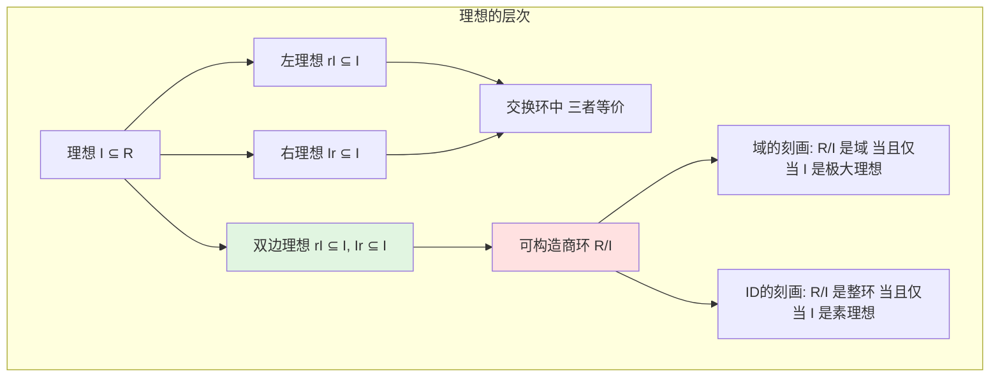
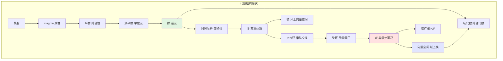

# 代数结构概念可视化

**制定日期**: 2026年4月2日
**条目数量**: 12个核心概念
**可视化格式**: Mermaid图表、ASCII艺术、描述性结构

---

## 📋 目录

- [代数结构概念可视化](#代数结构概念可视化)
  - [📋 目录](#-目录)
  - [一、群作用概念可视化](#一群作用概念可视化)
    - [1.1 概念定义](#11-概念定义)
    - [1.2 Mermaid结构图](#12-mermaid结构图)
    - [1.3 轨道分解ASCII图](#13-轨道分解ascii图)
    - [1.4 群作用的类型](#14-群作用的类型)
  - [二、子群与陪集可视化](#二子群与陪集可视化)
    - [2.1 子群格](#21-子群格)
    - [2.2 陪集分解](#22-陪集分解)
  - [三、正规子群与商群可视化](#三正规子群与商群可视化)
    - [3.1 正规子群条件](#31-正规子群条件)
    - [3.2 第一同构定理](#32-第一同构定理)
  - [四、环同态可视化](#四环同态可视化)
    - [4.1 环同态定义](#41-环同态定义)
  - [五、理想与商环可视化](#五理想与商环可视化)
    - [5.1 理想类型](#51-理想类型)
  - [六、域扩张可视化](#六域扩张可视化)
    - [6.1 域扩张塔](#61-域扩张塔)
  - [七、伽罗瓦对应可视化](#七伽罗瓦对应可视化)
    - [7.1 伽罗瓦理论基本定理](#71-伽罗瓦理论基本定理)
  - [八、模的结构可视化](#八模的结构可视化)
    - [8.1 模的定义](#81-模的定义)
  - [九、张量积可视化](#九张量积可视化)
    - [9.1 张量积的泛性质](#91-张量积的泛性质)
  - [十、范畴与函子可视化](#十范畴与函子可视化)
    - [10.1 范畴的基本结构](#101-范畴的基本结构)
    - [10.2 函子](#102-函子)
  - [十一、正合列可视化](#十一正合列可视化)
    - [11.1 正合列定义](#111-正合列定义)
  - [十二、代数结构层次图](#十二代数结构层次图)
    - [12.1 代数结构谱系](#121-代数结构谱系)

---

## 一、群作用概念可视化

### 1.1 概念定义

**群作用**: 群 G 在集合 X 上的作用是一个映射 G × X → X，满足：

- 单位元作用: e · x = x
- 相容性: (gh) · x = g · (h · x)

### 1.2 Mermaid结构图

```mermaid
graph TB
    subgraph 群作用 G 作用于 X
    G[群 G] --> A[作用]
    X[集合 X] --> A

    A --> F[群同态 φ: G → Sym(X)]
    F --> P[置换表示]

    A --> O[轨道分解]
    O --> O1[轨道 Orbit G·x = {g·x | g∈G}]
    O --> S[稳定子群 Stab(x) = {g∈G | g·x = x}]

    O1 --> C[轨道-稳定子定理 |G·x| = [G:Stab(x)]]
    end

    style G fill:#e1f5e1
    style X fill:#e1e5ff
    style O fill:#ffe1e1
```

### 1.3 轨道分解ASCII图

```
群 G 作用于集合 X
━━━━━━━━━━━━━━━━━━━━━━━━━━━━━━━━━━━━━━━━━━━━━━━

集合 X 被分解为不相交的轨道:

┌─────────────────────────────────────────────┐
│                                             │
│   ┌─────────┐   ┌─────────────┐   ┌─────┐  │
│   │ 轨道O₁  │   │    轨道O₂   │   │ O₃  │  │
│   │ ┌─┬─┐   │   │ ┌─┬─┬─┬─┐   │   │ ┌─┐ │  │
│   │ │a│b│   │   │ │c│d│e│f│   │   │ │g│ │  │
│   │ └─┴─┘   │   │ └─┴─┴─┴─┘   │   │ └─┘ │  │
│   │ |O₁|=2 │   │   |O₂|=4    │   │|O₃|=1│  │
│   └─────────┘   └─────────────┘   └─────┘  │
│                                             │
│ X = O₁ ∪ O₂ ∪ O₃ (不交并)                   │
│ |X| = |O₁| + |O₂| + |O₃| = 2 + 4 + 1 = 7   │
│                                             │
└─────────────────────────────────────────────┘

轨道-稳定子定理:
对于 x ∈ O₁: |O₁| = |G| / |Stab(x)|
```

### 1.4 群作用的类型

```mermaid
graph LR
    A[群作用类型] --> T[传递作用 只有一个轨道]
    A --> F[自由作用 Stab(x)={e}]
    A --> R[正则作用 传递+自由]
    A --> FA[忠实作用 核为{e}]

    T --> T1[X ≅ G/Stab(x)]
    F --> F1[|G·x| = |G|]
    R --> R1[X ≅ G]

    style T fill:#e1f5e1
    style F fill:#e1e5ff
    style R fill:#ffe1e1
```

---

## 二、子群与陪集可视化

### 2.1 子群格

```mermaid
graph TB
    subgraph 子群格结构
    G[G] --> H1[H₁]
    G --> H2[H₂]
    G --> H3[H₃]

    H1 --> K1[K₁]
    H1 --> K2[K₂]
    H2 --> K1
    H2 --> K3[K₃]

    K1 --> E[{e}]
    K2 --> E
    K3 --> E

    style G fill:#ffe1e1
    style E fill:#e1f5e1
    end
```

### 2.2 陪集分解

```
子群 H ≤ G 的左陪集分解
━━━━━━━━━━━━━━━━━━━━━━━━━━━━━━━━━━━━━━━━━━━━━━━

G = H ∪ g₁H ∪ g₂H ∪ ... ∪ gₙH

┌─────────────────────────────────────────────┐
│                                             │
│  H     g₁H     g₂H     ...     gₙH          │
│ ┌───┐ ┌───┐ ┌───┐         ┌───┐            │
│ │ e │ │g₁ │ │g₂ │   ...   │gₙ │            │
│ ├───┤ ├───┤ ├───┤         ├───┤            │
│ │h₁ │ │g₁h₁│ │g₂h₁│   ...   │gₙh₁│            │
│ ├───┤ ├───┤ ├───┤         ├───┤            │
│ │h₂ │ │g₁h₂│ │g₂h₂│   ...   │gₙh₂│            │
│ ├───┤ ├───┤ ├───┤         ├───┤            │
│ │...│ │...│ │...│         │...│            │
│ └───┘ └───┘ └───┘         └───┘            │
│                                             │
│ 性质:                                       │
│ • 所有陪集大小相等: |gH| = |H|              │
│ • 不同陪集不相交                            │
│ • [G:H] = 陪集个数 = |G|/|H|                │
│                                             │
└─────────────────────────────────────────────┘
```

---

## 三、正规子群与商群可视化

### 3.1 正规子群条件

```mermaid
graph TB
    subgraph 正规子群 N 是 G 的正规子群
    N[子群 N ≤ G] --> C[正规性条件]

    C --> C1[∀g∈G: gNg⁻¹ = N]
    C --> C2[∀g∈G: gN = Ng]
    C --> C3[N 是共轭类并]
    C --> C4[核 ker(φ) = N 对某个同态 φ]

    C1 --> Q[可构造商群 G/N]
    C2 --> Q

    Q --> Q1[运算: (gN)(hN) = (gh)N]
    Q --> Q2[自然投影 π: G → G/N]
    end

    style N fill:#e1f5e1
    style Q fill:#ffe1e1
```

### 3.2 第一同构定理

```mermaid
graph TB
    subgraph 第一同构定理
    G[群G] -->|同态 φ| H[群H]

    G --> N[ker(φ) 是 G 的正规子群]
    H --> I[im(φ) ≤ H]

    N --> Q[商群 G/ker(φ)]
    Q --> ISO[≅ im(φ)]
    I --> ISO

    ISO --> R[基本关系: G/ker(φ) ≅ im(φ)]
    end

    style G fill:#e1e5ff
    style H fill:#e1f5e1
    style ISO fill:#ffe1e1
```

---

## 四、环同态可视化

### 4.1 环同态定义

```mermaid
graph TB
    subgraph 环同态 φ: R → S
    R[环R] --> P[保持运算]

    P --> A[加法同态 φ(a+b) = φ(a)+φ(b)]
    P --> M[乘法同态 φ(ab) = φ(a)φ(b)]
    P --> U[保持单位元 φ(1ᵣ) = 1ₛ]

    A --> K[kernel(φ) = {r∈R | φ(r)=0}]
    M --> I[image(φ) ≤ S 子环]

    K --> I2[ker(φ) 是 R 的理想]
    end

    style R fill:#e1e5ff
    style K fill:#ffe1e1
```

---

## 五、理想与商环可视化

### 5.1 理想类型



---

## 六、域扩张可视化

### 6.1 域扩张塔

```mermaid
graph TB
    subgraph 域扩张 K/F
    F[基域 F] --> E[中间域 E]
    E --> K[扩张域 K]

    F --> D[次数 [K:F] = dimᶠK]
    E --> D1[[K:F] = [K:E][E:F]]

    K --> A[代数元 α满足F上多项式]
    K --> T[超越元 α不满足任何F上多项式]

    A --> SF[单代数扩张 F(α) ≅ F[x]/(m_α)]
    T --> ST[单超越扩张 F(α) ≅ F(x)]
    end

    style F fill:#e1f5e1
    style K fill:#ffe1e1
```

---

## 七、伽罗瓦对应可视化

### 7.1 伽罗瓦理论基本定理

```mermaid
graph TB
    subgraph 伽罗瓦对应
    direction TB

    subgraph 域的层次
    F1[K] --- E1[中间域E]
    E1 --- F11[F]
    end

    subgraph 群的层次
    G1[{e}] --- H1[子群H]
    H1 --- G11[Gal(K/F)]
    end

    F1 -.->|固定子域| H1
    H1 -.->|固定域| E1
    E1 -.->|伽罗瓦群| H1

    style F1 fill:#e1f5e1
    style G1 fill:#e1e5ff
    style E1 fill:#fff5e1
    style H1 fill:#ffe1e1
    end
```

---

## 八、模的结构可视化

### 8.1 模的定义

```mermaid
graph TB
    subgraph 模 M over 环 R
    R[环 R] --> M[模 M 加法群]

    M --> A[加法结构 (M, +) 是阿贝尔群]
    M --> S[数乘结构 R × M → M]

    S --> D[分配律 r(m+n) = rm + rn]
    S --> A1[结合律 (rs)m = r(sm)]
    S --> U[单位元 1·m = m]

    M --> SM[子模 N ⊆ M, 对运算封闭]
    M --> QM[商模 M/N]
    end

    style R fill:#e1e5ff
    style M fill:#e1f5e1
    style SM fill:#fff5e1
```

---

## 九、张量积可视化

### 9.1 张量积的泛性质

```mermaid
graph TB
    subgraph 张量积泛性质
    M[模M] --> P[M × N]
    N[模N] --> P

    P --> TP[M ⊗ᵣ N]
    P --> B[双线性映射 B: M × N → P]

    TP --> L[线性映射 f̃: M⊗N → P]
    B --> L

    L --> U[泛性质: Bil(M,N;P) ≅ Hom(M⊗N,P)]
    end

    style M fill:#e1e5ff
    style N fill:#e1f5e1
    style TP fill:#ffe1e1
```

---

## 十、范畴与函子可视化

### 10.1 范畴的基本结构

```mermaid
graph TB
    subgraph 范畴 C
    O[对象类 Obj(C)] --> M[态射类 Mor(C)]

    M --> D[定义域 dom: Mor → Obj]
    M --> C1[上域 cod: Mor → Obj]

    M --> I[恒等态射 idₐ: A → A]
    M --> CO[复合 ∘: Mor × Mor → Mor]

    CO --> A1[结合律 (f∘g)∘h = f∘(g∘h)]
    I --> U[单位律 f∘id = f = id∘f]
    end

    style O fill:#e1e5ff
    style M fill:#e1f5e1
```

### 10.2 函子

```mermaid
graph TB
    subgraph 函子 F: C → D
    C1[范畴C] --> D1[范畴D]

    C1 --> OC[对象映射 A ↦ F(A)]
    C1 --> MC[态射映射 f: A→B ↦ F(f): F(A)→F(B)]

    MC --> P1[保持恒等 F(idₐ) = id_F(A)]
    MC --> P2[保持复合 F(g∘f) = F(g)∘F(f)]

    P1 --> CF[协变函子]
    P2 --> CF

    MC --> CON[反变函子 F(f): F(B)→F(A)]
    end

    style C1 fill:#e1e5ff
    style D1 fill:#e1f5e1
    style CF fill:#ffe1e1
```

---

## 十一、正合列可视化

### 11.1 正合列定义

```mermaid
graph LR
    subgraph 正合列
    A[A] -->|f| B[B] -->|g| C[C]

    E[正合性 im(f) = ker(g)] --> C1[B点处正合]
    B --> E

    A1[短正合列] --> SEQ[0 → A → B → C → 0]

    SEQ --> I[f 单射]
    SEQ --> S[g 满射]
    SEQ --> Q[C ≅ B/A]
    end

    style E fill:#ffe1e1
    style SEQ fill:#e1f5e1
```

---

## 十二、代数结构层次图

### 12.1 代数结构谱系



---

**文档状态**: ✅ 完成
**条目数量**: 12个代数结构概念可视化
**最后更新**: 2026年4月2日
