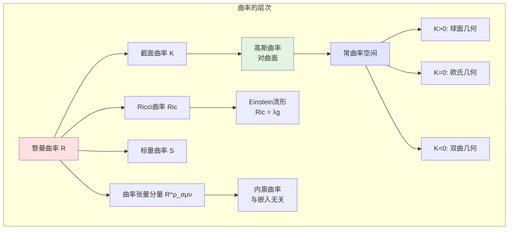

# 几何学概念可视化

**制定日期**: 2026年4月2日
**条目数量**: 10个核心概念
**可视化格式**: Mermaid图表、ASCII艺术、描述性结构

---

## 📋 目录

- [几何学概念可视化](#几何学概念可视化)
  - [📋 目录](#目录)
  - [一、流形概念可视化](#一流形概念可视化)
    - [1.1 流形定义](#11-流形定义)
    - [1.2 流形的局部结构](#12-流形的局部结构)
  - [二、切空间可视化](#二切空间可视化)
    - [2.1 切空间的定义](#21-切空间的定义)
    - [2.2 切空间的几何直观](#22-切空间的几何直观)
  - [三、曲率概念可视化](#三曲率概念可视化)
    - [3.1 曲率类型](#31-曲率类型)
    - [3.2 曲率的几何意义](#32-曲率的几何意义)
  - [四、测地线可视化](#四测地线可视化)
    - [4.1 测地线方程](#41-测地线方程)
    - [4.2 不同曲率空间的测地线](#42-不同曲率空间的测地线)
  - [五、纤维丛概念](#五纤维丛概念)
    - [5.1 纤维丛结构](#51-纤维丛结构)
    - [5.2 常见纤维丛](#52-常见纤维丛)
  - [六、黎曼度量可视化](#六黎曼度量可视化)
    - [6.1 黎曼度量的定义](#61-黎曼度量的定义)
    - [6.2 度量的局部表示](#62-度量的局部表示)
  - [七、联络概念](#七联络概念)
    - [7.1 仿射联络](#71-仿射联络)
    - [7.2 平行移动与曲率](#72-平行移动与曲率)
  - [八、指数映射](#八指数映射)
    - [8.1 指数映射的定义](#81-指数映射的定义)
    - [8.2 指数映射的几何](#82-指数映射的几何)
  - [九、等距嵌入](#九等距嵌入)
    - [9.1 等距嵌入定理](#91-等距嵌入定理)
    - [9.2 嵌入的例子](#92-嵌入的例子)
  - [十、几何不变量](#十几何不变量)
    - [10.1 拓扑不变量与几何不变量](#101-拓扑不变量与几何不变量)
    - [10.2 Gauss-Bonnet定理](#102-gauss-bonnet定理)

---

## 一、流形概念可视化

### 1.1 流形定义

```mermaid
graph TB
    subgraph n维光滑流形 M
    M[拓扑空间 M] --> C[局部同胚于 ℝ^n]
    C --> A[图册 {Uₐ, φₐ}]

    A --> C1[覆盖: ∪Uₐ = M]
    A --> C2[坐标卡: φₐ: Uₐ → ℝ^n]
    A --> C3[转移映射光滑<br/>φᵦ∘φₐ⁻¹ ∈ C^∞]

    M --> S[结构层 O_M]
    S --> F[光滑函数环]
    end

    style M fill:#e1e5ff
    style C fill:#e1f5e1
    style A fill:#ffe1e1

```

### 1.2 流形的局部结构

```

流形的局部坐标卡
━━━━━━━━━━━━━━━━━━━━━━━━━━━━━━━━━━━━━━━━━━━━━━━

        流形 M
           │
    ┌──────┴──────┐
    │   坐标卡    │
    │  (U, φ)     │
    │             │
    │    U ⊆ M    │────────→ ℝ^n
    │      ●      │    φ
    │     ╱│╲     │
    │    ╱ │ ╲    │
    │   p  │  q   │
    └──────┼──────┘
           │
    ┌──────┴──────┐
    │   坐标表示  │
    │             │
    │  φ(p) = (x¹,...,xⁿ) │
    │  φ(q) = (y¹,...,yⁿ) │
    │             │
    └─────────────┘

转移映射:
若 (Uₐ, φₐ) 和 (Uᵦ, φᵦ) 是两个坐标卡,
则转移映射 φᵦ∘φₐ⁻¹: φₐ(Uₐ∩Uᵦ) → φᵦ(Uₐ∩Uᵦ)
必须是光滑的 (C^∞)

流形的例子:
• S^n: n维球面
• T^n: n维环面
• RP^n: 实射影空间
• CP^n: 复射影空间
• Lie群: 既是群又是流形
━━━━━━━━━━━━━━━━━━━━━━━━━━━━━━━━━━━━━━━━━━━━━━━

```

---

## 二、切空间可视化

### 2.1 切空间的定义

```mermaid
graph TB
    subgraph 切空间 T_pM
    M[流形 M] --> P[点 p ∈ M]
    P --> T[切空间 T_pM]

    T --> D1[几何定义<br/>过p的曲线速度向量]
    T --> D2[代数定义<br/>导子 D: C^∞(M)→ℝ]
    T --> D3[物理定义<br/>方向导数]

    D1 --> C[曲线 γ: (-ε,ε) → M<br/>γ(0) = p]
    C --> V[切向量 v = γ'(0)]

    T --> B[基 {∂/∂x¹, ..., ∂/∂xⁿ}]
    B --> D[dim T_pM = dim M]

    P --> TM[切丛 TM = ⊔_p T_pM]
    end

    style T fill:#e1f5e1
    style TM fill:#ffe1e1

```

### 2.2 切空间的几何直观

```

切空间的几何意义
━━━━━━━━━━━━━━━━━━━━━━━━━━━━━━━━━━━━━━━━━━━━━━━

        M (曲面)
           │
           │    ╱ T_pM (切平面)
           │   ╱
           │  ╱ ╱╲ 切向量 v
           │ ●╱──╱─────────
           │p╱
           │╱
           │

在局部坐标 (x¹,...,xⁿ) 下:

切向量 v ∈ T_pM 可表示为:
v = v^i ∂/∂x^i|_p

基向量 ∂/∂x^i 的几何意义:
沿坐标曲线 x^i 方向的偏导数方向

切丛 TM:
所有切空间的并 TM = {(p,v) | p∈M, v∈T_pM}

TM 本身是 2n 维流形

余切空间 T_p*M:
T_pM 的对偶空间, 由余向量 (1-形式) 组成
基: {dx¹, ..., dxⁿ}
━━━━━━━━━━━━━━━━━━━━━━━━━━━━━━━━━━━━━━━━━━━━━━━

```

---

## 三、曲率概念可视化

### 3.1 曲率类型



### 3.2 曲率的几何意义

```

曲率的几何解释
━━━━━━━━━━━━━━━━━━━━━━━━━━━━━━━━━━━━━━━━━━━━━━━

1. 高斯曲率 (曲面):

   K = k₁ · k₂ (主曲率的乘积)

   K > 0: 椭球点          K = 0: 抛物点          K < 0: 双曲点
   ┌─────────┐           ┌─────────┐           ┌─────────┐
   │   ╭─╮   │           │   ╭───  │           │  ╱╲     │
   │  ╱   ╲  │           │  ╱      │           │ ╱  ╲    │
   │ │  ●  │ │           │ ●─────  │           │╱ ●  ╲   │
   │  ╲   ╱  │           │         │           │   鞍形   │
   │   ╰─╯   │           │         │           │         │
   └─────────┘           └─────────┘           └─────────┘
   球面                   柱面                   马鞍面

2. 截面曲率:
   对切平面 σ ⊂ T_pM,
   K(σ) = ⟨R(u,v)v,u⟩ / (|u|²|v|² - ⟨u,v⟩²)

   其中 {u,v} 是 σ 的基

3. Ricci曲率:
   沿方向 v 的平均曲率
   Ric(v,v) = Σ K(v,eᵢ) 对标准正交基 {eᵢ}

4. 标量曲率:
   S = Σ Ric(eᵢ,eᵢ) = 2Σ K(eᵢ,eⱼ)
   点 p 处的总曲率

几何意义:
• 曲率影响测地线的发散/收敛
• 正曲率: 测地线向彼此弯曲 (如球面)
• 负曲率: 测地线彼此远离 (如双曲空间)
• 零曲率: 测地线保持平行 (欧氏空间)
━━━━━━━━━━━━━━━━━━━━━━━━━━━━━━━━━━━━━━━━━━━━━━━

```

---

## 四、测地线可视化

### 4.1 测地线方程

```mermaid
graph TB
    subgraph 测地线 γ(t)
    G[测地线] --> D[定义: 局部最短路径]

    D --> E[测地线方程]
    E --> EQ[d²x^i/dt² + Γ^i_jk (dx^j/dt)(dx^k/dt) = 0]

    EQ --> C[Christoffel符号<br/>Γ^i_jk = ½g^il(∂_j g_kl + ∂_k g_jl - ∂_l g_jk)]

    G --> P[测地线的性质]
    P --> P1[自平行曲线<br/>∇_γ' γ' = 0]
    P --> P2[弧长极值]
    P --> P3[由初值唯一确定<br/>给定 p∈M, v∈T_pM]

    P3 --> E2[指数映射 exp_p(v) = γ_v(1)]
    end

    style G fill:#e1f5e1
    style E fill:#ffe1e1

```

### 4.2 不同曲率空间的测地线

```

测地线在不同曲率空间中的行为
━━━━━━━━━━━━━━━━━━━━━━━━━━━━━━━━━━━━━━━━━━━━━━━

欧氏空间 (K=0):            球面 (K>0):              双曲空间 (K<0):

    ═════════════════          ╭─────────╮             ╱╲    ╱╲
    平行直线                   ╱   大圆   ╲           ╱  ╲  ╱  ╲
                              ╱            ╲         ╱    ╲╱    ╲
                             ●──────────────●       ╱              ╲
                            测地线汇聚于对径点     测地线发散

测地完备性:
• 完备黎曼流形: 所有测地线可无限延伸
• Hopf-Rinow定理: 度量完备 ⟺ 测地完备
• 紧致流形必完备

测地线与曲率的关系:
Jacobi场 J(t) 描述邻近测地线的偏离:
J'' + R(J,γ')γ' = 0 (Jacobi方程)

• K>0: 测地线汇聚 (J振荡)
• K=0: 测地线平行 (J线性)
• K<0: 测地线发散 (J指数增长)
━━━━━━━━━━━━━━━━━━━━━━━━━━━━━━━━━━━━━━━━━━━━━━━

```

---

## 五、纤维丛概念

### 5.1 纤维丛结构

```mermaid
graph TB
    subgraph 纤维丛 (E, π, M, F)
    E[全空间 E] --> P[投影 π: E → M]
    M[底空间 M] --> P

    P --> F1[纤维 F_p = π⁻¹(p) ≅ F]
    F[标准纤维 F] --> F1

    E --> L[局部平凡化]
    L --> T[φₐ: π⁻¹(Uₐ) → Uₐ × F]

    T --> S[结构群 G]
    S --> A[转移函数<br/>gₐᵦ: Uₐ∩Uᵦ → G]

    A --> B[丛的结构由<br/>转移函数决定]
    end

    style E fill:#e1e5ff
    style M fill:#e1f5e1
    style F fill:#ffe1e1

```

### 5.2 常见纤维丛

```

纤维丛的例子
━━━━━━━━━━━━━━━━━━━━━━━━━━━━━━━━━━━━━━━━━━━━━━━

1. 切丛 TM:
   E = TM, M = M, F = ℝ^n, G = GL(n,ℝ)

       TM
       │
       │ π
       ↓
       M
   纤维: T_pM ≅ ℝ^n

2. 余切丛 T*M:
   E = T*M, F = ℝ^n
   纤维: T_p*M

3. 标架丛 FM:
   E = {(p, e₁,...,eₙ) | {eᵢ} 是 T_pM 的基}

   F = GL(n,ℝ), G = GL(n,ℝ)
   主丛

4. 向量丛:
   纤维是向量空间 (切丛、法丛等)

5. 主G-丛:
   纤维是Lie群 G
   结构群也是 G
   主丛上的联络对应规范场论中的规范势

丛的运算:
• Whitney和: E ⊕ F
• 张量积: E ⊗ F
• 对偶丛: E*
• 外幂: Λ^k E
━━━━━━━━━━━━━━━━━━━━━━━━━━━━━━━━━━━━━━━━━━━━━━━

```

---

## 六、黎曼度量可视化

### 6.1 黎曼度量的定义

```mermaid
graph TB
    subgraph 黎曼度量 g
    M[流形 M] --> G[度量张量 g]

    G --> P[点wise内积<br/>g_p: T_pM × T_pM → ℝ]

    P --> S1[对称性<br/>g(u,v) = g(v,u)]
    P --> P2[正定性<br/>g(v,v) ≥ 0, =0 ⟺ v=0]
    P --> B[双线性]

    G --> L[局部表示<br/>g = gᵢⱼ dx^i ⊗ dx^j]

    L --> C[Christoffel符号]
    L --> R[黎曼曲率张量]

    G --> D[诱导距离函数<br/>d(p,q) = inf{长度(γ)}]
    end

    style G fill:#e1f5e1
    style L fill:#ffe1e1
    style D fill:#e1e5ff

```

### 6.2 度量的局部表示

```

黎曼度量的局部表示
━━━━━━━━━━━━━━━━━━━━━━━━━━━━━━━━━━━━━━━━━━━━━━━

在局部坐标 (x¹, ..., xⁿ) 下:

ds² = gᵢⱼ dx^i dx^j

度量系数:
gᵢⱼ = g(∂/∂x^i, ∂/∂x^j)

例子:

1. 欧氏空间 ℝ^n:
   ds² = (dx¹)² + ... + (dxⁿ)²
   gᵢⱼ = δᵢⱼ (单位矩阵)

2. 球面 S² (半径R):
   ds² = R²(dθ² + sin²θ dφ²)

3. 双曲平面 H²:
   ds² = (dx² + dy²)/y²  (上半平面模型)

4. Schwarzschild度规:
   ds² = -(1-2M/r)dt² + (1-2M/r)⁻¹dr² + r²dΩ²
   (描述黑洞外部的时空)

度量的作用:
• 计算向量长度: |v| = √g(v,v)

• 计算曲线长度: L(γ) = ∫√g(γ',γ') dt
• 计算角度: cosθ = g(u,v)/(|u||v|)
• 计算体积: dV = √|g| dx¹∧...∧dxⁿ

━━━━━━━━━━━━━━━━━━━━━━━━━━━━━━━━━━━━━━━━━━━━━━━

```

---

## 七、联络概念

### 7.1 仿射联络

```mermaid
graph TB
    subgraph 联络 ∇
    TM[切丛 TM] --> C[协变导数<br/>∇: Γ(TM) × Γ(TM) → Γ(TM)]

    C --> P1[线性性<br/>∇_X(Y+Z) = ∇_XY + ∇_XZ]
    C --> P2[Leibniz法则<br/>∇_X(fY) = X(f)Y + f∇_XY]
    C --> P3[函数线性<br/>∇_(fX)Y = f∇_XY]

    C --> L[Levi-Civita联络<br/>唯一满足:]
    L --> T[无挠<br/>T(X,Y) = ∇_XY - ∇_YX - [X,Y] = 0]
    L --> M[度量相容<br/>∇g = 0]

    C --> P[平行移动<br/>沿曲线的向量平移]
    end

    style C fill:#e1f5e1
    style L fill:#ffe1e1
    style P fill:#e1e5ff

```

### 7.2 平行移动与曲率

```

平行移动与Holonomy
━━━━━━━━━━━━━━━━━━━━━━━━━━━━━━━━━━━━━━━━━━━━━━━

平行移动:
沿曲线 γ 将向量 v ∈ T_pM 移动到 T_qM
保持向量"平行"于自身

        M
         │
    v ───┼───────●─── P_γ(v)
    (p)  │      γ   (q)
         │

Holonomy:
沿闭曲线平行移动向量, 返回时的变换
Holonomy群: 所有闭曲线产生的线性变换群

曲率与Holonomy的关系:
• 曲率张量 R 是Holonomy的无穷小生成元
• 平坦空间 (R=0): Holonomy群是平凡的
• 常曲率空间: Holonomy群是极大可能的

Levi-Civita联络的Christoffel符号:
Γ^kᵢⱼ = ½g^kl(∂ᵢgⱼₗ + ∂ⱼgᵢₗ - ∂ₗgᵢⱼ)

协变导数:
∇ᵢv^j = ∂ᵢv^j + Γ^jᵢₖv^k

几何意义:
Γ 补偿了坐标基向量的变化
使得协变导数是张量
━━━━━━━━━━━━━━━━━━━━━━━━━━━━━━━━━━━━━━━━━━━━━━━

```

---

## 八、指数映射

### 8.1 指数映射的定义

```mermaid
graph TB
    subgraph 指数映射 exp_p
    P[点 p ∈ M] --> T[切空间 T_pM]
    T --> V[v ∈ T_pM]

    V --> G[测地线 γ_v<br/>γ_v(0) = p, γ_v'(0) = v]

    G --> E[exp_p(v) = γ_v(1)]

    E --> D[定义域<br/>v 足够小]
    E --> I[局部微分同胚]

    I --> N[法坐标<br/>在 p 附近]

    G --> J[Jacobi场<br/>变分向量场]
    end

    style T fill:#e1e5ff
    style E fill:#e1f5e1
    style N fill:#ffe1e1

```

### 8.2 指数映射的几何

```

指数映射的几何意义
━━━━━━━━━━━━━━━━━━━━━━━━━━━━━━━━━━━━━━━━━━━━━━━

        T_pM (切空间)              M (流形)

           │                            │
           │ 0                          │ p
           ●────────────────────────────●
           │\                           │\
           │ \                          │ \
           │  \  v                      │  \  exp_p(v)
           │   \                        │   \
           │    ●                       │    ●
           │     \  2v                  │     \  γ_v(2)
           │      ●                     │      ●
           │       \                    │       \
           └────────┘                   └────────┘
           测地线直线                    测地线曲线

法坐标:
在 p 点附近, exp_p 是微分同胚
法坐标使度量在 p 点处满足:
• gᵢⱼ(p) = δᵢⱼ
• ∂ₖgᵢⱼ(p) = 0
• Γ^kᵢⱼ(p) = 0

即: 在 p 点处度量近似于欧氏度量

测地极坐标:
(p, r, θ) 其中 r = |v|, θ = v/|v|

在法邻域内, 测地线就是径向直线

指数映射的奇点:
当 exp_p 不再是微分同胚时出现
对应于测地线的共轭点
━━━━━━━━━━━━━━━━━━━━━━━━━━━━━━━━━━━━━━━━━━━━━━━

```

---

## 九、等距嵌入

### 9.1 等距嵌入定理

```mermaid
graph TB
    subgraph 等距嵌入
    M[黎曼流形 (M,g)] --> E[等距嵌入<br/>φ: M → ℝ^N]

    E --> P[保持度量<br/>φ*δ = g]

    P --> N[所需维数 N]
    N --> N1[Nash嵌入定理<br/>N = n(3n+11)/2 (紧致)]
    N --> N2[Nash-Kuiper<br/>N = n+1 (C^1等距)]

    E --> W[Whitney嵌入定理<br/>N = 2n+1]

    P --> G[Nash嵌入的几何]
    G --> G1[高维空间中的弯曲]
    G --> G2[非唯一性]
    end

    style M fill:#e1e5ff
    style E fill:#e1f5e1
    style N fill:#ffe1e1

```

### 9.2 嵌入的例子

```

等距嵌入的例子
━━━━━━━━━━━━━━━━━━━━━━━━━━━━━━━━━━━━━━━━━━━━━━━

1. 平面曲线 (n=1):
   S¹ → ℝ²: (cos t, sin t)
   所需维数 N=2 (与Nash定理一致)

2. 球面 S² (半径R):
   S² → ℝ³: (Rsinθcosφ, Rsinθsinφ, Rcosθ)
   这是等距嵌入

   Nash定理预测 N = 2(6+11)/2 = 17
   实际只需 3!

3. 双曲平面 H²:
   不能等距嵌入到 ℝ³
   需要 ℝ⁵ (Blanusa嵌入)

4. 平坦环面 T²:
   Clifford环面: S¹(1/√2) × S¹(1/√2) ⊂ S³ ⊂ ℝ⁴
   这是等距嵌入

5. Klein瓶:
   可以等距嵌入到 ℝ⁴
   不能嵌入到 ℝ³ (只能浸入)

Nash-Kuiper定理的惊人结果:
• 任何短嵌入可以通过C^1扰动变成等距嵌入
• 结果高度非唯一
• 球面S²可以在ℝ³中C^1等距嵌入成任意小体积!
  (这与光滑情况完全不同)
━━━━━━━━━━━━━━━━━━━━━━━━━━━━━━━━━━━━━━━━━━━━━━━

```

---

## 十、几何不变量

### 10.1 拓扑不变量与几何不变量

```mermaid
graph TB
    subgraph 几何不变量
    M[流形 M] --> T[拓扑不变量]
    M --> G[几何不变量]

    T --> T1[基本群 π₁]
    T --> T2[同调群 H_*]
    T --> T3[同伦群 π_*]
    T --> T4[Euler示性数 χ]

    G --> G1[曲率不变量<br/>∫K dA, ∫S dV]
    G --> G2[示性类<br/>Euler类, Pontryagin类]
    G --> G3[谱不变量<br/>Laplace算子特征值]

    T --> C[Gauss-Bonnet定理<br/>∫M K dA = 2πχ(M)]
    G --> C

    G1 --> C2[Chern-Gauss-Bonnet<br/>高维推广]
    end

    style T fill:#e1e5ff
    style G fill:#e1f5e1
    style C fill:#ffe1e1

```

### 10.2 Gauss-Bonnet定理

```

Gauss-Bonnet定理与推广
━━━━━━━━━━━━━━━━━━━━━━━━━━━━━━━━━━━━━━━━━━━━━━━

2维Gauss-Bonnet:
∫_M K dA + ∫_∂M k_g ds + Σ(π-αᵢ) = 2πχ(M)

其中:
• K: Gauss曲率
• k_g: 测地曲率 (边界)
• αᵢ: 边界角点的外角
• χ(M) = 2 - 2g - b (Euler示性数)
  g = 亏格 (洞的数量)
  b = 边界分支数

例子:

球面 S² (g=0, b=0):
  ∫K dA = 4π = 2π·2 ✓

环面 T² (g=1, b=0):
  K=0 (平坦), χ=0
  ∫0 dA = 0 = 2π·0 ✓

高维推广 (Chern-Gauss-Bonnet):
∫_M Pf(Ω) = (2π)^n χ(M)
其中 Pf(Ω) 是曲率形式的Pfaffian

指标定理:
Atiyah-Singer指标定理连接:
• 解析不变量 (椭圆算子的指标)
• 拓扑不变量 (示性类)

几何与拓扑的深刻联系!
━━━━━━━━━━━━━━━━━━━━━━━━━━━━━━━━━━━━━━━━━━━━━━━

```

---

**文档状态**: ✅ 完成
**条目数量**: 10个几何学概念可视化
**最后更新**: 2026年4月2日
