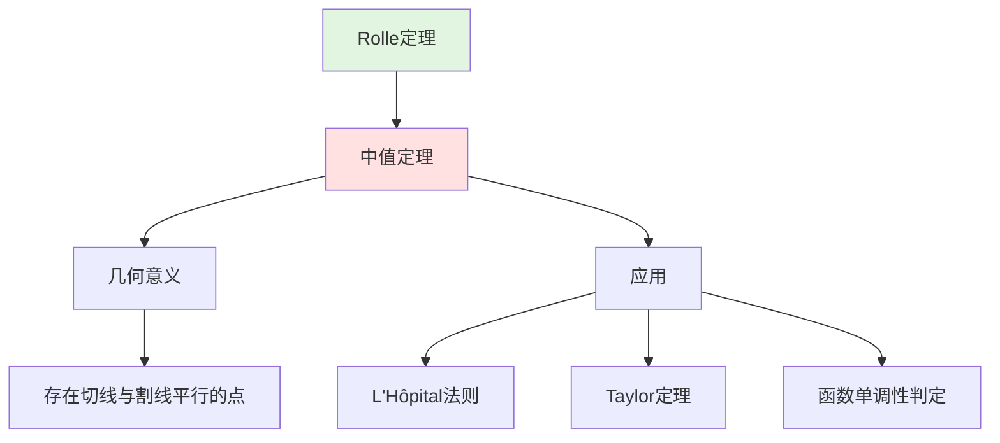
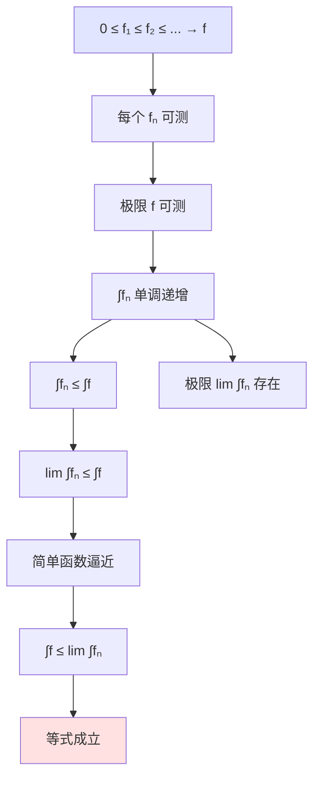

# 分析定理可视化

**制定日期**: 2026年4月2日
**条目数量**: 10个分析学核心定理
**可视化格式**: Mermaid图表、证明流程图、定理关系图

---

## 📋 目录

- [分析定理可视化](#分析定理可视化)
  - [📋 目录](#目录)
  - [一、介值定理](#一介值定理)
    - [定理陈述](#定理陈述)
    - [证明流程](#证明流程)
    - [几何解释](#几何解释)
  - [二、中值定理](#二中值定理)
    - 定理陈述
    - [证明依赖链](#证明依赖链)
  - [三、Rolle定理](#三rolle定理)
    - 定理陈述
  - [四、微积分基本定理](#四微积分基本定理)
    - 定理陈述
    - [证明结构](#证明结构)
    - [几何意义](#几何意义)
  - [五、单调收敛定理](#五单调收敛定理)
    - 定理陈述
  - [六、控制收敛定理](#六控制收敛定理)
    - 定理陈述
  - [七、Fubini定理](#七fubini定理)
    - 定理陈述
  - [八、Hahn-Banach定理](#八hahn-banach定理)
    - 定理陈述
    - 几何解释
  - [九、开映射定理](#九开映射定理)
    - 定理陈述
  - [十、一致有界原理](#十一致有界原理)
    - 定理陈述
    - [应用](#应用)

---

## 一、介值定理

### 定理陈述

**定理**: 设 $f \in C[a,b]$，$f(a) < k < f(b)$，则存在 $c \in (a,b)$ 使 $f(c) = k$。

### 证明流程

```mermaid
graph TD
    A[f 连续] --> B[集合 S = {x∈[a,b] | f(x) ≤ k}]

    B --> C[c = sup S]
    C --> D[f(c) ≤ k 由连续性]
    C --> E[f(c) ≥ k 由上确界性质]
    D --> F[f(c) = k]
    E --> F

    style A fill:#e1e5ff
    style C fill:#ffe1e1
    style F fill:#e1f5e1

```

### 几何解释

```

介值定理的几何意义
━━━━━━━━━━━━━━━━━━━━━━━━━━━━━━━━━━━━━━━━━━━━━━━

y │
f(b)├────────────────●
    │               ╱│
 k ─┼──────────────●─┼──────── k (水平线)
    │            ╱   │
f(a)├─────────●     │
    │         │     │
    └─────────┼─────┼──────────→ x
              a  c  b

连续函数的图像是一条"不间断"的曲线，
从 y=f(a) 到 y=f(b) 必须经过所有中间值。

应用:
• 求根算法 (二分法)
• Brouwer不动点定理的基础
• 连通性的刻画
━━━━━━━━━━━━━━━━━━━━━━━━━━━━━━━━━━━━━━━━━━━━━━━

```

---

## 二、中值定理

### 定理陈述

**定理**: 设 $f \in C[a,b]$ 且在 $(a,b)$ 可导，则存在 $c \in (a,b)$ 使：
$$f'(c) = \frac{f(b)-f(a)}{b-a}$$

### 证明依赖链



---

## 三、Rolle定理

### 定理陈述

**定理**: 设 $f \in C[a,b]$ 且在 $(a,b)$ 可导，$f(a) = f(b)$，则存在 $c \in (a,b)$ 使 $f'(c) = 0$。

```mermaid
graph TD
    A[f(a) = f(b)] --> B[f 在[a,b]有最值]
    B --> C[极值点在(a,b)内或端点]
    C --> D[若极值点c∈(a,b)]
    D --> E[Fermat引理: f'(c) = 0]
    C --> F[若极值都在端点]
    F --> G[f 为常数, f' = 0]

    style A fill:#e1e5ff
    style E fill:#ffe1e1

```

---

## 四、微积分基本定理

### 定理陈述

**定理**: 设 $f \in C[a,b]$，定义 $F(x) = \int_a^x f(t)dt$，则 $F'(x) = f(x)$。

### 证明结构

```mermaid
graph TB
    F[F(x) = ∫ₐˣ f(t)dt] --> D[求 F'(x)]
    D --> L[F(x+h) - F(x) = ∫ₓ^{x+h} f(t)dt]
    L --> M[中值定理: = f(ξ)·h]
    M --> Q[[F(x+h)-F(x)]/h = f(ξ)]
    Q --> I[h→0, ξ→x]
    I --> R[F'(x) = f(x)]

    F --> FTC2[FTC第二部分]
    FTC2 --> I2[∫ₐᵇ f = F(b) - F(a)]

    style F fill:#e1e5ff
    style R fill:#ffe1e1
    style I2 fill:#e1f5e1

```

### 几何意义

```

微积分基本定理的几何意义
━━━━━━━━━━━━━━━━━━━━━━━━━━━━━━━━━━━━━━━━━━━━━━━

第一部分: F'(x) = f(x)

y │
  │    ╱╱╱╱  f(t)
  │   ╱
  │  ╱   ┌────────────┐
  │ ╱    │   A(x)     │  面积函数 A(x) = ∫ₐˣ f
  │╱     │            │
  ●──────┴────────────┴──────→ x
  a      x      x+h   b

变化率: [A(x+h)-A(x)]/h → f(x) 当 h→0
即: 面积的瞬时变化率等于高度

第二部分: ∫ₐᵇ f = F(b) - F(a)

总变化 = 末值 - 初值
━━━━━━━━━━━━━━━━━━━━━━━━━━━━━━━━━━━━━━━━━━━━━━━

```

---

## 五、单调收敛定理

### 定理陈述

**定理**: 设 $f_n \geq 0$ 单调递增收敛到 $f$，则 $\int f_n \to \int f$。



---

## 六、控制收敛定理

### 定理陈述

**定理**: 设 $f_n \to f$ a.e.，$|f_n| \leq g$ 可积，则 $\int f_n \to \int f$。

```mermaid
graph TB
    A[fₙ → f a.e.] --> B[|fₙ| ≤ g ∈ L¹]

    B --> C[应用Fatou引理于 g+fₙ ≥ 0]
    C --> D[∫g + liminf ∫fₙ ≤ ∫g + ∫f]
    B --> E[应用Fatou引理于 g-fₙ ≥ 0]
    E --> F[∫g - limsup ∫fₙ ≤ ∫g - ∫f]
    D --> G[liminf ∫fₙ ≥ ∫f]
    F --> H[limsup ∫fₙ ≤ ∫f]
    G --> I[lim ∫fₙ = ∫f]
    H --> I

    style A fill:#e1e5ff
    style B fill:#e1f5e1
    style I fill:#ffe1e1

```

---

## 七、Fubini定理

### 定理陈述

**定理**: 设 $f \in L^1(X \times Y)$，则：
$$\int_{X \times Y} f = \int_X \left(\int_Y f(x,y)dy\right)dx = \int_Y \left(\int_X f(x,y)dx\right)dy$$

```mermaid
graph TB
    F[f ∈ L¹(X×Y)] --> P[乘积测度]
    P --> C[特征函数]
    C --> S[简单函数]
    S --> M[单调收敛]
    M --> N[非负可测函数]
    N --> L[L¹函数]

    L --> I[∫∫f = ∫[∫f dy]dx]

    F --> E[反例: f 不可积时交换可能不成立]

    style F fill:#e1e5ff
    style I fill:#ffe1e1

```

---

## 八、Hahn-Banach定理

### 定理陈述

**定理**: 设 $p$ 是半范数，$f$ 是子空间上的线性泛函且 $|f| \leq p$，则 $f$ 可保范延拓到全空间。

```mermaid
graph TB
    X[赋范空间 X] --> S[子空间 M]
    S --> F[线性泛函 f: M → ℝ]
    F --> P[|f| ≤ p (半范数)]

    P --> Z[Zorn引理]
    Z --> E[极大延拓 g]
    E --> C[若定义域 ≠ X]
    C --> Y[可再延拓, 矛盾]
    Y --> R[g 定义在全空间]
    R --> B[‖g‖ = ‖f‖]

    style X fill:#e1e5ff
    style R fill:#ffe1e1

```

### 几何解释

```

Hahn-Banach定理的几何意义
━━━━━━━━━━━━━━━━━━━━━━━━━━━━━━━━━━━━━━━━━━━━━━━

在子空间 M 上定义的泛函 f:

        X
        │
    M ──┼─────── 超平面 {f = c}
        │
        │

延拓到全空间 X，保持相同的范数:

        X
        │─────── 延拓后的超平面
        │
    M ──┼─────── 原超平面
        │
        │

分离定理 (推论):
两个不相交的凸集可用超平面分离

应用:
• 证明对偶空间非平凡
• 凸优化
• 经济学中的均衡存在性
━━━━━━━━━━━━━━━━━━━━━━━━━━━━━━━━━━━━━━━━━━━━━━━

```

---

## 九、开映射定理

### 定理陈述

**定理**: 设 $T: X \to Y$ 是Banach空间之间的满射有界线性算子，则 $T$ 是开映射。

```mermaid
graph TD
    T[T: X→Y 有界线性满射] --> B[Baire纲定理]
    B --> C[闭球像有内点]
    C --> S[对称性: T(B̄ₓ) 对称]
    S --> D[伸缩: T(B̄ₓ) 包含 Y 中球]
    D --> O[开集像开]
    O --> R[逆算子有界]

    T --> I[逆算子定理]
    I --> IC[X ≅ Y (拓扑同构)]

    style T fill:#e1e5ff
    style O fill:#ffe1e1
    style IC fill:#e1f5e1

```

---

## 十、一致有界原理

### 定理陈述

**定理**: 设 $\{T_\alpha\}$ 是Banach空间到赋范空间的有界线性算子族，若对每个 $x$，$\{\|T_\alpha x\|\}$ 有界，则 $\{\|T_\alpha\|\}$ 有界。

```mermaid
graph TD
    F[算子族 {Tₐ}] --> P[逐点有界]<br/>∀x: sup ‖Tₐx‖ < ∞
    P --> B[Baire纲定理]
    B --> C[某个闭球上{Tₐ}一致有界]
    C --> L[线性性: 放大到单位球]
    L --> U[一致有界]<br/>sup ‖Tₐ‖ < ∞

    P --> CG[共鸣定理]
    CG --> G[几何解释: 要么处处有界, 要么在某点爆炸]

    style F fill:#e1e5ff
    style P fill:#e1f5e1
    style U fill:#ffe1e1

```

### 应用

```

一致有界原理的应用
━━━━━━━━━━━━━━━━━━━━━━━━━━━━━━━━━━━━━━━━━━━━━━━

共鸣现象:

若 sup ‖Tₙ‖ = ∞，则存在 x₀ 使 sup ‖Tₙx₀‖ = ∞

经典应用:

1. Fourier级数的发散
   存在连续函数其Fourier级数在某点发散

2. 机械求积公式的收敛
   数值积分公式一致收敛的条件

3. 发散级数的求和
   各种求和方法的关系

4. 插值算子的收敛
   Lagrange插值不保证对所有连续函数收敛
━━━━━━━━━━━━━━━━━━━━━━━━━━━━━━━━━━━━━━━━━━━━━━━

```

---

**文档状态**: ✅ 完成
**条目数量**: 10个分析定理可视化
**最后更新**: 2026年4月2日
