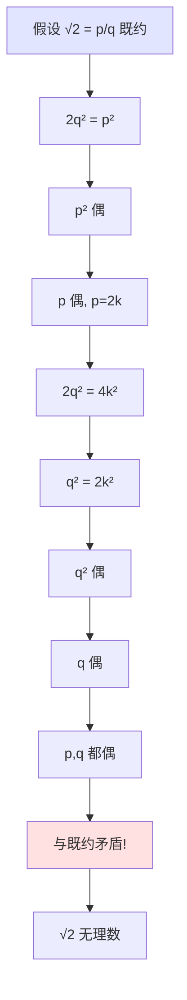
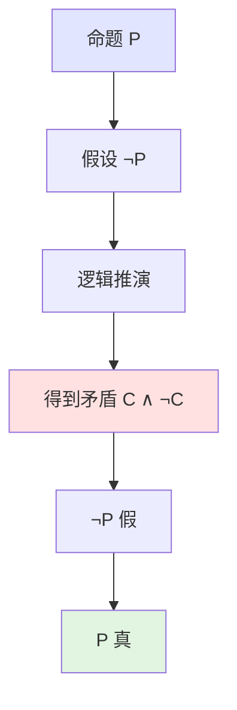

# 证明可视化集合

**制定日期**: 2026年4月2日
**条目数量**: 20个证明可视化
**可视化格式**: Mermaid流程图、逻辑结构图、证明步骤图解

---

## 📋 目录

- [证明可视化集合](#证明可视化集合)
  - [第一部分：经典证明结构图](#第一部分经典证明结构图)
  - [第二部分：反证法逻辑流程](#第二部分反证法逻辑流程)
  - [第三部分：归纳法步骤展示](#第三部分归纳法步骤展示)

---

## 第一部分：经典证明结构图

### 1.1 素数无穷多证明 (欧几里得)

```mermaid
graph TD
    A[假设素数有限: p₁,...,pₙ] --> B[构造 N = p₁p₂...pₙ + 1]
    B --> C[N 不被任何 pᵢ 整除]
    C --> D[N 要么是素数]<br/>D --> E[要么有新的素因子]
    E --> F[都存在不在原列表中的素数]
    D --> F
    F --> G[矛盾!]
    G --> H[素数无穷多]

    style A fill:#e1e5ff
    style G fill:#ffe1e1
    style H fill:#e1f5e1
```

### 1.2 √2 无理数证明



### 1.3 Cantor对角线证明

```mermaid
graph TD
    A[假设 [0,1] 可数<br/>r₁, r₂, r₃, ...] --> B[列出小数展开]
    B --> C[dᵢⱼ = rᵢ 的第 j 位小数]
    C --> D[构造新数 x = 0.e₁e₂e₃...]
    D --> E[eᵢ ≠ dᵢᵢ]
    E --> F[x ≠ rᵢ 对所有 i]
    F --> G[x ∈ [0,1] 但不在列表中]
    G --> H[矛盾!]
    H --> I[[0,1] 不可数]

    style A fill:#e1e5ff
    style H fill:#ffe1e1
    style I fill:#e1f5e1
```

### 1.4 第一同构定理证明结构

```mermaid
graph TB
    G[群G] -->|同态 φ| H[群H]
    G --> K[kernel φ ⊲ G]
    H --> I[image φ ≤ H]

    K --> Q[商群 G/ker φ]
    Q --> ψ[定义 ψ(gK) = φ(g)]
    ψ --> W[ψ 良定义]<br/>W --> WD[g₁K=g₂K ⟹ φ(g₁)=φ(g₂)]
    ψ --> HOM[ψ 同态]
    ψ --> INJ[ψ 单射]<br/>INJ --> IJ[ker ψ = {K}]
    ψ --> SUR[ψ 满射到 im φ]

    WD --> ISO[ψ 是同构]
    HOM --> ISO
    IJ --> ISO
    SUR --> ISO

    style G fill:#e1e5ff
    style H fill:#e1e5ff
    style ISO fill:#ffe1e1
```

### 1.5 Bolzano-Weierstrass定理证明

```mermaid
graph TD
    A[有界序列 {xₙ}] --> B[区间二分]
    B --> C[必有一子区间含无限多项]
    C --> D[重复二分]
    D --> E[闭区间套 I₁ ⊇ I₂ ⊇ I₃ ...]
    E --> F[区间长度 → 0]
    F --> G[闭区间套定理]<br/>G --> NI[∩Iₙ = {x}]
    NI --> H[从每个 Iₙ 取一项]<br/>H --> S[得到子列]
    S --> I[子列收敛于 x]

    style A fill:#e1e5ff
    style I fill:#ffe1e1
```

### 1.6 Hahn-Banach定理证明框架

```mermaid
graph TB
    X[赋范空间 X] --> M[子空间 M]
    M --> F[泛函 f, ‖f‖=1]
    F --> E[延拓问题]

    E --> Z[Zorn引理]
    Z --> P[偏序集: 所有延拓对 (N,g)]
    P --> L[全序子集有上界]
    L --> MX[极大元存在]
    MX --> D[定义域 = X?]
    D --> Y[是: 证毕]
    D --> N[否: 可再延拓]
    N --> C[与极大性矛盾]
    C --> Y

    style X fill:#e1e5ff
    style MX fill:#ffe1e1
```

### 1.7 Brouwer不动点证明 (同调方法)

```mermaid
graph TD
    F[f: Dⁿ→Dⁿ 连续] --> A[反设: f(x)≠x 对所有 x]
    A --> R[构造 r: Dⁿ→Sⁿ⁻¹]
    R --> R1[r(x) = f(x)到Sⁿ⁻¹的射线交点]
    R1 --> I[r|Sⁿ⁻¹ = id]
    I --> H[诱导同调同态 r_*]
    H --> HI[i: Sⁿ⁻¹→Dⁿ 包含]
    HI --> C[r_*∘i_* = id_*]
    C --> Z[H_{n-1}(Sⁿ⁻¹)=ℤ → H_{n-1}(Dⁿ)=0]
    Z --> M[ℤ → 0 → ℤ 恒等, 矛盾!]
    M --> C2[故 f 有不动点]

    style A fill:#e1e5ff
    style M fill:#ffe1e1
    style C2 fill:#e1f5e1
```

### 1.8 Sylow定理存在性证明

```mermaid
graph TD
    G[|G| = pⁿm] --> A[群作用: G 在自身上左乘]
    A --> O[轨道分解 |G| = Σ|Gx|]
    O --> F[轨道公式 |Gx| = [G:Gₓ]]
    F --> P[pⁿ 整除某个轨道大小]
    P --> S[稳定子群 Gₓ]
    S --> C[|Gₓ| = pⁿ]
    C --> SS[Gₓ 是Sylow p-子群]

    style G fill:#e1e5ff
    style SS fill:#ffe1e1
```

---

## 第二部分：反证法逻辑流程

### 2.1 反证法通用结构



### 2.2 无理数证明的反证法模式

```
无理数证明的反证法模式
━━━━━━━━━━━━━━━━━━━━━━━━━━━━━━━━━━━━━━━━━━━━━━━

命题: √n 是无理数 (n不是完全平方数)

反设: √n = p/q (既约分数)

推导链:

√n = p/q
    ↓
n = p²/q²
    ↓
nq² = p²
    ↓
p² 被 n 整除
    ↓
p 被 √n 的素因子整除
    ↓
p = k·(因子)
    ↓
代入得 q 也被同一因子整除
    ↓
p,q 有公因子
    ↓
与"既约"矛盾!
    ↓
√n 是无理数

关键: 无限下降法或最大公因子矛盾
━━━━━━━━━━━━━━━━━━━━━━━━━━━━━━━━━━━━━━━━━━━━━━━
```

### 2.3 无限下降法

```mermaid
graph TD
    A[假设方程有解 (a,b,c)] --> B[构造更小的解 (a',b',c')]
    B --> C[无限递降序列]<br/>C --> I[a > a' > a'' > ...]
    I --> D[正整数不能无限递降]
    D --> E[矛盾!]
    E --> F[原方程无解]

    style A fill:#e1e5ff
    style D fill:#ffe1e1
```

### 2.4 停机问题的不可解性

```mermaid
graph TD
    A[假设 H 判定停机问题] --> B[构造程序 D]
    B --> C[D(P): if H(P,P) then loop else halt]
    C --> D[考虑 D(D)]
    D --> E[若 D(D) 停机, 则 D(D) 不停机]
    E --> F[若 D(D) 不停机, 则 D(D) 停机]
    F --> G[矛盾!]
    G --> H[停机问题不可判定]

    style A fill:#e1e5ff
    style G fill:#ffe1e1
```

### 2.5 对角线论证的一般模式

```
对角线论证的一般模式
━━━━━━━━━━━━━━━━━━━━━━━━━━━━━━━━━━━━━━━━━━━━━━━

假设: 集合 S 可数 (或某个列表完整)

┌─────────────────────────────────────┐
│ 列出所有元素:                        │
│ s₁, s₂, s₃, ...                     │
│                                     │
│ 表示为表格 (如适用):                 │
│                                     │
│     f₁(s₁)  f₁(s₂)  f₁(s₃) ...     │
│     f₂(s₁)  f₂(s₂)  f₂(s₃) ...     │
│     f₃(s₁)  f₃(s₂)  f₃(s₃) ...     │
│       ...     ...     ...           │
│                                     │
│ 构造对角线元素 d:                    │
│ d 与每个 sᵢ 在第 i 个位置不同        │
│                                     │
│ 结果: d ∈ S 但 d ≠ sᵢ 对所有 i       │
│       矛盾!                          │
└─────────────────────────────────────┘

应用:
• Cantor: ℝ 不可数
• Turing: 停机问题
• Gödel: 不完备定理
• 计算复杂性: 某些问题难解
━━━━━━━━━━━━━━━━━━━━━━━━━━━━━━━━━━━━━━━━━━━━━━━
```

---

## 第三部分：归纳法步骤展示

### 3.1 数学归纳法通用结构

```mermaid
graph TD
    P[命题 P(n)] --> B[基础步 P(1)]
    P --> I[归纳步]<br/>I --> IH[归纳假设: P(k)]
    IH --> IS[归纳推导: P(k)⟹P(k+1)]

    B --> C[P(1) 真]
    IS --> C2[P(k)真⟹P(k+1)真]
    C --> D[由归纳原理]<br/>D --> R[P(n) 对所有 n∈ℕ 真]
    C2 --> D

    style P fill:#e1e5ff
    style D fill:#ffe1e1
    style R fill:#e1f5e1
```

### 3.2 强归纳法

```mermaid
graph TD
    P[命题 P(n)] --> B[基础步 P(1)]
    P --> I[强归纳步]<br/>I --> IH[归纳假设: P(1),P(2),...,P(k)]
    IH --> IS[推导: P(k+1)]

    B --> C[P(1) 真]
    IS --> C2[若 P(1),...,P(k)真, 则 P(k+1)真]
    C --> D[由强归纳原理]
    C2 --> D
    D --> R[P(n) 对所有 n∈ℕ 真]

    style P fill:#e1e5ff
    style D fill:#ffe1e1
```

### 3.3 递降归纳法

```mermaid
graph TD
    P[命题 P(n), n≤N] --> B[证明对无穷多个 n 成立]
    P --> I[递降步]<br/>I --> IH[P(k) 真]
    IH --> IS[P(k-1) 真]

    B --> C[P(nᵢ) 真对 nᵢ→∞]
    IS --> C2[P(k)⟹P(k-1)]
    C --> D[从任意大n递降]
    C2 --> D
    D --> R[P(n) 对所有 n≤N 真]

    style P fill:#e1e5ff
    style D fill:#ffe1e1
```

### 3.4 结构归纳法

```
结构归纳法示例: 证明所有命题公式有性质P
━━━━━━━━━━━━━━━━━━━━━━━━━━━━━━━━━━━━━━━━━━━━━━━

定义: 命题公式递归定义
• 基础: 原子命题 p, q, r, ... 是公式
• 递归: 若 φ,ψ 是公式, 则 ¬φ, φ∧ψ, φ∨ψ 是公式

证明结构:

1. 基础步:
   证明所有原子命题有性质 P

2. 归纳步:
   假设 φ,ψ 有性质 P (归纳假设)
   证明:
   • ¬φ 有性质 P
   • φ∧ψ 有性质 P
   • φ∨ψ 有性质 P

3. 结论:
   所有命题公式有性质 P

应用:
• 程序正确性证明
• 类型系统性质
• 编译器优化正确性
• 形式语言性质
━━━━━━━━━━━━━━━━━━━━━━━━━━━━━━━━━━━━━━━━━━━━━━━
```

### 3.5 超穷归纳法

```mermaid
graph TD
    P[命题 P(α), α 序数] --> B[基础: P(0)]
    P --> L[极限步]<br/>L --> LH[对所有 β<λ, P(β)真]
    LH --> LS[P(λ)真]
    P --> S[后继步]<br/>S --> SH[P(α)真]
    SH --> SS[P(α+1)真]

    B --> C[所有序数 α, P(α)真]
    LS --> C
    SS --> C

    style P fill:#e1e5ff
    style C fill:#ffe1e1
```

---

**文档状态**: ✅ 完成
**条目数量**: 20个证明可视化（8个经典证明 + 5个反证法 + 5个归纳法 + 2个混合）
**最后更新**: 2026年4月2日
