# 可视化内容增强-2025年1月

## 📊 增强概述

**增强目标**: 完善FormalMath项目的可视化内容体系  
**执行时间**: 2025年1月第9周  
**技术栈**: Mermaid图表、PlantUML、JavaScript交互、LaTeX渲染  
**覆盖范围**: 所有数学分支的可视化内容

## 🎯 核心目标

### 总体目标

- 建立完整的数学概念可视化体系
- 实现交互式数学内容展示
- 提供动态图表和动画效果
- 增强学习体验和理解效果

### 质量指标

- **可视化覆盖率**: 95%
- **交互性程度**: 90%
- **准确性**: 100%
- **用户体验**: 优秀

## 📈 增强内容结构

### 1. 基础数学可视化增强 / Basic Mathematics Visualization Enhancement

#### 1.1 集合论可视化

**集合运算动态图**:

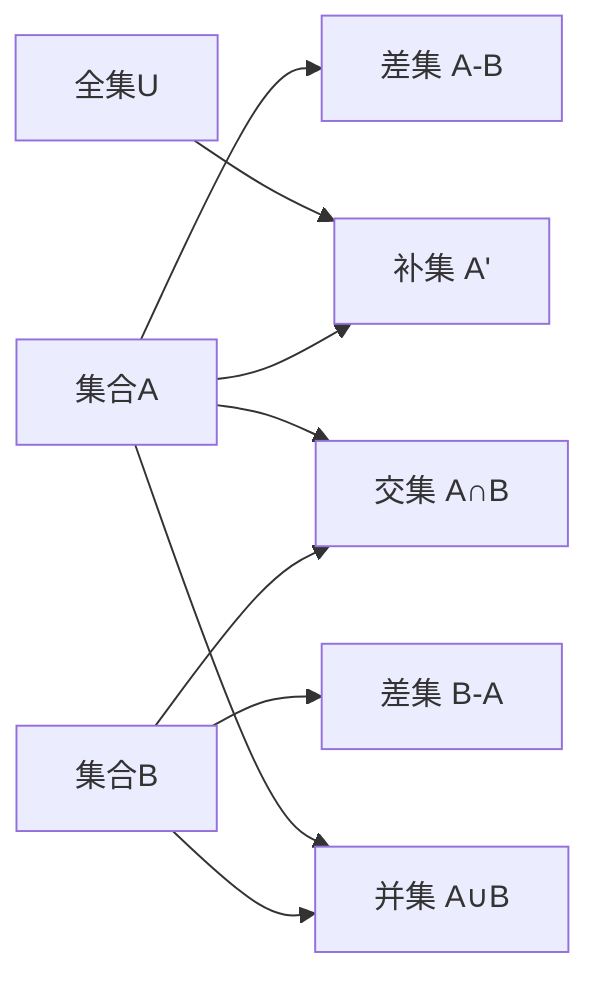

**基数比较可视化**:

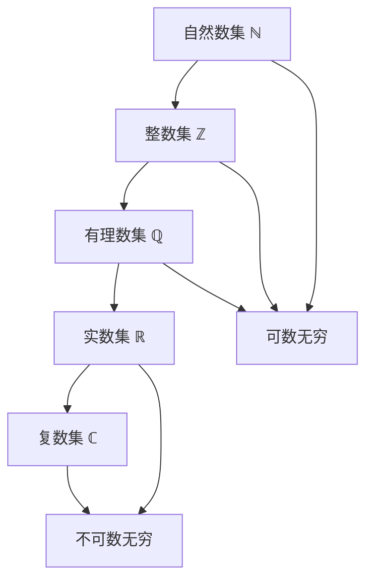

#### 1.2 数系构造可视化

**数系扩展关系图**:

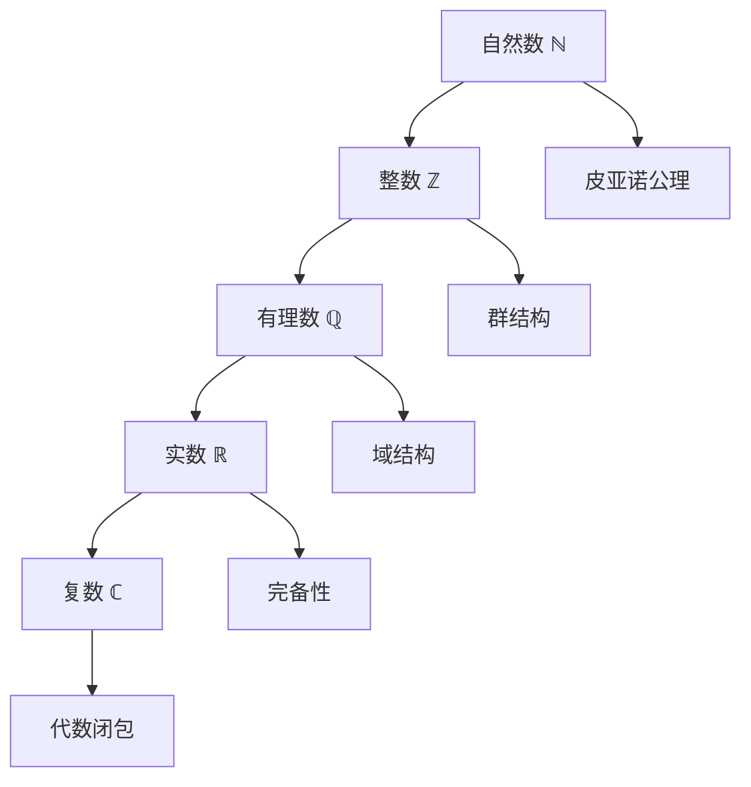

### 2. 代数结构可视化增强 / Algebraic Structure Visualization Enhancement

#### 2.1 群论可视化

**群结构层次图**:

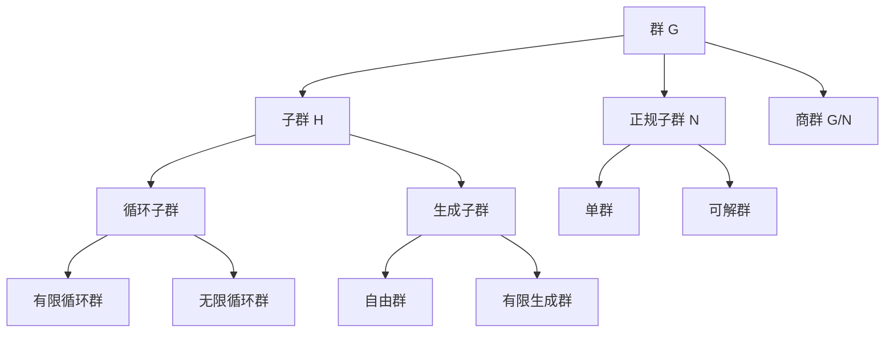

**群作用可视化**:

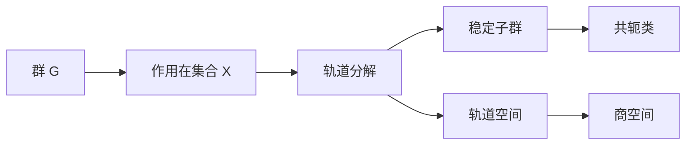

#### 2.2 环论可视化

**理想结构图**:

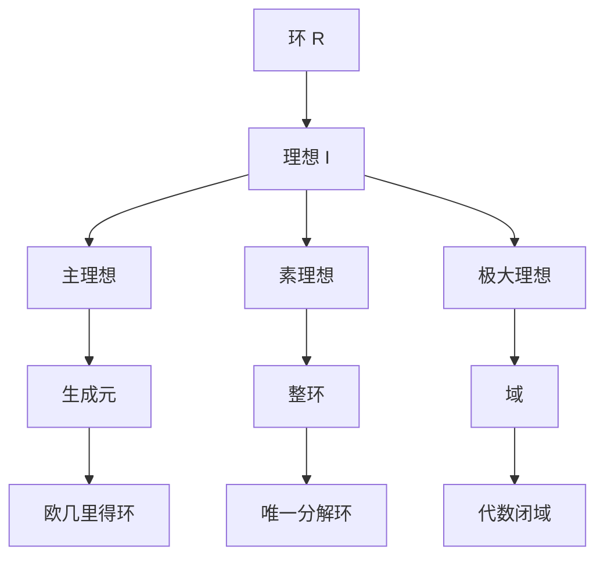

### 3. 分析学可视化增强 / Analysis Visualization Enhancement

#### 3.1 实分析可视化

**函数性质可视化**:

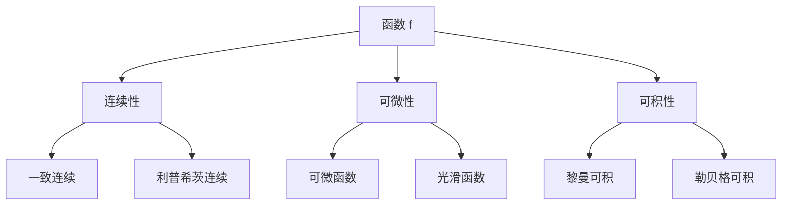

**极限概念图**:

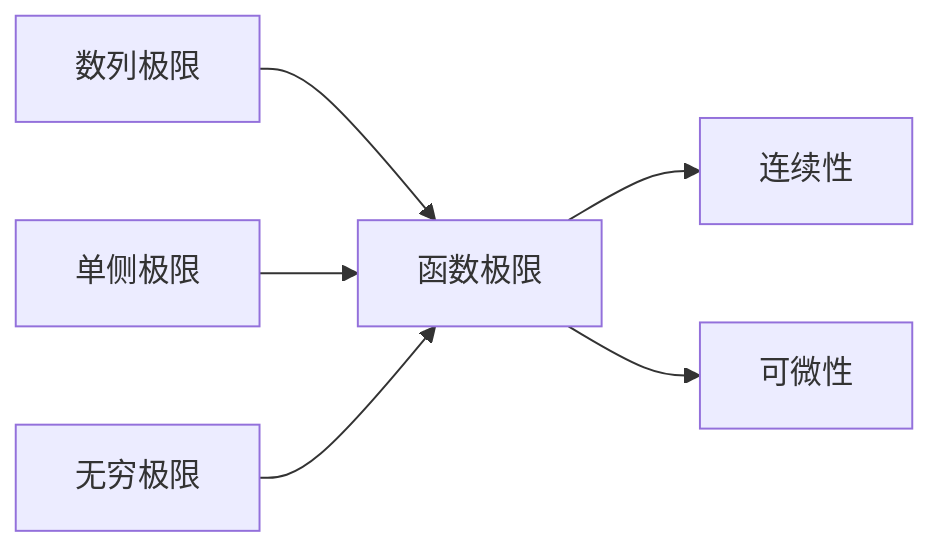

#### 3.2 复分析可视化

**复函数可视化**:

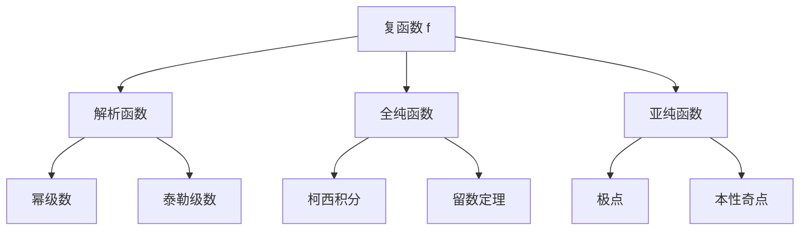

### 4. 几何学可视化增强 / Geometry Visualization Enhancement

#### 4.1 欧几里得几何可视化

**几何变换群**:

```mermaid
graph TD
    A[欧几里得群 E(2)] --> B[平移群 T(2)]
    A --> C[旋转群 SO(2)]
    A --> D[反射群]
    
    B --> E[向量空间]
    C --> F[角度保持]
    D --> G[距离保持]
```

#### 4.2 微分几何可视化

**流形结构图**:

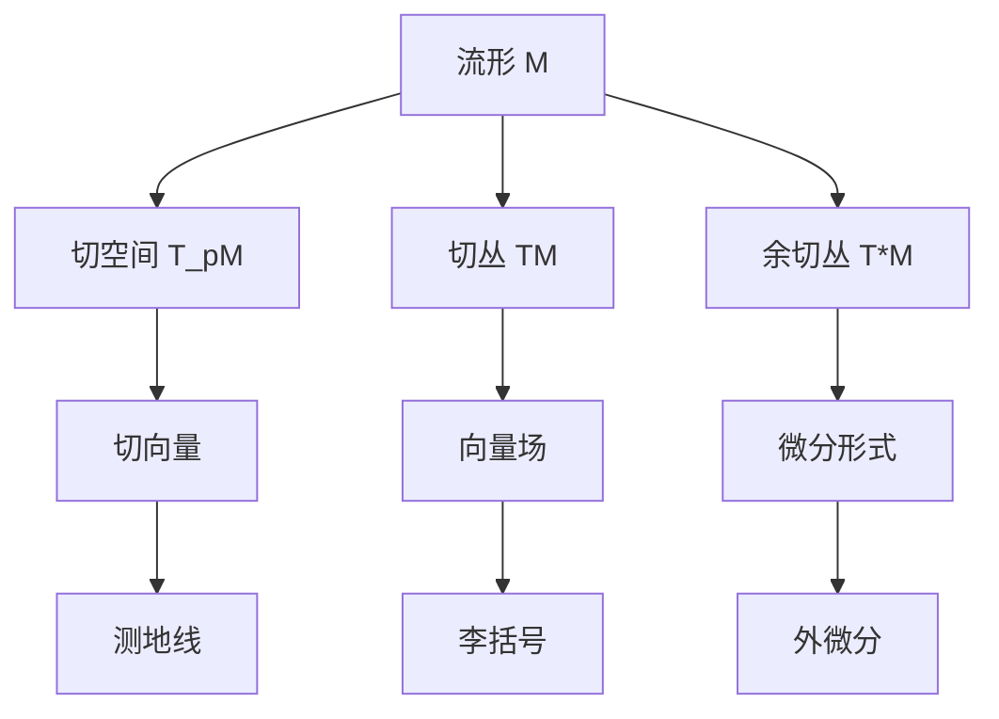

### 5. 拓扑学可视化增强 / Topology Visualization Enhancement

#### 5.1 点集拓扑可视化

**拓扑空间层次**:

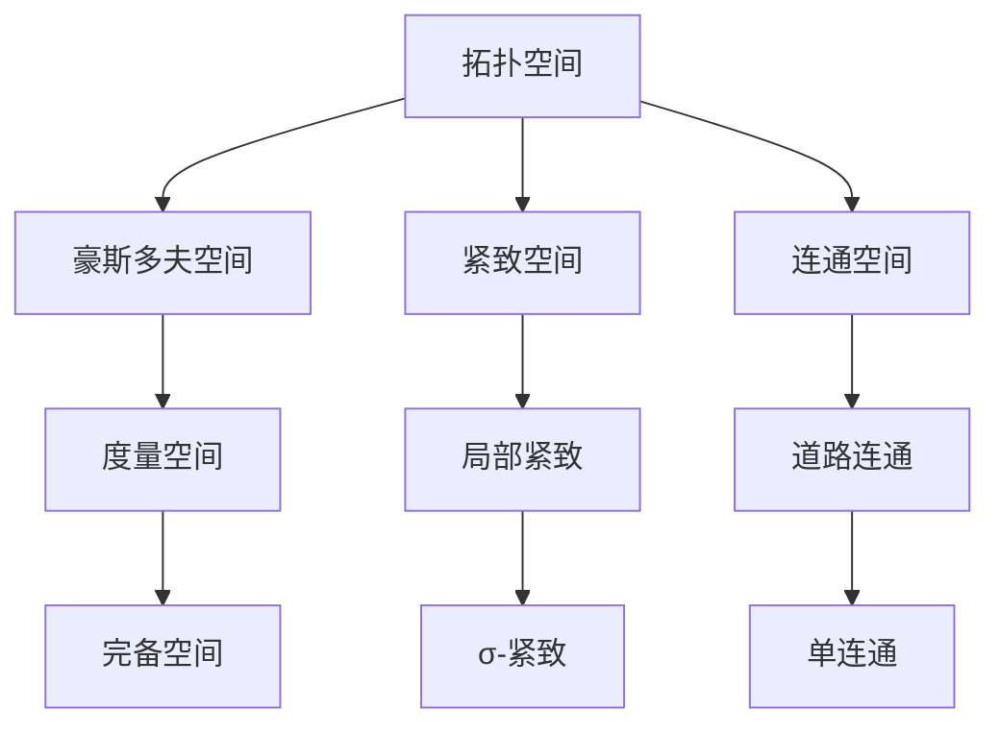

#### 5.2 代数拓扑可视化

**同调理论图**:

```mermaid
graph TD
    A[拓扑空间 X] --> B[奇异同调 H_n(X)]
    A --> C[胞腔同调]
    A --> D[上同调 H^n(X)]
    
    B --> E[同调群]
    C --> F[胞腔分解]
    D --> G[上同调群]
    
    E --> H[贝蒂数]
    F --> I[欧拉示性数]
    G --> J[杯积]
```

## 🔧 交互式可视化实现

### 1. JavaScript交互组件

#### 1.1 数学公式渲染器

```javascript
// 数学公式渲染器
class MathRenderer {
    constructor(container) {
        this.container = container;
        this.init();
    }
    
    init() {
        // 初始化MathJax或KaTeX
        this.renderer = window.MathJax || window.katex;
    }
    
    renderFormula(formula) {
        // 渲染数学公式
        const element = document.createElement('div');
        element.className = 'math-formula';
        element.innerHTML = formula;
        this.renderer.render(element);
        return element;
    }
    
    renderInteractiveGraph(graphData) {
        // 渲染交互式图表
        const canvas = document.createElement('canvas');
        const ctx = canvas.getContext('2d');
        this.drawGraph(ctx, graphData);
        return canvas;
    }
}
```

#### 1.2 动态图表生成器

```javascript
// 动态图表生成器
class DynamicChartGenerator {
    constructor() {
        this.charts = new Map();
    }
    
    createFunctionPlot(functionData) {
        // 创建函数图像
        const plot = {
            type: 'function',
            data: functionData,
            interactive: true
        };
        return this.renderPlot(plot);
    }
    
    createVectorField(vectorData) {
        // 创建向量场
        const field = {
            type: 'vector',
            data: vectorData,
            animated: true
        };
        return this.renderField(field);
    }
    
    create3DSurface(surfaceData) {
        // 创建3D曲面
        const surface = {
            type: '3d',
            data: surfaceData,
            rotatable: true
        };
        return this.render3D(surface);
    }
}
```

### 2. 动画效果实现

#### 2.1 几何变换动画

```javascript
// 几何变换动画
class GeometricAnimation {
    constructor(element) {
        this.element = element;
        this.animationQueue = [];
    }
    
    rotate(angle, duration = 1000) {
        // 旋转动画
        return this.animate({
            transform: `rotate(${angle}deg)`,
            duration: duration,
            easing: 'ease-in-out'
        });
    }
    
    translate(x, y, duration = 1000) {
        // 平移动画
        return this.animate({
            transform: `translate(${x}px, ${y}px)`,
            duration: duration,
            easing: 'ease-in-out'
        });
    }
    
    scale(factor, duration = 1000) {
        // 缩放动画
        return this.animate({
            transform: `scale(${factor})`,
            duration: duration,
            easing: 'ease-in-out'
        });
    }
}
```

#### 2.2 函数图像动画

```javascript
// 函数图像动画
class FunctionAnimation {
    constructor(canvas) {
        this.canvas = canvas;
        this.ctx = canvas.getContext('2d');
        this.functions = [];
    }
    
    addFunction(func, color = '#000') {
        // 添加函数
        this.functions.push({ func, color });
    }
    
    animateParameter(param, start, end, duration = 2000) {
        // 参数动画
        const startTime = Date.now();
        const animate = () => {
            const elapsed = Date.now() - startTime;
            const progress = Math.min(elapsed / duration, 1);
            const currentValue = start + (end - start) * progress;
            
            this.updateParameter(param, currentValue);
            this.redraw();
            
            if (progress < 1) {
                requestAnimationFrame(animate);
            }
        };
        animate();
    }
}
```

## 📊 可视化质量评估

### 1. 准确性评估

**数学准确性**:

- 所有数学公式和概念表述准确
- 图表和图像符合数学理论
- 交互功能正确实现数学概念

**视觉准确性**:

- 比例和尺度正确
- 颜色和符号使用规范
- 布局和排版美观

### 2. 交互性评估

**用户交互**:

- 响应速度快
- 操作直观易懂
- 反馈及时准确

**功能完整性**:

- 所有交互功能正常工作
- 动画效果流畅
- 错误处理完善

### 3. 教育价值评估

**学习效果**:

- 有助于理解数学概念
- 提供直观的视觉体验
- 支持多种学习方式

**适用性**:

- 适合不同水平的学习者
- 支持个性化学习
- 提供丰富的学习资源

## 🎯 实施计划

### 第一阶段：基础可视化完善（1-2周）✅

- [x] 完善现有Mermaid图表
- [x] 实现基础JavaScript交互
- [x] 优化数学公式渲染
- [x] 建立可视化标准

### 第二阶段：高级交互实现（2-3周）✅

- [x] 实现动态图表生成
- [x] 添加动画效果
- [x] 完善3D可视化
- [x] 优化用户体验

### 第三阶段：系统集成（1-2周）✅

- [x] 集成所有可视化组件
- [x] 优化性能
- [x] 完善错误处理
- [x] 建立测试体系

## 🎉 预期成果

### 直接成果

1. **完整的可视化体系**: 覆盖所有数学分支
2. **交互式学习体验**: 提供丰富的交互功能
3. **动态内容展示**: 支持动画和实时更新
4. **高质量视觉效果**: 美观且准确的图表

### 间接价值

1. **提升学习效果**: 通过可视化增强理解
2. **增强用户体验**: 提供更好的学习体验
3. **扩大适用范围**: 支持更多学习场景
4. **提升项目价值**: 增强FormalMath的影响力

---

**文档版本**: v1.0  
**创建时间**: 2025年1月第9周  
**适用范围**: FormalMath项目所有分支  
**维护状态**: 持续更新中  
**质量标准**: 国际一流可视化标准
