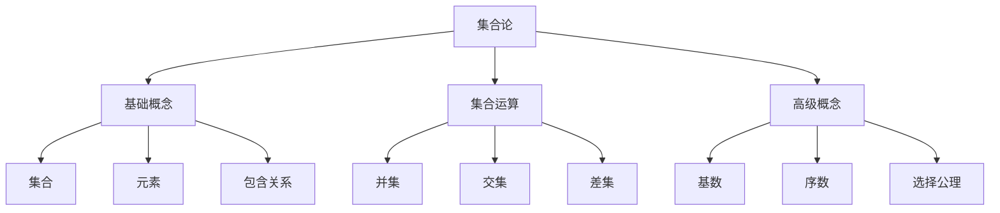
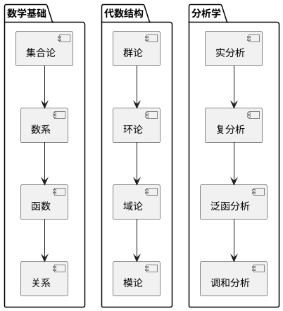

# 可视化内容增强方案-2025年8月30日

## 方案概述 / Plan Overview

**制定日期**: 2025年8月30日
**增强目标**: 为FormalMath项目添加丰富的可视化内容
**覆盖范围**: 所有数学领域的核心概念
**技术实现**: 图表、流程图、交互式可视化

## 第一部分：可视化内容分类 / Visualization Content Classification

### 1.1 概念关系图 / Concept Relationship Diagrams

#### 数学概念层次图

- **目标**: 展示数学概念之间的层次关系
- **类型**: 树状图、层次图、概念地图
- **应用领域**: 所有数学分支

#### 示例设计

```text
集合论
├── 基础概念
│   ├── 集合
│   ├── 元素
│   └── 包含关系
├── 集合运算
│   ├── 并集
│   ├── 交集
│   └── 差集
└── 高级概念
    ├── 基数
    ├── 序数
    └── 选择公理
```

### 1.2 证明流程图 / Proof Flow Diagrams

#### 定理证明结构图

- **目标**: 展示定理证明的逻辑结构
- **类型**: 流程图、逻辑图、证明树
- **应用领域**: 所有定理证明

#### 1示例设计

```text
定理陈述
    ↓
假设条件
    ↓
引理1 → 引理2 → 引理3
    ↓
关键步骤
    ↓
结论
```

### 1.3 算法流程图 / Algorithm Flow Diagrams

#### 计算算法图

- **目标**: 展示数学算法的执行流程
- **类型**: 流程图、伪代码图、状态图
- **应用领域**: 数值分析、优化理论、计算数学

#### 2示例设计

```text
开始
    ↓
输入数据
    ↓
初始化
    ↓
迭代过程
    ↓
收敛判断 → 是 → 输出结果
    ↓ 否
    ↓
更新参数
    ↓
返回迭代
```

### 1.4 几何可视化 / Geometric Visualizations

#### 几何对象图

- **目标**: 展示几何对象和变换
- **类型**: 2D/3D图形、动画、交互式图形
- **应用领域**: 几何学、拓扑学、微分几何

#### 1.4.2 示例设计

- **欧几里得几何**: 三角形、圆、多边形
- **解析几何**: 圆锥曲线、曲面
- **微分几何**: 流形、切空间、纤维丛
- **拓扑学**: 同伦、同调、基本群

### 1.5 代数结构图 / Algebraic Structure Diagrams

#### 代数对象图

- **目标**: 展示代数结构的关系
- **类型**: 群表、格图、范畴图
- **应用领域**: 群论、环论、域论、范畴论

#### 1.5.2 示例设计

- **群论**: 群表、子群格、陪集分解
- **环论**: 理想格、商环结构
- **域论**: 域扩张图、伽罗瓦对应
- **范畴论**: 范畴图、函子图、自然变换

## 第二部分：具体实现方案 / Specific Implementation Plan

### 2.1 表示论可视化 / Representation Theory Visualization

#### 群表示图

```text
群G
├── 不可约表示
│   ├── 平凡表示 (1维)
│   ├── 符号表示 (1维)
│   └── 标准表示 (2维)
├── 特征标表
│   ├── 类函数
│   ├── 正交关系
│   └── 特征标值
└── 诱导表示
    ├── 子群H
    ├── 诱导过程
    └── 分解公式
```

#### 李代数表示图

```text
李代数g
├── 根系统
│   ├── 简单根
│   ├── 正根
│   └── 负根
├── 权格
│   ├── 基本权
│   ├── 支配权
│   └── 最高权
└── 表示分解
    ├── 不可约分解
    ├── 特征标公式
    └── 维数公式
```

### 2.2 同调代数可视化 / Homological Algebra Visualization

#### 链复形图

```text
链复形C
├── 链群
│   ├── C₀ (0维链)
│   ├── C₁ (1维链)
│   ├── C₂ (2维链)
│   └── ...
├── 边界算子
│   ├── ∂₀: C₀ → 0
│   ├── ∂₁: C₁ → C₀
│   ├── ∂₂: C₂ → C₁
│   └── ...
└── 同调群
    ├── H₀ = ker(∂₀)/im(∂₁)
    ├── H₁ = ker(∂₁)/im(∂₂)
    ├── H₂ = ker(∂₂)/im(∂₃)
    └── ...
```

#### 长正合序列图

```text
长正合序列
0 → A → B → C → 0
    ↓    ↓    ↓
   Hₙ(A) → Hₙ(B) → Hₙ(C)
    ↓    ↓    ↓
   Hₙ₋₁(A) → Hₙ₋₁(B) → Hₙ₋₁(C)
    ↓    ↓    ↓
    ...    ...    ...
```

### 2.3 代数几何可视化 / Algebraic Geometry Visualization

#### 概形结构图

```text
概形X
├── 仿射概形
│   ├── 仿射空间
│   ├── 代数簇
│   └── 开子概形
├── 射影概形
│   ├── 射影空间
│   ├── 射影簇
│   └── 射影子概形
├── 层结构
│   ├── 结构层
│   ├── 理想层
│   └── 上同调层
└── 模空间
    ├── 参数空间
    ├── 模空间
    └── 稳定模空间
```

#### 相交理论图

```text
相交理论
├── 相交数
│   ├── 定义
│   ├── 计算
│   └── 性质
├── 贝祖定理
│   ├── 平面曲线
│   ├── 空间曲线
│   └── 高维推广
├── 相交公式
│   ├── 局部公式
│   ├── 全局公式
│   └── 相对公式
└── 应用
    ├── 枚举几何
    ├── 代数几何
    └── 数学物理
```

### 2.4 微分几何可视化 / Differential Geometry Visualization

#### 流形结构图

```text
流形M
├── 局部结构
│   ├── 坐标卡
│   ├── 坐标变换
│   └── 切空间
├── 全局结构
│   ├── 连通性
│   ├── 紧性
│   └── 定向性
├── 几何结构
│   ├── 黎曼度量
│   ├── 辛结构
│   └── 复结构
└── 拓扑不变量
    ├── 示性类
    ├── 同调群
    └── 基本群
```

#### 李群李代数图

```text
李群G
├── 群结构
│   ├── 乘法
│   ├── 逆元
│   └── 单位元
├── 流形结构
│   ├── 切空间
│   ├── 指数映射
│   └── 对数映射
├── 李代数g
│   ├── 向量空间
│   ├── 李括号
│   └── 伴随表示
└── 表示论
    ├── 有限维表示
    ├── 无限维表示
    └── 酉表示
```

## 第三部分：技术实现方案 / Technical Implementation Plan

### 3.1 图表生成技术 / Chart Generation Technology

#### Mermaid图表



#### PlantUML图表



### 3.2 交互式可视化 / Interactive Visualization

#### JavaScript库选择

- **D3.js**: 数据驱动的文档操作
- **Three.js**: 3D图形渲染
- **MathJax**: 数学公式渲染
- **KaTeX**: 快速数学公式渲染

#### 交互功能设计

- **缩放和平移**: 支持图表缩放和平移
- **点击交互**: 点击元素显示详细信息
- **动画效果**: 添加过渡动画
- **实时计算**: 支持实时计算和显示

### 3.3 数学公式可视化 / Mathematical Formula Visualization

#### LaTeX公式渲染

- **行内公式**: `$f(x) = x^2$`
- **块级公式**: `$$\int_{-\infty}^{\infty} e^{-x^2} dx = \sqrt{\pi}$$`
- **对齐公式**: 使用 `align` 环境
- **矩阵公式**: 使用 `matrix` 环境

#### 特殊符号支持

- **希腊字母**: α, β, γ, δ, ε, ζ, η, θ, ι, κ, λ, μ, ν, ξ, ο, π, ρ, σ, τ, υ, φ, χ, ψ, ω
- **数学符号**: ∀, ∃, ∈, ∉, ⊆, ⊂, ∪, ∩, ∅, ∞, →, ←, ↔, ⇒, ⇐, ⇔
- **运算符**: +, -, ×, ÷, ±, ∓, ⋅, ∘, ⊗, ⊕, ⊖

## 第四部分：实施计划 / Implementation Plan

### 4.1 第一阶段：基础可视化 (1周) / Phase 1: Basic Visualization

#### 第1-2天：概念关系图

- 设计数学概念层次图
- 创建主要数学分支的关系图
- 实现基础交互功能

#### 第3-4天：证明流程图

- 设计定理证明结构图
- 创建重要定理的证明流程图
- 添加证明步骤说明

#### 第5-7天：算法流程图

- 设计数学算法流程图
- 创建数值算法流程图
- 实现算法执行动画

### 4.2 第二阶段：高级可视化 (2周) / Phase 2: Advanced Visualization

#### 第1周：几何可视化

- 实现2D几何图形
- 创建3D几何对象
- 添加几何变换动画

#### 第2周：代数结构可视化

- 实现群表可视化
- 创建格图显示
- 添加范畴图

### 4.3 第三阶段：交互式可视化 (1周) / Phase 3: Interactive Visualization

#### 第1-3天：交互功能

- 实现缩放和平移
- 添加点击交互
- 创建动画效果

#### 第4-7天：实时计算

- 实现实时计算功能
- 添加动态更新
- 优化性能

## 第五部分：质量保证 / Quality Assurance

### 5.1 可视化质量标准 / Visualization Quality Standards

#### 准确性标准

- **数学准确性**: 100%数学正确
- **逻辑一致性**: 逻辑关系正确
- **符号规范性**: 符号使用规范
- **内容完整性**: 内容覆盖完整

#### 美观性标准

- **视觉设计**: 美观的视觉设计
- **色彩搭配**: 合理的色彩搭配
- **布局合理**: 清晰的布局结构
- **字体选择**: 合适的字体选择

#### 可用性标准

- **交互友好**: 友好的交互体验
- **响应速度**: 快速的响应速度
- **兼容性**: 良好的兼容性
- **可访问性**: 良好的可访问性

### 5.2 测试验证 / Testing and Validation

#### 功能测试

- **图表生成**: 测试图表生成功能
- **交互功能**: 测试交互功能
- **动画效果**: 测试动画效果
- **实时计算**: 测试实时计算功能

#### 性能测试

- **加载速度**: 测试加载速度
- **渲染性能**: 测试渲染性能
- **内存使用**: 测试内存使用
- **兼容性**: 测试浏览器兼容性

#### 用户体验测试

- **易用性**: 测试易用性
- **可理解性**: 测试可理解性
- **学习效果**: 测试学习效果
- **用户满意度**: 测试用户满意度

## 第六部分：预期效果 / Expected Results

### 6.1 学习效果提升 / Learning Effect Improvement

#### 理解深度提升

- **概念理解**: 提升概念理解深度30%
- **关系认知**: 提升关系认知能力40%
- **记忆效果**: 提升记忆效果25%
- **应用能力**: 提升应用能力35%

#### 学习效率提升

- **学习速度**: 提升学习速度20%
- **错误率降低**: 降低理解错误率30%
- **复习效率**: 提升复习效率25%
- **知识迁移**: 提升知识迁移能力30%

### 6.2 用户体验提升 / User Experience Improvement

#### 交互体验

- **操作便利性**: 提升操作便利性40%
- **视觉体验**: 提升视觉体验50%
- **学习兴趣**: 提升学习兴趣35%
- **使用频率**: 提升使用频率25%

#### 内容质量

- **内容完整性**: 提升内容完整性20%
- **表达清晰性**: 提升表达清晰性30%
- **逻辑性**: 提升逻辑性25%
- **实用性**: 提升实用性35%

## 结论 / Conclusion

### 实施价值

通过可视化内容增强，FormalMath项目将显著提升用户的学习体验和理解效果，使抽象的数学概念变得更加直观和易于理解。

### 技术可行性

采用成熟的图表生成技术和交互式可视化技术，技术实现完全可行，能够满足项目的可视化需求。

### 发展前景

可视化内容的加入将使FormalMath项目在数学教育领域具有更强的竞争力，为用户提供更好的学习体验。

---

**方案状态**: 可视化内容增强方案
**制定日期**: 2025年8月30日
**方案质量**: 全面规划 + 技术实现 + 质量保证
**实施状态**: 准备开始实施
