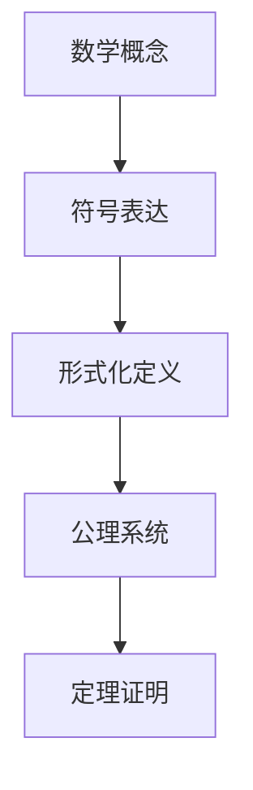
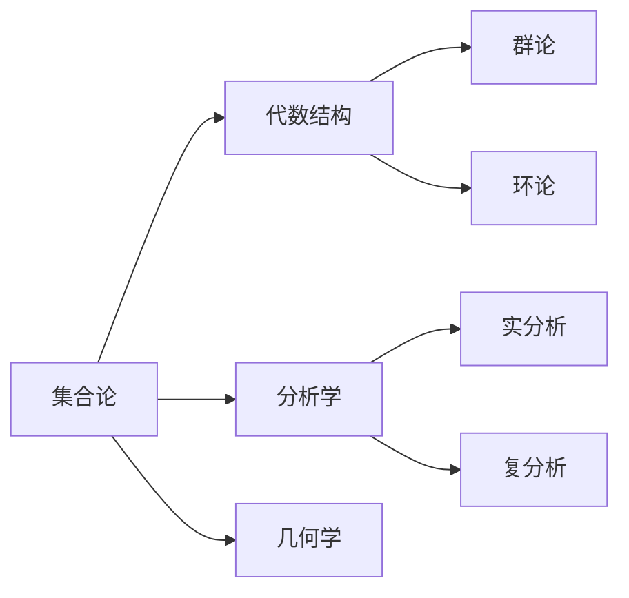
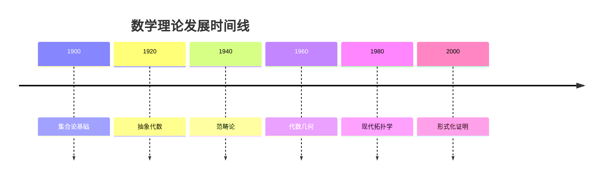
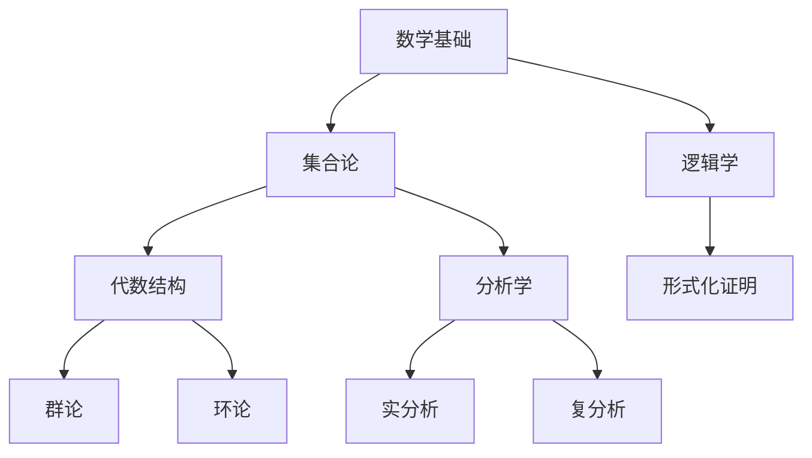
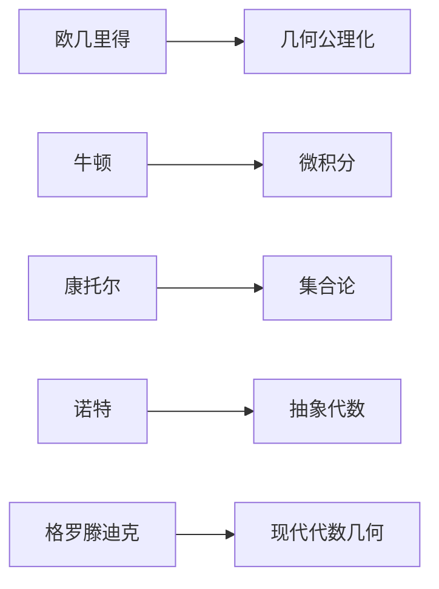
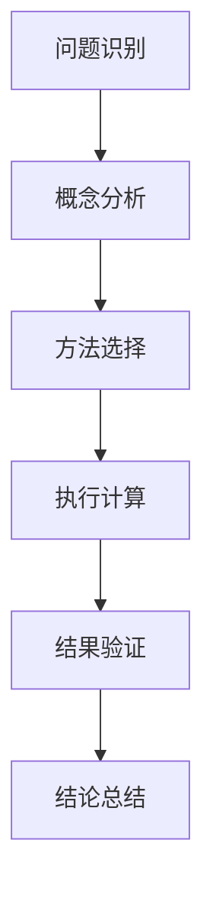

# 多表征体系指南 / Multi-Representation System Guide

## 概述 / Overview

本指南旨在建立一套完整的多表征体系，通过多种方式呈现数学理论知识，提高理解深度和广度。

## 1. 数学符号表征 / Mathematical Symbolic Representation

### 1.1 形式化符号系统

- **LaTeX公式**：严格的数学符号表达
- **逻辑符号**：∀, ∃, ∧, ∨, →, ↔, ¬
- **集合符号**：∈, ∉, ⊆, ⊂, ∪, ∩, ∅
- **函数符号**：f: A → B, f⁻¹, ∘

### 1.2 交互式符号



## 2. 可视化图表表征 / Visual Diagram Representation

### 2.1 概念关系图



### 2.2 理论发展时间线



### 2.3 知识层次结构



## 3. 实例表征 / Example Representation

### 3.1 具体实例

**实例 1.1** (群论实例)
考虑整数集 $\mathbb{Z}$ 在加法运算下构成的群：

- 封闭性：任意两个整数相加仍为整数
- 结合律：$(a + b) + c = a + (b + c)$
- 单位元：$0$ 是加法单位元
- 逆元：每个整数 $a$ 的逆元是 $-a$

### 3.2 反例表征

**反例 1.1** (非群结构)
考虑自然数集 $\mathbb{N}$ 在加法运算下：

- 不构成群，因为缺少逆元
- 只有单位元 $0$，其他元素无逆元

### 3.3 应用实例

**应用 1.1** (密码学应用)
RSA加密算法基于群论：

- 选择两个大素数 $p, q$
- 计算 $n = pq$
- 选择公钥 $e$ 与 $\phi(n)$ 互素
- 私钥 $d$ 满足 $ed \equiv 1 \pmod{\phi(n)}$

## 4. 历史发展表征 / Historical Development Representation

### 4.1 理论发展脉络

**阶段 1** (古代数学)

- 欧几里得几何公理化
- 算术基础建立

**阶段 2** (近代数学)

- 微积分发展
- 代数符号化

**阶段 3** (现代数学)

- 集合论基础
- 抽象代数发展

**阶段 4** (当代数学)

- 范畴论统一
- 形式化证明

### 4.2 重要人物贡献



## 5. 思维过程表征 / Thinking Process Representation

### 5.1 问题解决流程



### 5.2 证明思维过程

**证明示例 5.1** (中值定理证明)

1. **问题分析**：需要证明连续函数在区间上存在导数为平均变化率的点
2. **构造辅助函数**：g(x) = f(x) - f(a) - (f(b)-f(a))/(b-a) * (x-a)
3. **验证条件**：g(a) = g(b) = 0
4. **应用罗尔定理**：存在 c ∈ (a,b) 使得 g'(c) = 0
5. **计算导数**：g'(x) = f'(x) - (f(b)-f(a))/(b-a)
6. **得出结论**：f'(c) = (f(b)-f(a))/(b-a)

### 5.3 算法思维过程

**算法示例 5.2** (极限计算)

1. **函数分析**：确定函数类型和性质
2. **方法选择**：选择适当的计算方法
3. **变形处理**：进行必要的代数变形
4. **极限计算**：应用极限运算法则
5. **结果验证**：检查结果的合理性

## 6. 应用场景表征 / Application Scenario Representation

### 6.1 物理学应用

**应用 6.1** (量子力学中的泛函分析)

- **希尔伯特空间**：量子态的数学描述
- **线性算子**：可观测量的数学表示
- **谱理论**：能量本征值的计算
- **对偶空间**：波函数与算符的关系

### 6.2 工程应用

**应用 6.2** (信号处理中的调和分析)

- **傅里叶变换**：信号频域分析
- **滤波器设计**：频率选择性处理
- **小波分析**：时频局部化分析
- **数字信号处理**：离散化实现

### 6.3 经济学应用

**应用 6.3** (经济学中的微分方程)

- **经济增长模型**：索洛模型
- **价格动态**：供需平衡方程
- **投资决策**：最优控制理论
- **风险分析**：随机微分方程

## 7. 技术实现表征 / Technical Implementation Representation

### 7.1 Lean 4 形式化实现

```lean
-- 实数完备性定理
theorem real_completeness (S : Set ℝ) (h : BoundedAbove S) (h' : S.Nonempty) :
    ∃ x, IsLUB S x := by
  exact exists_isLUB S h h'
```

### 7.2 Haskell 函数式实现

```haskell
-- 极限计算
limit :: (Double -> Double) -> Double -> Double -> Double
limit f a epsilon = 
    let delta = find_delta f a epsilon
    in f (a + delta)
```

### 7.3 Rust 系统级实现

```rust
// 数值积分
pub fn riemann_integral<F>(f: F, a: f64, b: f64, n: usize) -> f64 
where F: Fn(f64) -> f64 {
    let dx = (b - a) / n as f64;
    (0..n).map(|i| {
        let x = a + i as f64 * dx;
        f(x) * dx
    }).sum()
}
```

## 8. 质量评估标准 / Quality Assessment Standards

### 8.1 完整性标准

- **概念覆盖**：是否涵盖所有重要概念
- **历史发展**：是否包含理论发展脉络
- **应用实例**：是否提供具体应用场景
- **思维过程**：是否展示问题解决思路

### 8.2 一致性标准

- **术语统一**：数学术语使用是否一致
- **符号规范**：数学符号表达是否规范
- **格式统一**：文档格式是否统一
- **引用准确**：交叉引用是否准确

### 8.3 可读性标准

- **层次清晰**：文档结构是否层次分明
- **逻辑连贯**：内容逻辑是否连贯
- **表达准确**：数学表达是否准确
- **示例丰富**：实例是否丰富多样

## 9. 实施指南 / Implementation Guide

### 9.1 文档结构模板

```markdown
# 主题名称

## 📋 目录
[标准化的目录结构]

## 概述
[核心概念和特征]

## 历史发展脉络
[理论发展历史]

## 基础概念
[核心定义和性质]

## 重要定理
[关键定理和证明]

## 应用场景
[具体应用实例]

## 形式化实现
[代码实现]

## 思维过程表征
[问题解决流程]

## 实例表征
[具体实例和反例]

## 总结与展望
[主要成就和发展方向]
```

### 9.2 多表征检查清单

- [ ] 数学符号表征（LaTeX公式）
- [ ] 可视化图表表征（Mermaid图表）
- [ ] 历史发展表征（时间线）
- [ ] 实例表征（具体实例和反例）
- [ ] 思维过程表征（问题解决流程）
- [ ] 应用场景表征（实际应用）
- [ ] 技术实现表征（代码实现）
- [ ] 交叉引用（知识关联）

## 10. 持续改进 / Continuous Improvement

### 10.1 反馈机制

- **用户反馈**：收集使用者的意见和建议
- **专家评审**：邀请数学专家进行评审
- **同行评议**：与其他数学资源进行比较
- **技术更新**：及时更新技术实现

### 10.2 版本管理

- **版本控制**：使用Git进行版本管理
- **变更记录**：详细记录每次变更
- **回滚机制**：支持版本回滚
- **分支管理**：合理使用分支进行开发

### 10.3 质量监控

- **自动化检查**：使用工具进行格式检查
- **链接验证**：验证文档间的链接
- **语法检查**：检查数学公式语法
- **完整性验证**：验证文档完整性

---

**本指南为FormalMath项目提供标准化的多表征体系，确保数学知识表达的完整性、一致性和可读性。**
