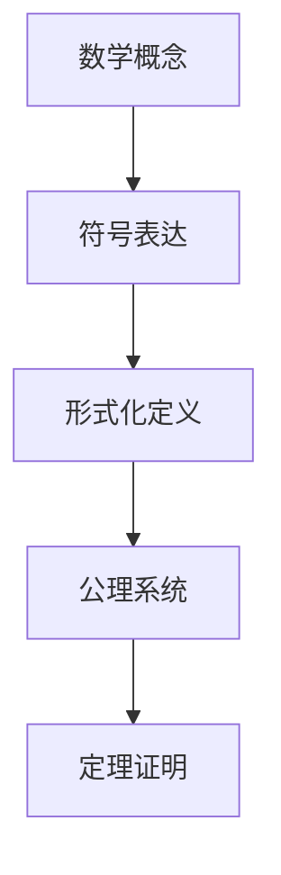
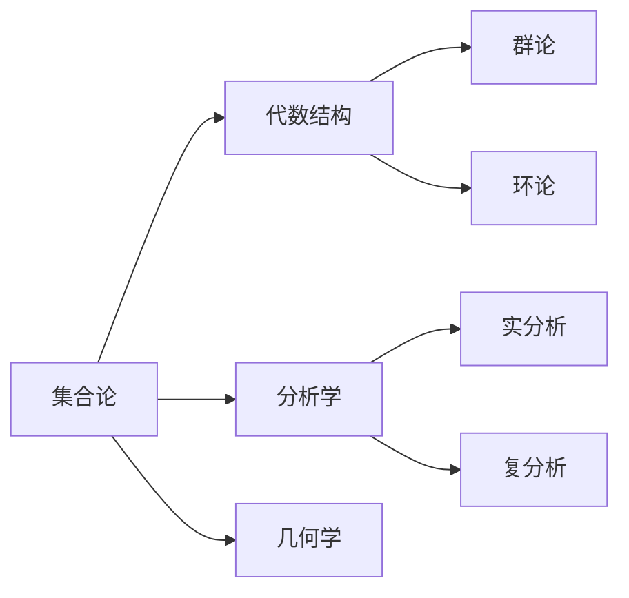
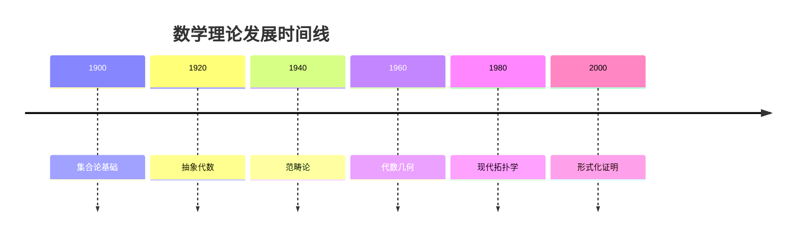
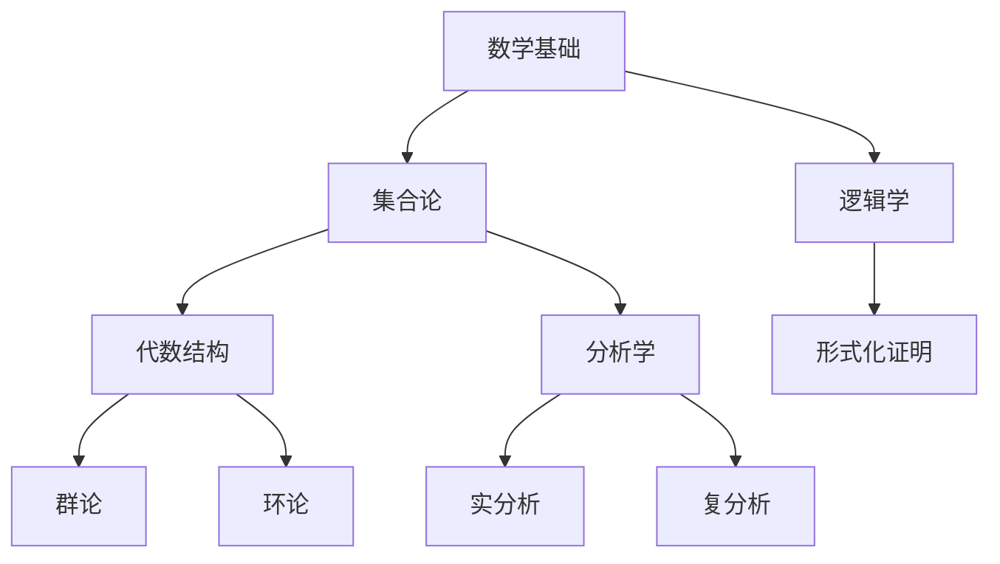
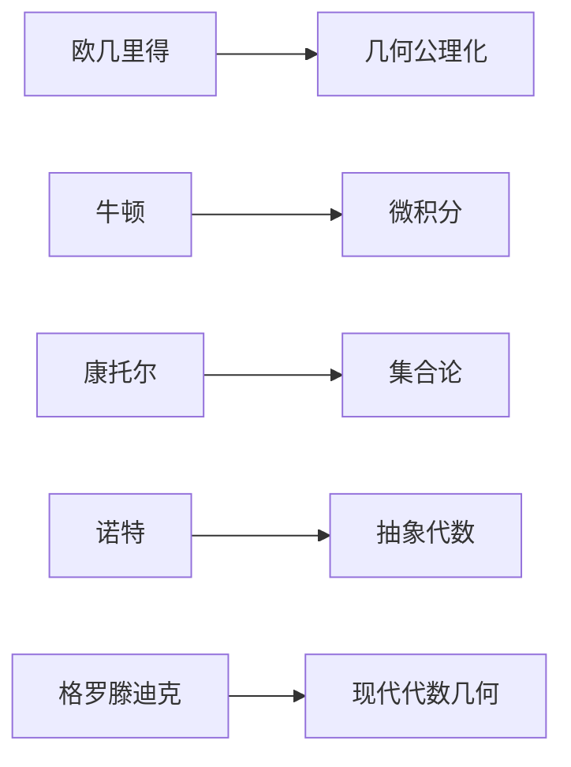
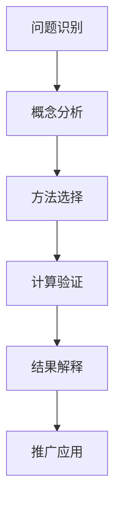

# 多表征体系指南 / Multi-Representation System Guide

## 概述 / Overview

本指南旨在建立一套完整的多表征体系，通过多种方式呈现数学理论知识，提高理解深度和广度。

## 1. 数学符号表征 / Mathematical Symbolic Representation

### 1.1 形式化符号系统

- **LaTeX公式**：严格的数学符号表达
- **逻辑符号**：∀, ∃, ∧, ∨, →, ↔, ¬
- **集合符号**：∈, ∉, ⊆, ⊂, ∪, ∩, ∅
- **函数符号**：f: A → B, f⁻¹, ∘

### 1.2 交互式符号

## 2. 可视化图表表征 / Visual Diagram Representation

### 2.1 概念关系图

### 2.2 理论发展时间线

### 2.3 知识层次结构

## 3. 实例表征 / Example Representation

### 3.1 具体实例

**实例 1.1** (群论实例)
考虑整数集 $\mathbb{Z}$ 在加法运算下构成的群：

- 封闭性：任意两个整数相加仍为整数
- 结合律：$(a + b) + c = a + (b + c)$
- 单位元：$0$ 是加法单位元
- 逆元：每个整数 $a$ 的逆元是 $-a$

### 3.2 反例表征

**反例 1.1** (非群结构)
考虑自然数集 $\mathbb{N}$ 在加法运算下：

- 不构成群，因为缺少逆元
- 只有单位元 $0$，其他元素无逆元

### 3.3 应用实例

**应用 1.1** (密码学应用)
RSA加密算法基于群论：

- 选择两个大素数 $p, q$
- 计算 $n = pq$
- 选择公钥 $e$ 与 $\phi(n)$ 互素
- 私钥 $d$ 满足 $ed \equiv 1 \pmod{\phi(n)}$

## 4. 历史发展表征 / Historical Development Representation

### 4.1 理论发展脉络

**阶段 1** (古代数学)

- 欧几里得几何公理化
- 算术基础建立

**阶段 2** (近代数学)

- 微积分发展
- 代数符号化

**阶段 3** (现代数学)

- 集合论基础
- 抽象代数发展

**阶段 4** (当代数学)

- 范畴论统一
- 形式化证明

### 4.2 重要人物贡献

## 5. 应用场景表征 / Application Scenario Representation

### 5.1 自然科学应用

- **物理学**：李群在量子力学中的应用
- **化学**：对称群在分子结构中的应用
- **生物学**：拓扑学在蛋白质折叠中的应用

### 5.2 工程技术应用

- **计算机科学**：范畴论在函数式编程中的应用
- **通信工程**：有限域在编码理论中的应用
- **人工智能**：线性代数在机器学习中的应用

### 5.3 社会科学应用

- **经济学**：博弈论在决策分析中的应用
- **社会学**：图论在社交网络分析中的应用

## 6. 思维过程表征 / Thinking Process Representation

### 6.1 问题解决流程

### 6.2 证明思维过程

**定理证明思维过程**：

1. **理解问题**：明确要证明的结论
2. **分析条件**：识别已知条件和假设
3. **选择方法**：确定证明策略
4. **构造证明**：逐步推导
5. **验证结果**：检查证明的正确性

## 7. 交互式表征 / Interactive Representation

### 7.1 动态可视化

- **几何图形**：可旋转的3D几何体
- **函数图像**：可调节参数的函数曲线
- **向量场**：可交互的向量场可视化

### 7.2 计算演示

- **数值计算**：实时数值计算演示
- **符号计算**：计算机代数系统演示
- **概率模拟**：蒙特卡洛方法演示

## 8. 多媒体表征 / Multimedia Representation

### 8.1 视频讲解

- 概念动画演示
- 定理证明过程
- 应用实例展示

### 8.2 音频解说

- 概念解释音频
- 历史背景介绍
- 应用案例讲解

### 8.3 交互式文档

- 可折叠的证明步骤
- 可点击的公式推导
- 可搜索的概念索引

## 9. 实现策略 / Implementation Strategy

### 9.1 技术工具

- **Mermaid**：流程图和时序图
- **LaTeX**：数学公式渲染
- **Python**：数值计算和可视化
- **JavaScript**：交互式图表
- **SVG**：矢量图形

### 9.2 内容组织

- **层次化结构**：从基础到高级
- **模块化设计**：独立可组合的单元
- **交叉引用**：建立知识关联网络

### 9.3 质量控制

- **学术标准**：严格的数学规范
- **一致性检查**：术语和符号统一
- **完整性验证**：覆盖所有重要概念

## 10. 持续改进 / Continuous Improvement

### 10.1 反馈机制

- 用户理解度评估
- 内容效果测试
- 专家评审意见

### 10.2 更新策略

- 定期内容审查
- 新理论及时补充
- 表征方式优化

### 10.3 扩展计划

- 增加更多应用场景
- 开发新的可视化工具
- 建立在线交互平台

---

*本指南将作为FormalMath项目的多表征标准，确保所有数学内容都能通过多种方式得到充分表达和理解。*
