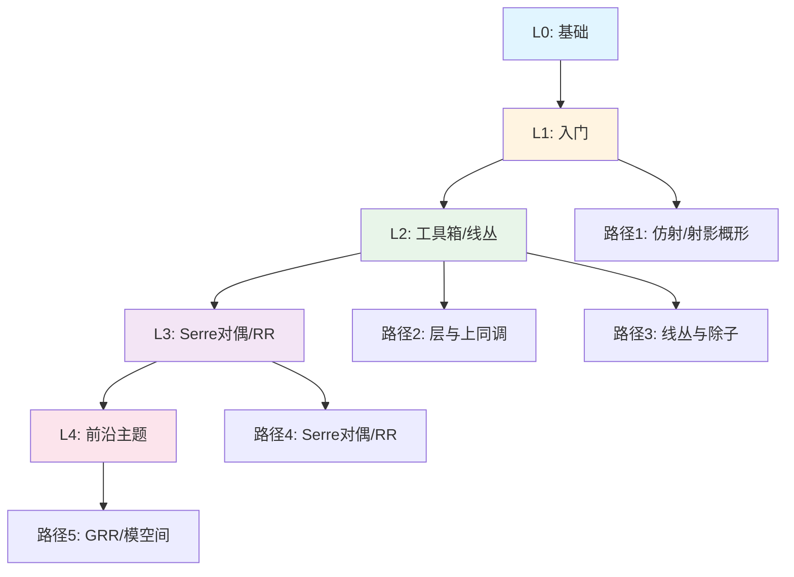
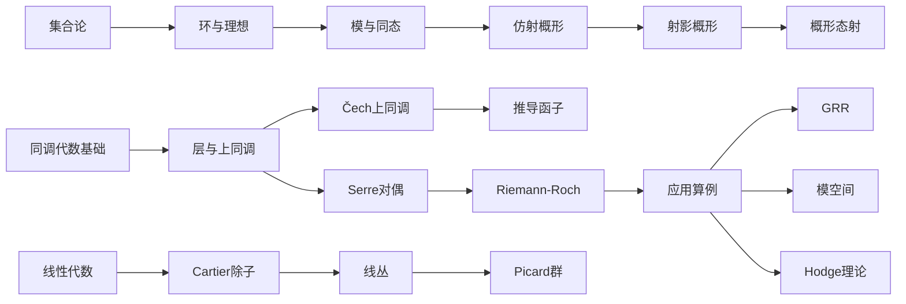
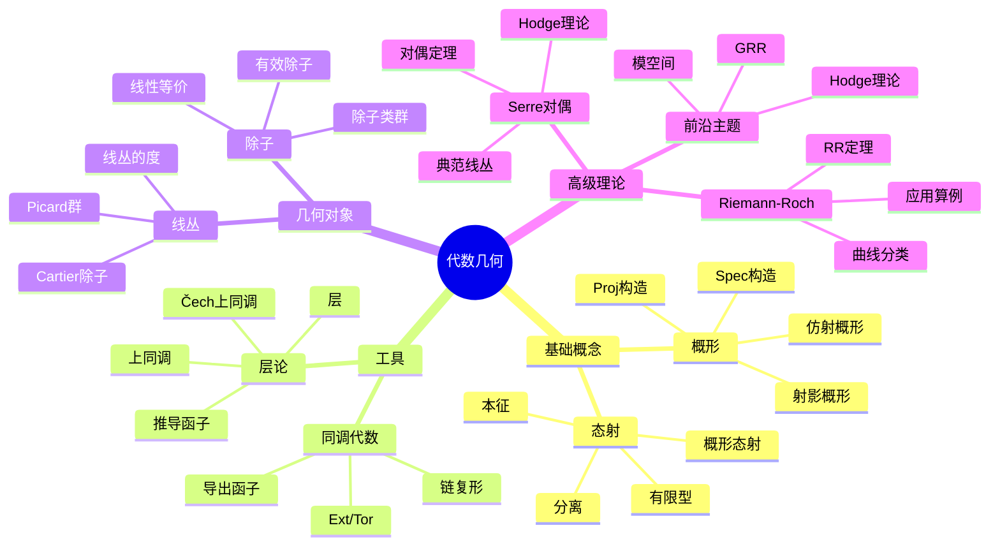

# 学习路径样例：代数几何（5条）

## 📋 路径总览

## 🗺️ 学习路径依赖关系图

## 路径1（L0→L1）：入门

- 先修：集合论、环与理想、模与同态
- 主线：仿射概形→射影概形→概形态射
- 目标：理解 Spec/Proj 与基本例

## 路径2（L1→L2）：工具箱

- 先修：同调代数基础（短正合列、Ext/Tor）
- 主线：层与上同调→Čech 上同调→推导函子
- 目标：能计算低维上同调

## 路径3（L1→L2）：线丛与除子

- 先修：线性代数、基础拓扑直觉
- 主线：Cartier 除子↔线丛字典→Picard 群
- 目标：能处理基础线丛问题

## 路径4（L2→L3）：Serre 对偶与RR

- 先修：上同调工具、典范线丛
- 主线：Serre 对偶→Riemann–Roch→应用算例
- 目标：完成 P^1/椭圆曲线算例

## 路径5（L3）：进一步主题

- 主题：GRR、模空间、Hodge 理论接口
- 资源：Hartshorne, G-H, SGA
- 目标：进入前沿专题阅读

## 📊 学习路径多维知识矩阵

| 路径 | 级别 | 先修知识 | 核心概念 | 关键定理 | 目标能力 | 典型应用 |
|------|------|---------|---------|---------|---------|---------|
| 路径1 | L0→L1 | 集合论、环与理想、模与同态 | 仿射概形、射影概形、概形态射 | Spec/Proj构造 | 理解概形基本概念 | 代数簇的概形化 |
| 路径2 | L1→L2 | 同调代数基础 | 层、上同调、Čech上同调、推导函子 | 上同调长正合序列 | 计算低维上同调 | 上同调计算 |
| 路径3 | L1→L2 | 线性代数、基础拓扑 | Cartier除子、线丛、Picard群 | 除子-线丛对应 | 处理线丛问题 | 线丛分类 |
| 路径4 | L2→L3 | 上同调工具、典范线丛 | Serre对偶、Riemann-Roch | Serre对偶定理、RR定理 | 完成典型算例 | 曲线分类 |
| 路径5 | L3 | 路径1-4内容 | GRR、模空间、Hodge理论 | Grothendieck-Riemann-Roch | 进入前沿研究 | 模空间理论 |

## 🎯 核心概念思维导图

