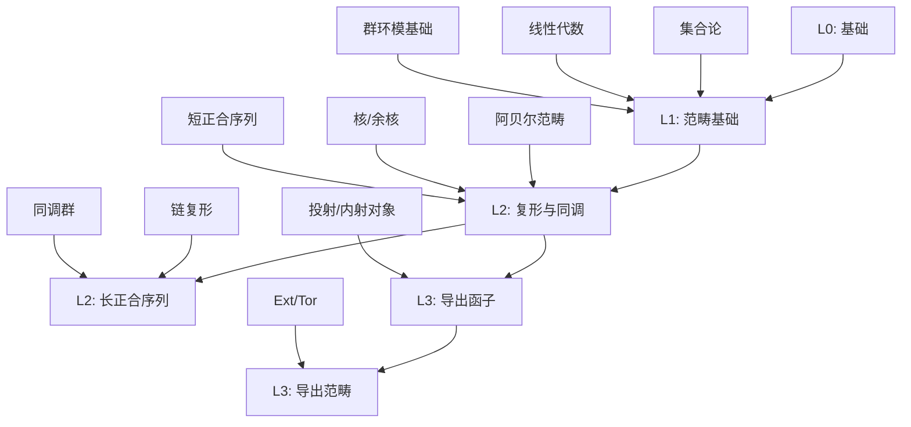

# 学习路径样例：同调代数（5条）

## 📊 学习路径知识矩阵

### 路径依赖关系图

### 学习路径多维矩阵

| 路径 | 级别 | 先修知识 | 核心概念 | 关键定理 | 目标能力 |
|-----|------|---------|---------|---------|---------|
| 路径1 | L0→L1 | 集合论、线性代数、群环模 | 阿贝尔范畴、核/余核、短正合序列 | 五项引理 | 熟练使用正合序列 |
| 路径2 | L1→L2 | 路径1、基本范畴语言 | 链复形、链映射、同调群 | 函子性 | 计算基础同调群 |
| 路径3 | L2 | 路径2 | 蛇引理、连接同态、长正合序列 | 蛇引理 | 构造并使用长正合序列 |
| 路径4 | L2→L3 | 投射/内射对象、自由分解 | Ext、Tor、分辨率 | 换序定理 | 计算低阶Ext/Tor |
| 路径5 | L3 | 三角范畴、锥与移位 | 导出范畴、三角结构、谱序列 | Grothendieck谱序列 | 理解导出视角 |

## 路径1（L0→L1）：入门与范畴基础

- 先修：集合论、线性代数、群环模基础
- 主线：阿贝尔范畴→核/余核→像/余像→短正合序列
- 目标：能熟练使用正合序列与五项引理

## 路径2（L1→L2）：复形与同调

- 先修：路径1内容、基本范畴语言
- 主线：链复形/上链复形→链映射与同伦→同调群定义→函子性
- 目标：能计算基础链复形的同调群

## 路径3（L2）：长正合序列与蛇引理

- 先修：路径2内容
- 主线：蛇引理→连接同态构造→短正合列诱导的长正合序列→应用
- 目标：能在计算中构造并使用长正合序列

## 路径4（L2→L3）：导出函子 Ext/Tor

- 先修：投射/内射对象、自由分解
- 主线：右导出函子 Ext、左导出函子 Tor→分辨率计算→换序与长正合列
- 目标：能用分辨率计算低阶 Ext/Tor 并解决典型练习

## 路径5（L3）：导出范畴与谱序列初步

- 先修：三角范畴基础、锥与移位
- 主线：导出范畴 D(A) 的构造→三角结构→Grothendieck 谱序列/蛇形谱序列
- 目标：理解导出视角下长正合列与谱序列的关系，具备阅读前沿文献门槛
