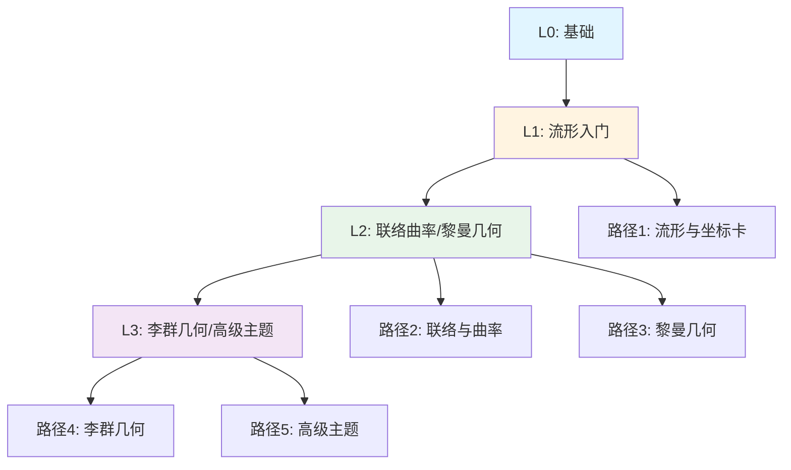
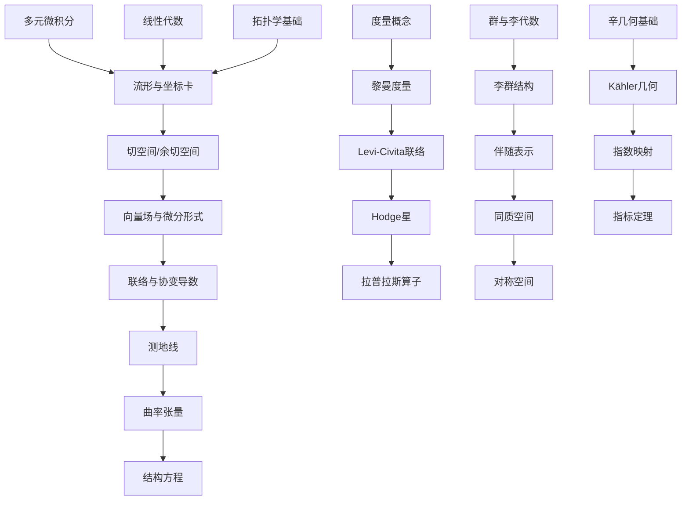
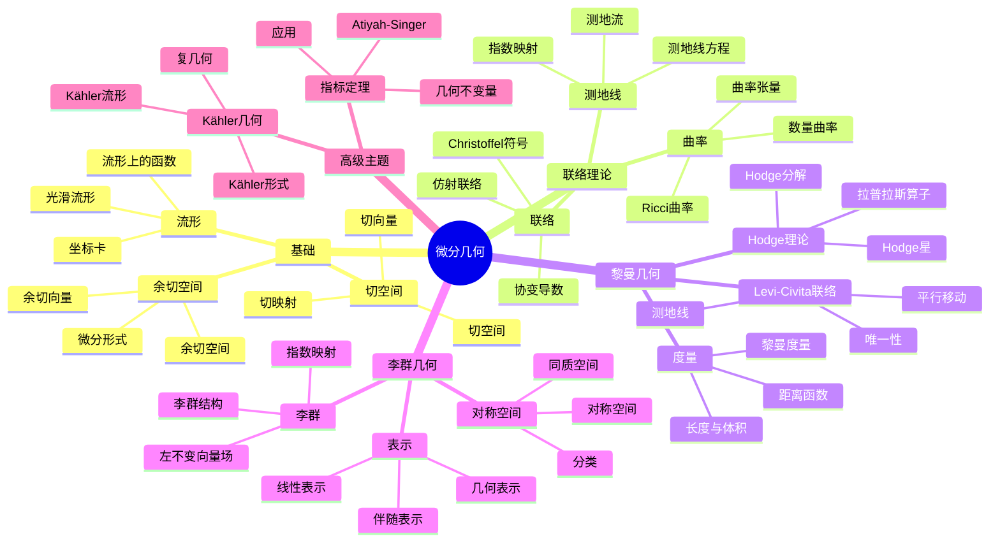

# 学习路径样例：微分几何（5条）

## 📋 路径总览

## 🗺️ 学习路径依赖关系图

## 路径1（L0→L1）：流形入门

- 先修：多元微积分、线性代数、拓扑学基础
- 主线：流形与坐标卡→切空间/余切空间→向量场与微分形式
- 目标：掌握光滑流形与基本微分算子

## 路径2（L1→L2）：联络与曲率

- 先修：路径1内容、张量运算
- 主线：联络与协变导数→测地线→曲率张量→结构方程
- 目标：能计算典型流形上的联络与曲率

## 路径3（L2）：黎曼几何与体积/拉普拉斯

- 先修：度量与长度体积概念
- 主线：黎曼度量→Levi-Civita 联络→Hodge 星→拉普拉斯算子
- 目标：理解Hodge分解与与de Rham上同调的联系（陈述与应用）

## 路径4（L2→L3）：李群与李代数几何

- 先修：群与李代数基础
- 主线：李群结构→伴随表示→同质空间与对称空间→表示与几何
- 目标：能处理常见李群的几何与表示接口

## 路径5（L3）：高级主题概览

- 先修：辛几何/复几何基础
- 主线：Kähler/辛几何接口→指数映射与切丛→指标定理（陈述）
- 目标：为几何分析与指标定理的深入学习打基础

## 📊 学习路径多维知识矩阵

| 路径 | 级别 | 先修知识 | 核心概念 | 关键定理 | 目标能力 | 典型应用 |
|------|------|---------|---------|---------|---------|---------|
| 路径1 | L0→L1 | 多元微积分、线性代数、拓扑学 | 流形、坐标卡、切空间、余切空间、向量场、微分形式 | 流形定义、切空间构造 | 掌握光滑流形 | 流形上的微积分 |
| 路径2 | L1→L2 | 路径1、张量运算 | 联络、协变导数、测地线、曲率张量、结构方程 | 曲率公式、结构方程 | 计算联络与曲率 | 流形上的几何 |
| 路径3 | L2 | 度量概念 | 黎曼度量、Levi-Civita联络、Hodge星、拉普拉斯算子 | Hodge分解、de Rham上同调 | 理解Hodge理论 | 调和形式 |
| 路径4 | L2→L3 | 群与李代数 | 李群、伴随表示、同质空间、对称空间 | 李群-李代数对应 | 处理李群几何 | 对称空间分类 |
| 路径5 | L3 | 辛几何/复几何 | Kähler几何、辛几何、指数映射、指标定理 | Atiyah-Singer指标定理 | 进入前沿研究 | 几何分析 |

## 🎯 核心概念思维导图

