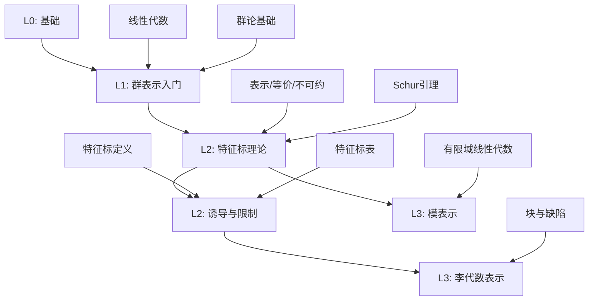

# 学习路径样例：表示论（5条）

## 📊 学习路径知识矩阵

### 路径依赖关系图

### 学习路径多维矩阵

| 路径 | 级别 | 先修知识 | 核心概念 | 关键定理 | 目标能力 |
|-----|------|---------|---------|---------|---------|
| 路径1 | L0→L1 | 线性代数、群论基础 | 表示、等价、不可约、Schur引理 | 完全可约性 | 处理小群表示 |
| 路径2 | L1→L2 | 路径1、复内积空间 | 特征标、正交关系、特征标表 | 正交关系定理 | 完成S3/S4/D4特征标表 |
| 路径3 | L2 | 群代数、张量积 | 诱导表示、限制、Frobenius互反性 | Frobenius互反性 | 计算分解与特征标 |
| 路径4 | L2→L3 | 有限域线性代数、模论 | 模表示、块、缺陷、Brauer特征标 | Brauer理论 | 理解完全可约失效 |
| 路径5 | L3 | 微分几何、李群李代数 | 权、根、最高权表示、Weyl角色公式 | Weyl角色公式 | 具备高级表示论基础 |

## 路径1（L0→L1）：有限群表示入门

- 先修：线性代数、群论基础
- 主线：表示/等价/不可约→Schur 引理→完全可约性（特征0）
- 目标：掌握基本概念并能处理小群的表示

## 路径2（L1→L2）：特征标理论

- 先修：路径1内容、复内积空间基础
- 主线：特征标定义→正交关系→特征标表→分解与重数
- 目标：能独立完成 S3/S4/D4 的特征标表与分解

## 路径3（L2）：诱导与限制、Frobenius 互反性

- 先修：群代数与张量积
- 主线：诱导表示 Ind、限制 Res→Frobenius 互反性→Mackey 分解
- 目标：会用互反性计算分解与特征标

## 路径4（L2→L3）：模表示与Brauer理论概览

- 先修：有限域线性代数、模论基础
- 主线：特征 p 下的不可分解→块与缺陷→Brauer 特征标
- 目标：理解完全可约失效的现象与基本工具

## 路径5（L3）：李代数/李群表示初步

- 先修：微分几何/李群李代数入门
- 主线：权与根→最高权表示→Weyl 角色公式（陈述与应用）
- 目标：具备继续学习高级表示论与几何表示论的基础
