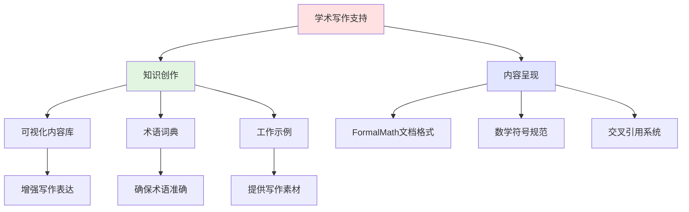

# FormalMath学术写作支持系统总览

**制定日期**: 2026年4月2日
**系统状态**: 已完成
**适用范围**: 数学学术写作（Harvard风格）

---

## 📋 目录

- [FormalMath学术写作支持系统总览](#formalmath学术写作支持系统总览)
  - [📋 目录](#-目录)
  - [一、系统架构](#一系统架构)
  - [二、模块说明](#二模块说明)
    - [2.1 写作指南模块](#21-写作指南模块)
    - [2.2 写作模板模块](#22-写作模板模块)
    - [2.3 写作资源模块](#23-写作资源模块)
    - [2.4 写作工具模块](#24-写作工具模块)
  - [三、使用指南](#三使用指南)
    - [3.1 初学者路径](#31-初学者路径)
    - [3.2 进阶使用者路径](#32-进阶使用者路径)
  - [四、与FormalMath知识体系的关联](#四与formalmath知识体系的关联)

---

## 一、系统架构

```

FormalMath学术写作支持系统
│
├── 01-写作指南/
│   ├── 01-论文结构指南.md      → 数学论文的标准结构
│   ├── 02-写作规范.md          → 定义-定理-证明写作规范
│   ├── 03-引用规范.md          → AMS文献引用标准
│   └── 04-符号规范.md          → 数学符号使用规范
│
├── 02-写作模板/
│   ├── 01-说明性论文模板.md    → 5页说明性论文
│   ├── 02-毕业论文模板.md      → 毕业论文结构
│   ├── 03-课程论文模板.md      → 课程论文格式
│   └── 04-读书笔记模板.md      → 学术读书笔记
│
├── 03-写作资源/
│   ├── 01-数学英语词汇.md      → 常用数学英语词汇表
│   ├── 02-证明句式库.md        → 证明常用句式
│   └── 03-经典论文赏析.md      → 10篇经典论文分析
│
├── 04-写作工具/
│   └── 工具推荐与指南.md       → LaTeX、Zotero等工具
│
└── 05-示例库/
    └── 优秀示例集合.md          → 优秀写作示例

```

---

## 二、模块说明

### 2.1 写作指南模块

| 文档 | 内容 | 目标读者 |
|-----|------|---------|
| 论文结构指南 | 标准数学论文结构（摘要、引言、主体、结论） | 所有写作者 |
| 写作规范 | 定义-定理-证明环境的规范使用 | 初学者 |
| 引用规范 | AMS引用标准、文献管理软件使用 | 所有写作者 |
| 符号规范 | 符号命名、字体、编号规范 | 所有写作者 |

### 2.2 写作模板模块

| 模板类型 | 页数 | 适用场景 |
|---------|------|---------|
| 说明性论文 | 5页 | 概念解释、小型结果展示 |
| 毕业论文 | 不定 | 学位论文 |
| 课程论文 | 10-20页 | 学期课程作业 |
| 读书笔记 | 2-5页 | 文献阅读记录 |

### 2.3 写作资源模块

- **数学英语词汇表**: 400+核心词汇，分类整理
- **证明句式库**: 100+证明常用句式
- **经典论文赏析**: 10篇不同领域经典论文分析

### 2.4 写作工具模块

涵盖以下工具的使用指南：

- LaTeX排版系统
- Zotero文献管理
- Overleaf在线协作
- Grammarly语法检查
- MathPix公式识别

---

## 三、使用指南

### 3.1 初学者路径

1. 阅读 `01-写作指南/` 全部文档
2. 选择一个模板开始写作
3. 参考 `03-写作资源/` 提升表达
4. 使用 `04-写作工具/` 提高效率
5. 对比 `05-示例库/` 改进写作

### 3.2 进阶使用者路径

1. 直接选择合适模板
2. 参考写作规范检查文稿
3. 使用写作工具优化流程
4. 学习经典论文的写作技巧

---

## 四、与FormalMath知识体系的关联



---

**文档状态**: ✅ 完成
**最后更新**: 2026年4月2日
