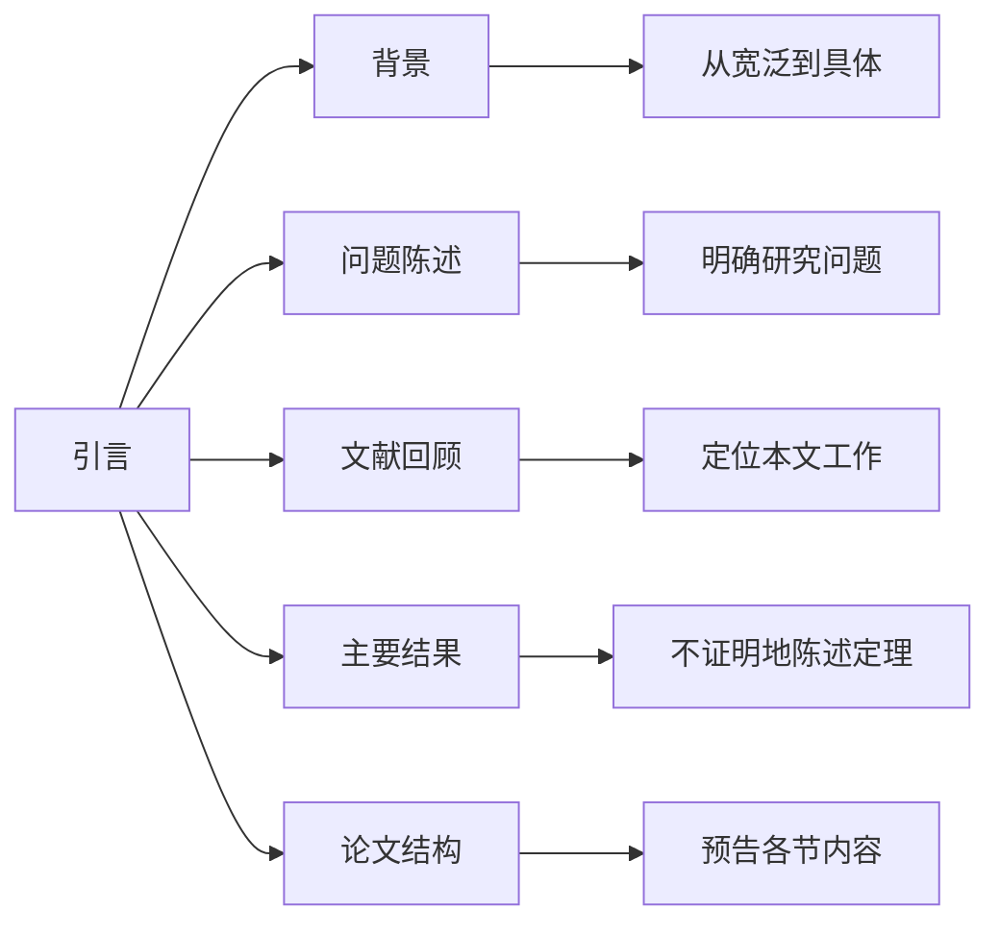

# 数学论文结构指南

**制定日期**: 2026年4月2日
**适用范围**: 数学学术论文

---

## 📋 目录

- [数学论文结构指南](#数学论文结构指南)
  - [📋 目录](#目录)
  - [一、标准结构](#一标准结构)
  - [二、各部分详解](#二各部分详解)
    - [2.1 摘要写作要点](#21-摘要写作要点)
    - [2.2 引言结构](#22-引言结构)
    - [2.3 定理-证明环境](#23-定理-证明环境)
  - [三、结构示例](#三结构示例)
    - [3.1 短篇论文结构 (5-10页)](#31-短篇论文结构-5-10页)
    - [3.2 学位论文结构](#32-学位论文结构)

---

## 一、标准结构

```

数学论文标准结构
━━━━━━━━━━━━━━━━━━━━━━━━━━━━━━━━━━━━━━━━━━━━━━━

1. 标题页 (Title Page)
   - 论文标题
   - 作者信息
   - 日期/机构

2. 摘要 (Abstract)
   - 研究背景 (1-2句)
   - 主要结果 (2-3句)
   - 方法概述 (1-2句)
   - 意义/应用 (1句)
   【200-300词】

3. 引言 (Introduction)
   - 背景介绍
   - 问题陈述
   - 主要结果陈述
   - 论文结构概述
   【占全文10-15%】

4. 预备知识/记号 (Preliminaries)
   - 必要的定义
   - 标准记号
   - 已知结果引用

5. 主体部分 (Main Content)
   - 定理陈述与证明
   - 例子与反例
   - 算法描述
   【占全文60-70%】

6. 应用/讨论 (Applications/Discussion)
   - 实际应用
   - 与其他工作的联系
   - 开放问题

7. 结论 (Conclusion)
   - 总结主要贡献
   - 未来工作方向

8. 参考文献 (References)
   - 按作者姓氏字母排序
   - 遵循AMS引用规范

9. 附录 (Appendix, 可选)
   - 冗长证明
   - 计算细节
   - 补充材料
━━━━━━━━━━━━━━━━━━━━━━━━━━━━━━━━━━━━━━━━━━━━━━━

```

---

## 二、各部分详解

### 2.1 摘要写作要点

```

摘要结构 (四段式)
━━━━━━━━━━━━━━━━━━━━━━━━━━━━━━━━━━━━━━━━━━━━━━━

第一段: 背景与动机
• 研究领域的简要介绍
• 问题的来源和重要性

第二段: 主要贡献
• 用一句话概括核心结果
• 强调创新点

第三段: 方法概述
• 关键技术的简要描述
• 不展开细节

第四段: 意义
• 理论意义或实际应用价值
• 对领域的影响

注意事项:
• 避免引用文献
• 避免数学公式 (除非必要)
• 保持自包含性
━━━━━━━━━━━━━━━━━━━━━━━━━━━━━━━━━━━━━━━━━━━━━━━

```

### 2.2 引言结构



### 2.3 定理-证明环境

```

定理环境的标准顺序
━━━━━━━━━━━━━━━━━━━━━━━━━━━━━━━━━━━━━━━━━━━━━━━

定理 2.1 (主要结果)
    ↓
定义 2.2 (必要的概念)
    ↓
引理 2.3 (辅助结果)
    ↓
引理 2.4 (另一个辅助结果)
    ↓
定理 2.1 的证明
    ↓
例子 2.5 (说明定理)
    ↓
注记 2.6 (额外说明)

编号规则:
• 定理、引理、命题、推论统一编号
• 定义、例子、注记独立编号
• 方程单独编号: (1), (2), ...
━━━━━━━━━━━━━━━━━━━━━━━━━━━━━━━━━━━━━━━━━━━━━━━

```

---

## 三、结构示例

### 3.1 短篇论文结构 (5-10页)

```

短篇论文示例结构
━━━━━━━━━━━━━━━━━━━━━━━━━━━━━━━━━━━━━━━━━━━━━━━

1. 标题与摘要 (1页)

2. 引言 (1-1.5页)
   - 背景
   - 问题
   - 主要定理 (不证明)

3. 主要结果 (2-3页)
   - 定理陈述
   - 证明
   - 推论

4. 应用/例子 (1页)
   - 具体例子
   - 数值结果 (如适用)

5. 结论 (0.5页)

6. 参考文献 (0.5-1页)
━━━━━━━━━━━━━━━━━━━━━━━━━━━━━━━━━━━━━━━━━━━━━━━

```

### 3.2 学位论文结构

```

学位论文章节结构
━━━━━━━━━━━━━━━━━━━━━━━━━━━━━━━━━━━━━━━━━━━━━━━

第1章 引言
第2章 预备知识
第3章 主要结果I
第4章 主要结果II
第5章 应用与数值实验
第6章 结论与展望

附录A: 冗长证明
附录B: 算法实现细节
附录C: 补充数据

参考文献
索引 (可选)
致谢
━━━━━━━━━━━━━━━━━━━━━━━━━━━━━━━━━━━━━━━━━━━━━━━

```

---

**文档状态**: ✅ 完成
**最后更新**: 2026年4月2日
