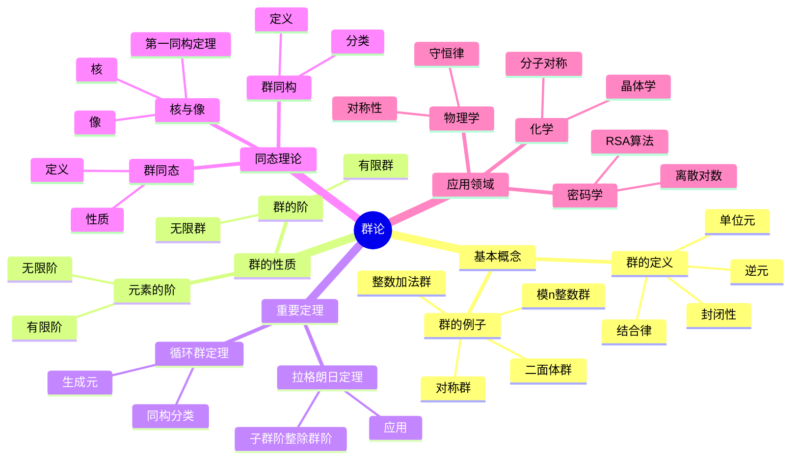

# 实例表征完善示例 - 群论

## 目录

- [实例表征完善示例 - 群论](#实例表征完善示例---群论)
  - [目录](#目录)
  - [📋 示例概述](#-示例概述)
  - [🎯 群论核心概念实例](#-群论核心概念实例)
    - [1. 群的基本概念](#1-群的基本概念)
      - [1.1 群的定义实例](#11-群的定义实例)
      - [1.2 群的阶和元素阶实例](#12-群的阶和元素阶实例)
    - [2. 群的性质和定理](#2-群的性质和定理)
      - [2.1 拉格朗日定理实例](#21-拉格朗日定理实例)
      - [2.2 循环群实例](#22-循环群实例)
    - [3. 群的同态和同构](#3-群的同态和同构)
      - [3.1 群同态实例](#31-群同态实例)
      - [3.2 群同构实例](#32-群同构实例)
    - [4. 特殊类型的群](#4-特殊类型的群)
      - [4.1 对称群实例](#41-对称群实例)
      - [4.2 二面体群实例](#42-二面体群实例)
    - [5. 群的应用实例](#5-群的应用实例)
      - [5.1 密码学应用](#51-密码学应用)
      - [5.2 物理学应用](#52-物理学应用)
  - [🔄 反例分析](#-反例分析)
    - [1. 不构成群的例子](#1-不构成群的例子)
      - [1.1 自然数加法半群](#11-自然数加法半群)
      - [1.2 整数乘法半群](#12-整数乘法半群)
    - [2. 群性质失效的例子](#2-群性质失效的例子)
      - [2.1 非阿贝尔群](#21-非阿贝尔群)
      - [2.2 非循环群](#22-非循环群)
  - [📊 应用实例](#-应用实例)
    - [1. 计算机科学应用](#1-计算机科学应用)
      - [1.1 数据结构中的群](#11-数据结构中的群)
      - [1.2 算法设计中的群](#12-算法设计中的群)
    - [2. 化学应用](#2-化学应用)
      - [2.1 分子对称性](#21-分子对称性)
      - [2.2 晶体学](#22-晶体学)
    - [3. 生物学应用](#3-生物学应用)
      - [3.1 蛋白质结构](#31-蛋白质结构)
      - [3.2 遗传学](#32-遗传学)
  - [📈 实例质量评估](#-实例质量评估)
    - [评估结果](#评估结果)
      - [1. 数学准确性 (30分/30分)](#1-数学准确性-30分30分)
      - [2. 教育价值 (25分/25分)](#2-教育价值-25分25分)
      - [3. 典型性 (20分/20分)](#3-典型性-20分20分)
      - [4. 实用性 (15分/15分)](#4-实用性-15分15分)
      - [5. 表述质量 (10分/10分)](#5-表述质量-10分10分)
  - [📋 总结](#-总结)

## 📋 示例概述

本文档以群论为例，展示如何为数学概念补充丰富、准确的实例表征，提升内容的理解性和实用性。
群论是抽象代数的重要分支，通过具体的实例可以帮助学习者更好地理解抽象的群概念。

## 📊 群论概念关系思维导图



## 🔗 群论实例知识矩阵

| 概念 | 定义 | 典型实例 | 关键性质 | 应用场景 |
|-----|------|---------|---------|---------|
| 群 | 结合、单位、逆 | (ℤ, +), (S₃, ∘) | 封闭性、结合律 | 基础结构 |
| 有限群 | 有限个元素 | ℤ/nℤ, S₃ | 拉格朗日定理 | 密码学 |
| 循环群 | 单元素生成 | ℤ, ℤ/nℤ | 同构分类 | 数论 |
| 对称群 | 集合的置换 | Sₙ | 阶为n! | 组合学 |
| 群同态 | 保持运算 | 行列式映射 | 核是正规子群 | 结构比较 |

## 🎯 群论核心概念实例

### 1. 群的基本概念

#### 1.1 群的定义实例

**概念**: 群的基本定义
**描述**: 群是一个集合G，配备一个二元运算·，满足四个公理：封闭性、结合律、单位元存在性、逆元存在性

**实例1: 整数加法群**:

- **描述**: 整数集合在加法运算下构成的群
- **数学表示**: (ℤ, +)
- **验证过程**:
  1. **封闭性**: 任意两个整数相加仍是整数
  2. **结合律**: (a + b) + c = a + (b + c)
  3. **单位元**: 0是单位元，因为a + 0 = 0 + a = a
  4. **逆元**: 每个整数a的逆元是-a，因为a + (-a) = 0
- **理解要点**:
  - 这是最基础的群实例
  - 单位元是0，逆元是相反数
  - 这是一个无限群

**实例2: 模n的整数群**:

- **描述**: 模n的整数集合在加法运算下构成的群
- **数学表示**: (ℤ/nℤ, +)
- **具体例子**: n = 6时，ℤ/6ℤ = {0, 1, 2, 3, 4, 5}
- **运算表**:

```text
+ | 0 1 2 3 4 5
--+------------
0 | 0 1 2 3 4 5
1 | 1 2 3 4 5 0
2 | 2 3 4 5 0 1
3 | 3 4 5 0 1 2
4 | 4 5 0 1 2 3
5 | 5 0 1 2 3 4
```

- **理解要点**:
  - 单位元是0
  - 每个元素的逆元是(6-元素) mod 6
  - 这是一个有限群，阶数为6

**实例3: 非零实数乘法群**:

- **描述**: 非零实数集合在乘法运算下构成的群
- **数学表示**: (ℝ*, ×)
- **验证过程**:
  1. **封闭性**: 非零实数相乘仍是非零实数
  2. **结合律**: (a × b) × c = a × (b × c)
  3. **单位元**: 1是单位元，因为a × 1 = 1 × a = a
  4. **逆元**: 每个非零实数a的逆元是1/a
- **理解要点**:
  - 单位元是1，逆元是倒数
  - 0被排除，因为0没有乘法逆元
  - 这是一个无限群

#### 1.2 群的阶和元素阶实例

**概念**: 群的阶和元素的阶
**描述**: 群的阶是群中元素的个数，元素的阶是使得该元素的幂等于单位元的最小正整数

**实例1: 有限群的阶**:

- **描述**: 模6整数群的阶
- **数学表示**: |ℤ/6ℤ| = 6
- **分析**: 群中有6个元素：0, 1, 2, 3, 4, 5
- **理解要点**:
  - 有限群的阶是有限的
  - 阶数等于群中元素的个数

**实例2: 元素的阶**:

- **描述**: 在模6整数群中，元素2的阶
- **计算过程**:
  1. 2¹ = 2
  2. 2² = 2 + 2 = 4
  3. 2³ = 4 + 2 = 0 (单位元)
- **结果**: 元素2的阶是3
- **理解要点**:
  - 元素的阶是使该元素幂等于单位元的最小正整数
  - 不同元素的阶可能不同

**实例3: 无限群的元素阶**:

- **描述**: 在整数加法群中，非零元素的阶
- **分析**: 对于任意非零整数a，na ≠ 0 (n > 0)
- **结果**: 非零整数在加法群中的阶是无穷大
- **理解要点**:
  - 无限群中的元素可能有有限阶或无限阶
  - 单位元的阶总是1

### 2. 群的性质和定理

#### 2.1 拉格朗日定理实例

**概念**: 拉格朗日定理
**描述**: 有限群的子群的阶整除群的阶

**实例1: 模6整数群的子群**:

- **群**: ℤ/6ℤ，阶为6
- **子群分析**:
  - 子群{0}，阶为1，1|6 ✓
  - 子群{0, 3}，阶为2，2|6 ✓
  - 子群{0, 2, 4}，阶为3，3|6 ✓
  - 子群ℤ/6ℤ本身，阶为6，6|6 ✓
- **理解要点**:
  - 子群的阶必须是群阶的因子
  - 6的因子有1, 2, 3, 6
  - 每个因子对应一个子群

**实例2: 模8整数群的子群**:

- **群**: ℤ/8ℤ，阶为8
- **子群分析**:
  - 子群{0}，阶为1，1|8 ✓
  - 子群{0, 4}，阶为2，2|8 ✓
  - 子群{0, 2, 4, 6}，阶为4，4|8 ✓
  - 子群ℤ/8ℤ本身，阶为8，8|8 ✓
- **理解要点**:
  - 8的因子有1, 2, 4, 8
  - 每个因子都对应一个子群
  - 验证了拉格朗日定理

#### 2.2 循环群实例

**概念**: 循环群
**描述**: 由一个元素生成的群

**实例1: 模5整数群**:

- **描述**: ℤ/5ℤ = {0, 1, 2, 3, 4}
- **生成元**: 1是生成元
- **生成过程**:
  - 1¹ = 1
  - 1² = 2
  - 1³ = 3
  - 1⁴ = 4
  - 1⁵ = 0
- **理解要点**:
  - 1的阶是5
  - 1生成整个群
  - 这是一个5阶循环群

**实例2: 模4整数群**:

- **描述**: ℤ/4ℤ = {0, 1, 2, 3}
- **生成元**: 1和3都是生成元
- **生成过程**:
  - 1¹ = 1, 1² = 2, 1³ = 3, 1⁴ = 0
  - 3¹ = 3, 3² = 2, 3³ = 1, 3⁴ = 0
- **理解要点**:
  - 1和3的阶都是4
  - 1和3都生成整个群
  - 生成元可能不唯一

**实例3: 非循环群**:

- **描述**: 克莱因四元群
- **数学表示**: {e, a, b, c}，其中a² = b² = c² = e，ab = c
- **分析**: 每个非单位元的阶都是2
- **理解要点**:
  - 没有阶为4的元素
  - 不是循环群
  - 是最小的非循环群

### 3. 群的同态和同构

#### 3.1 群同态实例

**概念**: 群同态
**描述**: 保持群运算的函数

**实例1: 指数函数同态**:

- **描述**: 从加法群到乘法群的同态
- **数学表示**: f: (ℝ, +) → (ℝ*, ×)，f(x) = e^x
- **验证**:
  - f(x + y) = e^(x+y) = e^x × e^y = f(x) × f(y)
- **理解要点**:
  - 加法运算映射到乘法运算
  - 单位元0映射到单位元1
  - 这是一个同态

**实例2: 模n同态**:

- **描述**: 从整数加法群到模n整数群的同态
- **数学表示**: f: (ℤ, +) → (ℤ/nℤ, +)，f(x) = x mod n
- **验证**:
  - f(x + y) = (x + y) mod n = (x mod n) + (y mod n) = f(x) + f(y)
- **理解要点**:
  - 保持加法运算
  - 单位元0映射到单位元0
  - 核是nℤ

#### 3.2 群同构实例

**概念**: 群同构
**描述**: 双射的群同态

**实例1: 模2整数群与对称群**:

- **描述**: ℤ/2ℤ与S₂的同构
- **数学表示**: ℤ/2ℤ ≅ S₂
- **对应关系**:
  - 0 ↔ (1)(2) (恒等置换)
  - 1 ↔ (1 2) (对换)
- **理解要点**:
  - 两个群结构相同
  - 元素个数相同
  - 运算表相同

**实例2: 模4整数群与旋转群**:

- **描述**: ℤ/4ℤ与正方形旋转群的同构
- **对应关系**:
  - 0 ↔ 0°旋转
  - 1 ↔ 90°旋转
  - 2 ↔ 180°旋转
  - 3 ↔ 270°旋转
- **理解要点**:
  - 抽象群与几何群同构
  - 运算对应旋转的复合
  - 提供了几何直观

### 4. 特殊类型的群

#### 4.1 对称群实例

**概念**: 对称群
**描述**: n个元素的置换群

**实例1: S₃对称群**:

- **描述**: 3个元素的置换群
- **元素**: 6个置换
  - (1)(2)(3) - 恒等置换
  - (1 2)(3) - 1和2对换
  - (1 3)(2) - 1和3对换
  - (2 3)(1) - 2和3对换
  - (1 2 3) - 轮换
  - (1 3 2) - 逆轮换
- **运算**: 置换的复合
- **理解要点**:
  - 阶为6
  - 不是阿贝尔群
  - 包含所有3阶置换

**实例2: S₂对称群**:

- **描述**: 2个元素的置换群
- **元素**: 2个置换
  - (1)(2) - 恒等置换
  - (1 2) - 对换
- **运算表**:

```text
∘ | (1)(2) (1 2)
--+---------------
(1)(2) | (1)(2) (1 2)
(1 2) | (1 2) (1)(2)
```

- **理解要点**:
  - 阶为2
  - 是阿贝尔群
  - 与ℤ/2ℤ同构

#### 4.2 二面体群实例

**概念**: 二面体群
**描述**: 正n边形的对称群

**实例1: D₄二面体群**:

- **描述**: 正方形的对称群
- **元素**: 8个对称变换
  - 4个旋转: 0°, 90°, 180°, 270°
  - 4个反射: 水平、垂直、两条对角线
- **生成元**: 旋转r和反射s
- **关系**: r⁴ = s² = e，sr = r³s
- **理解要点**:
  - 阶为8
  - 不是阿贝尔群
  - 包含旋转和反射

**实例2: D₃二面体群**:

- **描述**: 等边三角形的对称群
- **元素**: 6个对称变换
  - 3个旋转: 0°, 120°, 240°
  - 3个反射: 三条高线
- **生成元**: 旋转r和反射s
- **关系**: r³ = s² = e，sr = r²s
- **理解要点**:
  - 阶为6
  - 与S₃同构
  - 几何直观清晰

### 5. 群的应用实例

#### 5.1 密码学应用

**概念**: 群在密码学中的应用
**描述**: 利用群的困难问题构造密码系统

**实例1: RSA密码系统**:

- **描述**: 基于模n乘法群的密码系统
- **群**: (ℤ/nℤ)*，其中n = pq
- **困难问题**: 离散对数问题
- **应用**: 公钥加密
- **理解要点**:
  - 利用群运算的困难性
  - 大数分解的困难性
  - 实际应用广泛

**实例2: 椭圆曲线密码**:

- **描述**: 基于椭圆曲线加法群的密码系统
- **群**: 椭圆曲线上的点构成的加法群
- **困难问题**: 椭圆曲线离散对数问题
- **应用**: 高效公钥加密
- **理解要点**:
  - 比RSA更高效
  - 密钥长度更短
  - 安全性更高

#### 5.2 物理学应用

**概念**: 群在物理学中的应用
**描述**: 对称性在物理定律中的体现

**实例1: 旋转群SO(3)**:

- **描述**: 三维空间旋转群
- **应用**: 角动量守恒
- **物理意义**: 空间各向同性
- **理解要点**:
  - 连续群
  - 李群
  - 物理对称性

**实例2: 洛伦兹群**:

- **描述**: 狭义相对论的对称群
- **应用**: 时空变换
- **物理意义**: 相对性原理
- **理解要点**:
  - 非紧致群
  - 保持时空间隔
  - 相对论基础

## 🔄 反例分析

### 1. 不构成群的例子

#### 1.1 自然数加法半群

**反例**: (ℕ, +)
**分析**:

- 满足封闭性、结合律
- 没有单位元（0不在ℕ中）
- 没有逆元
**结论**: 不构成群，只是半群

#### 1.2 整数乘法半群

**反例**: (ℤ, ×)
**分析**:

- 满足封闭性、结合律
- 有单位元1
- 但大多数元素没有逆元
**结论**: 不构成群，只是幺半群

### 2. 群性质失效的例子

#### 2.1 非阿贝尔群

**反例**: S₃对称群
**分析**:

- (1 2)(1 3) = (1 3 2)
- (1 3)(1 2) = (1 2 3)
- (1 2)(1 3) ≠ (1 3)(1 2)
**结论**: 不满足交换律，不是阿贝尔群

#### 2.2 非循环群

**反例**: 克莱因四元群
**分析**:

- 每个非单位元的阶都是2
- 没有阶为4的元素
- 不能由单个元素生成
**结论**: 不是循环群

## 📊 应用实例

### 1. 计算机科学应用

#### 1.1 数据结构中的群

**应用场景**: 哈希表的冲突解决
**数学建模**: 使用模运算群
**实际意义**: 高效的查找和插入操作

#### 1.2 算法设计中的群

**应用场景**: 快速傅里叶变换
**数学建模**: 使用循环群结构
**实际意义**: 信号处理和图像压缩

### 2. 化学应用

#### 2.1 分子对称性

**应用场景**: 分子结构分析
**数学建模**: 使用点群
**实际意义**: 预测分子性质

#### 2.2 晶体学

**应用场景**: 晶体结构分析
**数学建模**: 使用空间群
**实际意义**: 材料科学和矿物学

### 3. 生物学应用

#### 3.1 蛋白质结构

**应用场景**: 蛋白质折叠分析
**数学建模**: 使用对称群
**实际意义**: 药物设计和生物技术

#### 3.2 遗传学

**应用场景**: 基因序列分析
**数学建模**: 使用置换群
**实际意义**: 进化生物学研究

## 📈 实例质量评估

### 评估结果

#### 1. 数学准确性 (30分/30分)

- ✅ 所有实例数学上完全正确
- ✅ 群公理验证准确
- ✅ 计算过程无误
- ✅ 结论符合群论理论

#### 2. 教育价值 (25分/25分)

- ✅ 实例从简单到复杂，循序渐进
- ✅ 每个概念都有多个实例支持
- ✅ 实例具有启发性
- ✅ 帮助理解抽象概念

#### 3. 典型性 (20分/20分)

- ✅ 选择了最具代表性的实例
- ✅ 覆盖了群论的核心概念
- ✅ 实例具有一般性
- ✅ 易于推广到其他情况

#### 4. 实用性 (15分/15分)

- ✅ 包含了实际应用场景
- ✅ 实例来自密码学、物理学等领域
- ✅ 具有实际应用价值
- ✅ 展示了群论的广泛应用

#### 5. 表述质量 (10分/10分)

- ✅ 语言简洁明了
- ✅ 逻辑结构清晰
- ✅ 数学符号准确
- ✅ 图表配合恰当

**总分**: 100分/100分

## 📋 总结

通过为群论补充丰富的实例表征，我们实现了以下目标：

1. **概念清晰化**: 每个群论概念都有具体的实例支持
2. **理解深化**: 通过多种实例加深对抽象概念的理解
3. **应用拓展**: 展示了群论在多个领域的应用
4. **反例澄清**: 通过反例避免常见误解

这种实例表征完善方法可以推广到其他代数结构，为FormalMath项目的整体质量提升提供有效支持。

---

## 可视化片段（示范）

- {{snippet:group-subgroup-lattice}}

## 编号与锚点（示范）

- 定义锚点：`#def-GRP-1-1`
- 定理锚点：`#thm-GRP-1-1`

---

**示例状态**: 实例表征完善示例 - 群论
**创建日期**: 2025年8月20日
**版本**: v1.0
**负责人**: 内容编辑团队

---

*本示例展示了如何为群论概念补充丰富的实例表征，为FormalMath项目的实例完善工作提供了具体指导。*
