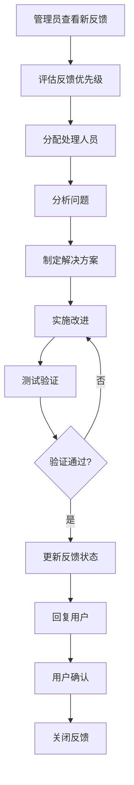

# 用户反馈系统原型设计

## 📋 设计概述

### 设计目标

创建直观、易用的用户反馈系统原型，提供优秀的用户体验，确保用户能够便捷地提交反馈并获得及时响应。

### 设计原则

- **简洁性**: 界面简洁明了，减少用户认知负担
- **易用性**: 操作流程简单，降低使用门槛
- **响应性**: 快速响应用户操作，提供即时反馈
- **一致性**: 保持界面风格和交互方式的一致性
- **可访问性**: 支持不同设备和用户群体的使用

## 🎨 界面原型设计

### 1. 反馈提交界面

#### 1.1 主界面布局

```text
┌─────────────────────────────────────────────────────────┐
│  FormalMath 用户反馈系统                                │
├─────────────────────────────────────────────────────────┤
│                                                         │
│  📝 提交反馈                                           │
│                                                         │
│  ┌─────────────────────────────────────────────────────┐ │
│  │ 反馈类型: [内容错误 ▼]                              │ │
│  │                                                     │ │
│  │ 相关文档: [选择文档 ▼]                              │ │
│  │                                                     │ │
│  │ 问题描述:                                           │ │
│  │ ┌─────────────────────────────────────────────────┐ │ │
│  │ │ 请详细描述您遇到的问题或建议...                 │ │ │
│  │ │                                                 │ │ │
│  │ │                                                 │ │ │
│  │ └─────────────────────────────────────────────────┘ │ │
│  │                                                     │ │
│  │ 严重程度: ⭐⭐⭐⭐⭐                                │ │
│  │                                                     │ │
│  │ 联系邮箱: [your.email@example.com]                 │ │
│  │                                                     │ │
│  │ 附件上传: [选择文件] (支持图片、PDF、文档)         │ │
│  │                                                     │ │
│  │ [提交反馈] [取消]                                   │ │
│  └─────────────────────────────────────────────────────┘ │
│                                                         │
└─────────────────────────────────────────────────────────┘
```

#### 1.2 反馈类型选择

**下拉菜单选项**:

- 内容错误 (数学公式错误、概念解释错误、实例错误)
- 功能建议 (新功能建议、功能改进建议)
- 用户体验 (界面问题、导航问题、阅读体验)
- 技术问题 (代码错误、形式化证明问题)
- 其他反馈

#### 1.3 文档选择器

**功能特性**:

- 搜索功能：支持关键词搜索文档
- 分类浏览：按数学领域分类浏览
- 最近访问：显示用户最近访问的文档
- 快速选择：常用文档快速选择

### 2. 反馈状态查询界面

#### 2.1 查询界面

```text
┌─────────────────────────────────────────────────────────┐
│  FormalMath 用户反馈系统                                │
├─────────────────────────────────────────────────────────┤
│                                                         │
│  🔍 查询反馈状态                                       │
│                                                         │
│  ┌─────────────────────────────────────────────────────┐ │
│  │ 查询方式:                                           │ │
│  │ ○ 反馈ID: [FB-2025-001]                            │ │
│  │ ○ 邮箱地址: [your.email@example.com]               │ │
│  │                                                     │ │
│  │ [查询状态]                                          │ │
│  └─────────────────────────────────────────────────────┘ │
│                                                         │
│  📊 我的反馈历史                                       │
│                                                         │
│  ┌─────────────────────────────────────────────────────┐ │
│  │ FB-2025-001 | 内容错误 | 处理中 | 2025-08-19       │ │
│  │ FB-2025-002 | 功能建议 | 已完成 | 2025-08-18       │ │
│  │ FB-2025-003 | 用户体验 | 待处理 | 2025-08-17       │ │
│  └─────────────────────────────────────────────────────┘ │
│                                                         │
└─────────────────────────────────────────────────────────┘
```

#### 2.2 反馈详情界面

```text
┌─────────────────────────────────────────────────────────┐
│  FormalMath 用户反馈系统                                │
├─────────────────────────────────────────────────────────┤
│                                                         │
│  📋 反馈详情 - FB-2025-001                             │
│                                                         │
│  ┌─────────────────────────────────────────────────────┐ │
│  │ 状态: 🟡 处理中                                     │ │
│  │ 提交时间: 2025-08-19 14:30                          │ │
│  │ 预计完成: 2025-08-21                                │ │
│  │                                                     │ │
│  │ 反馈内容:                                           │ │
│  │ 在集合论基础文档中，第3章第2节的公式有误...        │ │
│  │                                                     │ │
│  │ 处理进度:                                           │ │
│  │ ████████████████████░░ 80%                          │ │
│  │                                                     │ │
│  │ 最新回复:                                           │ │
│  │ 感谢您的反馈，我们正在核实并修正该问题...          │ │
│  │                                                     │ │
│  │ [查看完整对话] [添加补充]                           │ │
│  └─────────────────────────────────────────────────────┘ │
│                                                         │
└─────────────────────────────────────────────────────────┘
```

### 3. 管理后台界面

#### 3.1 反馈管理仪表板

```text
┌─────────────────────────────────────────────────────────┐
│  FormalMath 反馈管理系统                                │
├─────────────────────────────────────────────────────────┤
│                                                         │
│  📊 反馈概览                                           │
│                                                         │
│  ┌─────────────┐ ┌─────────────┐ ┌─────────────┐       │
│  │ 总反馈数    │ │ 待处理      │ │ 处理中      │       │
│  │ 1,234       │ │ 45          │ │ 23          │       │
│  └─────────────┘ └─────────────┘ └─────────────┘       │
│                                                         │
│  📈 反馈趋势                                           │
│  ┌─────────────────────────────────────────────────────┐ │
│  │                                                     │ │
│  │ 图表区域 (显示反馈量趋势)                           │ │
│  │                                                     │ │
│  └─────────────────────────────────────────────────────┘ │
│                                                         │
│  📋 最新反馈                                           │
│  ┌─────────────────────────────────────────────────────┐ │
│  │ FB-2025-001 | 内容错误 | 高 | 2025-08-19 14:30     │ │
│  │ FB-2025-002 | 功能建议 | 中 | 2025-08-19 13:15     │ │
│  │ FB-2025-003 | 用户体验 | 低 | 2025-08-19 12:45     │ │
│  └─────────────────────────────────────────────────────┘ │
│                                                         │
└─────────────────────────────────────────────────────────┘
```

#### 3.2 反馈处理界面

```text
┌─────────────────────────────────────────────────────────┐
│  FormalMath 反馈管理系统                                │
├─────────────────────────────────────────────────────────┤
│                                                         │
│  📝 处理反馈 - FB-2025-001                             │
│                                                         │
│  ┌─────────────────────────────────────────────────────┐ │
│  │ 反馈信息:                                           │ │
│  │ 类型: 内容错误                                      │ │
│  │ 文档: 集合论基础                                    │ │
│  │ 描述: 第3章第2节的公式有误...                      │ │
│  │                                                     │ │
│  │ 处理状态: [处理中 ▼]                                │ │
│  │ 优先级: [高 ▼]                                      │ │
│  │ 负责人: [张三 ▼]                                    │ │
│  │                                                     │ │
│  │ 处理记录:                                           │ │
│  │ ┌─────────────────────────────────────────────────┐ │ │
│  │ │ 2025-08-19 15:00 | 张三 | 开始处理              │ │ │
│  │ │ 2025-08-19 15:30 | 张三 | 已核实问题            │ │ │
│  │ └─────────────────────────────────────────────────┘ │ │
│  │                                                     │ │
│  │ 回复用户:                                           │ │
│  │ ┌─────────────────────────────────────────────────┐ │ │
│  │ │ 感谢您的反馈，我们正在修正该问题...             │ │ │
│  │ └─────────────────────────────────────────────────┘ │ │
│  │                                                     │ │
│  │ [保存] [发送回复] [关闭]                            │ │
│  └─────────────────────────────────────────────────────┘ │
│                                                         │
└─────────────────────────────────────────────────────────┘
```

## 🔄 交互流程设计

### 1. 反馈提交流程

```mermaid
graph TD
    A[用户访问反馈页面] --> B[选择反馈类型]
    B --> C[填写问题描述]
    C --> D[选择严重程度]
    D --> E[填写联系邮箱]
    E --> F[上传附件(可选)]
    F --> G[提交反馈]
    G --> H[系统验证]
    H --> I{验证通过?}
    I -->|是| J[保存反馈]
    I -->|否| K[显示错误信息]
    K --> C
    J --> L[发送确认邮件]
    L --> M[显示成功页面]
    M --> N[生成反馈ID]
```

### 2. 反馈处理流程



### 3. 状态查询流程

```mermaid
graph TD
    A[用户访问查询页面] --> B[选择查询方式]
    B --> C{查询方式}
    C -->|反馈ID| D[输入反馈ID]
    C -->|邮箱地址| E[输入邮箱地址]
    D --> F[系统查询]
    E --> F
    F --> G{查询结果}
    G -->|找到| H[显示反馈详情]
    G -->|未找到| I[显示错误信息]
    H --> J[查看处理进度]
    J --> K[查看回复记录]
    K --> L[添加补充信息(可选)]
```

## 🎯 用户体验设计

### 1. 响应式设计

#### 1.1 桌面端设计

- **布局**: 固定宽度，居中显示
- **字体**: 14-16px，确保可读性
- **间距**: 统一的内边距和外边距
- **颜色**: 使用项目统一的配色方案

#### 1.2 移动端适配

- **布局**: 流式布局，自适应屏幕宽度
- **字体**: 16px以上，确保触摸友好
- **按钮**: 44px最小高度，便于触摸操作
- **表单**: 垂直布局，减少横向滚动

### 2. 交互反馈

#### 2.1 即时反馈

- **输入验证**: 实时验证表单输入
- **状态提示**: 显示操作状态和进度
- **错误提示**: 清晰的错误信息和解决建议
- **成功确认**: 操作成功的明确确认

#### 2.2 加载状态

- **页面加载**: 显示加载动画
- **表单提交**: 禁用提交按钮，显示加载状态
- **数据查询**: 显示查询进度
- **文件上传**: 显示上传进度条

### 3. 可访问性设计

#### 3.1 键盘导航

- **Tab顺序**: 合理的Tab键导航顺序
- **快捷键**: 支持常用快捷键操作
- **焦点指示**: 清晰的焦点指示器

#### 3.2 屏幕阅读器支持

- **语义化标签**: 使用正确的HTML语义标签
- **ARIA属性**: 添加必要的ARIA属性
- **替代文本**: 为图片和图标提供替代文本

## 📱 移动端优化

### 1. 触摸优化

#### 1.1 触摸目标

- **按钮大小**: 最小44x44px
- **间距**: 按钮间最小8px间距
- **点击区域**: 扩大可点击区域

#### 1.2 手势支持

- **滑动**: 支持左右滑动切换
- **缩放**: 支持图片缩放查看
- **长按**: 支持长按显示上下文菜单

### 2. 性能优化

#### 2.1 加载优化

- **懒加载**: 图片和内容懒加载
- **压缩**: 资源压缩和优化
- **缓存**: 合理使用浏览器缓存

#### 2.2 网络优化

- **离线支持**: 支持离线查看已下载内容
- **断点续传**: 文件上传支持断点续传
- **网络检测**: 网络状态检测和提示

## 🎨 视觉设计规范

### 1. 色彩规范

#### 1.1 主色调

- **主色**: #1890ff (蓝色)
- **辅助色**: #52c41a (绿色)
- **警告色**: #faad14 (橙色)
- **错误色**: #f5222d (红色)

#### 1.2 中性色

- **文字主色**: #262626
- **文字次色**: #8c8c8c
- **边框色**: #d9d9d9
- **背景色**: #f5f5f5

### 2. 字体规范

#### 2.1 字体族

- **中文**: PingFang SC, Microsoft YaHei
- **英文**: -apple-system, BlinkMacSystemFont, Segoe UI

#### 2.2 字号规范

- **标题**: 20px, 18px, 16px
- **正文**: 14px
- **辅助文字**: 12px
- **注释**: 10px

### 3. 间距规范

#### 3.1 基础间距

- **8px**: 最小间距单位
- **16px**: 标准间距
- **24px**: 大间距
- **32px**: 超大间距

#### 3.2 组件间距

- **表单元素**: 16px
- **按钮组**: 8px
- **卡片内容**: 24px
- **页面边距**: 16px

## 📋 原型测试计划

### 1. 用户测试

#### 1.1 测试目标

- 验证界面易用性
- 评估操作流程合理性
- 收集用户改进建议
- 识别潜在问题

#### 1.2 测试方法

- **可用性测试**: 邀请用户完成特定任务
- **A/B测试**: 对比不同设计方案
- **眼动追踪**: 分析用户注意力分布
- **问卷调查**: 收集用户满意度数据

### 2. 技术测试

#### 2.1 功能测试

- 表单提交功能
- 文件上传功能
- 状态查询功能
- 邮件通知功能

#### 2.2 性能测试

- 页面加载速度
- 表单响应时间
- 并发用户处理能力
- 移动端性能表现

## 📊 成功指标

### 1. 用户体验指标

- **任务完成率**: > 90%
- **操作错误率**: < 5%
- **用户满意度**: > 4.0/5.0
- **平均操作时间**: < 2分钟

### 2. 技术性能指标

- **页面加载时间**: < 3秒
- **表单响应时间**: < 1秒
- **系统可用性**: > 99%
- **移动端兼容性**: 100%

---

**设计状态**: 用户反馈系统原型设计  
**制定日期**: 2025年8月19日  
**版本**: v1.0  
**负责人**: 用户体验设计团队

---

*本原型设计为FormalMath项目用户反馈系统提供了完整的界面和交互设计方案，确保系统具有良好的用户体验和易用性。*
