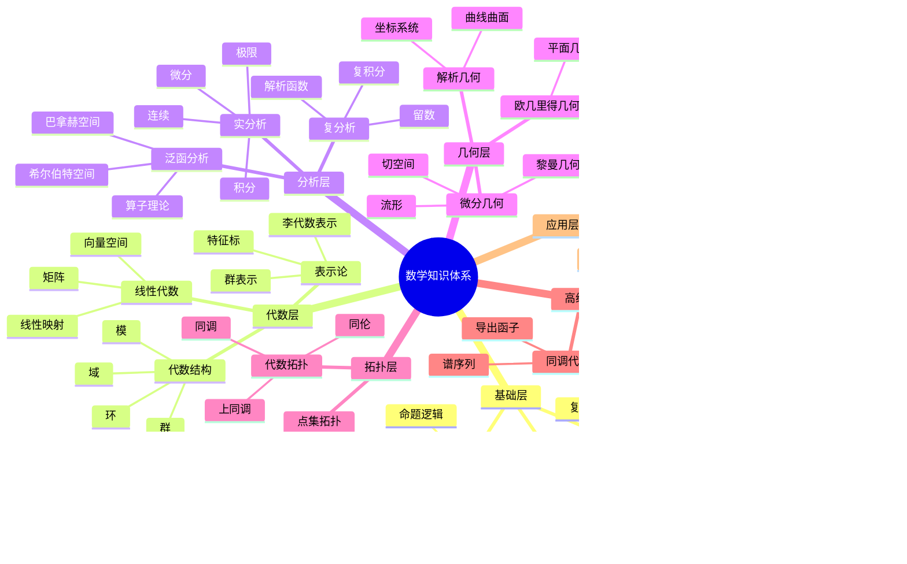

# 跨分支知识关联图谱

## 📋 概述

本文档提供FormalMath项目中各数学分支之间的知识关联图谱，通过思维导图和多维知识矩阵展示概念之间的跨分支联系。

**创建日期**: 2025年11月20日
**目标**: 建立完整的跨分支知识关联体系，帮助理解数学知识的整体结构

---

## 🗺️ 数学分支整体关联图

### 基础数学到高级数学的演进路径

### 数学分支关联思维导图

---

## 🔗 核心跨分支关联

### 1. 代数结构与拓扑学的关联

#### 关联思维导图

#### 知识矩阵：代数拓扑核心概念

| 代数概念 | 拓扑对应 | 构造方法 | 关键定理 | 应用 |
|---------|---------|---------|---------|------|
| 群 | 基本群π₁ | 道路同伦类 | 同伦不变性 | 流形分类 |
| 阿贝尔群 | 同调群Hₙ | 奇异同调 | 同调公理 | 拓扑不变量 |
| 环 | 上同调环H* | 杯积 | 上同调环结构 | 流形分类 |
| 模 | 局部系数系统 | 覆盖空间 | 局部系统上同调 | 纤维丛 |
| 链复形 | 奇异链复形 | 边界算子 | 同调长正合序列 | 计算同调 |

### 2. 代数结构与分析学的关联

#### 关联思维导图

#### 知识矩阵：代数分析核心概念

| 代数概念 | 分析对应 | 构造方法 | 关键定理 | 应用 |
|---------|---------|---------|---------|------|
| 李群 | 流形+群结构 | 指数映射 | 李群-李代数对应 | 对称性 |
| 群表示 | 函数空间 | 诱导表示 | 彼得-外尔定理 | 傅里叶分析 |
| C*代数 | 算子代数 | GNS构造 | 谱定理 | 量子力学 |
| 函数域 | 代数函数 | 黎曼-罗赫定理 | 函数域理论 | 数论 |

### 3. 代数结构与几何学的关联

#### 关联思维导图

#### 知识矩阵：代数几何核心概念

| 代数概念 | 几何对应 | 构造方法 | 关键定理 | 应用 |
|---------|---------|---------|---------|------|
| 交换环 | 仿射概形 | Spec构造 | 概形理论 | 代数簇 |
| 模 | 拟凝聚层 | 层化 | 层上同调 | 向量丛 |
| 域扩张 | 覆盖 | 基变换 | 伽罗瓦对应 | 分支覆盖 |
| 局部环 | 局部概形 | 局部化 | 局部性质 | 奇点理论 |

### 4. 分析学与几何学的关联

#### 关联思维导图

#### 知识矩阵：分析几何核心概念

| 分析概念 | 几何对应 | 构造方法 | 关键定理 | 应用 |
|---------|---------|---------|---------|------|
| 微分 | 切空间 | 切映射 | 链式法则 | 流形理论 |
| 积分 | 体积形式 | 定向积分 | 斯托克斯定理 | 流形积分 |
| 偏微分方程 | 几何流 | 几何演化 | 存在唯一性 | 几何分析 |
| 调和函数 | 调和形式 | 拉普拉斯算子 | 霍奇理论 | 几何不变量 |

---

## 📊 跨分支知识矩阵总览

### 主要分支关联强度矩阵

| 分支 | 基础数学 | 代数结构 | 分析学 | 几何学 | 拓扑学 | 数论 | 逻辑学 |
|-----|---------|---------|--------|--------|--------|------|--------|
| 基础数学 | - | ⭐⭐⭐⭐⭐ | ⭐⭐⭐⭐⭐ | ⭐⭐⭐⭐⭐ | ⭐⭐⭐⭐⭐ | ⭐⭐⭐⭐⭐ | ⭐⭐⭐⭐⭐ |
| 代数结构 | ⭐⭐⭐⭐⭐ | - | ⭐⭐⭐⭐ | ⭐⭐⭐⭐⭐ | ⭐⭐⭐⭐ | ⭐⭐⭐⭐ | ⭐⭐⭐ |
| 分析学 | ⭐⭐⭐⭐⭐ | ⭐⭐⭐⭐ | - | ⭐⭐⭐⭐⭐ | ⭐⭐⭐ | ⭐⭐⭐ | ⭐⭐ |
| 几何学 | ⭐⭐⭐⭐⭐ | ⭐⭐⭐⭐⭐ | ⭐⭐⭐⭐⭐ | - | ⭐⭐⭐⭐⭐ | ⭐⭐⭐ | ⭐⭐ |
| 拓扑学 | ⭐⭐⭐⭐⭐ | ⭐⭐⭐⭐ | ⭐⭐⭐ | ⭐⭐⭐⭐⭐ | - | ⭐⭐ | ⭐⭐ |
| 数论 | ⭐⭐⭐⭐⭐ | ⭐⭐⭐⭐ | ⭐⭐⭐ | ⭐⭐⭐ | ⭐⭐ | - | ⭐⭐⭐ |
| 逻辑学 | ⭐⭐⭐⭐⭐ | ⭐⭐⭐ | ⭐⭐ | ⭐⭐ | ⭐⭐ | ⭐⭐⭐ | - |

**图例**: ⭐⭐⭐⭐⭐ 极强关联 | ⭐⭐⭐⭐ 强关联 | ⭐⭐⭐ 中等关联 | ⭐⭐ 弱关联 | ⭐ 很弱关联

---

## 🎯 学习路径建议

### 跨分支学习路径

---

## 📚 参考文献

- 各分支的核心理论文档
- 跨分支应用分析文档
- 形式化实现文档

---

**创建日期**: 2025年11月20日
**维护者**: FormalMath项目组
**版本**: v1.0
