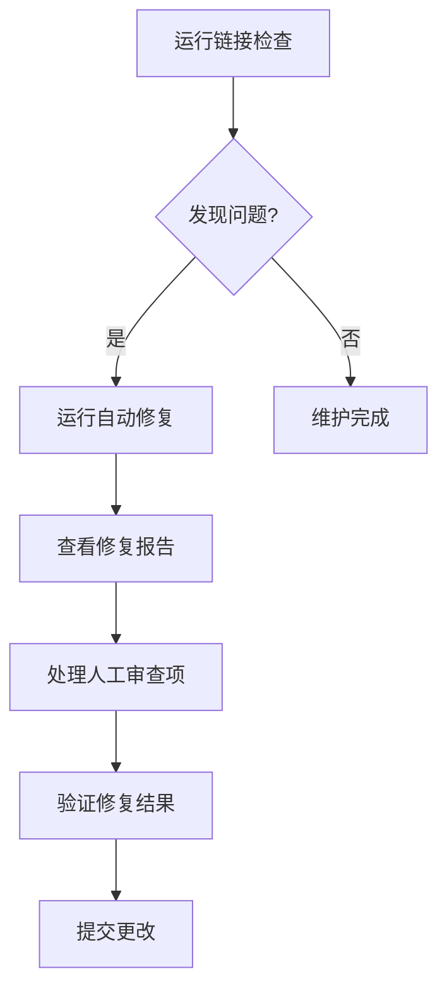

# FormalMath项目链接维护指南

本指南旨在帮助项目贡献者维护FormalMath项目中的链接完整性，确保文档间的引用关系准确有效。

---

## 目录

1. [链接系统概述](#链接系统概述)
2. [常见问题类型](#常见问题类型)
3. [维护工具使用](#维护工具使用)
4. [修复工作流程](#修复工作流程)
5. [最佳实践](#最佳实践)
6. [自动化集成](#自动化集成)
7. [故障排除](#故障排除)

---

## 链接系统概述

### 1.1 链接类型

FormalMath项目使用标准的Markdown链接格式：

```markdown
[链接文本](链接目标)
```

链接目标可以是以下类型：

| 类型 | 示例 | 说明 |
|------|------|------|
| 内部文件 | `./file.md` | 同一目录下的文件 |
| 内部文件 | `../other/file.md` | 相对路径的文件 |
| 目录 | `docs/` | 指向目录(推荐改为README.md) |
| 锚点 | `#section-name` | 当前文件的锚点 |
| 文件+锚点 | `file.md#anchor` | 跨文件锚点 |
| 外部链接 | `https://...` | 外部网站链接 |

### 1.2 锚点生成规则

GitHub/GitLab风格的锚点ID生成规则：

1. 转换为小写
2. 移除Markdown格式标记(`_*~`)
3. 移除特殊字符(保留字母、数字、空格、连字符)
4. 将空格替换为连字符
5. 移除首尾的连字符

**示例：**
```markdown
# 1. 概述
→ 锚点: #1-概述

## 严格定义 (Definition)
→ 锚点: #严格定义-definition

### 基础定义 {#basic-def}
→ 锚点: #basic-def (显式锚点优先)
```

---

## 常见问题类型

### 2.1 文件路径错误

#### 问题1: 目录链接
**错误示例：**
```markdown
[查看文档](docs/)
[项目根目录](.)
```

**正确写法：**
```markdown
[查看文档](./README.md)
[项目根目录](./README.md)
```

#### 问题2: 相对路径错误
**错误示例：**
```markdown
[相关文档](../../other/file.md)  // 路径层级错误
```

**正确写法：**
```markdown
[相关文档](../other/file.md)  // 根据实际位置调整
```

#### 问题3: 文件扩展名缺失
**错误示例：**
```markdown
[查看详情](filename)  // 缺少.md
```

**正确写法：**
```markdown
[查看详情](filename.md)
```

### 2.2 锚点错误

#### 问题1: 前导连字符
**错误示例：**
```markdown
[返回目录](#-目录)
```

**正确写法：**
```markdown
[返回目录](#目录)
```

#### 问题2: 大小写不匹配
**错误示例：**
```markdown
# 我的标题
...
[链接](#我的標題)  // 繁体"標"与简体"标"不同
```

**正确写法：**
```markdown
[链接](#我的标题)
```

#### 问题3: 特殊字符
**错误示例：**
```markdown
# 数学定义 (Math Definition)
...
[链接](#数学定义-(math-definition))  // 括号需要正确处理
```

**正确写法：**
```markdown
[链接](#数学定义-math-definition)
```

### 2.3 文件移动/重命名

当文件被移动或重命名时，原有链接会失效。

**预防措施：**
1. 移动文件时，同时更新所有引用该文件的链接
2. 使用 `grep` 搜索引用：
   ```bash
   grep -r "old-filename.md" --include="*.md" .
   ```

---

## 维护工具使用

### 3.1 链接检查工具 (link_checker.py)

#### 基本用法

```bash
# 检查当前目录
python tools/link_checker.py .

# 检查指定目录
python tools/link_checker.py /path/to/project
```

#### 输出说明

工具会生成两个报告文件：

1. `output/link_check_report.txt` - 文本格式报告
2. `output/link_check_report.json` - JSON格式详细报告

报告包含：
- 无效链接列表
- 问题类型分类
- 统计信息

### 3.2 链接修复工具 (link_fixer.py)

#### 基本用法

```bash
# 干运行模式(预览修复)
python tools/link_fixer.py

# 快速模式(仅处理高频问题)
python tools/link_fixer.py --quick

# 应用修复
python tools/link_fixer.py --apply

# 交互式确认
python tools/link_fixer.py --apply --interactive

# 完整模式(处理所有问题类型)
python tools/link_fixer.py --apply
```

#### 输出文件

1. `output/link_fix_report.md` - 修复报告
2. `output/link_fix_report.json` - JSON格式详细报告
3. `output/manual_review_report.md` - 需人工处理的问题报告

#### 修复策略

| 置信度 | 处理方式 |
|--------|----------|
| ≥90% | 自动应用修复 |
| 80-90% | 自动应用修复(可配置) |
| <80% | 需人工确认 |

---

## 修复工作流程

### 4.1 定期维护流程



### 4.2 新贡献者工作流

#### 提交前检查

1. **编写文档时**
   - 使用相对路径引用内部文件
   - 验证锚点名称正确
   - 避免使用目录链接

2. **提交前**
   ```bash
   # 检查自己的修改
   python tools/link_checker.py .
   
   # 如有问题，运行修复
   python tools/link_fixer.py --apply --quick
   ```

3. **创建PR时**
   - 在PR描述中注明"已检查链接"
   - 如修改了大量文件，附上链接检查报告

### 4.3 维护者审查流程

#### 审查链接相关PR

1. 检查PR是否包含链接修改
2. 如有可能影响链接的文件移动/重命名：
   ```bash
   # 检出PR分支
   git checkout pr-branch
   
   # 运行链接检查
   python tools/link_checker.py .
   ```
3. 确认无新增无效链接

---

## 最佳实践

### 5.1 链接编写规范

#### 推荐做法 ✅

```markdown
<!-- 使用相对路径 -->
[查看详情](../concept/README.md)

<!-- 明确指定文件名 -->
[术语表](./../00-标准术语表-8语言.md)

<!-- 使用简洁的锚点 -->
## 概述
[跳转到概述](#概述)

<!-- 跨文件锚点 -->
[查看相关概念](other-file.md#相关概念)
```

#### 避免做法 ❌

```markdown
<!-- 不要使用目录链接 -->
[查看文档](docs/)

<!-- 不要省略扩展名 -->
[查看文件](filename)

<!-- 避免复杂锚点 -->
## 1. 概述 (Overview) - 重要！
[链接](#1-概述-overview-重要)  // 难以维护

<!-- 避免过长的锚点 -->
[链接](#这是一个非常长的锚点名称包含很多信息难以阅读和维护)
```

### 5.2 文件组织规范

1. **目录结构稳定**
   - 避免频繁移动文件
   - 建立清晰的目录层级

2. **使用索引文件**
   - 每个主要目录应包含README.md
   - 作为目录链接的目标

3. **命名一致性**
   - 使用统一的命名规范
   - 避免文件名重复

### 5.3 锚点命名规范

1. **使用简短、描述性的名称**
   ```markdown
   ## 基本概念
   → #基本概念
   
   ### 严格定义
   → #严格定义
   ```

2. **避免特殊字符**
   - 不使用括号、引号等
   - 中英文混用时注意空格

3. **显式锚点(可选)**
   ```markdown
   ## 概述 {#overview}
   ```

---

## 自动化集成

### 6.1 GitHub Actions 集成

创建 `.github/workflows/link-check.yml`：

```yaml
name: Link Check

on:
  push:
    branches: [main, master]
  pull_request:
    branches: [main, master]
  schedule:
    # 每周一凌晨运行
    - cron: '0 0 * * 1'

jobs:
  check-links:
    runs-on: ubuntu-latest
    steps:
      - uses: actions/checkout@v3
      
      - name: Set up Python
        uses: actions/setup-python@v4
        with:
          python-version: '3.10'
      
      - name: Check Links
        run: |
          python tools/link_checker.py .
          if [ $? -ne 0 ]; then
            echo "::error::发现无效链接，请查看报告"
            exit 1
          fi
      
      - name: Upload Report
        if: failure()
        uses: actions/upload-artifact@v3
        with:
          name: link-check-report
          path: output/link_check_report.txt
```

### 6.2 Pre-commit Hook

创建 `.pre-commit-hooks/check-links.sh`：

```bash
#!/bin/bash
# 检查修改的Markdown文件中的链接

CHANGED_MD=$(git diff --cached --name-only --diff-filter=ACM | grep '\.md$' || true)

if [ -z "$CHANGED_MD" ]; then
    exit 0
fi

python tools/link_checker.py . --files $CHANGED_MD
exit $?
```

配置 `.pre-commit-config.yaml`：

```yaml
repos:
  - repo: local
    hooks:
      - id: check-links
        name: Check Markdown Links
        entry: .pre-commit-hooks/check-links.sh
        language: script
        files: \.md$
```

### 6.3 VS Code 任务配置

在 `.vscode/tasks.json` 中添加：

```json
{
  "version": "2.0.0",
  "tasks": [
    {
      "label": "Check Links",
      "type": "shell",
      "command": "python tools/link_checker.py .",
      "group": "test",
      "presentation": {
        "reveal": "always"
      }
    },
    {
      "label": "Fix Links (Preview)",
      "type": "shell",
      "command": "python tools/link_fixer.py --quick",
      "group": "build"
    },
    {
      "label": "Fix Links (Apply)",
      "type": "shell",
      "command": "python tools/link_fixer.py --apply --quick",
      "group": "build"
    }
  ]
}
```

---

## 故障排除

### 7.1 常见问题

#### Q1: 链接检查工具运行缓慢

**解决方案：**
```bash
# 仅检查特定目录
python tools/link_checker.py ./docs

# 或使用快速模式修复
python tools/link_fixer.py --quick
```

#### Q2: 误报外部链接

**说明：** 工具会跳过以 `http://`、`https://` 等开头的链接。如果外部链接被误报，请检查链接格式。

#### Q3: 修复后链接仍然无效

**可能原因：**
1. 目标文件确实不存在
2. 修复建议不正确
3. 存在多个问题叠加

**解决方案：**
1. 手动检查目标文件是否存在
2. 查看 `output/manual_review_report.md`
3. 使用 `--interactive` 模式逐条确认

### 7.2 工具错误

#### 错误："报告文件不存在"

**原因：** 需要先运行链接检查

**解决：**
```bash
python tools/link_checker.py .
python tools/link_fixer.py --apply
```

#### 错误：编码问题

**解决：** 工具已处理常见编码问题。如仍有问题，请确保文件使用UTF-8编码。

### 7.3 报告解读

#### link_check_report.txt

```
无效链接 (XXX 个):
- 文件路径: [broken anchor] #锚点名称
```

- `broken file` - 目标文件不存在
- `broken anchor` - 锚点不存在
- `empty link` - 链接目标为空

#### link_fix_report.md

查看以下部分：
- **统计摘要** - 整体修复情况
- **高置信度自动修复** - 自动应用的修复
- **需手动处理的问题** - 需要人工干预的链接

---

## 附录

### A. 快速参考

```bash
# 完整检查
python tools/link_checker.py .

# 快速修复预览
python tools/link_fixer.py --quick

# 应用快速修复
python tools/link_fixer.py --apply --quick

# 交互式修复
python tools/link_fixer.py --apply --interactive

# 仅检查特定目录
python tools/link_checker.py ./docs
```

### B. 相关文档

- [00-链接修复完成报告.md](../00-链接修复完成报告.md) - 最新修复报告
- `output/link_check_report.txt` - 链接检查报告
- `output/manual_review_report.md` - 需人工处理的问题

### C. 联系方式

如发现工具问题或有改进建议，请：
1. 提交Issue到项目仓库
2. 在PR中描述问题和解决方案

---

**文档版本:** 1.0  
**最后更新:** 2026年4月5日  
**维护者:** FormalMath项目团队
