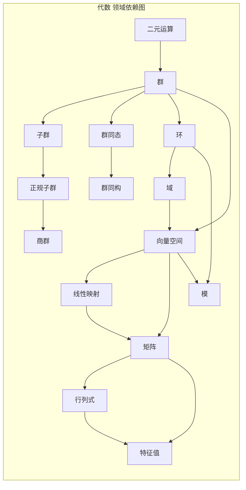

# 代数 领域依赖图

```mermaid
graph TD
    subgraph 代数[代数 领域依赖图]
        direction TB
        C016["二元运算"]
        C017["群"]
        C018["子群"]
        C019["正规子群"]
        C020["商群"]
        C021["群同态"]
        C022["群同构"]
        C023["环"]
        C024["域"]
        C025["向量空间"]
        C026["线性映射"]
        C027["矩阵"]
        C028["行列式"]
        C029["特征值"]
        C030["模"]
        C016 --> C017
        C017 --> C018
        C017 --> C021
        C017 --> C023
        C017 --> C025
        C018 --> C019
        C019 --> C020
        C021 --> C022
        C023 --> C024
        C023 --> C030
        C024 --> C025
        C025 --> C026
        C025 --> C027
        C025 --> C030
        C026 --> C027
        C027 --> C028
        C027 --> C029
        C028 --> C029
    end
```