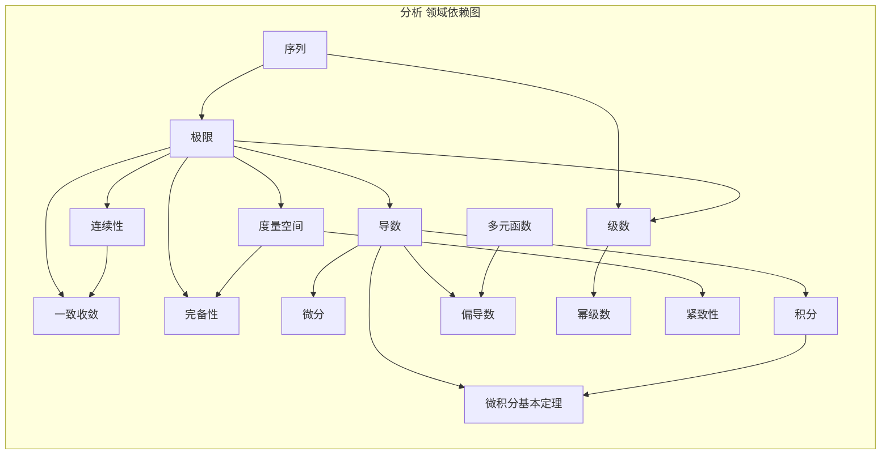

# 分析 领域依赖图

```mermaid
graph TD
    subgraph 分析[分析 领域依赖图]
        direction TB
        C031["序列"]
        C032["极限"]
        C033["连续性"]
        C034["导数"]
        C035["微分"]
        C036["积分"]
        C037["微积分基本定理"]
        C038["级数"]
        C039["幂级数"]
        C040["一致收敛"]
        C041["度量空间"]
        C042["完备性"]
        C043["紧致性"]
        C044["多元函数"]
        C045["偏导数"]
        C031 --> C032
        C031 --> C038
        C032 --> C033
        C032 --> C034
        C032 --> C038
        C032 --> C040
        C032 --> C041
        C032 --> C042
        C034 --> C035
        C034 --> C036
        C034 --> C037
        C034 --> C045
        C036 --> C037
        C038 --> C039
        C033 --> C040
        C041 --> C042
        C041 --> C043
        C044 --> C045
    end
```