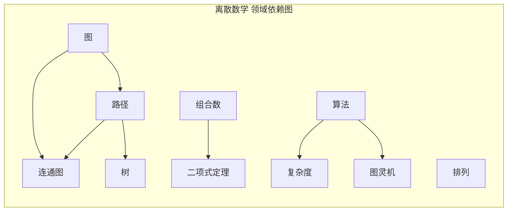

# 离散数学 领域依赖图

```mermaid
graph TD
    subgraph 离散数学[离散数学 领域依赖图]
        direction TB
        C081["图"]
        C082["路径"]
        C083["树"]
        C084["连通图"]
        C085["组合数"]
        C086["排列"]
        C087["二项式定理"]
        C088["算法"]
        C089["复杂度"]
        C090["图灵机"]
        C081 --> C082
        C081 --> C084
        C082 --> C083
        C082 --> C084
        C085 --> C087
        C088 --> C089
        C088 --> C090
    end
```