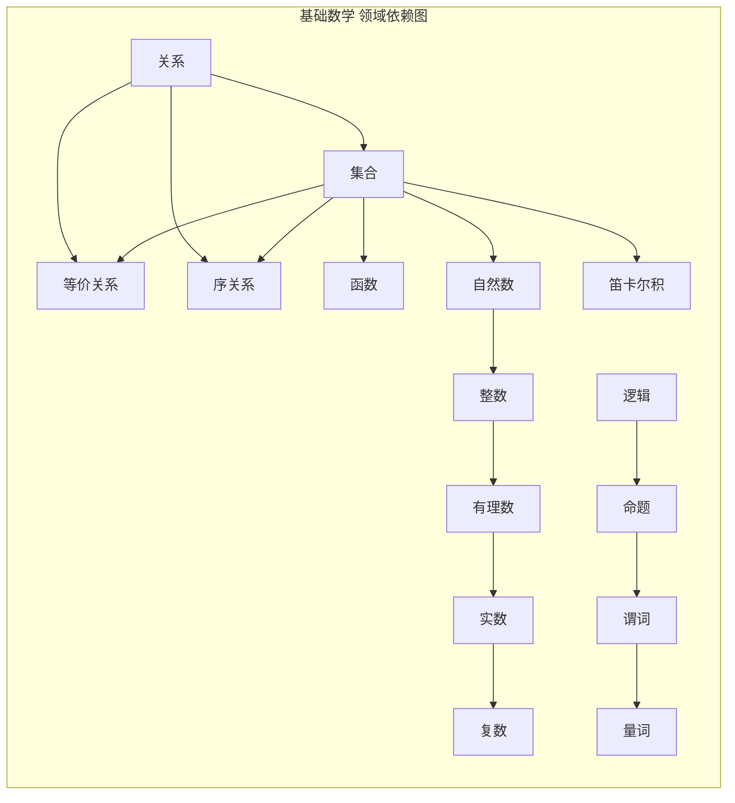

# 基础数学 领域依赖图

```mermaid
graph TD
    subgraph 基础数学[基础数学 领域依赖图]
        direction TB
        C001["关系"]
        C002["集合"]
        C003["函数"]
        C004["自然数"]
        C005["整数"]
        C006["有理数"]
        C007["实数"]
        C008["复数"]
        C009["逻辑"]
        C010["命题"]
        C011["谓词"]
        C012["量词"]
        C013["等价关系"]
        C014["序关系"]
        C015["笛卡尔积"]
        C001 --> C002
        C001 --> C013
        C001 --> C014
        C002 --> C003
        C002 --> C004
        C002 --> C013
        C002 --> C014
        C002 --> C015
        C004 --> C005
        C005 --> C006
        C006 --> C007
        C007 --> C008
        C009 --> C010
        C010 --> C011
        C011 --> C012
    end
```