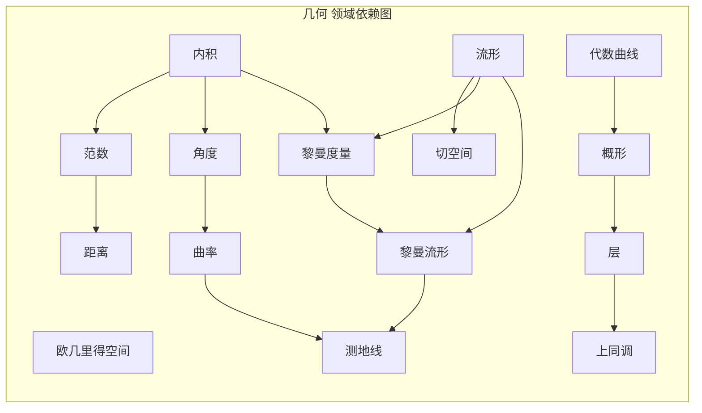

# 几何 领域依赖图

```mermaid
graph TD
    subgraph 几何[几何 领域依赖图]
        direction TB
        C046["欧几里得空间"]
        C047["内积"]
        C048["范数"]
        C049["距离"]
        C050["角度"]
        C051["曲率"]
        C052["流形"]
        C053["切空间"]
        C054["黎曼度量"]
        C055["黎曼流形"]
        C056["测地线"]
        C057["代数曲线"]
        C058["概形"]
        C059["层"]
        C060["上同调"]
        C047 --> C048
        C047 --> C050
        C047 --> C054
        C048 --> C049
        C050 --> C051
        C052 --> C053
        C052 --> C054
        C052 --> C055
        C054 --> C055
        C055 --> C056
        C051 --> C056
        C057 --> C058
        C058 --> C059
        C059 --> C060
    end
```