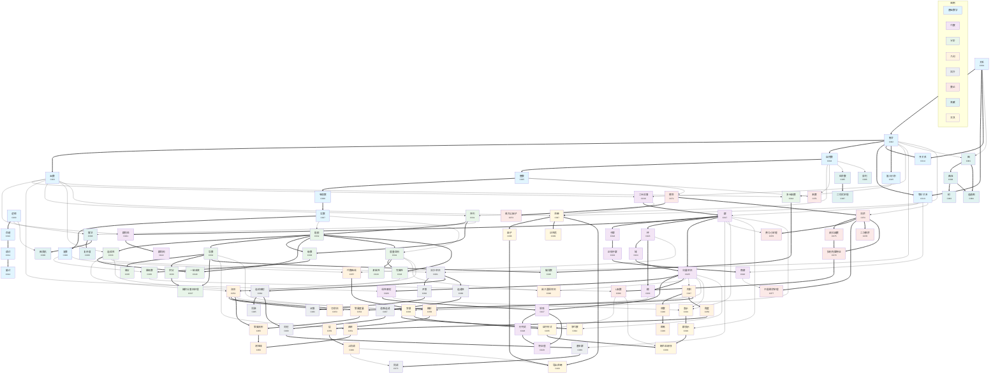

# 全局概念依赖图

```mermaid
graph TD
    C001["关系<br/><small>C001</small>"]
    style C001 fill:#E1F5FE
    C002["集合<br/><small>C002</small>"]
    style C002 fill:#E1F5FE
    C003["函数<br/><small>C003</small>"]
    style C003 fill:#E1F5FE
    C004["自然数<br/><small>C004</small>"]
    style C004 fill:#E1F5FE
    C005["整数<br/><small>C005</small>"]
    style C005 fill:#E1F5FE
    C006["有理数<br/><small>C006</small>"]
    style C006 fill:#E1F5FE
    C007["实数<br/><small>C007</small>"]
    style C007 fill:#E1F5FE
    C008["复数<br/><small>C008</small>"]
    style C008 fill:#E1F5FE
    C009["逻辑<br/><small>C009</small>"]
    style C009 fill:#E1F5FE
    C010["命题<br/><small>C010</small>"]
    style C010 fill:#E1F5FE
    C011["谓词<br/><small>C011</small>"]
    style C011 fill:#E1F5FE
    C012["量词<br/><small>C012</small>"]
    style C012 fill:#E1F5FE
    C013["等价关系<br/><small>C013</small>"]
    style C013 fill:#E1F5FE
    C014["序关系<br/><small>C014</small>"]
    style C014 fill:#E1F5FE
    C015["笛卡尔积<br/><small>C015</small>"]
    style C015 fill:#E1F5FE
    C016["二元运算<br/><small>C016</small>"]
    style C016 fill:#F3E5F5
    C017["群<br/><small>C017</small>"]
    style C017 fill:#F3E5F5
    C018["子群<br/><small>C018</small>"]
    style C018 fill:#F3E5F5
    C019["正规子群<br/><small>C019</small>"]
    style C019 fill:#F3E5F5
    C020["商群<br/><small>C020</small>"]
    style C020 fill:#F3E5F5
    C021["群同态<br/><small>C021</small>"]
    style C021 fill:#F3E5F5
    C022["群同构<br/><small>C022</small>"]
    style C022 fill:#F3E5F5
    C023["环<br/><small>C023</small>"]
    style C023 fill:#F3E5F5
    C024["域<br/><small>C024</small>"]
    style C024 fill:#F3E5F5
    C025["向量空间<br/><small>C025</small>"]
    style C025 fill:#F3E5F5
    C026["线性映射<br/><small>C026</small>"]
    style C026 fill:#F3E5F5
    C027["矩阵<br/><small>C027</small>"]
    style C027 fill:#F3E5F5
    C028["行列式<br/><small>C028</small>"]
    style C028 fill:#F3E5F5
    C029["特征值<br/><small>C029</small>"]
    style C029 fill:#F3E5F5
    C030["模<br/><small>C030</small>"]
    style C030 fill:#F3E5F5
    C031["序列<br/><small>C031</small>"]
    style C031 fill:#E8F5E9
    C032["极限<br/><small>C032</small>"]
    style C032 fill:#E8F5E9
    C033["连续性<br/><small>C033</small>"]
    style C033 fill:#E8F5E9
    C034["导数<br/><small>C034</small>"]
    style C034 fill:#E8F5E9
    C035["微分<br/><small>C035</small>"]
    style C035 fill:#E8F5E9
    C036["积分<br/><small>C036</small>"]
    style C036 fill:#E8F5E9
    C037["微积分基本定理<br/><small>C037</small>"]
    style C037 fill:#E8F5E9
    C038["级数<br/><small>C038</small>"]
    style C038 fill:#E8F5E9
    C039["幂级数<br/><small>C039</small>"]
    style C039 fill:#E8F5E9
    C040["一致收敛<br/><small>C040</small>"]
    style C040 fill:#E8F5E9
    C041["度量空间<br/><small>C041</small>"]
    style C041 fill:#E8F5E9
    C042["完备性<br/><small>C042</small>"]
    style C042 fill:#E8F5E9
    C043["紧致性<br/><small>C043</small>"]
    style C043 fill:#E8F5E9
    C044["多元函数<br/><small>C044</small>"]
    style C044 fill:#E8F5E9
    C045["偏导数<br/><small>C045</small>"]
    style C045 fill:#E8F5E9
    C046["欧几里得空间<br/><small>C046</small>"]
    style C046 fill:#FFF3E0
    C047["内积<br/><small>C047</small>"]
    style C047 fill:#FFF3E0
    C048["范数<br/><small>C048</small>"]
    style C048 fill:#FFF3E0
    C049["距离<br/><small>C049</small>"]
    style C049 fill:#FFF3E0
    C050["角度<br/><small>C050</small>"]
    style C050 fill:#FFF3E0
    C051["曲率<br/><small>C051</small>"]
    style C051 fill:#FFF3E0
    C052["流形<br/><small>C052</small>"]
    style C052 fill:#FFF3E0
    C053["切空间<br/><small>C053</small>"]
    style C053 fill:#FFF3E0
    C054["黎曼度量<br/><small>C054</small>"]
    style C054 fill:#FFF3E0
    C055["黎曼流形<br/><small>C055</small>"]
    style C055 fill:#FFF3E0
    C056["测地线<br/><small>C056</small>"]
    style C056 fill:#FFF3E0
    C057["代数曲线<br/><small>C057</small>"]
    style C057 fill:#FFF3E0
    C058["概形<br/><small>C058</small>"]
    style C058 fill:#FFF3E0
    C059["层<br/><small>C059</small>"]
    style C059 fill:#FFF3E0
    C060["上同调<br/><small>C060</small>"]
    style C060 fill:#FFF3E0
    C061["拓扑空间<br/><small>C061</small>"]
    style C061 fill:#ECEFF1
    C062["开集<br/><small>C062</small>"]
    style C062 fill:#ECEFF1
    C063["闭集<br/><small>C063</small>"]
    style C063 fill:#ECEFF1
    C064["连续映射<br/><small>C064</small>"]
    style C064 fill:#ECEFF1
    C065["同胚<br/><small>C065</small>"]
    style C065 fill:#ECEFF1
    C066["连通性<br/><small>C066</small>"]
    style C066 fill:#ECEFF1
    C067["道路连通<br/><small>C067</small>"]
    style C067 fill:#ECEFF1
    C068["同伦<br/><small>C068</small>"]
    style C068 fill:#ECEFF1
    C069["基本群<br/><small>C069</small>"]
    style C069 fill:#ECEFF1
    C070["同调<br/><small>C070</small>"]
    style C070 fill:#ECEFF1
    C071["素数<br/><small>C071</small>"]
    style C071 fill:#FBE9E7
    C072["整除<br/><small>C072</small>"]
    style C072 fill:#FBE9E7
    C073["最大公因子<br/><small>C073</small>"]
    style C073 fill:#FBE9E7
    C074["同余<br/><small>C074</small>"]
    style C074 fill:#FBE9E7
    C075["欧拉函数<br/><small>C075</small>"]
    style C075 fill:#FBE9E7
    C076["费马小定理<br/><small>C076</small>"]
    style C076 fill:#FBE9E7
    C077["中国剩余定理<br/><small>C077</small>"]
    style C077 fill:#FBE9E7
    C078["二次剩余<br/><small>C078</small>"]
    style C078 fill:#FBE9E7
    C079["狄利克雷特征<br/><small>C079</small>"]
    style C079 fill:#FBE9E7
    C080["L函数<br/><small>C080</small>"]
    style C080 fill:#FBE9E7
    C081["图<br/><small>C081</small>"]
    style C081 fill:#E0F2F1
    C082["路径<br/><small>C082</small>"]
    style C082 fill:#E0F2F1
    C083["树<br/><small>C083</small>"]
    style C083 fill:#E0F2F1
    C084["连通图<br/><small>C084</small>"]
    style C084 fill:#E0F2F1
    C085["组合数<br/><small>C085</small>"]
    style C085 fill:#E0F2F1
    C086["排列<br/><small>C086</small>"]
    style C086 fill:#E0F2F1
    C087["二项式定理<br/><small>C087</small>"]
    style C087 fill:#E0F2F1
    C088["算法<br/><small>C088</small>"]
    style C088 fill:#E0F2F1
    C089["复杂度<br/><small>C089</small>"]
    style C089 fill:#E0F2F1
    C090["图灵机<br/><small>C090</small>"]
    style C090 fill:#E0F2F1
    C091["表示<br/><small>C091</small>"]
    style C091 fill:#FFF8E1
    C092["群表示<br/><small>C092</small>"]
    style C092 fill:#FFF8E1
    C093["李群<br/><small>C093</small>"]
    style C093 fill:#FFF8E1
    C094["李代数<br/><small>C094</small>"]
    style C094 fill:#FFF8E1
    C095["自守形式<br/><small>C095</small>"]
    style C095 fill:#FFF8E1
    C096["朗兰兹纲领<br/><small>C096</small>"]
    style C096 fill:#FFF8E1
    C097["范畴<br/><small>C097</small>"]
    style C097 fill:#FFF8E1
    C098["函子<br/><small>C098</small>"]
    style C098 fill:#FFF8E1
    C099["泛性质<br/><small>C099</small>"]
    style C099 fill:#FFF8E1
    C100["导出范畴<br/><small>C100</small>"]
    style C100 fill:#FFF8E1
    C001 ==> C002
    C001 ==> C013
    C001 ==> C014
    C001 --> C081
    C002 ==> C003
    C002 ==> C004
    C002 ==> C013
    C002 ==> C014
    C002 ==> C015
    C002 --> C016
    C002 --> C061
    C002 --> C081
    C002 --> C097
    C004 ==> C005
    C004 --> C031
    C004 --> C071
    C004 --> C085
    C004 --> C086
    C005 ==> C006
    C005 --> C071
    C005 --> C072
    C006 ==> C007
    C007 ==> C008
    C007 --> C032
    C007 --> C041
    C009 ==> C010
    C009 --> C088
    C009 --> C090
    C010 ==> C011
    C011 ==> C012
    C003 --> C016
    C003 --> C021
    C003 --> C026
    C003 --> C031
    C003 --> C033
    C003 --> C044
    C003 --> C097
    C016 ==> C017
    C016 --> C097
    C013 --> C017
    C013 --> C020
    C013 --> C074
    C017 ==> C018
    C017 ==> C021
    C017 ==> C023
    C017 ==> C025
    C017 --> C069
    C017 --> C076
    C017 --> C091
    C017 --> C092
    C017 --> C093
    C018 ==> C019
    C019 ==> C020
    C021 ==> C022
    C023 ==> C024
    C023 ==> C030
    C023 --> C057
    C024 ==> C025
    C025 ==> C026
    C025 ==> C027
    C025 ==> C030
    C025 --> C046
    C025 --> C047
    C025 --> C053
    C025 --> C091
    C025 --> C094
    C026 ==> C027
    C026 --> C091
    C027 ==> C028
    C027 ==> C029
    C028 ==> C029
    C031 ==> C032
    C031 ==> C038
    C031 --> C088
    C032 ==> C033
    C032 ==> C034
    C032 ==> C038
    C032 ==> C040
    C032 ==> C041
    C032 ==> C042
    C034 ==> C035
    C034 ==> C036
    C034 ==> C037
    C034 ==> C045
    C034 --> C051
    C034 --> C093
    C036 ==> C037
    C038 ==> C039
    C008 --> C039
    C008 --> C057
    C033 ==> C040
    C033 --> C052
    C033 --> C061
    C033 --> C064
    C041 ==> C042
    C041 ==> C043
    C041 --> C046
    C041 --> C052
    C015 --> C044
    C044 ==> C045
    C047 ==> C048
    C047 ==> C050
    C047 ==> C054
    C048 ==> C049
    C050 ==> C051
    C042 --> C052
    C052 ==> C053
    C052 ==> C054
    C052 ==> C055
    C052 --> C093
    C054 ==> C055
    C055 ==> C056
    C051 ==> C056
    C057 ==> C058
    C030 --> C058
    C058 ==> C059
    C059 ==> C060
    C061 ==> C062
    C061 ==> C064
    C061 ==> C066
    C062 ==> C063
    C064 ==> C065
    C064 ==> C068
    C066 ==> C067
    C067 ==> C068
    C068 ==> C069
    C069 ==> C070
    C060 --> C070
    C060 --> C100
    C072 ==> C073
    C072 ==> C074
    C074 ==> C075
    C074 ==> C076
    C074 ==> C077
    C074 ==> C078
    C074 ==> C079
    C020 --> C077
    C075 ==> C079
    C079 ==> C080
    C039 --> C080
    C081 ==> C082
    C081 ==> C084
    C082 ==> C083
    C082 ==> C084
    C085 ==> C087
    C088 ==> C089
    C088 ==> C090
    C091 ==> C092
    C093 ==> C094
    C093 ==> C095
    C080 --> C095
    C080 --> C096
    C092 ==> C096
    C095 ==> C096
    C097 ==> C098
    C097 ==> C099
    C097 ==> C100
    C098 ==> C100

    subgraph Legend[图例]
        direction LR
        L1[基础数学]:::foundation
        L2[代数]:::algebra
        L3[分析]:::analysis
        L4[几何]:::geometry
        L5[拓扑]:::topology
        L6[数论]:::numbertheory
        L7[离散]:::discrete
        L8[交叉]:::interdisciplinary
    end

    classDef foundation fill:#E1F5FE
    classDef algebra fill:#F3E5F5
    classDef analysis fill:#E8F5E9
    classDef geometry fill:#FFF3E0
    classDef topology fill:#ECEFF1
    classDef numbertheory fill:#FBE9E7
    classDef discrete fill:#E0F2F1
    classDef interdisciplinary fill:#FFF8E1
    classDef highlight stroke:#FF5722,stroke-width:3px
```