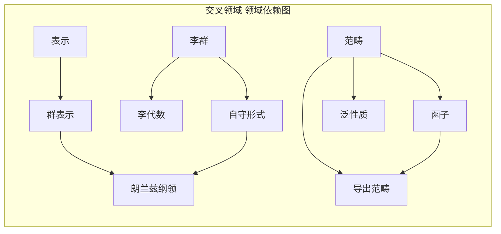

# 交叉领域 领域依赖图

```mermaid
graph TD
    subgraph 交叉领域[交叉领域 领域依赖图]
        direction TB
        C091["表示"]
        C092["群表示"]
        C093["李群"]
        C094["李代数"]
        C095["自守形式"]
        C096["朗兰兹纲领"]
        C097["范畴"]
        C098["函子"]
        C099["泛性质"]
        C100["导出范畴"]
        C091 --> C092
        C093 --> C094
        C093 --> C095
        C092 --> C096
        C095 --> C096
        C097 --> C098
        C097 --> C099
        C097 --> C100
        C098 --> C100
    end
```