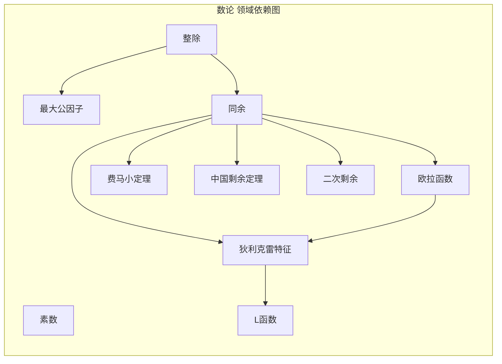

# 数论 领域依赖图

```mermaid
graph TD
    subgraph 数论[数论 领域依赖图]
        direction TB
        C071["素数"]
        C072["整除"]
        C073["最大公因子"]
        C074["同余"]
        C075["欧拉函数"]
        C076["费马小定理"]
        C077["中国剩余定理"]
        C078["二次剩余"]
        C079["狄利克雷特征"]
        C080["L函数"]
        C072 --> C073
        C072 --> C074
        C074 --> C075
        C074 --> C076
        C074 --> C077
        C074 --> C078
        C074 --> C079
        C075 --> C079
        C079 --> C080
    end
```