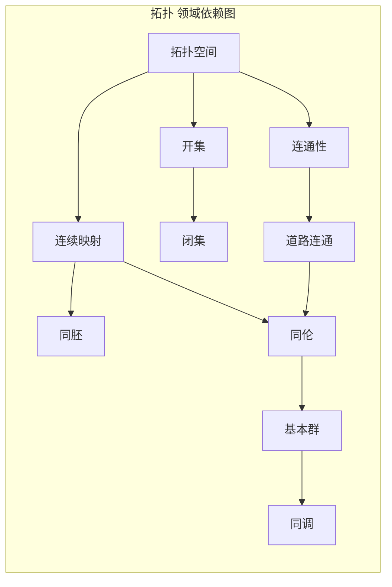

# 拓扑 领域依赖图

```mermaid
graph TD
    subgraph 拓扑[拓扑 领域依赖图]
        direction TB
        C061["拓扑空间"]
        C062["开集"]
        C063["闭集"]
        C064["连续映射"]
        C065["同胚"]
        C066["连通性"]
        C067["道路连通"]
        C068["同伦"]
        C069["基本群"]
        C070["同调"]
        C061 --> C062
        C061 --> C064
        C061 --> C066
        C062 --> C063
        C064 --> C065
        C064 --> C068
        C066 --> C067
        C067 --> C068
        C068 --> C069
        C069 --> C070
    end
```