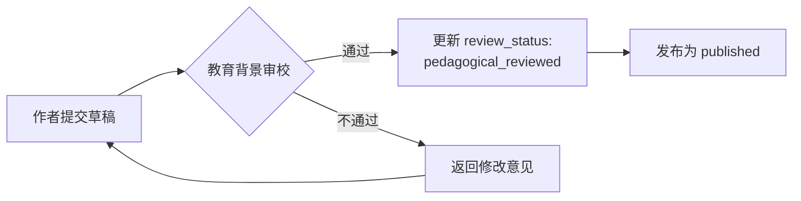
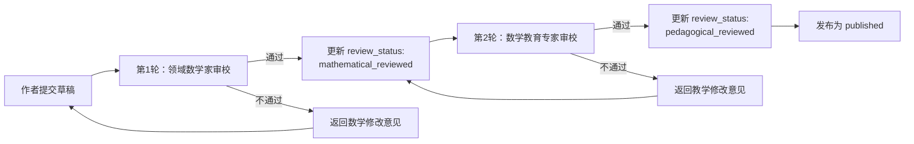
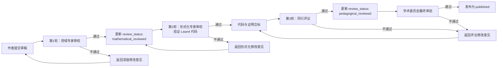

# FormalMath 三层内容标准 v2.0

> **任务编号**：P1-T6
> **生效日期**：2026-04-17
> **适用范围**：`e:\_src\FormalMath` 项目全部新建与重构文档
> **替代文件**：此前所有关于内容分级、质量 KPI 及审稿流程的旧版文档

---

## 引言

针对项目当前被反馈的“铜层注水膨胀、银层和金层缺失”问题，本标准建立铜（Copper）/银（Silver）/金（Gold）三层内容生产与质量控制体系。三层标准分别对应不同的目标人群、内容深度、审稿要求与产出策略，确保资源投入与学术产出的精确匹配。

---

## 1. 三层定义

### 1.1 铜层（基础概念层 / Copper）

| 维度 | 标准 |
|------|------|
| **目标人群** | 高中生 / 大一学生 |
| **内容特征** | 直观解释、多表征方式（图形/实例/自然语言）、常见误区辨析、基础定义 |
| **对标质量** | Wikipedia 高质量数学条目、Math StackExchange 高赞回答 |
| **形式要求** | 无需给出完整形式化证明，但所有定义必须准确、无歧义；鼓励使用图示与具体数值示例 |
| **字数参考** | 1,000 – 3,000 字 |
| **审稿要求** | 1 轮教育背景审校（具备数学教育或本科低年级教学经验者） |

**核心原则**：铜层是“引桥”，不是“终点”。其任务是消除先修知识障碍，为银层课程铺垫，而非追求自身的广度扩张。

---

### 1.2 银层（本科核心课程层 / Silver）

| 维度 | 标准 |
|------|------|
| **目标人群** | 大二至大四本科生 / 研究生低年级 |
| **内容特征** | 严格定义、完整定理证明链条、典型例题、习题及详细解答、常见错误模式分析 |
| **对标质量** | MIT OCW Lecture Notes、Harvard / Princeton 本科高年级讲义 |
| **形式要求** | 每个核心定理必须有自然语言完整证明（不得跳过关键步骤）；每章配套 ≥10 道习题及完整解答 |
| **字数参考** | 5,000 – 15,000 字 / 章 |
| **审稿要求** | 2 轮审校（第 1 轮：领域数学家；第 2 轮：数学教育专家） |
| **特别要求** | 优先覆盖 5 门核心课程——MIT 18.100A（实分析）、MIT 18.701（抽象代数）、MIT 18.06（线性代数）、Harvard Math 232br（代数几何引论）、Stanford FOAG（基础代数几何） |

**核心原则**：银层是未来 12 个月的**重点攻坚区域**。银层的充实程度直接决定项目能否被本科高年级学生和自学者视为可信赖的核心学习资源。

---

### 1.3 金层（研究级专题层 / Gold）

| 维度 | 标准 |
|------|------|
| **目标人群** | 研究生 / 研究人员 |
| **内容特征** | 前沿专题、严格证明、原始文献直接引用、形式化代码深度嵌入、与国际权威资源精确对应 |
| **对标质量** | Stacks Project 章节、Kerodon 条目、nLab 页面 |
| **形式要求** | 每个定义必须有原始文献出处；每个定理证明不得跳过关键步骤；**必须有配套 Lean4 代码** |
| **字数参考** | 不限 |
| **审稿要求** | 3 轮审校（第 1 轮：领域专家；第 2 轮：形式化专家；第 3 轮：同行评议） |
| **特别要求** | 初期只选择 3–5 个专题攻坚，不求广度但求深度；每个专题须指定一名“专题负责人”（Topic Owner） |

**核心原则**：金层是项目的**学术标杆**。其存在意义是证明 FormalMath 具备产出研究级、可形式化验证内容的能力，而非追求覆盖面的虚荣指标。

---

## 2. 文档元数据标准

自本标准生效之日起，**所有新文档及重构文档**必须在文件头部包含以下 YAML frontmatter 字段：

```yaml
---
title: "文档标题"
level: "copper" | "silver" | "gold"
msc_primary: "XX-XX"
target_courses:
  - "MIT 18.100A Ch.2"
references:
  textbooks:
    - title: "书名"
      author: "作者"
      edition: "版次"
      chapters: "相关章节"
      pages: "页码范围"
  papers:
    - title: "论文标题"
      author: "作者"
      journal: "期刊名"
      year: 2024
      doi: "10.xxxx/xxxxx"
      zbmath: "Zbl xxxx.xxxxx"
      mr_number: "MRxxxxxxx"
  databases:
    - type: "Stacks Project"
      url: "https://stacks.math.columbia.edu/tag/XXXX"
      tag: "XXXX"
review_status: "draft" | "mathematical_reviewed" | "pedagogical_reviewed" | "published"
---
```

### 字段说明

| 字段 | 必填 | 说明 |
|------|------|------|
| `title` | 是 | 文档标题，使用中文或中英双语 |
| `level` | 是 | 仅允许 `copper`、`silver`、`gold` 三者之一 |
| `msc_primary` | 是 | Mathematics Subject Classification 主分类号，格式为 `XX-XX` |
| `target_courses` | 否 | 若文档服务于特定课程，列出课程编号及对应章节 |
| `references.textbooks` | 否 | 铜层建议填写；银层核心文档**建议**填写；金层**必须**填写 |
| `references.papers` | 否 | 金层**必须**至少包含一条原始文献引用 |
| `references.databases` | 否 | 金层若涉及与 Stacks Project / Kerodon / nLab 的对应关系，**必须**填写 |
| `review_status` | 是 | 当前文档的审稿状态，状态流转见第 4 节 |

---

## 3. 生产与冻结政策

### 3.1 铜层：冻结大规模扩张

- **政策**：自本标准生效之日起，铜层进入**维护性冻结**状态。
- **允许的操作**：
  - 填补银层核心课程（见 1.2 节）所必需的先修知识空白；
  - 对已有铜层文档进行准确性修正与格式统一；
  - 为银层新增章节配套必要的“引桥”短文。
- **禁止的操作**：
  - 独立发起与核心课程无关的新铜层专题；
  - 为追求文档数量而拆分或稀释现有铜层内容。

### 3.2 银层：未来 12 个月的重点攻坚区域

- **政策**：银层是接下来四个季度的**唯一优先扩张层**。
- **资源分配**：
  - 至少 60% 的内容生产人力投入银层；
  - 每个优先课程须指定一名“课程负责人”（Course Owner），负责章节规划、审校调度与质量把关；
  - 每月召开一次银层进度评审会，检查定理-证明覆盖率与习题产出数量。

### 3.3 金层：战略性布局，由专家团队主导

- **政策**：金层采取**精品专题制**，非全员可参与。
- **资源分配**：
  - 由项目学术委员会（或等效专家组）每年审定 3–5 个金层专题；
  - 每个专题配备至少 1 名数学领域专家 + 1 名 Lean4 形式化专家；
  - 金层文档的发布须经学术委员会主席签字（或等效最终审批）。

---

## 4. 审稿流程图

### 4.1 铜层审稿流程



### 4.2 银层审稿流程



### 4.3 金层审稿流程



### 4.4 状态流转说明

| 当前状态 | 可流转至 | 触发条件 |
|----------|----------|----------|
| `draft` | `mathematical_reviewed` | 通过领域数学家 / 专家审校 |
| `mathematical_reviewed` | `pedagogical_reviewed` | 通过教育专家 / 形式化专家 / 同行评议审校 |
| `pedagogical_reviewed` | `published` | 通过最终审批并正式发布 |
| 任意状态 | `draft` | 收到重大修改意见，回退重审 |

---

## 5. 质量 KPI（替代旧指标）

旧指标（如“月度新增文档数”、“总字数”、“章节覆盖率百分比”）因助长铜层膨胀，即日起废止。新的 KPI 体系以**学术深度、可验证性与教学有效性**为核心。

### 5.1 KPI 定义与测量方法

| KPI 名称 | 定义 | 测量方法 | 目标值（银层/金层） |
|----------|------|----------|---------------------|
| **定理-证明覆盖率** | 核心定理列表中，拥有完整自然语言证明的定理所占比例 | 由课程负责人维护核心定理清单，逐条核对 | 银层 ≥ 95%；金层 = 100% |
| **定义严格性得分** | 文档中定义的无歧义、可形式化程度评分（1–5 分） | 审校人按 5 分制打分，取平均分 | 银层 ≥ 4.0；金层 ≥ 4.5 |
| **习题-解答对数量** | 每章（或每专题）中，附带完整解答的习题数量 | 自动统计 frontmatter 或附录中的习题条目 | 银层 ≥ 10 对/章；金层 ≥ 5 对/专题 |
| **原始文献引用密度** | 每 1,000 字中，原始文献（textbooks/papers）引用的平均次数 | 自动扫描 `references` 字段并除以字数 | 银层 ≥ 1.0；金层 ≥ 3.0 |
| **形式化-自然语言桥梁度** | Lean4 代码与正文解释的对应清晰度评分（1–5 分） | 形式化专家按 5 分制打分 | 金层 ≥ 4.0；银层暂不要求 |

### 5.2 KPI 评审周期

- **月度**：统计银层各课程的定理-证明覆盖率与习题-解答对数量；
- **季度**：对金层专题进行定义严格性得分与形式化-自然语言桥梁度的综合评审；
- **年度**：基于全年 KPI 数据，审定下一年度的金层专题清单与银层优先课程调整方案。

### 5.3 不达标处理

若某文档在月度/季度评审中未达到对应层级的 KPI 目标值：

1. **首次不达标**：发出黄色警告，限期 2 周内整改；
2. **连续两次不达标**：将该文档的 `review_status` 强制回退至 `draft`，并暂停该专题/课程的新文档审批；
3. **年度累计三次不达标**：取消该课程负责人或专题负责人的任职资格，重新指派。

---

## 附录 A：术语表

| 术语 | 定义 |
|------|------|
| **铜层 / Copper** | 面向高中生与大一学生的基础概念层 |
| **银层 / Silver** | 面向大二至研究生低年级的本科核心课程层 |
| **金层 / Gold** | 面向研究生与研究人员的研究级专题层 |
| **Course Owner** | 银层某门优先课程的负责人，统筹该课程的内容规划与审校 |
| **Topic Owner** | 金层某个专题的负责人，统筹该专题的数学内容与形式化代码 |
| **原始文献** | 直接引用自教科书或学术期刊的文献，而非二手整理资料 |
| **形式化-自然语言桥梁度** | 衡量 Lean4 代码与自然语言解释之间对应关系的清晰程度 |

---

## 附录 B：版本历史

| 版本 | 日期 | 修订内容 |
|------|------|----------|
| v2.0 | 2026-04-17 | 初始发布，建立铜/银/金三层标准，替代旧版内容分级与 KPI 体系 |
