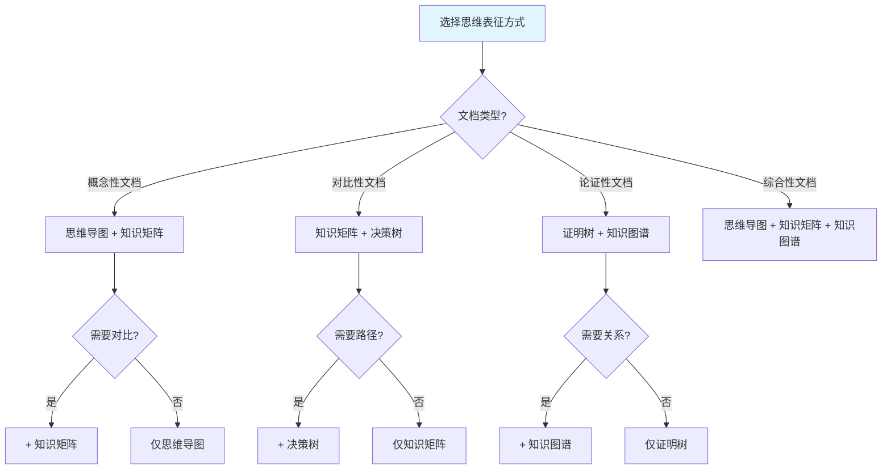

# FormalMath项目全面推进整合计划

**创建日期**: 2025年12月1日
**状态**: 🚀 全面整合推进中
**目标**: 完成所有101个文档的深化，整合多种思维表征方式，对齐权威资源

---

## 📊 当前总体进度

- **总文档数**: 101个
- **已深化文档**: 14个
- **待深化文档**: 87个
- **完成度**: 14%

---

## 🎯 整合目标

### 1. 多种思维表征方式整合

**目标**：在每个深化文档中整合以下思维表征方式：

1. **思维导图（Mind Map）**
   - 展示知识结构的层次关系
   - 从中心主题向外发散
   - 适用于概念梳理和知识概览

2. **知识矩阵（Knowledge Matrix）**
   - 多维度对比分析
   - 系统化比较不同观点
   - 适用于深度分析和对比研究

3. **决策树（Decision Tree）**
   - 展示选择路径和决策逻辑
   - 结构化的问题解决过程
   - 适用于方法选择和问题分类

4. **证明树（Proof Tree）**
   - 展示证明的逻辑结构
   - 从前提到结论的推理路径
   - 适用于数学论证分析

5. **知识图谱（Knowledge Graph）**
   - 展示概念之间的网络关系
   - 多维度的知识关联
   - 适用于复杂关系分析

6. **概念属性定义表**
   - 明确概念的定义和属性
   - 系统化的概念分析
   - 适用于概念理解

---

## 🌐 权威资源对齐

### 1. 网络权威资源

**Wikipedia条目**：
- Mathematical Philosophy
- Philosophy of Mathematics
- Mathematical Realism / Platonism
- Formalism (mathematics)
- Intuitionism
- Constructivism (mathematics)
- Logicism
- Structuralism (mathematics)
- Fictionalism
- Mathematical Explanation

**Stanford Encyclopedia of Philosophy (SEP)**：
- Platonism in the Philosophy of Mathematics
- Formalism in the Philosophy of Mathematics
- Intuitionism in the Philosophy of Mathematics
- Constructive Mathematics
- Logicism and Neo-Logicism
- Structuralism in the Philosophy of Mathematics
- Mathematical Explanation

**Internet Encyclopedia of Philosophy (IEP)**：
- Philosophy of Mathematics
- Mathematical Platonism
- Formalism in Mathematics
- Intuitionism in Mathematics

### 2. 国际大学课程资源

**MIT (麻省理工学院)**：
- 18.510 Introduction to Mathematical Logic and Set Theory
- 24.09 Topics in Philosophy of Mathematics

**Stanford University**：
- PHIL 150: Mathematical Logic
- PHIL 152: Philosophy of Mathematics

**Harvard University**：
- Philosophy 142: Philosophy of Mathematics

**Oxford University**：
- Philosophy of Mathematics courses

### 3. 中小学课程资源

**Common Core State Standards (美国)**：
- 数学课程标准和框架

**Singapore Mathematics Curriculum**：
- 新加坡数学教育标准

**Finland National Curriculum**：
- 芬兰数学教育框架

---

## 📋 思维表征方式整合标准

### 1. 每个深化文档必须包含

**基础内容**：
1. ✅ 实质性内容（每章节≥500字）
2. ✅ 详细展开（所有子主题具体化）
3. ✅ 理论依据（相关理论支撑）
4. ✅ 实际案例（具体应用案例）
5. ✅ 参考文献（3-5个权威文献）

**思维表征方式**（根据文档内容选择2-3种）：
1. ✅ 思维导图：展示知识结构
2. ✅ 知识矩阵：多维度对比
3. ✅ 决策树：展示选择路径
4. ✅ 证明树：展示证明结构（如适用）
5. ✅ 知识图谱：展示概念关系
6. ✅ 概念属性定义表：明确概念属性

---

## 🔄 推进计划

### 阶段一：第三批剩余文档（13个）- 🔄 进行中

**数学哲学本体论（7个）**：
- ✅ 实在论（381行）- 已完成
- ✅ 形式主义（272行）- 已完成
- ✅ 虚构主义（262行）- 已完成
- ✅ 构造主义（246行）- 已完成
- ✅ 直觉主义（384行）- 已完成
- ✅ 逻辑主义（398行）- 已完成
- ✅ 结构主义（399行）- 已完成
- ⏳ 各主义对比分析（390行）- 已深化，需添加思维表征

**数学哲学认识论（1个）**：
- ✅ 数学知识来源详细分析（316行）- 已深化

**数学解释文档（5个）**：
- ✅ 数学解释的独特性（335行）- 已深化
- ✅ 数学解释的语义学（331行）- 已深化
- ✅ 数学解释的多样性（309行）- 已深化
- ⏳ 数学论证的逻辑结构（465行）- 已有内容，需深化并添加思维表征
- ⏳ 独特的解释论证方式（437行）- 已深化，需添加思维表征
- ⏳ 数学论证的严格性（387行）- 已有内容，需深化

### 阶段二：添加思维表征方式

为每个已深化文档添加：
1. 思维导图（展示知识结构）
2. 知识矩阵（多维度对比，如适用）
3. 决策树（展示选择路径，如适用）
4. 知识图谱（展示概念关系）

### 阶段三：第四批文档（22个）- 待开始

**数学历史文档（12个）**
**数学家文档（10个）**

### 阶段四：第五批文档（31个）- 待开始

**其他研究目录文档**

---

## 📊 思维表征方式选择指南

### 决策树：选择哪种思维表征方式？

---

## 🎯 整合实施步骤

### 步骤1：为每个文档选择适当的思维表征方式

根据文档内容特点选择2-3种思维表征方式：

| 文档类型 | 推荐思维表征方式 | 理由 |
|---------|----------------|------|
| **本体论文档** | 思维导图 + 知识矩阵 + 知识图谱 | 需要结构展示、多维度对比、关系网络 |
| **认识论文档** | 思维导图 + 决策树 | 需要知识结构、选择路径 |
| **解释理论文档** | 知识矩阵 + 证明树 + 知识图谱 | 需要对比分析、论证结构、概念关系 |
| **论证结构文档** | 证明树 + 决策树 + 知识图谱 | 需要推理结构、方法选择、关系网络 |

### 步骤2：对齐权威资源

每个文档的深化都要：
1. 参考Wikipedia相关条目
2. 对齐SEP/IEP条目内容
3. 参考国际大学课程内容
4. 参考中小学课程标准

### 步骤3：保持一致性

1. **术语一致性**：使用标准术语
2. **格式一致性**：统一文档格式
3. **深度一致性**：每章节≥500字
4. **质量一致性**：所有文档达到相同标准

---

## 📖 权威资源参考清单

### 数学哲学

1. **SEP条目**：
   - Platonism in the Philosophy of Mathematics
   - Formalism in the Philosophy of Mathematics
   - Intuitionism in the Philosophy of Mathematics
   - Structuralism in the Philosophy of Mathematics
   - Mathematical Explanation

2. **Wikipedia条目**：
   - Philosophy of Mathematics
   - Mathematical Platonism
   - Formalism (mathematics)
   - Intuitionism
   - Constructivism (mathematics)
   - Logicism
   - Structuralism (mathematics)
   - Fictionalism

### 数学解释

1. **SEP条目**：
   - Mathematical Explanation
   - Proof Theory
   - Model Theory

2. **Wikipedia条目**：
   - Mathematical Proof
   - Mathematical Explanation

### 思维表征

1. **Wikipedia条目**：
   - Mind Map
   - Concept Map
   - Knowledge Graph
   - Decision Tree

2. **国际标准**：
   - IEEE Learning Object Metadata
   - SCORM (Sharable Content Object Reference Model)

---

## ✅ 下一步行动

1. ✅ 继续深化第三批剩余文档
2. ⏳ 为已深化文档添加思维表征方式
3. ⏳ 对齐权威资源内容
4. ⏳ 继续推进第四批、第五批文档

---

**更新时间**: 2025年12月1日
**状态**: 🚀 全面整合推进中
