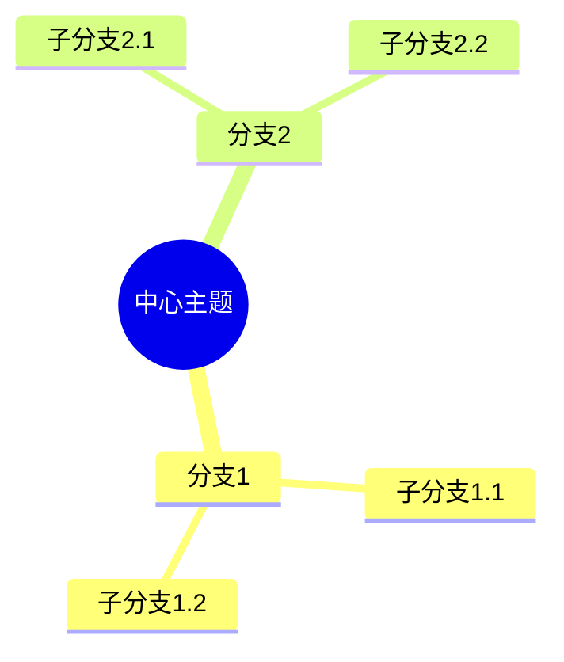
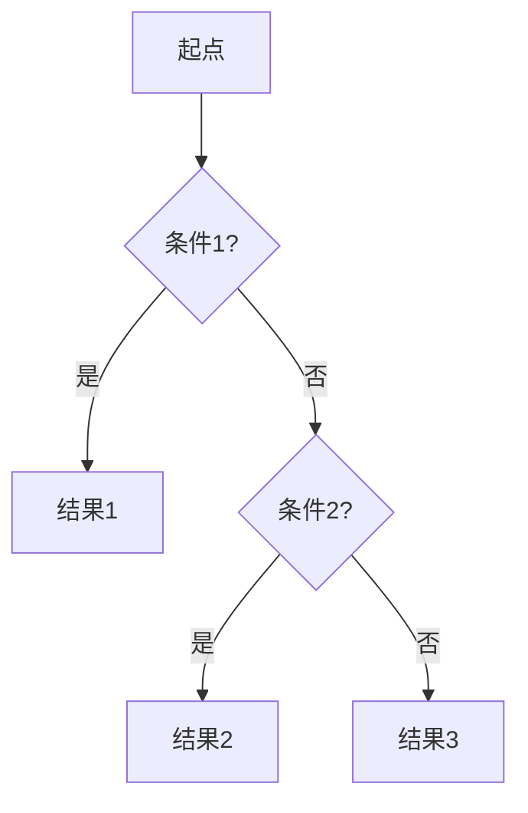
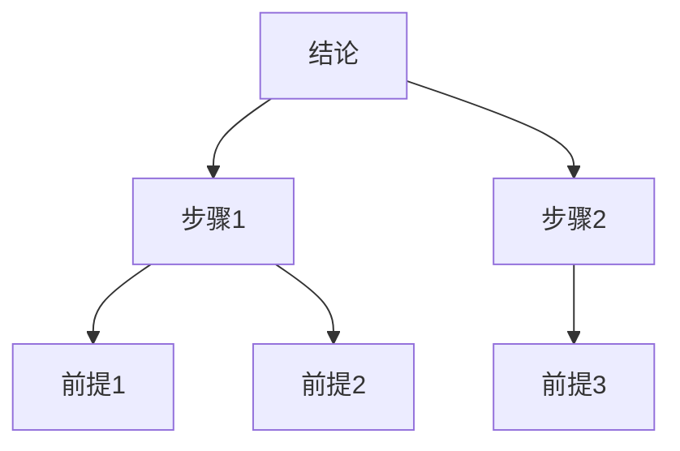
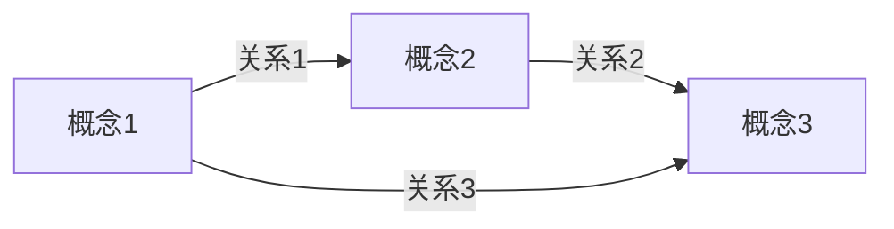

# FormalMath项目全面推进整合计划（详细版）

**创建日期**: 2025年12月1日
**状态**: 🚀 全面整合推进中
**目标**: 完成所有101个文档的深化，整合多种思维表征方式，对齐权威资源，确保一致性和有效性

---

## 📊 当前总体进度

- **总文档数**: 101个
- **已深化文档**: 14个
- **待深化文档**: 87个
- **完成度**: 14%

---

## 🎯 整合目标

### 1. 多种思维表征方式整合

**目标**：在每个深化文档中整合以下思维表征方式，根据文档特点选择2-4种：

#### 1.1 思维导图（Mind Map）

**特点**：
- 放射状结构，从中心向外发散
- 层次清晰，易于理解
- 支持知识概览和整体把握

**适用文档**：
- 概念性文档（本体论、认识论总览）
- 知识体系构建文档
- 需要结构梳理的文档

**实施标准**：
- 中心主题明确
- 主要分支3-7个
- 层次深度3-4层
- 使用Mermaid语法或文字描述

#### 1.2 知识矩阵（Knowledge Matrix）

**特点**：
- 多维度对比分析
- 系统化比较
- 量化指标支持

**适用文档**：
- 对比性文档（各主义对比分析）
- 多方法对比文档
- 需要深度分析的文档

**实施标准**：
- 比较对象：行
- 比较维度：列
- 每个单元格：具体信息或评分
- 使用Markdown表格格式

#### 1.3 决策树（Decision Tree）

**特点**：
- 结构化决策路径
- 条件判断清晰
- 支持选择指导

**适用文档**：
- 方法论文档
- 问题解决文档
- 需要路径选择的文档

**实施标准**：
- 根节点：决策起点
- 内部节点：条件判断
- 叶节点：决策结果
- 使用Mermaid流程图或文字描述

#### 1.4 证明树（Proof Tree）

**特点**：
- 展示证明逻辑结构
- 从前提到结论的推理路径
- 支持证明理解

**适用文档**：
- 论证结构文档
- 证明方法文档
- 需要展示推理的文档

**实施标准**：
- 根节点：结论
- 内部节点：中间步骤
- 叶节点：前提/公理
- 使用Mermaid流程图或文字描述

#### 1.5 知识图谱（Knowledge Graph）

**特点**：
- 网络化关系展示
- 多维度知识关联
- 支持探索学习

**适用文档**：
- 关系复杂文档
- 需要网络结构的文档
- 综合性强文档

**实施标准**：
- 节点：概念/实体
- 边：关系
- 使用Mermaid图表或文字描述

#### 1.6 概念属性定义表

**特点**：
- 明确概念定义
- 系统化属性分析
- 支持概念理解

**适用文档**：
- 所有文档的核心概念部分
- 需要概念澄清的文档

**实施标准**：
- 概念名称
- 定义
- 属性列表
- 关系说明

---

## 🌐 权威资源对齐

### 2. 网络权威资源清单

#### 2.1 Wikipedia条目

**数学哲学核心条目**：
- Philosophy of Mathematics
- Mathematical Platonism / Realism
- Formalism (mathematics)
- Intuitionism
- Constructivism (mathematics)
- Logicism
- Structuralism (mathematics)
- Fictionalism
- Mathematical Explanation
- Mathematical Proof
- Model Theory
- Proof Theory

**思维表征条目**：
- Mind Map
- Concept Map
- Knowledge Graph
- Decision Tree
- Semantic Network

#### 2.2 Stanford Encyclopedia of Philosophy (SEP)

**数学哲学条目**：
- Platonism in the Philosophy of Mathematics
- Formalism in the Philosophy of Mathematics
- Intuitionism in the Philosophy of Mathematics
- Constructive Mathematics
- Logicism and Neo-Logicism
- Structuralism in the Philosophy of Mathematics
- Mathematical Explanation
- Proof Theory
- Model Theory

#### 2.3 Internet Encyclopedia of Philosophy (IEP)

**相关条目**：
- Philosophy of Mathematics
- Mathematical Platonism
- Formalism in Mathematics
- Intuitionism in Mathematics

### 3. 国际大学课程资源

#### 3.1 MIT (麻省理工学院)

**相关课程**：
- 18.510 Introduction to Mathematical Logic and Set Theory
- 24.09 Topics in Philosophy of Mathematics

**课程特点**：
- 严格的逻辑训练
- 形式化方法
- 公理化系统

#### 3.2 Stanford University

**相关课程**：
- PHIL 150: Mathematical Logic
- PHIL 152: Philosophy of Mathematics

**课程特点**：
- 逻辑与哲学结合
- 形式化验证
- 计算思维

#### 3.3 Harvard University

**相关课程**：
- Philosophy 142: Philosophy of Mathematics

**课程特点**：
- 历史视角
- 哲学分析
- 概念澄清

#### 3.4 Oxford University

**相关课程**：
- Philosophy of Mathematics courses

**课程特点**：
- 经典文本研读
- 概念分析
- 论证评估

### 4. 中小学课程资源

#### 4.1 Common Core State Standards (美国)

**数学课程框架**：
- K-12数学内容标准
- 数学实践标准
- 数学思维培养

#### 4.2 Singapore Mathematics Curriculum

**课程特点**：
- CPA方法（具体-图像-抽象）
- 问题解决导向
- 系统化思维训练

#### 4.3 Finland National Curriculum

**课程特点**：
- 现象式学习
- 跨学科整合
- 能力导向

---

## 📋 思维表征方式选择矩阵

### 5. 文档类型-表征方式对应表

| 文档类型 | 思维导图 | 知识矩阵 | 决策树 | 证明树 | 知识图谱 | 概念属性表 |
|---------|---------|---------|--------|--------|---------|-----------|
| **本体论总览** | ✅ 必需 | ✅ 推荐 | ⚪ 可选 | ❌ 不适用 | ✅ 推荐 | ✅ 必需 |
| **具体主义** | ✅ 推荐 | ✅ 推荐 | ⚪ 可选 | ❌ 不适用 | ✅ 推荐 | ✅ 必需 |
| **认识论总览** | ✅ 必需 | ✅ 推荐 | ✅ 推荐 | ❌ 不适用 | ✅ 推荐 | ✅ 必需 |
| **解释理论** | ✅ 推荐 | ✅ 必需 | ⚪ 可选 | ⚪ 可选 | ✅ 推荐 | ✅ 必需 |
| **论证结构** | ✅ 推荐 | ✅ 推荐 | ✅ 推荐 | ✅ 必需 | ✅ 推荐 | ✅ 推荐 |
| **解释方法** | ✅ 推荐 | ✅ 推荐 | ✅ 必需 | ⚪ 可选 | ⚪ 可选 | ✅ 推荐 |
| **解释案例** | ⚪ 可选 | ✅ 推荐 | ✅ 推荐 | ✅ 推荐 | ⚪ 可选 | ⚪ 可选 |

**说明**：
- ✅ 必需：必须包含
- ✅ 推荐：强烈推荐包含
- ⚪ 可选：根据内容需要选择
- ❌ 不适用：不适合此类文档

---

## 🔄 推进计划详细安排

### 阶段一：第三批剩余文档深化（13个）- 🔄 进行中

**时间安排**：2-3周

**任务清单**：

#### 1. 数学哲学本体论（7个）

| 文档 | 当前行数 | 目标行数 | 思维表征方式 | 优先级 |
|------|---------|---------|------------|--------|
| 实在论 | 381 | 400+ | 思维导图 + 知识矩阵 + 知识图谱 | P0 |
| 形式主义 | 272 | 350+ | 思维导图 + 知识矩阵 + 决策树 | P0 |
| 虚构主义 | 262 | 350+ | 思维导图 + 知识矩阵 | P0 |
| 构造主义 | 246 | 350+ | 思维导图 + 决策树 | P0 |
| 直觉主义 | 384 | 400+ | 思维导图 + 知识矩阵 + 证明树 | P0 |
| 逻辑主义 | 398 | 400+ | 思维导图 + 知识矩阵 + 证明树 | P0 |
| 结构主义 | 399 | 400+ | 思维导图 + 知识矩阵 + 知识图谱 | P0 |
| 各主义对比分析 | 390 | 450+ | 知识矩阵 + 决策树 + 知识图谱 | P0 |

#### 2. 数学哲学认识论（1个）

| 文档 | 当前行数 | 目标行数 | 思维表征方式 | 优先级 |
|------|---------|---------|------------|--------|
| 数学知识来源详细分析 | 316 | 400+ | 思维导图 + 决策树 + 知识图谱 | P0 |
| 数学知识性质详细分析 | 316 | 400+ | 思维导图 + 知识矩阵 + 知识图谱 | P0 |

#### 3. 数学解释文档（5个）

| 文档 | 当前行数 | 目标行数 | 思维表征方式 | 优先级 |
|------|---------|---------|------------|--------|
| 数学解释的语义学 | 331 | 450+ | 思维导图 + 知识图谱 + 概念属性表 | P0 |
| 数学解释的独特性 | 335 | 450+ | 思维导图 + 知识矩阵 + 决策树 | P0 |
| 数学解释的多样性 | 309 | 450+ | 思维导图 + 知识矩阵 + 知识图谱 | P0 |
| 数学论证的逻辑结构 | 465 | 550+ | 证明树 + 决策树 + 知识图谱 | P0 |
| 独特的解释论证方式 | 437 | 550+ | 证明树 + 决策树 + 知识矩阵 | P0 |
| 数学论证的严格性 | 387 | 500+ | 证明树 + 决策树 + 知识图谱 | P0 |

---

### 阶段二：为已深化文档添加思维表征方式 - ⏳ 待开始

**时间安排**：1-2周

**任务清单**：

1. **为14个已深化文档添加思维表征方式**
   - 实在论：思维导图 + 知识矩阵 + 知识图谱
   - 形式主义：思维导图 + 知识矩阵 + 决策树
   - 虚构主义：思维导图 + 知识矩阵
   - 构造主义：思维导图 + 决策树
   - 直觉主义：思维导图 + 知识矩阵 + 证明树
   - 逻辑主义：思维导图 + 知识矩阵 + 证明树
   - 结构主义：思维导图 + 知识矩阵 + 知识图谱
   - 各主义对比分析：知识矩阵 + 决策树 + 知识图谱
   - 数学知识来源详细分析：思维导图 + 决策树 + 知识图谱
   - 数学知识性质详细分析：思维导图 + 知识矩阵 + 知识图谱
   - 数学解释的独特性：思维导图 + 知识矩阵 + 决策树
   - 数学解释的语义学：思维导图 + 知识图谱 + 概念属性表
   - 数学解释的多样性：思维导图 + 知识矩阵 + 知识图谱
   - 独特的解释论证方式：证明树 + 决策树 + 知识矩阵

2. **对齐权威资源**
   - 检查Wikipedia条目对齐
   - 检查SEP条目对齐
   - 检查国际课程内容对齐
   - 补充权威参考文献

---

### 阶段三：第四批文档（22个）- ⏳ 待开始

**时间安排**：4-6周

**数学历史文档（12个）**
- 古代数学
- 中世纪数学
- 近代数学
- 现代数学

**数学家文档（10个）**
- 古代数学家
- 近代数学家
- 现代数学家

---

### 阶段四：第五批文档（31个）- ⏳ 待开始

**时间安排**：6-8周

**其他研究目录文档**：
- 数学认知（4个）
- 思脉（4个）
- 思维表征（18个）
- 数学语义（4个）
- 其他（1个）

---

## 📊 思维表征方式实施标准

### 6. 思维导图实施标准

**结构要求**：
- 中心主题：明确、简洁
- 主要分支：3-7个，使用不同颜色
- 层次深度：3-4层
- 关键词：每个分支2-5个词

**格式要求**：
- 使用Mermaid语法
- 或使用文字描述的层次结构
- 确保可读性

**示例格式**：

### 7. 知识矩阵实施标准

**结构要求**：
- 行：比较对象（3-10个）
- 列：比较维度（3-8个）
- 单元格：具体信息或评分

**格式要求**：
- 使用Markdown表格
- 表头清晰
- 内容具体

**示例格式**：
| 对象 | 维度1 | 维度2 | 维度3 |
|------|------|------|------|
| 对象1 | 信息1 | 信息2 | 信息3 |
| 对象2 | 信息1 | 信息2 | 信息3 |

### 8. 决策树实施标准

**结构要求**：
- 根节点：决策起点
- 内部节点：条件判断（if-else）
- 叶节点：决策结果
- 分支：清晰标注条件

**格式要求**：
- 使用Mermaid流程图
- 或使用文字描述的树状结构
- 确保逻辑清晰

**示例格式**：

### 9. 证明树实施标准

**结构要求**：
- 根节点：要证明的结论
- 内部节点：中间推理步骤
- 叶节点：前提、公理或已证定理
- 边：标注推理规则

**格式要求**：
- 使用Mermaid流程图（自下而上）
- 或使用文字描述的证明结构
- 确保推理路径清晰

**示例格式**：

### 10. 知识图谱实施标准

**结构要求**：
- 节点：概念/实体（5-15个）
- 边：关系（标注关系类型）
- 节点类型：不同颜色区分
- 关系类型：不同线型区分

**格式要求**：
- 使用Mermaid图表
- 或使用文字描述的关系网络
- 确保关系清晰

**示例格式**：

---

## 🔍 权威资源对齐检查清单

### 11. 每个文档必须检查

**Wikipedia对齐**：
- [ ] 检查相关Wikipedia条目
- [ ] 对齐核心概念定义
- [ ] 对齐历史背景
- [ ] 对齐代表人物信息

**SEP对齐**：
- [ ] 检查相关SEP条目
- [ ] 对齐理论框架
- [ ] 对齐关键论证
- [ ] 对齐现代发展

**国际课程对齐**：
- [ ] 检查MIT/Stanford相关课程
- [ ] 对齐课程大纲
- [ ] 对齐教学方法
- [ ] 对齐评估标准

**中小学课程对齐**：
- [ ] 检查Common Core标准
- [ ] 检查新加坡数学课程
- [ ] 检查芬兰数学课程
- [ ] 对齐教学重点

---

## ✅ 质量保证标准

### 12. 文档深化质量检查

**内容质量**：
- [ ] 每章节≥500字
- [ ] 详细展开所有子主题
- [ ] 包含理论依据
- [ ] 包含实际案例
- [ ] 包含3-5个参考文献

**思维表征质量**：
- [ ] 包含2-4种思维表征方式
- [ ] 思维表征与内容匹配
- [ ] 思维表征清晰可读
- [ ] 思维表征有助于理解

**权威性检查**：
- [ ] 对齐Wikipedia条目
- [ ] 对齐SEP条目
- [ ] 对齐国际课程内容
- [ ] 引用权威参考文献

**一致性检查**：
- [ ] 术语使用一致
- [ ] 格式统一
- [ ] 深度一致
- [ ] 风格一致

---

## 📅 执行时间表

### 第1-2周：第三批文档深化

- 完成剩余13个文档的深化
- 每文档增加50-150行实质性内容
- 确保每章节≥500字

### 第3周：思维表征方式添加

- 为14个已深化文档添加思维表征方式
- 根据文档类型选择2-4种表征方式
- 使用Mermaid或Markdown格式

### 第4周：权威资源对齐

- 检查所有文档的权威资源对齐情况
- 补充缺失的权威参考文献
- 对齐Wikipedia、SEP、国际课程内容

### 第5-10周：第四批文档

- 深化22个阶段三文档
- 整合思维表征方式
- 对齐权威资源

### 第11-18周：第五批文档

- 深化31个其他研究目录文档
- 整合思维表征方式
- 对齐权威资源

---

## 🎯 成功标准

**内容标准**：
- ✅ 每章节≥500字
- ✅ 详细展开所有子主题
- ✅ 包含理论依据和实际案例
- ✅ 包含3-5个权威参考文献

**表征标准**：
- ✅ 每个文档包含2-4种思维表征方式
- ✅ 思维表征清晰、准确、有用
- ✅ 思维表征与内容完美融合

**权威性标准**：
- ✅ 对齐Wikipedia核心条目
- ✅ 对齐SEP相关条目
- ✅ 对齐国际课程内容
- ✅ 引用权威资源

**一致性标准**：
- ✅ 术语使用一致
- ✅ 格式统一
- ✅ 深度一致
- ✅ 风格一致

---

## 📝 后续推进步骤

1. ✅ 立即开始深化第三批剩余文档
2. ⏳ 同时为已深化文档添加思维表征方式
3. ⏳ 逐步对齐权威资源
4. ⏳ 继续推进第四批、第五批文档

---

**更新时间**: 2025年12月1日
**状态**: 🚀 全面整合推进中
**下一步**: 继续深化剩余文档，同时添加思维表征方式和对齐权威资源
