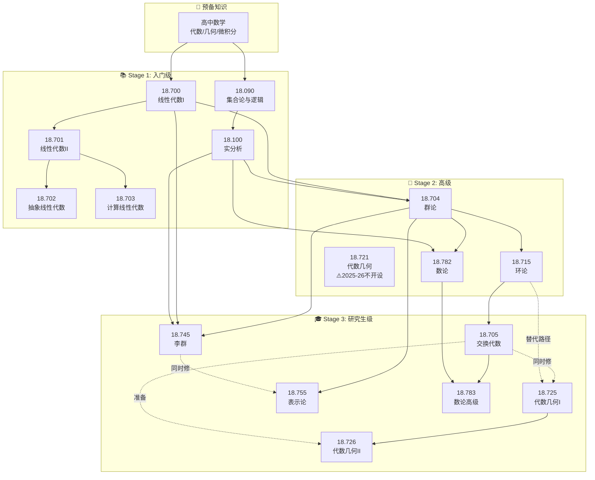
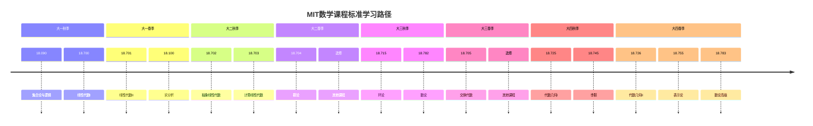
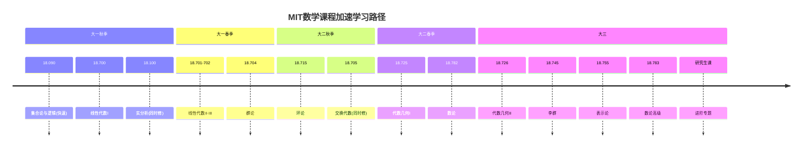
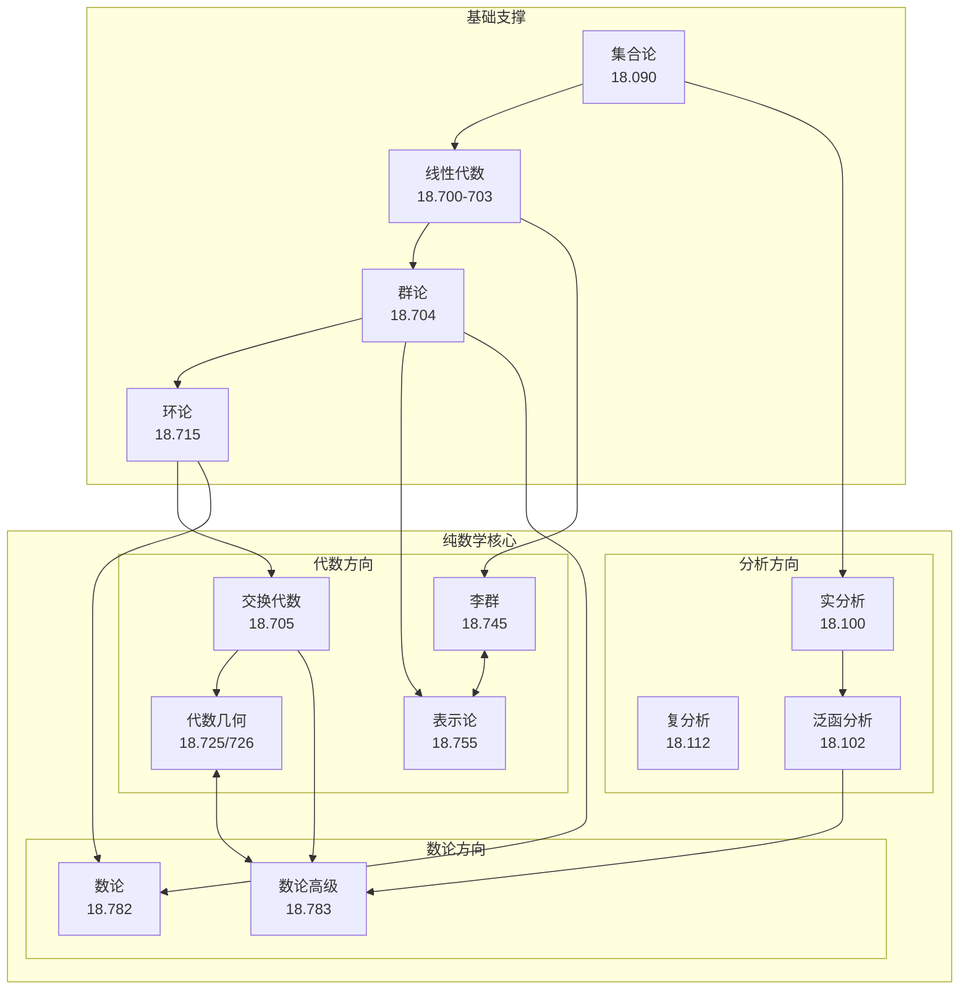
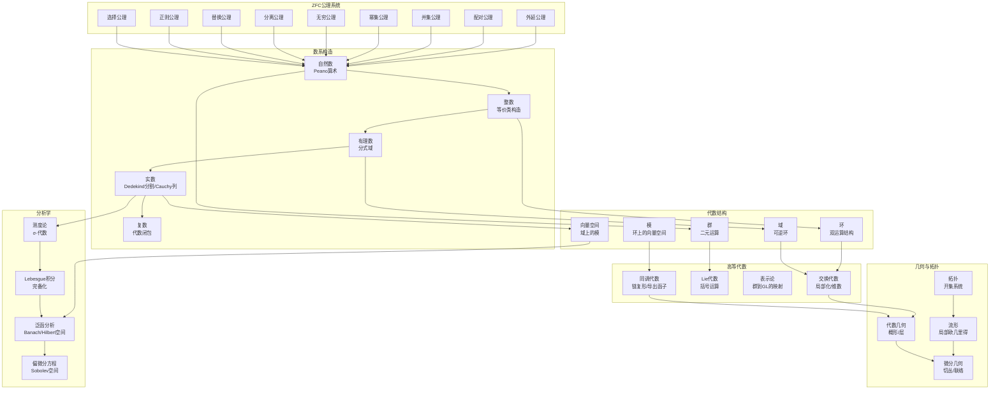
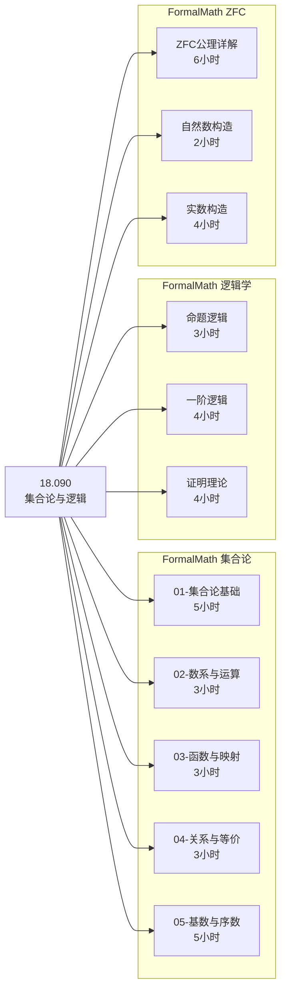
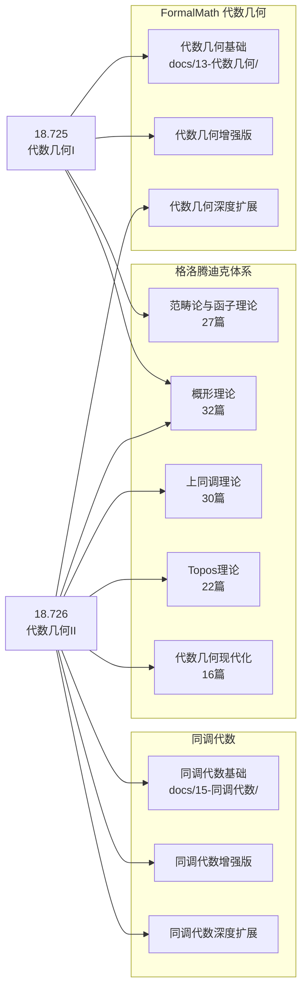

# MIT数学课程先修依赖关系图

> **说明**: 本图展示MIT数学课程的依赖关系，以及FormalMath资源如何支持这些依赖。

---

## 📊 课程依赖关系总图

---

## 🔄 FormalMath支持映射图

```mermaid
flowchart LR
    subgraph FormalMath["📚 FormalMath资源库"]
        subgraph Foundation["基础数学"]
            SetTheory[集合论<br/>docs/01-基础数学/集合论/]
            ZFC[ZFC公理<br/>docs/01-基础数学/ZFC公理体系/]
            Logic[逻辑学<br/>docs/07-逻辑学/]
        end

        subgraph Algebra["代数结构"]
            Linear[线性代数<br/>docs/02-代数结构/线性代数/]
            Group[群论<br/>docs/02-代数结构/群论/]
            Ring[环论<br/>docs/02-代数结构/环论/]
            Module[模论<br/>docs/02-代数结构/模论/]
            CommAlg[交换代数<br/>docs/02-代数结构/交换代数/]
            Lie[Lie代数<br/>docs/02-代数结构/李代数/]
            Rep[表示论<br/>docs/02-代数结构/表示论/]
        end

        subgraph Analysis["分析学"]
            Real[实分析<br/>docs/03-分析学/实分析/]
            Complex[复分析<br/>docs/03-分析学/复分析/]
            Func[泛函分析<br/>docs/03-分析学/泛函分析/]
        end

        subgraph NumberTheory["数论"]
            Elementary[初等数论<br/>docs/06-数论/初等数论/]
            AlgNT[代数数论<br/>docs/06-数论/代数数论/]
            AnalNT[解析数论<br/>docs/06-数论/解析数论/]
        end

        subgraph AlgebraicGeometry["代数几何"]
            AG[代数几何基础<br/>docs/13-代数几何/]
            Homological[同调代数<br/>docs/15-同调代数/]
        end

        subgraph Grothendieck["格洛腾迪克体系"]
            Cat[范畴论<br/>数学家理念体系/格洛腾迪克/范畴论与函子理论/]
            Schemes[概形理论<br/>数学家理念体系/格洛腾迪克/概形理论/]
            Cohomology[上同调理论<br/>数学家理念体系/格洛腾迪克/上同调理论/]
            Topos[Topos理论<br/>数学家理念体系/格洛腾迪克/Topos理论/]
        end
    end

    subgraph MIT["🎓 MIT课程"]
        18090m[18.090<br/>集合论与逻辑]
        18700m[18.700-703<br/>线性代数序列]
        18100m[18.100<br/>实分析]
        18704m[18.704<br/>群论]
        18715m[18.715<br/>环论]
        18782m[18.782<br/>数论]
        18705m[18.705<br/>交换代数]
        18725m[18.725<br/>代数几何I]
        18726m[18.726<br/>代数几何II]
        18745m[18.745<br/>李群]
        18755m[18.755<br/>表示论]
        18783m[18.783<br/>数论高级]
    end

    SetTheory --> 18090m
    ZFC --> 18090m
    Logic --> 18090m

    Linear --> 18700m

    Real --> 18100m

    Group --> 18704m

    Ring --> 18715m
    Module --> 18715m

    Elementary --> 18782m
    AlgNT --> 18782m

    CommAlg --> 18705m
    Module --> 18705m

    AG --> 18725m
    CommAlg --> 18725m

    Schemes --> 18725m
    Schemes --> 18726m
    Cohomology --> 18726m
    Homological --> 18726m

    Lie --> 18745m
    Rep --> 18745m

    Rep --> 18755m
    Group --> 18755m

    AlgNT --> 18783m
    AnalNT --> 18783m
    AG --> 18783m
```

---

## 📈 课程序列推荐路径

### 标准路径 (4年制)

### 加速路径 (有扎实基础的学生)

---

## 🎯 课程聚类图

---

## 📚 FormalMath内容依赖图

---

## 🔍 课程与FormalMath详细映射

### 18.090 → FormalMath资源

### 18.725/726 → FormalMath资源

---

## 📋 学习路径检查清单

### 进入Stage 1前

- [ ] 掌握高中数学全部内容
- [ ] 了解基本的集合运算（并、交、补）
- [ ] 理解函数的基本概念

### 进入Stage 2前

- [ ] ✅ 完成18.090: 能写形式化证明
- [ ] ✅ 完成18.700/701: 掌握有限维向量空间理论
- [ ] ✅ 完成18.100: 理解ε-δ语言
- [ ] 能阅读数学文献中的证明

### 进入Stage 3前

- [ ] ✅ 完成18.704: 掌握群论基本定理
- [ ] ✅ 完成18.715: 理解理想理论和模论基础
- [ ] ✅ 完成18.705 (或同时修): 熟悉局部化和诺特环
- [ ] 能独立阅读Hartshorne/Atiyah-Macdonald级别的教材

---

*最后更新: 2026年4月*
