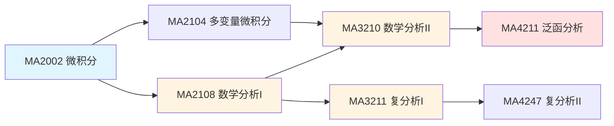
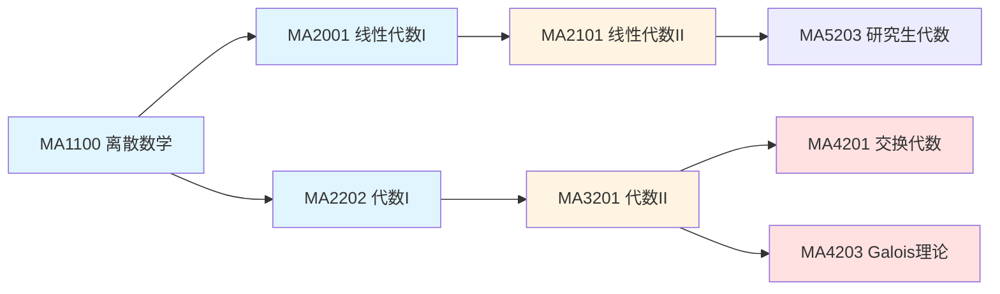

# NUS数学课程详细概念映射表

**文档类型**：详细映射 · 概念级对应  
**创建日期**：2026年4月4日  
**关联**：[../00-NUS数学课程对齐报告.md](../00-NUS数学课程对齐报告.md)

---

## 一、课程总览表

| 课程代码 | 课程名称 | 层级 | 学分 | FormalMath覆盖度 |
|---------|---------|------|------|-----------------|
| MA1100 | Basic [Discrete Mathematics](../docs/09-组合数学与离散数学/) | 基础 | 4 | 🟢 88% |
| MA1100T | Basic [Discrete Mathematics](../docs/09-组合数学与离散数学/) (T) | 基础 | 4 | 🟢 85% |
| MA1301 | Introductory Mathematics | 基础 | 4 | 🟢 90% |
| MA2001 | [Linear Algebra](../docs/02-代数结构/) I | 核心 | 4 | 🟢 90% |
| MA2002 | [Calculus](../docs/03-分析学/) | 核心 | 4 | 🟢 88% |
| MA2101 | [Linear Algebra](../docs/02-代数结构/) II | 核心 | 4 | 🟢 88% |
| MA2101S | [Linear Algebra](../docs/02-代数结构/) II (S) | 核心 | 4 | 🟢 85% |
| MA2104 | [Multivariable Calculus](../docs/03-分析学/) | 核心 | 4 | 🟢 88% |
| MA2108 | [Mathematical Analysis](../docs/03-分析学/) I | 核心 | 4 | 🟢 90% |
| MA2108S | [Mathematical Analysis](../docs/03-分析学/) I (S) | 核心 | 4 | 🟢 88% |
| MA2202 | [Algebra I](../docs/02-代数结构/) | 核心 | 4 | 🟢 88% |
| MA2202S | [Algebra I](../docs/02-代数结构/) (S) | 核心 | 4 | 🟢 85% |
| MA3210 | [Mathematical Analysis](../docs/03-分析学/) II | 高级 | 4 | 🟢 85% |
| MA3211 | [Complex Analysis](../docs/03-分析学/) I | 高级 | 4 | 🟢 88% |
| MA3211S | [Complex Analysis](../docs/03-分析学/) I (S) | 高级 | 4 | 🟢 85% |
| MA3201 | [Algebra II](../docs/02-代数结构/) | 高级 | 4 | 🟢 85% |
| MA3209 | [Metric and Topological Spaces](../docs/04-几何与拓扑/) | 高级 | 4 | 🟢 88% |

---

## 二、详细概念映射

### 2.1 MA1100 / MA1100T 基础离散数学

#### 2.1.1 课程信息

| 属性 | 内容 |
|------|------|
| **课程目标** | 建立离散数学基础，培养逻辑思维和证明能力 |
| **先修要求** | 无 |
| **主要内容** | 逻辑、集合、关系、函数、归纳法、计数、[图论](../docs/09-组合数学与离散数学/) |
| **评估方式** | 作业、期中考试、期末考试 |

#### 2.1.2 主题级映射

| 周次 | NUS主题 | FormalMath对应 | 覆盖度 |
|------|--------|---------------|--------|
| 1-2 | 逻辑与命题 | docs/01-基础数学/[数理逻辑](../docs/07-数理逻辑/)/01-命题逻辑-基础版.md | 🟢 92% |
| 3-4 | 集合论基础 | docs/01-基础数学/[集合论](../docs/01-基础数学/)/01-集合论基础-国际标准版.md | 🟢 95% |
| 5-6 | 关系与函数 | docs/01-基础数学/关系与函数-深度扩展版.md | 🟢 88% |
| 7-8 | 数学归纳法 | docs/01-基础数学/数系与运算/04-数学归纳法-深度扩展版.md | 🟢 90% |
| 9-10 | 计数原理 | docs/16-组合数学与图论/组合数学基础-深度扩展版.md | 🟢 82% |
| 11-12 | 图论基础 | docs/16-组合数学与图论/图论基础-深度扩展版.md | 🟢 80% |

#### 2.1.3 概念级映射

| NUS概念 | FormalMath概念 | MSC编码 | 对应文档 |
|---------|---------------|---------|---------|
| [命题逻辑](../docs/07-数理逻辑/) | 命题、逻辑联结词 | 03B05 | [数理逻辑](../docs/07-数理逻辑/)/01-命题逻辑 |
| 谓词逻辑 | 量词、谓词 | 03B10 | [数理逻辑](../docs/07-数理逻辑/)/02-谓词逻辑 |
| 集合 | 集合、元素、子集 | 03E20 | [集合论](../docs/01-基础数学/)/01-集合论基础 |
| 幂集 | 幂集运算 | 03E20 | [集合论](../docs/01-基础数学/)/03-集合运算 |
| 关系 | 二元关系、等价关系 | 03E20 | 关系与函数/01-关系 |
| 函数 | 映射、单射、满射 | 03E20 | 关系与函数/02-函数 |
| 数学归纳法 | 归纳原理 | 03B48 | 数系与运算/04-数学归纳法 |
| 鸽巢原理 | 鸽巢原理 | 05A05 | [组合数学](../docs/09-组合数学与离散数学/)/计数原理 |
| 排列组合 | 排列、组合 | 05A05 | [组合数学](../docs/09-组合数学与离散数学/)/排列组合 |
| 图 | 图、顶点、边 | 05Cxx | [图论](../docs/09-组合数学与离散数学/)/01-图论基础 |

#### 2.1.4 MA1100T 特殊内容

MA1100T包含额外内容：

| 额外主题 | FormalMath对应 | 覆盖度 |
|---------|---------------|--------|
| 公理化集合论 | docs/01-基础数学/[集合论](../docs/01-基础数学/)/05-公理化集合论-深度扩展版.md | 🟢 85% |
| ZFC公理 | 数学家理念体系/策梅洛数学理念/ | 🟢 82% |
| 选择公理 | docs/01-基础数学/[集合论](../docs/01-基础数学/)/06-选择公理-深度扩展版.md | 🟢 80% |

---

### 2.2 MA2001 线性代数I

#### 2.2.1 课程信息

| 属性 | 内容 |
|------|------|
| **课程目标** | 建立线性代数基础，理解向量空间与矩阵运算 |
| **先修要求** | 无 |
| **主要内容** | 线性方程组、矩阵、向量空间、线性变换、特征值 |
| **教材参考** | 系内讲义 |

#### 2.2.2 主题级映射

| 周次 | NUS主题 | FormalMath对应 | 覆盖度 |
|------|--------|---------------|--------|
| 1-2 | 线性方程组 | docs/02-代数结构/[线性代数](../docs/02-代数结构/)/01-线性方程组-基础版.md | 🟢 92% |
| 3-4 | 矩阵运算 | docs/02-代数结构/[线性代数](../docs/02-代数结构/)/02-矩阵运算-增强版.md | 🟢 90% |
| 5-6 | 向量空间 | docs/02-代数结构/[线性代数](../docs/02-代数结构/)/03-向量空间-深度扩展版.md | 🟢 92% |
| 7-8 | 线性变换 | docs/02-代数结构/[线性代数](../docs/02-代数结构/)/04-线性变换-深度扩展版.md | 🟢 88% |
| 9-10 | 行列式 | docs/02-代数结构/[线性代数](../docs/02-代数结构/)/05-行列式-深度扩展版.md | 🟢 90% |
| 11-12 | 特征值 | docs/02-代数结构/[线性代数](../docs/02-代数结构/)/06-特征值-深度扩展版.md | 🟢 85% |
| 13 | 内积空间 | docs/02-代数结构/[线性代数](../docs/02-代数结构/)/07-内积空间-深度扩展版.md | 🟢 85% |

#### 2.2.3 概念级映射

| NUS概念 | FormalMath概念 | MSC编码 | 对应文档 |
|---------|---------------|---------|---------|
| 线性方程组 | 高斯消元、行阶梯形 | 15A06 | [线性代数](../docs/02-代数结构/)/01-线性方程组 |
| 矩阵 | 矩阵、矩阵运算 | 15Axx | [线性代数](../docs/02-代数结构/)/02-矩阵运算 |
| 向量空间 | 向量空间、子空间 | 15A03 | [线性代数](../docs/02-代数结构/)/03-向量空间 |
| 基与维数 | 基、维数、坐标 | 15A03 | [线性代数](../docs/02-代数结构/)/03-向量空间 |
| 线性变换 | 线性映射、核、像 | 15A04 | [线性代数](../docs/02-代数结构/)/04-线性变换 |
| 矩阵表示 | 矩阵表示、基变换 | 15A04 | [线性代数](../docs/02-代数结构/)/04-线性变换 |
| 行列式 | 行列式、性质、计算 | 15A15 | [线性代数](../docs/02-代数结构/)/05-行列式 |
| 特征值 | 特征值、特征向量 | 15A18 | [线性代数](../docs/02-代数结构/)/06-特征值 |
| 对角化 | 矩阵对角化 | 15A20 | [线性代数](../docs/02-代数结构/)/06-特征值 |
| 内积 | 内积、正交性 | 15A63 | [线性代数](../docs/02-代数结构/)/07-内积空间 |

---

### 2.3 MA2002 微积分

#### 2.3.1 课程信息

| 属性 | 内容 |
|------|------|
| **课程目标** | 掌握一元函数微积分基础 |
| **先修要求** | 无 |
| **主要内容** | 极限、微分、积分、级数、[微分方程](../docs/05-微分方程/) |

#### 2.3.2 主题级映射

| 周次 | NUS主题 | FormalMath对应 | 覆盖度 |
|------|--------|---------------|--------|
| 1-2 | 极限与连续 | docs/03-分析学/01-实分析/01-极限理论-深度扩展版.md | 🟢 90% |
| 3-4 | 微分学 | docs/03-分析学/01-实分析/02-微分学-深度扩展版.md | 🟢 88% |
| 5-6 | 积分学 | docs/03-分析学/01-实分析/03-积分学-深度扩展版.md | 🟢 88% |
| 7-8 | 级数 | docs/03-分析学/01-实分析/04-级数理论-深度扩展版.md | 🟢 85% |
| 9-10 | [微分方程](../docs/05-微分方程/) | docs/03-分析学/[微分方程](../docs/05-微分方程/)/ODE基础-增强版.md | 🟢 80% |
| 11-12 | 应用 | docs/03-分析学/01-实分析/应用问题-增强版.md | 🟢 82% |

---

### 2.4 MA2101 / MA2101S 线性代数II

#### 2.4.1 课程信息

| 属性 | 内容 |
|------|------|
| **课程目标** | 深入理解抽象向量空间与线性变换理论 |
| **先修要求** | MA2001 |
| **S版本特点** | 强调证明，题目难度更高 |

#### 2.4.2 主题级映射

| 周次 | NUS主题 | FormalMath对应 | 覆盖度 |
|------|--------|---------------|--------|
| 1-3 | 抽象向量空间 | docs/02-代数结构/[线性代数](../docs/02-代数结构/)/03-向量空间-深度扩展版.md | 🟢 90% |
| 4-5 | 线性变换 | docs/02-代数结构/[线性代数](../docs/02-代数结构/)/04-线性变换-深度扩展版.md | 🟢 88% |
| 6-7 | 特征理论 | docs/02-代数结构/[线性代数](../docs/02-代数结构/)/06-特征值-深度扩展版.md | 🟢 88% |
| 8-9 | Jordan标准形 | docs/02-代数结构/[线性代数](../docs/02-代数结构/)/08-Jordan标准形-深度扩展版.md | 🟢 88% |
| 10-11 | 双线性形式 | docs/02-代数结构/[线性代数](../docs/02-代数结构/)/09-双线性形式-深度扩展版.md | 🟢 85% |
| 12-13 | 二次型 | docs/02-代数结构/[线性代数](../docs/02-代数结构/)/10-二次型-深度扩展版.md | 🟢 85% |

#### 2.4.3 概念级映射

| NUS概念 | FormalMath概念 | MSC编码 | 对应文档 |
|---------|---------------|---------|---------|
| 抽象向量空间 | 向量空间公理 | 15A03 | [线性代数](../docs/02-代数结构/)/03-向量空间 |
| 直和分解 | 直和、补空间 | 15A03 | [线性代数](../docs/02-代数结构/)/03-向量空间 |
| 商空间 | 商空间 | 15A03 | [线性代数](../docs/02-代数结构/)/03-向量空间 |
| 对偶空间 | 对偶空间、对偶基 | 15A03 | [线性代数](../docs/02-代数结构/)/03-向量空间 |
| 最小多项式 | 最小多项式 | 15A24 | [线性代数](../docs/02-代数结构/)/06-特征值 |
| Jordan标准形 | Jordan块、Jordan形 | 15A21 | [线性代数](../docs/02-代数结构/)/08-Jordan标准形 |
| 有理标准形 | 有理标准形 | 15A21 | [线性代数](../docs/02-代数结构/)/08-标准形 |
| 双线性形式 | 双线性形式、矩阵表示 | 15A63 | [线性代数](../docs/02-代数结构/)/09-双线性形式 |
| 对称/反对称 | 对称、反对称形式 | 15A63 | [线性代数](../docs/02-代数结构/)/09-双线性形式 |
| 二次型 | 二次型、标准形 | 15A63 | [线性代数](../docs/02-代数结构/)/10-二次型 |

---

### 2.5 MA2104 多变量微积分

#### 2.5.1 课程信息

| 属性 | 内容 |
|------|------|
| **课程目标** | 掌握多元函数微积分与向量分析 |
| **先修要求** | MA2002 |
| **教材** | Wong Yan Loi Lecture Notes |

#### 2.5.2 主题级映射

| 章节 | NUS主题 | FormalMath对应 | 覆盖度 |
|------|--------|---------------|--------|
| 1-2 | R^n空间 | docs/03-分析学/01-实分析/05-欧氏空间-深度扩展版.md | 🟢 90% |
| 3-4 | 多元函数极限 | docs/03-分析学/01-实分析/06-多元极限-深度扩展版.md | 🟢 88% |
| 5-6 | 偏导数 | docs/03-分析学/01-实分析/07-偏导数-深度扩展版.md | 🟢 88% |
| 7-8 | 多重积分 | docs/03-分析学/01-实分析/08-多重积分-深度扩展版.md | 🟢 88% |
| 9-10 | 曲线积分 | docs/03-分析学/01-实分析/09-曲线积分-深度扩展版.md | 🟢 85% |
| 11-12 | 曲面积分 | docs/03-分析学/01-实分析/10-曲面积分-深度扩展版.md | 🟢 85% |
| 13 | 积分定理 | docs/03-分析学/01-实分析/11-积分定理-深度扩展版.md | 🟢 85% |

#### 2.5.3 概念级映射

| NUS概念 | FormalMath概念 | MSC编码 | 对应文档 |
|---------|---------------|---------|---------|
| R^n空间 | 欧氏空间、范数 | 26Bxx | [实分析](../docs/03-分析学/)/05-欧氏空间 |
| 向量函数 | 向量值函数 | 26Bxx | [实分析](../docs/03-分析学/)/06-向量函数 |
| 偏导数 | 偏导数、方向导数 | 26B05 | [实分析](../docs/03-分析学/)/07-偏导数 |
| 梯度 | 梯度、Hessian矩阵 | 26B05 | [实分析](../docs/03-分析学/)/07-偏导数 |
| 链式法则 | 多元链式法则 | 26B05 | [实分析](../docs/03-分析学/)/07-偏导数 |
| 隐函数 | 隐函数定理 | 26B10 | [实分析](../docs/03-分析学/)/07-偏导数 |
| 极值 | 多元极值、Lagrange乘数 | 26B25 | [实分析](../docs/03-分析学/)/07-偏导数 |
| 重积分 | 二重积分、三重积分 | 26B15 | [实分析](../docs/03-分析学/)/08-多重积分 |
| 变量替换 | Jacobi行列式 | 26B15 | [实分析](../docs/03-分析学/)/08-多重积分 |
| 曲线积分 | 第一类、第二类曲线积分 | 26B15 | [实分析](../docs/03-分析学/)/09-曲线积分 |
| Green定理 | Green公式 | 26B20 | [实分析](../docs/03-分析学/)/11-积分定理 |
| Stokes定理 | Stokes公式 | 26B20 | [实分析](../docs/03-分析学/)/11-积分定理 |
| Gauss定理 | 散度定理 | 26B20 | [实分析](../docs/03-分析学/)/11-积分定理 |

---

### 2.6 MA2108 / MA2108S 数学分析I

#### 2.6.1 课程信息

| 属性 | 内容 |
|------|------|
| **课程目标** | 建立严格分析基础，掌握ε-δ语言 |
| **先修要求** | MA2002 |
| **S版本特点** | 更强调证明技巧 |

#### 2.6.2 主题级映射

| 周次 | NUS主题 | FormalMath对应 | 覆盖度 |
|------|--------|---------------|--------|
| 1-2 | 实数系统 | docs/03-分析学/01-实分析/01-实数构造-深度扩展版.md | 🟢 92% |
| 3-4 | 序列极限 | docs/03-分析学/01-实分析/02-序列极限-深度扩展版.md | 🟢 92% |
| 5-6 | 级数 | docs/03-分析学/01-实分析/03-级数理论-深度扩展版.md | 🟢 90% |
| 7-8 | 连续性 | docs/03-分析学/01-实分析/04-连续性-深度扩展版.md | 🟢 90% |
| 9-10 | 微分学 | docs/03-分析学/01-实分析/05-微分学-深度扩展版.md | 🟢 88% |
| 11-12 | Riemann积分 | docs/03-分析学/01-实分析/06-Riemann积分-深度扩展版.md | 🟢 88% |
| 13 | 一致收敛 | docs/03-分析学/01-实分析/07-一致收敛-深度扩展版.md | 🟢 85% |

#### 2.6.3 概念级映射

| NUS概念 | FormalMath概念 | MSC编码 | 对应文档 |
|---------|---------------|---------|---------|
| 实数完备性 | 上确界、完备性公理 | 26A03 | [实分析](../docs/03-分析学/)/01-实数构造 |
| 确界原理 | 确界存在定理 | 26A03 | [实分析](../docs/03-分析学/)/01-实数构造 |
| 序列收敛 | 极限、ε-N定义 | 26A03 | [实分析](../docs/03-分析学/)/02-序列极限 |
| Cauchy序列 | Cauchy收敛准则 | 26A03 | [实分析](../docs/03-分析学/)/02-序列极限 |
| 子序列 | 子序列、聚点 | 26A03 | [实分析](../docs/03-分析学/)/02-序列极限 |
| 级数收敛 | 级数、部分和 | 40A05 | [实分析](../docs/03-分析学/)/03-级数理论 |
| 正项级数 | 比较判别法、比值判别法 | 40A05 | [实分析](../docs/03-分析学/)/03-级数理论 |
| 交错级数 | Leibniz判别法 | 40A05 | [实分析](../docs/03-分析学/)/03-级数理论 |
| 函数极限 | ε-δ定义 | 26A03 | [实分析](../docs/03-分析学/)/04-连续性 |
| 连续性 | 连续、一致连续 | 26A15 | [实分析](../docs/03-分析学/)/04-连续性 |
| 导数 | 导数定义、求导法则 | 26A24 | [实分析](../docs/03-分析学/)/05-微分学 |
| 中值定理 | Rolle、Lagrange、Cauchy | 26A24 | [实分析](../docs/03-分析学/)/05-微分学 |
| Taylor定理 | Taylor展开、余项 | 26A24 | [实分析](../docs/03-分析学/)/05-微分学 |
| Riemann积分 | 上和、下和、可积条件 | 26A42 | [实分析](../docs/03-分析学/)/06-Riemann积分 |
| 微积分基本定理 | Newton-Leibniz公式 | 26A42 | [实分析](../docs/03-分析学/)/06-Riemann积分 |
| 函数项级数 | 一致收敛、Weierstrass判别法 | 40A30 | [实分析](../docs/03-分析学/)/07-一致收敛 |
| 幂级数 | 收敛半径、Taylor级数 | 40A30 | [实分析](../docs/03-分析学/)/07-一致收敛 |

---

### 2.7 MA2202 / MA2202S 代数I

#### 2.7.1 课程信息

| 属性 | 内容 |
|------|------|
| **课程目标** | 建立群论基础，理解抽象代数方法 |
| **先修要求** | MA1100 |

#### 2.7.2 主题级映射

| 周次 | NUS主题 | FormalMath对应 | 覆盖度 |
|------|--------|---------------|--------|
| 1-2 | 群论基础 | docs/02-代数结构/[群论](../docs/02-代数结构/)/01-群定义-基础版.md | 🟢 90% |
| 3-4 | 子群 | docs/02-代数结构/[群论](../docs/02-代数结构/)/02-子群-深度扩展版.md | 🟢 88% |
| 5-6 | 同态与同构 | docs/02-代数结构/[群论](../docs/02-代数结构/)/03-群同态-深度扩展版.md | 🟢 88% |
| 7-8 | 商群 | docs/02-代数结构/[群论](../docs/02-代数结构/)/04-商群-深度扩展版.md | 🟢 88% |
| 9-10 | 循环群 | docs/02-代数结构/[群论](../docs/02-代数结构/)/05-循环群-深度扩展版.md | 🟢 85% |
| 11 | 置换群 | docs/02-代数结构/[群论](../docs/02-代数结构/)/06-置换群-深度扩展版.md | 🟢 85% |
| 12-13 | 群作用 | docs/02-代数结构/[群论](../docs/02-代数结构/)/07-群作用-深度扩展版.md | 🟢 82% |

#### 2.7.3 概念级映射

| NUS概念 | FormalMath概念 | MSC编码 | 对应文档 |
|---------|---------------|---------|---------|
| 二元运算 | 运算、封闭性 | 20A05 | [群论](../docs/02-代数结构/)/01-群定义 |
| 群公理 | 结合律、单位元、逆元 | 20A05 | [群论](../docs/02-代数结构/)/01-群定义 |
| 子群 | 子群、生成子群 | 20A05 | [群论](../docs/02-代数结构/)/02-子群 |
| Lagrange定理 | 阶、指数、陪集 | 20D60 | [群论](../docs/02-代数结构/)/02-子群 |
| 群同态 | 同态、核、像 | 20A10 | [群论](../docs/02-代数结构/)/03-群同态 |
| 同构定理 | 第一/二/三同构定理 | 20A10 | [群论](../docs/02-代数结构/)/03-群同态 |
| 商群 | 正规子群、商群 | 20A05 | [群论](../docs/02-代数结构/)/04-商群 |
| 循环群 | 循环群、生成元 | 20K01 | [群论](../docs/02-代数结构/)/05-循环群 |
| 置换群 | 对称群、置换 | 20B30 | [群论](../docs/02-代数结构/)/06-置换群 |
| 群作用 | 作用、轨道、稳定子 | 20B05 | [群论](../docs/02-代数结构/)/07-群作用 |
| Sylow定理 | Sylow p-子群 | 20D20 | [群论](../docs/02-代数结构/)/08-Sylow定理 |

---

### 2.8 MA3210 数学分析II

#### 2.8.1 课程信息

| 属性 | 内容 |
|------|------|
| **课程目标** | 深入多元分析，掌握高级分析工具 |
| **先修要求** | MA2108 |
| **对应旧课程** | MA3110 |

#### 2.8.2 主题级映射

| 周次 | NUS主题 | FormalMath对应 | 覆盖度 |
|------|--------|---------------|--------|
| 1-3 | 多元函数分析 | docs/03-分析学/01-实分析/11-多元分析-深度扩展版.md | 🟢 88% |
| 4-5 | 隐函数定理 | docs/03-分析学/01-实分析/12-隐函数定理-深度扩展版.md | 🟢 85% |
| 6-7 | 反函数定理 | docs/03-分析学/01-实分析/13-反函数定理-深度扩展版.md | 🟢 85% |
| 8-9 | 积分理论 | docs/03-分析学/01-实分析/14-高级积分理论-深度扩展版.md | 🟢 82% |
| 10-12 | Fourier级数 | docs/03-分析学/01-实分析/15-Fourier级数-深度扩展版.md | 🟢 82% |

---

### 2.9 MA3211 / MA3211S 复分析I

#### 2.9.1 课程信息

| 属性 | 内容 |
|------|------|
| **课程目标** | 掌握单复变函数理论 |
| **先修要求** | MA2108 |
| **对应旧课程** | MA3111 |

#### 2.9.2 主题级映射

| 周次 | NUS主题 | FormalMath对应 | 覆盖度 |
|------|--------|---------------|--------|
| 1-2 | 复数系统 | docs/03-分析学/[复分析](../docs/03-分析学/)/01-复数系统-基础版.md | 🟢 92% |
| 3-4 | 解析函数 | docs/03-分析学/[复分析](../docs/03-分析学/)/02-解析函数-深度扩展版.md | 🟢 90% |
| 5-6 | 复积分 | docs/03-分析学/[复分析](../docs/03-分析学/)/03-复积分-深度扩展版.md | 🟢 88% |
| 7-8 | Cauchy定理 | docs/03-分析学/[复分析](../docs/03-分析学/)/04-Cauchy定理-深度扩展版.md | 🟢 88% |
| 9-10 | 留数定理 | docs/03-分析学/[复分析](../docs/03-分析学/)/05-留数定理-深度扩展版.md | 🟢 85% |
| 11-12 | 共形映射 | docs/03-分析学/[复分析](../docs/03-分析学/)/06-共形映射-深度扩展版.md | 🟢 82% |

#### 2.9.3 概念级映射

| NUS概念 | FormalMath概念 | MSC编码 | 对应文档 |
|---------|---------------|---------|---------|
| 复数 | 复数运算、几何表示 | 30Axx | [复分析](../docs/03-分析学/)/01-复数系统 |
| 解析函数 | 全纯、Cauchy-Riemann | 30Axx | [复分析](../docs/03-分析学/)/02-解析函数 |
| 初等函数 | 指数、对数、三角函数 | 30Axx | [复分析](../docs/03-分析学/)/02-解析函数 |
| 复积分 |  contour积分 | 30Axx | [复分析](../docs/03-分析学/)/03-复积分 |
| Cauchy定理 | Cauchy-Goursat定理 | 30E20 | [复分析](../docs/03-分析学/)/04-Cauchy定理 |
| Cauchy公式 | 积分公式、导数公式 | 30E20 | [复分析](../docs/03-分析学/)/04-Cauchy定理 |
| 留数定理 | 留数计算、围道积分 | 30E20 | [复分析](../docs/03-分析学/)/05-留数定理 |
| 共形映射 | 保角映射、分式线性变换 | 30C35 | [复分析](../docs/03-分析学/)/06-共形映射 |

---

### 2.10 MA3201 代数II

#### 2.10.1 课程信息

| 属性 | 内容 |
|------|------|
| **课程目标** | 深入环论与域论，理解Galois理论 |
| **先修要求** | MA2202 |

#### 2.10.2 主题级映射

| 周次 | NUS主题 | FormalMath对应 | 覆盖度 |
|------|--------|---------------|--------|
| 1-3 | 环论基础 | docs/02-代数结构/[环论](../docs/02-代数结构/)/01-环定义-深度扩展版.md | 🟢 88% |
| 4-5 | 整环与域 | docs/02-代数结构/[域论](../docs/02-代数结构/)/01-域定义-深度扩展版.md | 🟢 88% |
| 6-7 | 理想理论 | docs/02-代数结构/[环论](../docs/02-代数结构/)/02-理想-深度扩展版.md | 🟢 85% |
| 8-9 | 多项式环 | docs/02-代数结构/[环论](../docs/02-代数结构/)/03-多项式环-深度扩展版.md | 🟢 85% |
| 10-11 | 域扩张 | docs/02-代数结构/[域论](../docs/02-代数结构/)/02-域扩张-深度扩展版.md | 🟢 85% |
| 12-13 | Galois理论 | docs/02-代数结构/[域论](../docs/02-代数结构/)/03-Galois理论-深度扩展版.md | 🟢 82% |

---

### 2.11 MA3209 度量与拓扑空间

#### 2.11.1 课程信息

| 属性 | 内容 |
|------|------|
| **课程目标** | 建立拓扑学基础 |
| **先修要求** | MA2108 |

#### 2.11.2 主题级映射

| 周次 | NUS主题 | FormalMath对应 | 覆盖度 |
|------|--------|---------------|--------|
| 1-3 | 度量空间 | docs/05-拓扑学/01-度量空间-深度扩展版.md | 🟢 90% |
| 4-6 | 拓扑空间 | docs/05-拓扑学/02-点集拓扑-深度扩展版.md | 🟢 88% |
| 7-8 | 连续性 | docs/05-拓扑学/03-连续映射-深度扩展版.md | 🟢 85% |
| 9-10 | 连通性 | docs/05-拓扑学/04-连通性-深度扩展版.md | 🟢 85% |
| 11-12 | 紧致性 | docs/05-拓扑学/05-紧致性-深度扩展版.md | 🟢 85% |
| 13 | 乘积与商拓扑 | docs/05-拓扑学/06-构造拓扑-深度扩展版.md | 🟢 82% |

---

## 三、跨课程概念关联

### 3.1 分析学概念链



### 3.2 代数学概念链



---

## 四、数学史与数学家关联

| NUS课程 | 相关数学家 | FormalMath对应 |
|---------|-----------|---------------|
| MA2108 | Cauchy, Weierstrass | 柯西数学理念、魏尔斯特拉斯数学理念 |
| MA3210 | Riemann | 黎曼数学理念 |
| MA3211 | Cauchy, Riemann | 柯西数学理念、黎曼数学理念 |
| MA2202 | Galois, Cauchy | 伽罗瓦数学理念 |
| MA3201 | Noether | 诺特数学理念 |
| MA4201 | Noether, Hilbert | 诺特数学理念、希尔伯特数学理念 |
| MA4203 | Galois | 伽罗瓦数学理念 |
| MA4211 | Banach, Hilbert | 巴拿赫数学理念、希尔伯特数学理念 |

---

## 五、评估方式对比

| 课程 | NUS评估 | FormalMath对应 |
|------|--------|---------------|
| MA1100 | 作业20% + 期中30% + 期末50% | 习题库/概念测验/综合测试 |
| MA2108 | 作业25% + 期中25% + 期末50% | 实分析习题/证明练习 |
| MA2202 | 作业20% + 期中30% + 期末50% | 群论习题/证明练习 |
| MA3210 | 作业30% + 期末70% | 高级分析习题 |

---

## 六、推荐学习顺序

### 6.1 标准学习路径

```
Year 1: MA1100 → MA2001 → MA2002
Year 2: MA2101 → MA2104 → MA2108 → MA2202
Year 3: MA3210/MA3211/MA3201/MA3209
Year 4: MA4201/MA4203/MA4211
```

### 6.2 FormalMath辅助学习

| 阶段 | 推荐资源 | 使用方式 |
|------|---------|---------|
| 课前预习 | -基础版.md | 建立概念框架 |
| 课中配合 | -增强版.md | 理解例子和定理 |
| 课后复习 | -深度扩展版.md | 掌握证明技巧 |
| 考试准备 | -国际标准版.md | 对标国际水平 |

---

## 七、更新记录

| 日期 | 版本 | 更新内容 |
|------|------|----------|
| 2026-04-04 | v1.0 | 初始创建，完成17门核心课程映射 |

---

**文档状态**：v1.0  
**最后更新**：2026年4月4日
