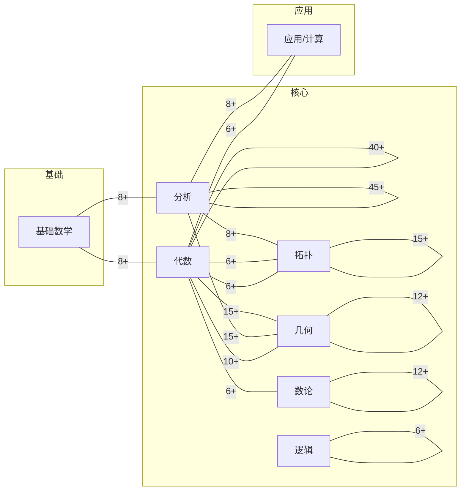

# FormalMath 跨分支链接导航索引

**创建日期**: 2026年2月2日
**数据源**: [cross-branch-links.yaml](./cross-branch-links.yaml)
**设计文档**: [00-跨分支链接系统设计文档](../00-跨分支链接系统设计文档-2026年2月2日.md)
**总链接数**: 200

---

## 📋 说明

本索引为跨分支概念链接的导航入口。完整数据（source、target、type、description 等）见 `cross-branch-links.yaml`。校验脚本：项目根下 `tools/检查跨分支链接.ps1`。

---

## 🧭 按分支对浏览

以下为链接数量较多的分支对（便于按主题浏览）。完整 200 条均含 `branch_pair` 字段。

| 分支对 | 说明 | 约数量 |
|--------|------|--------|
| **代数-代数** | 群、环、域、向量空间、线性映射、表示等 | 40+ |
| **分析-分析** | 极限、连续、导数、积分、级数、实/复分析、泛函分析等 | 45+ |
| **分析-几何** | 流形、Stokes、微分形式、曲率、Poincaré 等 | 15+ |
| **代数-几何** | 概形、交换代数、层、Hilbert 零点等 | 15+ |
| **拓扑-拓扑** | 拓扑空间、同伦、同调、紧性、基本群等 | 15+ |
| **几何-几何** | 流形、黎曼流形、曲率、微分几何等 | 12+ |
| **数论-数论** | 素数、同余、L 函数、二次互反等 | 12+ |
| **基础-基础** | 集合、函数、ZFC、自然数构造等 | 8+ |
| **逻辑-逻辑** | 命题逻辑、谓词逻辑、形式化证明、模型论等 | 6+ |
| **分析-拓扑** | 泛函、紧性、Baire、Ascoli 等 | 8+ |
| **几何-代数** | 概形、层上同调、Riemann-Roch 等 | 10+ |
| **拓扑-代数** | 同调代数、Poincaré 对偶、Hurewicz 等 | 6+ |
| **应用-*** | 概率、机器学习、控制论、数据科学等 | 6+ |
| 其他 | 计算-分析、离散-代数、组合-基础等 | 若干 |

*注：约数量为目测区间，精确统计可对 `cross-branch-links.yaml` 按 `branch_pair` 聚合。*

---

## 📐 按链接类型浏览

| 类型 | 说明 |
|------|------|
| **先修** | 概念 A 为概念 B 的先修知识 |
| **应用** | 概念/定理在另一分支的应用 |
| **推广** | 概念 A 是概念 B 的推广或特例 |
| **交叉** | 两分支共用的桥梁概念 |

完整数据中每条链接均含 `type` 字段。

---

## 📂 按文档查询

- **源文档 → 出链**：在 `cross-branch-links.yaml` 中搜索 `source: "路径"`。
- **目标文档 → 入链**：在 `cross-branch-links.yaml` 中搜索 `target: "路径"`。
- 路径均为相对项目根的路径（如 `concept/核心概念/08-群.md`）。

---

## 📐 链接可视化（分支级图）

以下为分支级关联图：节点为数学分支，边上的数字为链接数量（约）。数据来源：`cross-branch-links.yaml` 按 `branch_pair` 聚合。

*说明：同一分支内为自环（如代数-代数 40+）；上图为简化示意，完整边权见「按分支对浏览」表。*

---

## ✅ 导航与可视化状态

- [x] 链接数据（200 条）与校验脚本
- [x] 本导航索引（按分支对、按类型、使用说明）
- [x] 链接可视化（分支级 Mermaid 图，见上文）
- [ ] 按文档的自动索引页（可由脚本从 yaml 生成）
- [ ] 交互式可视化（可选，见设计文档 §4）

---

**文档版本**: v1.1
**最后更新**: 2026年2月2日
