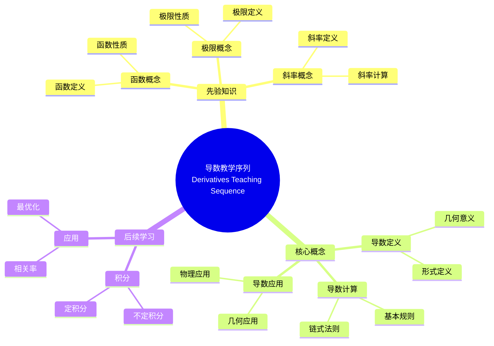

# 概念映射"导数"的教学序列和课程计划

Concept Mapping a Teaching Sequence and Lesson Plan for "Derivatives"

**创建日期**: 2025年12月11日
**创建日期**: December 11, 2025
**研究领域**: 数学教育 - 概念映射 - 中等数学 - 导数
**研究领域**: Mathematics Education - Concept Mapping - Secondary Mathematics - Derivatives
**主题编号**: CM.03.03
**章节**: Chapter 8
**作者**: Karoline Afamasaga-Fuata'i
**优先级**: P0（最高优先级）⭐⭐⭐⭐⭐

---

## 📑 目录 / Table of Contents

- [概念映射"导数"的教学序列和课程计划](#概念映射导数的教学序列和课程计划)
  - [📑 目录 / Table of Contents](#-目录--table-of-contents)
  - [📋 一、概述 / Overview](#-一概述--overview)
    - [1.1 研究目标 / Research Objectives](#11-研究目标--research-objectives)
    - [1.2 案例研究对象 / Case Study Subject](#12-案例研究对象--case-study-subject)
    - [1.3 核心内容 / Core Content](#13-核心内容--core-content)
  - [🔬 二、研究方法 / Research Methodology](#-二研究方法--research-methodology)
    - [2.1 研究设计 / Research Design](#21-研究设计--research-design)
    - [2.2 数据收集 / Data Collection](#22-数据收集--data-collection)
    - [2.3 分析框架 / Analysis Framework](#23-分析框架--analysis-framework)
  - [📚 三、概览概念映射 / Overview Concept Maps](#-三概览概念映射--overview-concept-maps)
    - [3.1 Year 11 概览概念映射](#31-year-11-概览概念映射)
    - [3.2 Year 12 概览概念映射](#32-year-12-概览概念映射)
    - [3.3 概览映射的作用 / Role of Overview Maps](#33-概览映射的作用--role-of-overview-maps)
  - [📐 四、导数数学内容深度分析 / Deep Analysis of Derivative Mathematical Content](#-四导数数学内容深度分析--deep-analysis-of-derivative-mathematical-content)
    - [4.1 导数的数学定义与本质 / Mathematical Definition and Essence of Derivatives](#41-导数的数学定义与本质--mathematical-definition-and-essence-of-derivatives)
      - [4.1.1 导数的基本定义 / Basic Definition of Derivatives](#411-导数的基本定义--basic-definition-of-derivatives)
      - [4.1.2 导数的数学性质 / Mathematical Properties of Derivatives](#412-导数的数学性质--mathematical-properties-of-derivatives)
    - [4.2 导数的应用 / Applications of Derivatives](#42-导数的应用--applications-of-derivatives)
      - [4.2.1 几何应用 / Geometric Applications](#421-几何应用--geometric-applications)
      - [4.2.2 极值问题 / Extremum Problems](#422-极值问题--extremum-problems)
    - [4.3 导数与其他数学概念的关联 / Relationships Between Derivatives and Other Mathematical Concepts](#43-导数与其他数学概念的关联--relationships-between-derivatives-and-other-mathematical-concepts)
      - [4.3.1 导数与极限 / Derivatives and Limits](#431-导数与极限--derivatives-and-limits)
      - [4.3.2 导数与积分 / Derivatives and Integrals](#432-导数与积分--derivatives-and-integrals)
    - [4.4 导数数学内容典型例题 / Typical Examples of Derivative Mathematical Content](#44-导数数学内容典型例题--typical-examples-of-derivative-mathematical-content)
      - [4.4.1 导数定义与计算 / Derivative Definition and Calculation](#441-导数定义与计算--derivative-definition-and-calculation)
      - [4.4.2 导数法则的应用 / Application of Derivative Rules](#442-导数法则的应用--application-of-derivative-rules)
      - [4.4.3 导数在实际问题中的应用 / Application of Derivatives in Real-World Problems](#443-导数在实际问题中的应用--application-of-derivatives-in-real-world-problems)
    - [4.5 跨主题关联小结 / Cross-Topic Association Summary](#45-跨主题关联小结--cross-topic-association-summary)
      - [4.5.1 导数与函数性质的关联 / Association Between Derivatives and Function Properties](#451-导数与函数性质的关联--association-between-derivatives-and-function-properties)
      - [4.5.2 导数与积分的关联 / Association Between Derivatives and Integrals](#452-导数与积分的关联--association-between-derivatives-and-integrals)
  - [📐 五、教学序列概念映射 / Teaching Sequence Concept Map](#-五教学序列概念映射--teaching-sequence-concept-map)
    - [5.1 教学序列结构 / Teaching Sequence Structure](#51-教学序列结构--teaching-sequence-structure)
    - [5.2 教学序列特点 / Teaching Sequence Characteristics](#52-教学序列特点--teaching-sequence-characteristics)
    - [5.3 教学序列设计过程与具体内容 / Teaching Sequence Design Process and Specific Content](#53-教学序列设计过程与具体内容--teaching-sequence-design-process-and-specific-content)
      - [5.3.1 概览映射的构建过程 / Overview Map Construction Process](#531-概览映射的构建过程--overview-map-construction-process)
      - [5.3.2 教学序列概念映射的具体结构 / Specific Structure of Teaching Sequence Concept Map](#532-教学序列概念映射的具体结构--specific-structure-of-teaching-sequence-concept-map)
      - [5.3.3 概念映射在教学序列设计中的作用 / Role of Concept Maps in Teaching Sequence Design](#533-概念映射在教学序列设计中的作用--role-of-concept-maps-in-teaching-sequence-design)
  - [📝 六、课程计划概念映射 / Lesson Plan Concept Map](#-六课程计划概念映射--lesson-plan-concept-map)
    - [6.1 课程计划结构 / Lesson Plan Structure](#61-课程计划结构--lesson-plan-structure)
    - [6.2 课程计划特点 / Lesson Plan Characteristics](#62-课程计划特点--lesson-plan-characteristics)
  - [💡 七、反思与洞察 / Reflections and Insights](#-七反思与洞察--reflections-and-insights)
    - [7.1 Bobby的反思 / Bobby's Reflections](#71-bobby的反思--bobbys-reflections)
    - [7.2 主要洞察 / Key Insights](#72-主要洞察--key-insights)
  - [📈 八、思维表征方式 / Representation Methods](#-八思维表征方式--representation-methods)
    - [8.1 导数教学序列思维导图 / Derivatives Teaching Sequence Mind Map](#81-导数教学序列思维导图--derivatives-teaching-sequence-mind-map)
    - [8.2 教学序列设计决策树 / Teaching Sequence Design Decision Tree](#82-教学序列设计决策树--teaching-sequence-design-decision-tree)
    - [8.3 教学规划证明树 / Teaching Planning Proof Tree](#83-教学规划证明树--teaching-planning-proof-tree)
  - [📚 九、参考文献 / References](#-九参考文献--references)
    - [9.1 主要参考文献 / Main References](#91-主要参考文献--main-references)
    - [9.2 相关研究 / Related Research](#92-相关研究--related-research)

---

## 📋 一、概述 / Overview

### 1.1 研究目标 / Research Objectives

**主要目标 / Main Objectives**:

- 展示概念映射如何提供两年数学课程的宏观视图
- Demonstrating how concept maps can provide a macro view of a two-year mathematics curriculum
- 展示如何创新开发导数的教学序列和课程计划
- Demonstrating how to innovatively develop a teaching sequence and lesson plan on Derivatives
- 展示概念映射在教学规划中的应用
- Demonstrating the application of concept mapping in teaching planning

### 1.2 案例研究对象 / Case Study Subject

**研究对象 / Subject**:

- **姓名**: Bobby（化名）
- **身份**: 中等数学职前教师
  Secondary preservice mathematics teacher
- **任务**: 开发导数的教学序列和两个连续课程
  Task: Develop teaching sequence and two consecutive lessons on Derivatives
- **课程**: 高级中等数学教育课程Assignment 1
  Senior secondary mathematics education course Assignment 1

### 1.3 核心内容 / Core Content

**主要内容 / Main Content**:

1. **概览概念映射** - 两年数学课程的概览概念映射
   Overview Concept Maps - Overview concept maps of two-year mathematics curriculum
2. **教学序列概念映射** - 导数主题的教学序列概念映射
   Teaching Sequence Concept Map - Teaching sequence concept map for Derivatives topic
3. **课程计划概念映射** - 具体课程的概念映射
   Lesson Plan Concept Map - Concept map for specific lessons
4. **反思与洞察** - Bobby的反思和洞察
   Reflections and Insights - Bobby's reflections and insights

---

## 🔬 二、研究方法 / Research Methodology

### 2.1 研究设计 / Research Design

**研究方法 / Research Method**: 案例研究 / Case Study

**研究任务 / Research Tasks**:

1. **概览映射** - 构建两年数学课程的概览概念映射
   Overview Mapping - Construct overview concept maps of two-year mathematics curriculum
2. **教学序列映射** - 构建导数主题的教学序列概念映射
   Teaching Sequence Mapping - Construct teaching sequence concept map for Derivatives topic
3. **课程计划映射** - 构建具体课程的概念映射
   Lesson Plan Mapping - Construct concept maps for specific lessons

### 2.2 数据收集 / Data Collection

**收集的数据类型 / Types of Data Collected**:

1. **概览概念映射** - 14个概览概念映射（仅显示2个）
2. **教学序列概念映射** - 导数主题的教学序列概念映射
3. **课程计划概念映射** - 两个连续课程的概念映射
4. **反思日志** - Bobby的反思日志

### 2.3 分析框架 / Analysis Framework

**概念映射分析 / Concept Map Analysis**:

- 分析概念映射结构
- Analyze concept map structure
- 评估概念层次组织
- Evaluate conceptual hierarchical organization
- 识别教学序列
- Identify teaching sequences

---

## 📚 三、概览概念映射 / Overview Concept Maps

### 3.1 Year 11 概览概念映射

**主要结构 / Main Structure**:

- **Level 1**: Year 11 Mathematics
- **Level 2**:
  - (A) Building Blocks of Functions
  - (B) Real Functions
  - (C) Examples of Functions

**Real Functions分支 / Real Functions Branch**:

- **Level 3**:
  - I. Foundations
  - II. The Slope Problem（标记*，与导数相关）
  - III. Introduction: Product, Quotient and Chain Rule

**教学序列 / Teaching Sequence**:

- 顺序A, B, C表示首选教学序列
  Order A, B, C indicates preferred teaching sequence
- 顺序I, II, III表示导数主题内的教学序列
  Order I, II, III indicates teaching sequence within Derivatives topic

### 3.2 Year 12 概览概念映射

**主要结构 / Main Structure**:

- **Level 1**: Year 12 Mathematics
- **Level 4**:
  - HSC (2 Unit) Mathematics topics/units
  - HSC (3 Unit) Mathematics Extension I topics/units

**Calculus分支 / Calculus Branch**:

- **Level 5**: II. Calculus（标记*）
- **Level 6**:
  - 1. Geometric Applications of Differentiation
  - 1. Integration

**Applications分支 / Applications Branch**:

- **Level 5**: 1. Applications of Calculus to the Physical World（标记**）
- **Level 6**:
  - (1) Related Rates
  - (2) Growth and Decay
  - (3) Rectilinear Motion
  - (4) Simple Harmonic Motion
  - (5) Motion of Projectiles

### 3.3 概览映射的作用 / Role of Overview Maps

**主要作用 / Main Functions**:

1. **宏观定位** - 将导数主题定位在两年课程中
   Macro Positioning - Position Derivatives topic within two-year curriculum
2. **概念关联** - 展示导数与其他主题的关联
   Concept Relationships - Show relationships between Derivatives and other topics
3. **教学序列** - 提供教学序列指导
   Teaching Sequence - Provide teaching sequence guidance

---

## 📐 四、导数数学内容深度分析 / Deep Analysis of Derivative Mathematical Content

### 4.1 导数的数学定义与本质 / Mathematical Definition and Essence of Derivatives

#### 4.1.1 导数的基本定义 / Basic Definition of Derivatives

**几何定义 / Geometric Definition**:

$$f'(x) = \lim_{h \to 0} \frac{f(x+h) - f(x)}{h}$$

- 导数表示函数图像在点 $(x, f(x))$ 处的切线斜率
- Derivative represents the slope of the tangent line to the function graph at point $(x, f(x))$

**极限定义 / Limit Definition**:

$$f'(x) = \lim_{\Delta x \to 0} \frac{\Delta y}{\Delta x} = \lim_{\Delta x \to 0} \frac{f(x+\Delta x) - f(x)}{\Delta x}$$

- 导数是函数变化率的极限
- Derivative is the limit of the rate of change of the function

**物理定义 / Physical Definition**:

- 如果 $s(t)$ 表示位移，则 $s'(t) = v(t)$ 表示瞬时速度
- If $s(t)$ represents displacement, then $s'(t) = v(t)$ represents instantaneous velocity
- 如果 $v(t)$ 表示速度，则 $v'(t) = a(t)$ 表示瞬时加速度
- If $v(t)$ represents velocity, then $v'(t) = a(t)$ represents instantaneous acceleration

#### 4.1.2 导数的数学性质 / Mathematical Properties of Derivatives

**线性性 / Linearity**:

$$(af + bg)' = af' + bg'$$

其中 $a$ 和 $b$ 是常数

- where $a$ and $b$ are constants

**乘积法则 / Product Rule**:

$$(fg)' = f'g + fg'$$

**商法则 / Quotient Rule**:

$$\left(\frac{f}{g}\right)' = \frac{f'g - fg'}{g^2}$$

**链式法则 / Chain Rule**:

$$(f \circ g)'(x) = f'(g(x)) \cdot g'(x)$$

### 4.2 导数的应用 / Applications of Derivatives

#### 4.2.1 几何应用 / Geometric Applications

- **切线方程**: $y - f(a) = f'(a)(x - a)$
- **Tangent Line Equation**: $y - f(a) = f'(a)(x - a)$
- **函数单调性**: $f'(x) > 0$ 表示函数递增，$f'(x) < 0$ 表示函数递减
- **Function Monotonicity**: $f'(x) > 0$ means function is increasing, $f'(x) < 0$ means function is decreasing

#### 4.2.2 极值问题 / Extremum Problems

- **极值条件**: 如果 $f'(c) = 0$ 或 $f'(c)$ 不存在，则 $c$ 可能是极值点
- **Extremum Condition**: If $f'(c) = 0$ or $f'(c)$ does not exist, then $c$ may be an extremum point
- **二阶导数判别**: $f''(c) > 0$ 表示局部最小值，$f''(c) < 0$ 表示局部最大值
- **Second Derivative Test**: $f''(c) > 0$ indicates local minimum, $f''(c) < 0$ indicates local maximum

### 4.3 导数与其他数学概念的关联 / Relationships Between Derivatives and Other Mathematical Concepts

#### 4.3.1 导数与极限 / Derivatives and Limits

- 导数的定义依赖于极限概念
- Definition of derivative depends on limit concept
- 连续函数不一定可导，但可导函数一定连续
- Continuous functions are not necessarily differentiable, but differentiable functions are continuous

#### 4.3.2 导数与积分 / Derivatives and Integrals

- **微积分基本定理**: $\int_a^b f'(x) dx = f(b) - f(a)$
- **Fundamental Theorem of Calculus**: $\int_a^b f'(x) dx = f(b) - f(a)$
- 导数和积分是互逆运算
- Derivatives and integrals are inverse operations

### 4.4 导数数学内容典型例题 / Typical Examples of Derivative Mathematical Content

#### 4.4.1 导数定义与计算 / Derivative Definition and Calculation

**例题 / Example**:

- 使用导数的定义求函数 $f(x) = x^2$ 在 $x = 3$ 处的导数。
- Use the definition of derivative to find the derivative of $f(x) = x^2$ at $x = 3$.

**解答 / Solution**:

**步骤1 / Step 1**: 应用导数定义

- Apply derivative definition

$$f'(3) = \lim_{h \to 0} \frac{f(3+h) - f(3)}{h} = \lim_{h \to 0} \frac{(3+h)^2 - 3^2}{h}$$

**步骤2 / Step 2**: 展开并化简

- Expand and simplify

$$= \lim_{h \to 0} \frac{9 + 6h + h^2 - 9}{h} = \lim_{h \to 0} \frac{6h + h^2}{h} = \lim_{h \to 0} (6 + h)$$

**步骤3 / Step 3**: 求极限

- Evaluate limit

$$= 6 + 0 = 6$$

**答案 / Answer**: $f'(3) = 6$

**数学意义 / Mathematical Meaning**:

- **导数定义的直接应用**: 这道题展示了如何使用导数的极限定义直接计算导数，体现了导数作为变化率极限的本质。
- **Direct Application of Derivative Definition**: This problem demonstrates how to directly calculate derivatives using the limit definition, demonstrating the essence of derivatives as limits of rates of change.

- **极限运算的重要性**: 导数的计算依赖于极限运算，这体现了微积分中极限概念的基础地位。
- **Importance of Limit Operations**: Derivative calculations depend on limit operations, demonstrating the fundamental position of limit concepts in calculus.

#### 4.4.2 导数法则的应用 / Application of Derivative Rules

**例题 / Example**:

- 求函数 $f(x) = (x^2 + 1)(x^3 - 2x)$ 的导数。
- Find the derivative of the function $f(x) = (x^2 + 1)(x^3 - 2x)$.

**解答 / Solution**:

**方法1：乘积法则 / Method 1: Product Rule**

设 $u(x) = x^2 + 1$，$v(x) = x^3 - 2x$

- Let $u(x) = x^2 + 1$, $v(x) = x^3 - 2x$

则 $u'(x) = 2x$，$v'(x) = 3x^2 - 2$

- Then $u'(x) = 2x$, $v'(x) = 3x^2 - 2$

应用乘积法则：

- Apply product rule:

$$f'(x) = u'(x)v(x) + u(x)v'(x)$$

$$= 2x(x^3 - 2x) + (x^2 + 1)(3x^2 - 2)$$

$$= 2x^4 - 4x^2 + 3x^4 - 2x^2 + 3x^2 - 2$$

$$= 5x^4 - 3x^2 - 2$$

**方法2：先展开再求导 / Method 2: Expand Then Differentiate**

$$f(x) = (x^2 + 1)(x^3 - 2x) = x^5 - 2x^3 + x^3 - 2x = x^5 - x^3 - 2x$$

$$f'(x) = 5x^4 - 3x^2 - 2$$

**答案 / Answer**: $f'(x) = 5x^4 - 3x^2 - 2$

**数学意义 / Mathematical Meaning**:

- **乘积法则的实用性**: 乘积法则提供了计算两个函数乘积导数的有效方法，避免了先展开再求导的繁琐过程。
- **Practicality of Product Rule**: The product rule provides an effective method for calculating the derivative of the product of two functions, avoiding the tedious process of expanding first then differentiating.

- **方法选择的灵活性**: 两种方法得到相同结果，体现了数学方法的多样性和一致性。选择哪种方法取决于具体问题的特点。
- **Flexibility in Method Selection**: Both methods yield the same result, demonstrating the diversity and consistency of mathematical methods. Which method to choose depends on the characteristics of the specific problem.

#### 4.4.3 导数在实际问题中的应用 / Application of Derivatives in Real-World Problems

**例题 / Example**:

- 一个矩形的周长为20米。当矩形的长和宽各为多少时，面积最大？
- A rectangle has a perimeter of 20 meters. What should be the length and width for maximum area?

**解答 / Solution**:

**步骤1 / Step 1**: 建立数学模型

- Establish mathematical model

设长为 $x$ 米，宽为 $y$ 米

- Let length be $x$ meters, width be $y$ meters

根据周长条件：$2(x + y) = 20$，即 $x + y = 10$，所以 $y = 10 - x$

- According to perimeter condition: $2(x + y) = 20$, i.e., $x + y = 10$, so $y = 10 - x$

面积函数：$A(x) = x \cdot y = x(10 - x) = 10x - x^2$

- Area function: $A(x) = x \cdot y = x(10 - x) = 10x - x^2$

**步骤2 / Step 2**: 求导数

- Find derivative

$$A'(x) = 10 - 2x$$

**步骤3 / Step 3**: 求临界点

- Find critical points

令 $A'(x) = 0$：

- Set $A'(x) = 0$:

$$10 - 2x = 0$$

$$x = 5$$

**步骤4 / Step 4**: 验证最大值

- Verify maximum

$$A''(x) = -2 < 0$$

因此 $x = 5$ 是最大值点

- Therefore $x = 5$ is a maximum point

当 $x = 5$ 时，$y = 10 - 5 = 5$

- When $x = 5$, $y = 10 - 5 = 5$

**答案 / Answer**: 当长为5米、宽为5米（即正方形）时，面积最大，最大面积为25平方米。

**数学意义 / Mathematical Meaning**:

- **优化问题的导数方法**: 这道题展示了如何使用导数解决优化问题：建立目标函数、求导数、找临界点、验证极值。这是导数在实际问题中的重要应用。
- **Derivative Method for Optimization Problems**: This problem demonstrates how to use derivatives to solve optimization problems: establish objective function, find derivative, locate critical points, verify extrema. This is an important application of derivatives in practical problems.

- **几何直觉与数学证明**: 直觉上，周长固定的矩形中，正方形面积最大。通过导数方法，我们可以严格证明这一结论，体现了数学证明的力量。
- **Geometric Intuition and Mathematical Proof**: Intuitively, among rectangles with fixed perimeter, the square has maximum area. Through the derivative method, we can rigorously prove this conclusion, demonstrating the power of mathematical proof.

### 4.5 跨主题关联小结 / Cross-Topic Association Summary

#### 4.5.1 导数与函数性质的关联 / Association Between Derivatives and Function Properties

**核心关联 / Core Association**:

导数与函数的性质（单调性、极值、凹凸性）有着深刻的联系。导数不仅是函数性质的研究工具，更是函数性质的本质特征。

**数学结构分析 / Mathematical Structure Analysis**:

- **导数与单调性**: 函数在区间上的单调性完全由导数的符号决定：$f'(x) > 0$ 时函数单调递增，$f'(x) < 0$ 时函数单调递减。这体现了导数作为"变化率"与函数"变化趋势"之间的本质联系。
- **Derivative and Monotonicity**: The monotonicity of a function on an interval is completely determined by the sign of its derivative: $f'(x) > 0$ means the function is increasing, $f'(x) < 0$ means the function is decreasing. This demonstrates the essential connection between derivative as "rate of change" and function's "change trend".
- **导数与极值**: 函数的极值点出现在导数为零或导数不存在的点（临界点）。二阶导数 $f''(x)$ 的符号决定极值的类型：$f''(x) > 0$ 为极小值，$f''(x) < 0$ 为极大值。这体现了导数在极值分析中的核心作用。
- **Derivative and Extrema**: Function extrema occur at points where the derivative is zero or does not exist (critical points). The sign of the second derivative $f''(x)$ determines the type of extremum: $f''(x) > 0$ means minimum, $f''(x) < 0$ means maximum. This demonstrates the core role of derivatives in extremum analysis.
- **导数与凹凸性**: 函数的凹凸性由二阶导数决定：$f''(x) > 0$ 时函数凹向上（凸），$f''(x) < 0$ 时函数凹向下（凹）。拐点出现在二阶导数为零或不存在且符号改变的点。这体现了高阶导数在函数性质分析中的作用。
- **Derivative and Concavity**: The concavity of a function is determined by the second derivative: $f''(x) > 0$ means the function is concave up (convex), $f''(x) < 0$ means the function is concave down (concave). Inflection points occur where the second derivative is zero or does not exist and changes sign. This demonstrates the role of higher-order derivatives in function property analysis.

**应用扩展 / Application Extensions**:

- **导数在函数图像分析中的应用**: 通过分析导数的符号和零点，可以确定函数的单调区间、极值点和拐点，从而绘制函数的精确图像。
- **Application of Derivatives in Function Graph Analysis**: By analyzing the sign and zeros of derivatives, we can determine monotonic intervals, extremum points, and inflection points of functions, thereby drawing precise function graphs.

**数学意义 / Mathematical Meaning**:

- **导数作为函数性质的本质**: 导数不仅是研究函数性质的工具，更是函数性质的本质特征。函数的单调性、极值、凹凸性都可以通过导数来精确描述和判断。
- **Derivative as Essence of Function Properties**: Derivatives are not only tools for studying function properties but also essential characteristics of function properties. Monotonicity, extrema, and concavity of functions can all be precisely described and determined through derivatives.

- **理论深度**: 导数与函数性质的关联体现了微积分作为研究函数性质的理论框架的完整性，为理解函数行为提供了系统的数学工具。
- **Theoretical Depth**: The association between derivatives and function properties demonstrates the completeness of calculus as a theoretical framework for studying function properties, providing systematic mathematical tools for understanding function behavior.

#### 4.5.2 导数与积分的关联 / Association Between Derivatives and Integrals

**核心关联 / Core Association**:

导数与积分通过微积分基本定理联系起来，两者是互逆运算。这种关联不仅体现在计算上，更深层地体现了微积分理论的统一性。

**数学结构分析 / Mathematical Structure Analysis**:

- **微积分基本定理**: 微积分基本定理 $\int_a^b f'(x)dx = f(b) - f(a)$ 建立了导数与积分之间的深刻联系。这一定理表明：函数在区间上的积分等于其原函数在区间端点处的函数值之差。
- **Fundamental Theorem of Calculus**: The fundamental theorem of calculus $\int_a^b f'(x)dx = f(b) - f(a)$ establishes a deep connection between derivatives and integrals. This theorem shows that the integral of a function over an interval equals the difference of its antiderivative at the interval endpoints.
- **导数与积分的互逆性**: 如果 $F(x) = \int_a^x f(t)dt$，则 $F'(x) = f(x)$。这表明积分是导数的逆运算，导数也是积分的逆运算（在适当条件下）。这种互逆性体现了微积分运算的对称性。
- **Inverse Relationship Between Derivatives and Integrals**: If $F(x) = \int_a^x f(t)dt$, then $F'(x) = f(x)$. This shows that integration is the inverse of differentiation, and differentiation is also the inverse of integration (under appropriate conditions). This inverse relationship demonstrates the symmetry of calculus operations.
- **原函数与不定积分**: 导数的逆运算是不定积分，如果 $F'(x) = f(x)$，则 $\int f(x)dx = F(x) + C$，其中 $C$ 是常数。这体现了导数与积分在函数空间中的对偶关系。
- **Antiderivatives and Indefinite Integrals**: The inverse operation of differentiation is indefinite integration. If $F'(x) = f(x)$, then $\int f(x)dx = F(x) + C$, where $C$ is a constant. This demonstrates the dual relationship between derivatives and integrals in function spaces.

**应用扩展 / Application Extensions**:

- **定积分的计算**: 通过微积分基本定理，定积分的计算可以转化为求原函数，这大大简化了积分计算。
- **Calculation of Definite Integrals**: Through the fundamental theorem of calculus, calculation of definite integrals can be transformed into finding antiderivatives, greatly simplifying integration calculations.

**数学意义 / Mathematical Meaning**:

- **微积分理论的统一性**: 导数与积分的关联体现了微积分理论的统一性。两者不是孤立的运算，而是统一理论框架中的两个相互关联的部分。
- **Unity of Calculus Theory**: The association between derivatives and integrals demonstrates the unity of calculus theory. They are not isolated operations but two interconnected parts of a unified theoretical framework.

- **理论深度**: 微积分基本定理不仅是计算工具，更是微积分理论的核心，它揭示了变化率（导数）与累积量（积分）之间的深刻联系，为理解微积分的本质提供了理论基础。
- **Theoretical Depth**: The fundamental theorem of calculus is not only a computational tool but also the core of calculus theory. It reveals the deep connection between rate of change (derivative) and accumulated quantity (integral), providing a theoretical foundation for understanding the essence of calculus.

---

## 📐 五、教学序列概念映射 / Teaching Sequence Concept Map

### 5.1 教学序列结构 / Teaching Sequence Structure

**主要概念 / Main Concepts**:

- 导数概念 / Derivative concepts
- 斜率问题 / Slope problem
- 切线 / Tangent
- 极限 / Limit
- 微分 / Differentiation

**概念层次 / Concept Hierarchy**:

- 从最一般概念到最具体概念
  From most general to most specific concepts
- 展示概念之间的关联
  Show relationships between concepts
- 提供教学序列指导
  Provide teaching sequence guidance

### 5.2 教学序列特点 / Teaching Sequence Characteristics

**主要特点 / Main Characteristics**:

1. **概念完整性** - 包含所有关键概念
   Concept Completeness - Includes all key concepts
2. **层次清晰** - 概念层次结构清晰
   Clear Hierarchy - Conceptual hierarchy is clear
3. **关联明确** - 概念之间的关联明确
   Clear Relationships - Relationships between concepts are clear

### 5.3 教学序列设计过程与具体内容 / Teaching Sequence Design Process and Specific Content

本节基于Bobby的案例研究，详细描述他如何通过概念映射构建导数主题的教学序列，包括从概览映射到具体教学序列的完整过程。

#### 5.3.1 概览映射的构建过程 / Overview Map Construction Process

**第一步：构建Year 11和Year 12的概览概念映射 / Step 1: Constructing Year 11 and Year 12 Overview Concept Maps**

Bobby首先构建了14个概览概念映射（覆盖两年数学课程的所有单元），其中两个关键概览映射如下：

**Year 11 概览映射结构 / Year 11 Overview Map Structure**:

- **顶层**: Year 11 Mathematics
- **第二层（主要单元）**:
  - (A) Building Blocks of Functions（函数基础）
  - (B) Functions and Relations（函数与关系）
  - (C) Polynomial Functions（多项式函数）
  - (D) Exponential and Logarithmic Functions（指数与对数函数）
  - (E) Trigonometric Functions（三角函数）
  - (F) Differential Calculus（微分学）← 导数主题所在单元
- **第三层（F单元的子概念）**:
  - 斜率问题（Slope Problem）
  - 切线（Tangent）
  - 极限（Limit）
  - 导数（Derivative）
  - 微分（Differentiation）

**Year 12 概览映射结构 / Year 12 Overview Map Structure**:

- **顶层**: Year 12 Mathematics
- **第二层（主要单元）**:
  - (A) Further Differentiation（进一步微分）
  - (B) Applications of Derivatives（导数应用）
  - (C) Integration（积分）
  - (D) Applications of Integration（积分应用）
- **第三层（B单元的子概念）**:
  - 极值问题（Extremum Problems）
  - 优化问题（Optimization）
  - 相关率（Related Rates）
  - 曲线绘制（Curve Sketching）

**设计洞察 / Design Insights**:

- **"先定义整个空间"原则**: Bobby在反思中强调，必须首先构建概览映射来"定义整个（单元）空间"，然后才能精确定位导数单元在两年课程中的位置和与其他单元的关系。
- **纵向衔接**: 概览映射清晰地显示了导数从Year 11的"引入"到Year 12的"深化与应用"的纵向发展路径。

#### 5.3.2 教学序列概念映射的具体结构 / Specific Structure of Teaching Sequence Concept Map

**Bobby构建的导数教学序列概念映射包含以下层次 / Bobby's Derivative Teaching Sequence Concept Map Contains the Following Levels**:

**Level 1（顶层 / Top Level）**: 导数（Derivatives）

**Level 2（主要概念簇 / Main Concept Clusters）**:

1. **先验知识 / Prior Knowledge**:
   - 函数概念（Function Concepts）
   - 极限概念（Limit Concepts）
   - 斜率概念（Slope Concepts）

2. **核心概念 / Core Concepts**:
   - 导数定义（Derivative Definition）
   - 导数计算（Derivative Calculation）
   - 导数应用（Derivative Applications）

3. **后续学习 / Subsequent Learning**:
   - 积分（Integration）
   - 应用拓展（Application Extensions）

**Level 3（具体概念 / Specific Concepts）**:

- **导数定义下**: 形式定义（Formal Definition）、几何意义（Geometric Meaning）、物理意义（Physical Meaning）
- **导数计算下**: 基本规则（Basic Rules）、乘积法则（Product Rule）、商法则（Quotient Rule）、链式法则（Chain Rule）
- **导数应用下**: 几何应用（切线、单调性）、物理应用（速度、加速度）、优化问题（极值、最优化）

**教学序列建议 / Teaching Sequence Recommendations**（基于概念映射的层次结构）:

1. **第1-2课时**: 回顾先验知识（函数、极限、斜率），建立导数概念的直观基础
2. **第3-4课时**: 引入导数定义（从斜率问题出发，通过极限定义导数）
3. **第5-7课时**: 学习导数计算（基本规则、乘积法则、商法则、链式法则）
4. **第8-10课时**: 导数应用（几何应用、物理应用、优化问题）

#### 5.3.3 概念映射在教学序列设计中的作用 / Role of Concept Maps in Teaching Sequence Design

**概念映射提供的设计指导 / Design Guidance Provided by Concept Maps**:

1. **概念依赖关系**: 概念映射清晰地显示了哪些概念是其他概念的前提（如"极限"是"导数定义"的前提）。
2. **教学顺序**: 概念映射的层次结构直接提示了教学顺序（从一般到具体，从基础到应用）。
3. **概念关联**: 跨链接显示了不同概念簇之间的关联（如"导数"与"积分"的互逆关系），提示在教学中需要建立这些关联。

---

## 📝 六、课程计划概念映射 / Lesson Plan Concept Map

### 6.1 课程计划结构 / Lesson Plan Structure

**主要组成部分 / Main Components**:

1. **教学目标** - 课程的教学目标
   Learning Objectives - Learning objectives of the lesson
2. **核心概念** - 课程的核心概念
   Core Concepts - Core concepts of the lesson
3. **教学序列** - 课程的教学序列
   Teaching Sequence - Teaching sequence of the lesson
4. **评估方法** - 课程的评估方法
   Assessment Methods - Assessment methods of the lesson

### 6.2 课程计划特点 / Lesson Plan Characteristics

**主要特点 / Main Characteristics**:

1. **概念聚焦** - 聚焦于核心概念
   Concept Focus - Focus on core concepts
2. **序列清晰** - 教学序列清晰
   Clear Sequence - Teaching sequence is clear
3. **评估整合** - 评估方法整合到课程中
   Assessment Integration - Assessment methods integrated into lesson

---

## 💡 七、反思与洞察 / Reflections and Insights

### 7.1 Bobby的反思 / Bobby's Reflections

**主要反思 / Main Reflections**:

1. **概念映射维度** - 识别概念映射的不同维度
   Concept Map Dimensions - Identified different dimensions of concept maps
2. **知识建构** - 理解知识建构过程
   Knowledge Construction - Understood knowledge construction process
3. **教学规划** - 理解教学规划过程
   Teaching Planning - Understood teaching planning process

### 7.2 主要洞察 / Key Insights

**主要洞察 / Key Insights**:

1. **先定义整个空间** - "我必须首先定义整个（单元）空间，然后才能尝试定义（单元）本身"
   Define Entire Space First - "I must firstly define the entire space of the (unit) before attempting to define the (unit) itself"
2. **概念映射类型** - 区分"先验知识建构映射"和"最佳描述映射"
   Concept Map Types - Distinguished between "prior-knowledge construct map" and "best description map"
3. **教学理解** - 发展对教学的理解
   Pedagogical Understanding - Developed understanding of teaching

---

## 📈 八、思维表征方式 / Representation Methods

### 8.1 导数教学序列思维导图 / Derivatives Teaching Sequence Mind Map



### 8.2 教学序列设计决策树 / Teaching Sequence Design Decision Tree

```text
如何设计导数教学序列？
├─ 学生先验知识是什么？
│  ├─ 函数概念
│  │  └─ ✅ 确保学生理解函数
│  │     └─ 重点：函数定义、性质
│  ├─ 极限概念
│  │  └─ ✅ 确保学生理解极限
│  │     └─ 重点：极限定义、计算
│  └─ 斜率概念
│     └─ ✅ 确保学生理解斜率
│        └─ 重点：斜率定义、几何意义
├─ 教学重点是什么？
│  ├─ 概念理解
│  │  └─ ✅ 强调导数概念
│  │     └─ 重点：导数定义、几何意义
│  ├─ 计算技能
│  │  └─ ✅ 强调导数计算
│  │     └─ 重点：基本规则、链式法则
│  └─ 应用能力
│     └─ ✅ 强调导数应用
│        └─ 重点：几何应用、物理应用
└─ 教学序列如何安排？
   ├─ 从具体到抽象
   │  └─ ✅ 从斜率问题开始
   │     └─ 序列：斜率 → 切线 → 导数
   ├─ 从简单到复杂
   │  └─ ✅ 从基本概念开始
   │     └─ 序列：定义 → 计算 → 应用
   └─ 从局部到整体
      └─ ✅ 从单个概念开始
         └─ 序列：导数 → 积分 → 应用
```

### 8.3 教学规划证明树 / Teaching Planning Proof Tree

```text
【目标】证明：概念映射有效支持教学序列设计
【Goal】Prove: Concept mapping effectively supports teaching sequence design

自底向上证明树 / Bottom-Up Proof Tree:

层次1（理论前提 / Theoretical Premises）
├─ 前提1：教学规划理论
│  └─ 支持：教学序列需要概念分析
├─ 前提2：概念映射理论
│  └─ 支持：概念映射提供概念分析工具
└─ 前提3：有意义学习理论
   └─ 支持：概念映射促进有意义学习

层次2（机制论证 / Mechanism Argument）
├─ 机制1：概念分析机制
│  ├─ 过程：分析课程概念结构
│  ├─ 工具：概念映射提供分析框架
│  └─ 结果：识别关键概念和关联
├─ 机制2：序列设计机制
│  ├─ 过程：基于概念结构设计序列
│  ├─ 工具：概念映射显示概念层次
│  └─ 结果：设计合理教学序列
└─ 机制3：课程规划机制
   ├─ 过程：规划具体课程
   ├─ 工具：概念映射指导课程设计
   └─ 结果：设计有效课程

层次3（实证证据 / Empirical Evidence）
├─ 证据1：Bobby案例研究
│  ├─ 方法：分析概念映射构建过程
│  ├─ 结果：成功设计教学序列和课程
│  └─ 解释：概念映射有效支持设计
└─ 证据2：概览映射证据
   ├─ 方法：分析概览概念映射
   ├─ 结果：提供宏观视图和序列指导
   └─ 解释：概览映射有效支持规划

层次4（综合结论 / Comprehensive Conclusion）
└─ 结论：概念映射有效支持教学序列设计
   ├─ 理论机制明确
   ├─ 实证证据支持
   └─ 应用效果显著
```

---

## 📚 九、参考文献 / References

### 9.1 主要参考文献 / Main References

1. **Afamasaga-Fuata'i, K. (2009)**. Concept Mapping a Teaching Sequence and Lesson Plan for "Derivatives". In K. Afamasaga-Fuata'i (Ed.), *Concept Mapping in Mathematics: Research into Practice* (pp. 149-169). Springer.

2. **Ausubel, D. P. (2000)**. *The Acquisition and Retention of Knowledge: A Cognitive View*. Kluwer Academic Publishers.

3. **Novak, J. D., & Gowin, D. B. (1984)**. *Learning How to Learn*. Cambridge University Press.

### 9.2 相关研究 / Related Research

1. **New South Wales Board of Studies (NSWBOS) (2002)**. *Mathematics 2/3 Unit - Years 11-12*. Sydney, Australia: NSWBOS.

2. **Schoenfeld, A. H. (1991)**. On mathematics as sense-making: An informal attack on the unfortunate divorce of formal and informal mathematics. In J. F. Voss, D. N. Perkins, & J. W. Segal (Eds.), *Informal reasoning and education* (pp. 311-343). Lawrence Erlbaum Associates.

---

**创建日期**: 2025年12月11日
**最后更新**: 2025年12月11日
**状态**: ✅ Chapter 8详细梳理文档已创建
**完成度**: 100%
