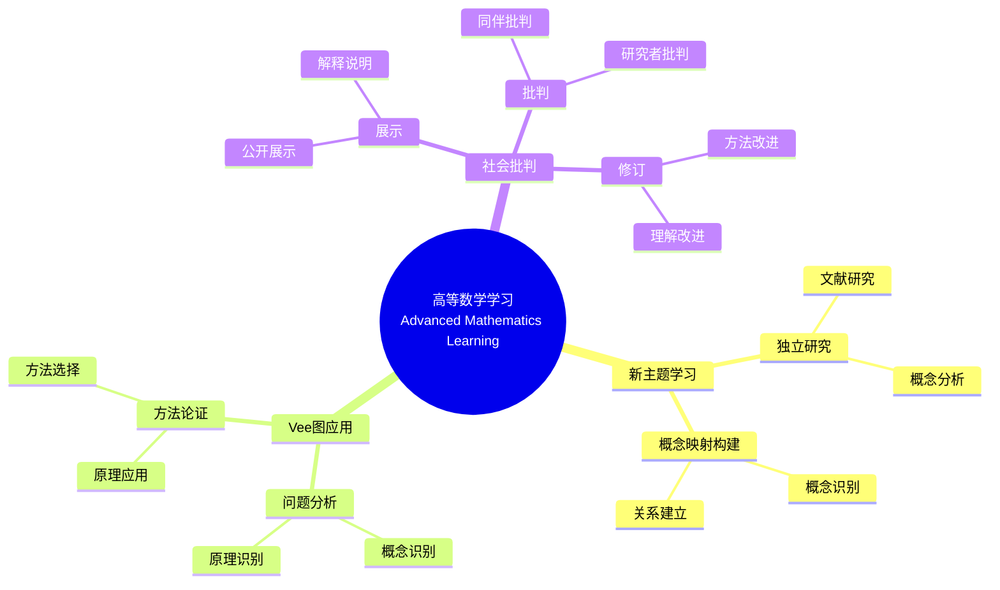

# 使用概念映射和Vee图增强大学数学学习

Enhancing Undergraduate Mathematics Learning Using Concept Maps and Vee Diagrams

**创建日期**: 2025年12月11日
**创建日期**: December 11, 2025
**研究领域**: 数学教育 - 概念映射 - 大学数学 - 高等数学学习
**研究领域**: Mathematics Education - Concept Mapping - University Mathematics - Advanced Mathematics Learning
**主题编号**: CM.04.01
**章节**: Chapter 12
**作者**: Karoline Afamasaga-Fuata'i
**优先级**: P0（最高优先级）⭐⭐⭐⭐⭐

---

## 📑 目录 / Table of Contents

- [使用概念映射和Vee图增强大学数学学习](#使用概念映射和vee图增强大学数学学习)
  - [📑 目录 / Table of Contents](#-目录--table-of-contents)
  - [📋 一、概述 / Overview](#-一概述--overview)
    - [1.1 研究目标 / Research Objectives](#11-研究目标--research-objectives)
    - [1.2 研究问题 / Research Questions](#12-研究问题--research-questions)
    - [1.3 研究对象 / Research Subjects](#13-研究对象--research-subjects)
  - [🔬 二、研究方法 / Research Methodology](#-二研究方法--research-methodology)
    - [2.1 研究设计 / Research Design](#21-研究设计--research-design)
    - [2.2 数据收集 / Data Collection](#22-数据收集--data-collection)
    - [2.3 分析框架 / Analysis Framework](#23-分析框架--analysis-framework)
  - [📐 三、高等数学核心内容深度分析 / Deep Analysis of Advanced Mathematics Core Content](#-三高等数学核心内容深度分析--deep-analysis-of-advanced-mathematics-core-content)
    - [3.1 高等数学的数学结构 / Mathematical Structure of Advanced Mathematics](#31-高等数学的数学结构--mathematical-structure-of-advanced-mathematics)
      - [3.1.1 高等数学的定义与范围 / Definition and Scope of Advanced Mathematics](#311-高等数学的定义与范围--definition-and-scope-of-advanced-mathematics)
      - [3.1.2 高等数学的主要分支 / Main Branches of Advanced Mathematics](#312-高等数学的主要分支--main-branches-of-advanced-mathematics)
    - [3.2 微积分的核心概念 / Core Concepts of Calculus](#32-微积分的核心概念--core-concepts-of-calculus)
      - [3.2.1 极限 / Limits](#321-极限--limits)
      - [3.2.2 导数 / Derivatives](#322-导数--derivatives)
      - [3.2.3 积分 / Integrals](#323-积分--integrals)
    - [3.3 线性代数的核心概念 / Core Concepts of Linear Algebra](#33-线性代数的核心概念--core-concepts-of-linear-algebra)
      - [3.3.1 向量空间 / Vector Spaces](#331-向量空间--vector-spaces)
      - [3.3.2 线性变换 / Linear Transformations](#332-线性变换--linear-transformations)
      - [3.3.3 特征值与特征向量 / Eigenvalues and Eigenvectors](#333-特征值与特征向量--eigenvalues-and-eigenvectors)
    - [3.4 高等数学概念之间的关联 / Relationships Between Advanced Mathematics Concepts](#34-高等数学概念之间的关联--relationships-between-advanced-mathematics-concepts)
      - [3.4.1 微积分与线性代数 / Calculus and Linear Algebra](#341-微积分与线性代数--calculus-and-linear-algebra)
      - [3.4.2 微积分与微分方程 / Calculus and Differential Equations](#342-微积分与微分方程--calculus-and-differential-equations)
      - [3.4.3 线性代数与微分方程 / Linear Algebra and Differential Equations](#343-线性代数与微分方程--linear-algebra-and-differential-equations)
    - [3.5 高等数学学习典型例题 / Typical Examples of Advanced Mathematics Learning](#35-高等数学学习典型例题--typical-examples-of-advanced-mathematics-learning)
      - [3.5.1 微积分概念的综合应用 / Comprehensive Application of Calculus Concepts](#351-微积分概念的综合应用--comprehensive-application-of-calculus-concepts)
      - [3.5.2 线性代数概念的应用 / Application of Linear Algebra Concepts](#352-线性代数概念的应用--application-of-linear-algebra-concepts)
      - [3.5.3 跨学科概念的综合应用 / Comprehensive Application of Interdisciplinary Concepts](#353-跨学科概念的综合应用--comprehensive-application-of-interdisciplinary-concepts)
  - [🔗 三、跨主题关联小结 / Cross-Topic Association Summary](#-三跨主题关联小结--cross-topic-association-summary)
    - [3.6 高等数学学习与概念映射工具的关联 / Association Between Advanced Mathematics Learning and Concept Mapping Tools](#36-高等数学学习与概念映射工具的关联--association-between-advanced-mathematics-learning-and-concept-mapping-tools)
    - [3.7 高等数学学习与意义建构的关联 / Association Between Advanced Mathematics Learning and Meaning Making](#37-高等数学学习与意义建构的关联--association-between-advanced-mathematics-learning-and-meaning-making)
    - [3.8 高等数学学习与教学指南的关联 / Association Between Advanced Mathematics Learning and Teaching Guides](#38-高等数学学习与教学指南的关联--association-between-advanced-mathematics-learning-and-teaching-guides)
  - [📚 四、概念映射数据分析 / Concept Map Data Analysis](#-四概念映射数据分析--concept-map-data-analysis)
    - [3.1 结构标准 / Structural Criteria](#31-结构标准--structural-criteria)
    - [3.2 内容标准 / Contents Criteria](#32-内容标准--contents-criteria)
    - [3.3 命题标准 / Propositions Criteria](#33-命题标准--propositions-criteria)
    - [3.4 数据分析结果 / Data Analysis Results](#34-数据分析结果--data-analysis-results)
    - [3.4.1 典型学生概念映射演进案例 / Typical Student Concept Map Evolution Cases](#341-典型学生概念映射演进案例--typical-student-concept-map-evolution-cases)
  - [📊 四、Vee图数据分析 / Vee Diagram Data Analysis](#-四vee图数据分析--vee-diagram-data-analysis)
    - [4.1 整体标准 / Overall Criteria](#41-整体标准--overall-criteria)
    - [4.2 特定标准 / Specific Criteria](#42-特定标准--specific-criteria)
    - [4.3 数据分析结果 / Data Analysis Results](#43-数据分析结果--data-analysis-results)
  - [💡 五、学习效果分析 / Learning Effectiveness Analysis](#-五学习效果分析--learning-effectiveness-analysis)
    - [5.1 概念理解发展 / Conceptual Understanding Development](#51-概念理解发展--conceptual-understanding-development)
    - [5.2 问题解决能力发展 / Problem-Solving Ability Development](#52-问题解决能力发展--problem-solving-ability-development)
    - [5.3 学习效果综合评估 / Comprehensive Learning Effectiveness Assessment](#53-学习效果综合评估--comprehensive-learning-effectiveness-assessment)
  - [📈 六、思维表征方式 / Representation Methods](#-六思维表征方式--representation-methods)
    - [6.1 高等数学学习思维导图 / Advanced Mathematics Learning Mind Map](#61-高等数学学习思维导图--advanced-mathematics-learning-mind-map)
    - [6.2 学习效果证明树 / Learning Effectiveness Proof Tree](#62-学习效果证明树--learning-effectiveness-proof-tree)
  - [📚 七、参考文献 / References](#-七参考文献--references)
    - [7.1 主要参考文献 / Main References](#71-主要参考文献--main-references)
    - [7.2 相关研究 / Related Research](#72-相关研究--related-research)

---

## 📋 一、概述 / Overview

### 1.1 研究目标 / Research Objectives

**主要目标 / Main Objectives**:

- 研究使用概念映射和Vee图对新高等数学主题学习的影响
- Investigating the impact of using concept maps and vee diagrams on learning new advanced mathematics topics
- 展示概念映射在学习新主题中的作用
- Demonstrating the role of concept maps in learning new topics
- 展示Vee图在问题解决中的作用
- Demonstrating the role of vee diagrams in problem solving

### 1.2 研究问题 / Research Questions

**焦点问题 / Focus Questions**:

1. 概念映射和Vee图活动如何影响学生的数学学习？
   In what ways did the activities of concept mapping and Vee diagramming influence students' mathematics learning?
2. 概念映射在了解数学结构和性质方面发挥什么作用？
   What roles did concept maps play in learning about the structure and nature of mathematics learning?
3. Vee图在促进问题解决过程和生成多种方法方面发挥什么作用？
   What roles did Vee diagrams play in facilitating the problem solving process and generation of multiple methods?

### 1.3 研究对象 / Research Subjects

**研究对象 / Subjects**:

- **6个学生** - 萨摩亚大学数学学生
  6 students - Samoan university mathematics students
- **新主题** - 选择新数学主题进行研究
  New Topics - Selected new mathematics topics for research
- **时间**: 一个学期（14周）
  Time: One semester (14 weeks)

---

## 🔬 二、研究方法 / Research Methodology

### 2.1 研究设计 / Research Design

**研究方法 / Research Method**: 探索性教学实验 / Exploratory Teaching Experiment

**研究过程 / Research Process**:

1. **熟悉阶段** - 介绍概念映射和Vee图
   Familiarization Phase - Introduce concept maps and vee diagrams
2. **研究阶段** - 学生独立研究新主题
   Research Phase - Students independently research new topics
3. **构建阶段** - 构建概念映射和Vee图
   Construction Phase - Construct concept maps and vee diagrams
4. **展示阶段** - 在研讨会中展示
   Presentation Phase - Present in seminars
5. **批判阶段** - 接受社会批判
   Critique Phase - Receive social critique
6. **修订阶段** - 根据批判修订
   Revision Phase - Revise based on critique

### 2.2 数据收集 / Data Collection

**收集的数据类型 / Types of Data Collected**:

1. **概念映射** - 4个版本的概念映射
2. **Vee图** - 4个问题的Vee图（每个至少2个版本）
3. **最终报告** - 学生的最终报告

### 2.3 分析框架 / Analysis Framework

**概念映射分析 / Concept Map Analysis**:

- 结构复杂性
- Structural complexity
- 内容性质
- Nature of contents
- 有效命题
- Valid propositions

**Vee图分析 / Vee Diagram Analysis**:

- 整体标准
- Overall criteria
- 特定标准
- Specific criteria
- 概念与方法对应
- Correspondence between concepts and methods

---

## 📐 三、高等数学核心内容深度分析 / Deep Analysis of Advanced Mathematics Core Content

### 3.1 高等数学的数学结构 / Mathematical Structure of Advanced Mathematics

#### 3.1.1 高等数学的定义与范围 / Definition and Scope of Advanced Mathematics

**高等数学定义 / Advanced Mathematics Definition**:

- **高等数学**是建立在初等数学基础上的更深入、更抽象的数学分支
- **Advanced Mathematics** is deeper and more abstract mathematical branches built on elementary mathematics
- 主要包括微积分、线性代数、微分方程、复变函数等
- Mainly includes calculus, linear algebra, differential equations, complex analysis, etc.

**高等数学的特点 / Characteristics of Advanced Mathematics**:

- **抽象性**: 高度抽象的概念和理论
- **Abstraction**: Highly abstract concepts and theories
- **严谨性**: 严格的逻辑推理和证明
- **Rigor**: Strict logical reasoning and proofs
- **应用性**: 广泛的实际应用
- **Applicability**: Wide practical applications

#### 3.1.2 高等数学的主要分支 / Main Branches of Advanced Mathematics

**主要分支 / Main Branches**:

1. **微积分 / Calculus**:
   - 研究函数的导数和积分
   - Studies derivatives and integrals of functions
   - 包括单变量和多变量微积分
   - Includes single-variable and multivariable calculus

2. **线性代数 / Linear Algebra**:
   - 研究向量空间、线性变换、矩阵
   - Studies vector spaces, linear transformations, matrices

3. **微分方程 / Differential Equations**:
   - 研究包含导数的方程
   - Studies equations involving derivatives

4. **复变函数 / Complex Analysis**:
   - 研究复变量的函数
   - Studies functions of complex variables

5. **实分析 / Real Analysis**:
   - 研究实数的性质和实函数的理论
   - Studies properties of real numbers and theory of real functions

### 3.2 微积分的核心概念 / Core Concepts of Calculus

#### 3.2.1 极限 / Limits

**极限定义 / Limit Definition**:

- **极限**描述函数在某点附近的行为
- **Limit** describes the behavior of a function near a point
- $\lim_{x \to a} f(x) = L$ 表示当 $x$ 接近 $a$ 时，$f(x)$ 接近 $L$
- $\lim_{x \to a} f(x) = L$ means as $x$ approaches $a$, $f(x)$ approaches $L$

**极限的性质 / Properties of Limits**:

- **唯一性**: 如果极限存在，则唯一
- **Uniqueness**: If limit exists, it is unique
- **运算法则**: 极限的加法、乘法、除法法则
- **Operation Rules**: Addition, multiplication, division rules for limits

#### 3.2.2 导数 / Derivatives

**导数定义 / Derivative Definition**:

- **导数**是函数在某点的瞬时变化率
- **Derivative** is the instantaneous rate of change of a function at a point
- $f'(x) = \lim_{h \to 0} \frac{f(x+h) - f(x)}{h}$
- $f'(x) = \lim_{h \to 0} \frac{f(x+h) - f(x)}{h}$

**导数的应用 / Applications of Derivatives**:

- **几何意义**: 切线的斜率
- **Geometric Meaning**: Slope of tangent line
- **物理意义**: 速度、加速度
- **Physical Meaning**: Velocity, acceleration
- **优化问题**: 求极值
- **Optimization Problems**: Finding extrema

#### 3.2.3 积分 / Integrals

**积分定义 / Integral Definition**:

- **定积分**: $\int_a^b f(x)dx$ 表示函数在区间 $[a,b]$ 上的面积
- **Definite Integral**: $\int_a^b f(x)dx$ represents the area under the function on interval $[a,b]$
- **不定积分**: $\int f(x)dx$ 表示原函数
- **Indefinite Integral**: $\int f(x)dx$ represents the antiderivative

**微积分基本定理 / Fundamental Theorem of Calculus**:

- $\frac{d}{dx}\int_a^x f(t)dt = f(x)$
- $\int_a^b f'(x)dx = f(b) - f(a)$

### 3.3 线性代数的核心概念 / Core Concepts of Linear Algebra

#### 3.3.1 向量空间 / Vector Spaces

**向量空间定义 / Vector Space Definition**:

- **向量空间**是具有加法和数乘运算的集合
- **Vector Space** is a set with addition and scalar multiplication operations
- 满足8条公理（结合律、交换律、分配律等）
- Satisfies 8 axioms (associativity, commutativity, distributivity, etc.)

**向量空间的性质 / Properties of Vector Spaces**:

- **基 / Basis**: 线性无关的生成集
- **Dimension**: 基中向量的个数
- **子空间 / Subspace**: 向量空间的子集，本身也是向量空间

#### 3.3.2 线性变换 / Linear Transformations

**线性变换定义 / Linear Transformation Definition**:

- **线性变换**是保持向量加法和数乘的映射
- **Linear Transformation** is a mapping that preserves vector addition and scalar multiplication
- $T(av + bw) = aT(v) + bT(w)$
- $T(av + bw) = aT(v) + bT(w)$

**矩阵表示 / Matrix Representation**:

- 每个线性变换都可以用矩阵表示
- Every linear transformation can be represented by a matrix
- $T(v) = Av$，其中 $A$ 是变换矩阵
- $T(v) = Av$, where $A$ is the transformation matrix

#### 3.3.3 特征值与特征向量 / Eigenvalues and Eigenvectors

**定义 / Definition**:

- **特征值**和**特征向量**满足 $Av = \lambda v$
- **Eigenvalue** $\lambda$ and **eigenvector** $v$ satisfy $Av = \lambda v$
- 特征值表示变换的缩放因子
- Eigenvalues represent scaling factors of transformations

### 3.4 高等数学概念之间的关联 / Relationships Between Advanced Mathematics Concepts

#### 3.4.1 微积分与线性代数 / Calculus and Linear Algebra

**关联关系 / Relationship**:

- **多变量微积分**使用线性代数的工具
- **Multivariable Calculus** uses tools from linear algebra
- 梯度、散度、旋度等概念涉及向量和矩阵
- Concepts like gradient, divergence, curl involve vectors and matrices

**深度关联分析 / Deep Association Analysis**:

- **梯度作为线性映射**: 多变量函数的梯度 $\nabla f$ 可以看作从 $\mathbb{R}^n$ 到 $\mathbb{R}$ 的线性映射，这体现了微积分与线性代数在函数分析中的统一
- **Gradient as Linear Mapping**: The gradient $\nabla f$ of a multivariable function can be viewed as a linear mapping from $\mathbb{R}^n$ to $\mathbb{R}$, demonstrating the unity of calculus and linear algebra in function analysis
- **雅可比矩阵**: 向量值函数的导数（雅可比矩阵）是线性变换的矩阵表示，这体现了导数概念从标量到向量的推广
- **Jacobian Matrix**: The derivative (Jacobian matrix) of a vector-valued function is the matrix representation of a linear transformation, demonstrating the generalization of the derivative concept from scalars to vectors
- **链式法则的矩阵形式**: 多变量复合函数的链式法则可以表示为矩阵乘法，这体现了微积分运算与线性代数运算的统一性
- **Matrix Form of Chain Rule**: The chain rule for multivariable composite functions can be represented as matrix multiplication, demonstrating the unity of calculus operations and linear algebra operations
- **内积空间与函数空间**: 函数空间（如 $L^2$ 空间）是无限维内积空间，微积分中的积分可以看作内积，这体现了微积分与线性代数在抽象层面的统一
- **Inner Product Spaces and Function Spaces**: Function spaces (such as $L^2$ spaces) are infinite-dimensional inner product spaces. Integrals in calculus can be viewed as inner products, demonstrating the unity of calculus and linear algebra at an abstract level

#### 3.4.2 微积分与微分方程 / Calculus and Differential Equations

**关联关系 / Relationship**:

- 微分方程是微积分的应用
- Differential equations are applications of calculus
- 求解微分方程需要积分技巧
- Solving differential equations requires integration techniques

**深度关联分析 / Deep Association Analysis**:

- **微分方程作为函数方程**: 微分方程是包含未知函数及其导数的函数方程，求解微分方程本质上是寻找满足特定微分关系的函数，这体现了微积分作为研究函数变化规律的工具
- **Differential Equations as Functional Equations**: Differential equations are functional equations involving unknown functions and their derivatives. Solving differential equations essentially means finding functions that satisfy specific differential relationships, demonstrating calculus as a tool for studying function change laws
- **微积分基本定理的推广**: 微分方程可以看作微积分基本定理的推广：从 $\int_a^b f'(x)dx = f(b) - f(a)$ 到更一般的函数关系 $F(x, y, y', \ldots) = 0$
- **Generalization of Fundamental Theorem of Calculus**: Differential equations can be viewed as a generalization of the fundamental theorem of calculus: from $\int_a^b f'(x)dx = f(b) - f(a)$ to more general functional relationships $F(x, y, y', \ldots) = 0$
- **解的存在性与唯一性**: 微分方程解的存在性与唯一性定理（如Picard-Lindelöf定理）依赖于微积分中的连续性、可微性等概念，这体现了微积分理论在微分方程理论中的基础地位
- **Existence and Uniqueness of Solutions**: Theorems on existence and uniqueness of solutions to differential equations (such as Picard-Lindelöf theorem) depend on concepts from calculus like continuity and differentiability, demonstrating the fundamental position of calculus theory in differential equation theory
- **数值方法与微积分**: 微分方程的数值求解方法（如欧拉法、龙格-库塔法）本质上是微积分中数值积分的推广，这体现了微积分方法在微分方程求解中的应用
- **Numerical Methods and Calculus**: Numerical solution methods for differential equations (such as Euler's method, Runge-Kutta methods) are essentially generalizations of numerical integration in calculus, demonstrating the application of calculus methods in solving differential equations

#### 3.4.3 线性代数与微分方程 / Linear Algebra and Differential Equations

**关联关系 / Relationship**:

- 线性微分方程系统可以用矩阵方法求解
- Systems of linear differential equations can be solved using matrix methods
- 特征值在求解常系数线性微分方程中起关键作用
- Eigenvalues play key roles in solving constant-coefficient linear differential equations

**深度关联分析 / Deep Association Analysis**:

- **线性算子的特征值问题**: 线性微分算子 $L[y] = a_n y^{(n)} + \cdots + a_1 y' + a_0 y$ 可以看作线性变换，特征值问题 $L[y] = \lambda y$ 的本质是寻找算子作用下的不变函数（特征函数）
- **Eigenvalue Problem of Linear Operators**: Linear differential operator $L[y] = a_n y^{(n)} + \cdots + a_1 y' + a_0 y$ can be viewed as a linear transformation. The eigenvalue problem $L[y] = \lambda y$ essentially seeks invariant functions (eigenfunctions) under operator action
- **矩阵指数与解的结构**: 线性微分方程系统 $\frac{d\mathbf{x}}{dt} = A\mathbf{x}$ 的解可以表示为 $\mathbf{x}(t) = e^{At}\mathbf{x}_0$，其中 $e^{At}$ 是矩阵指数，这体现了线性代数中矩阵函数理论在微分方程中的应用
- **Matrix Exponential and Solution Structure**: The solution of linear differential equation system $\frac{d\mathbf{x}}{dt} = A\mathbf{x}$ can be expressed as $\mathbf{x}(t) = e^{At}\mathbf{x}_0$, where $e^{At}$ is the matrix exponential, demonstrating the application of matrix function theory from linear algebra in differential equations
- **相空间与状态空间**: 微分方程系统的解在相空间（或状态空间）中的轨迹可以用线性代数的几何方法研究，这体现了线性代数在动力系统分析中的应用
- **Phase Space and State Space**: Trajectories of solutions to differential equation systems in phase space (or state space) can be studied using geometric methods from linear algebra, demonstrating the application of linear algebra in dynamical systems analysis
- **稳定性理论与特征值**: 线性系统的稳定性完全由系数矩阵的特征值决定，这体现了线性代数特征值理论在动力系统稳定性分析中的核心作用
- **Stability Theory and Eigenvalues**: The stability of linear systems is completely determined by the eigenvalues of the coefficient matrix, demonstrating the core role of linear algebra eigenvalue theory in stability analysis of dynamical systems

### 3.5 高等数学学习典型例题 / Typical Examples of Advanced Mathematics Learning

#### 3.5.1 微积分概念的综合应用 / Comprehensive Application of Calculus Concepts

**例题 / Example**:

- 求函数 $f(x) = x^3 - 3x^2 + 2$ 在区间 $[-1, 3]$ 上的最大值和最小值。
- Find the maximum and minimum values of the function $f(x) = x^3 - 3x^2 + 2$ on the interval $[-1, 3]$.

**解答 / Solution**:

**步骤1：求导数 / Step 1: Find Derivative**

$$f'(x) = 3x^2 - 6x = 3x(x - 2)$$

**步骤2：求临界点 / Step 2: Find Critical Points**

令 $f'(x) = 0$：

- Set $f'(x) = 0$:

$$3x(x - 2) = 0$$

因此 $x = 0$ 或 $x = 2$

- Therefore $x = 0$ or $x = 2$

**步骤3：求函数值 / Step 3: Find Function Values**

- 端点值 / Endpoint values:
  - $f(-1) = (-1)^3 - 3(-1)^2 + 2 = -1 - 3 + 2 = -2$
  - $f(3) = 3^3 - 3(3)^2 + 2 = 27 - 27 + 2 = 2$

- 临界点值 / Critical point values:
  - $f(0) = 0^3 - 3(0)^2 + 2 = 2$
  - $f(2) = 2^3 - 3(2)^2 + 2 = 8 - 12 + 2 = -2$

**步骤4：比较确定最值 / Step 4: Compare to Determine Extrema**

最大值：$\max\{-2, 2, 2, -2\} = 2$，在 $x = 0$ 和 $x = 3$ 处取得

- Maximum: $\max\{-2, 2, 2, -2\} = 2$, achieved at $x = 0$ and $x = 3$

最小值：$\min\{-2, 2, 2, -2\} = -2$，在 $x = -1$ 和 $x = 2$ 处取得

- Minimum: $\min\{-2, 2, 2, -2\} = -2$, achieved at $x = -1$ and $x = 2$

**答案 / Answer**: 最大值为 $2$，最小值为 $-2$

**数学意义 / Mathematical Meaning**:

- **微积分基本定理的应用**: 这道题综合运用了导数的概念（求导）、导数的几何意义（临界点）、闭区间上连续函数的最值定理，体现了微积分概念的系统性应用。
- **Application of Fundamental Calculus Theorems**: This problem comprehensively applies derivative concepts (differentiation), geometric meaning of derivatives (critical points), and the extreme value theorem for continuous functions on closed intervals, demonstrating systematic application of calculus concepts.

- **概念整合**: 极值问题需要整合导数的定义、导数的几何意义、函数的连续性等多个微积分概念，体现了高等数学学习中概念整合的重要性。
- **Concept Integration**: Extremum problems require integrating multiple calculus concepts such as definition of derivatives, geometric meaning of derivatives, and continuity of functions, demonstrating the importance of concept integration in advanced mathematics learning.

#### 3.5.2 线性代数概念的应用 / Application of Linear Algebra Concepts

**例题 / Example**:

- 求矩阵 $A = \begin{pmatrix} 2 & 1 \\ 1 & 2 \end{pmatrix}$ 的特征值和特征向量。
- Find the eigenvalues and eigenvectors of the matrix $A = \begin{pmatrix} 2 & 1 \\ 1 & 2 \end{pmatrix}$.

**解答 / Solution**:

**步骤1：求特征方程 / Step 1: Find Characteristic Equation**

特征多项式：

- Characteristic polynomial:

$$\det(A - \lambda I) = \det\begin{pmatrix} 2-\lambda & 1 \\ 1 & 2-\lambda \end{pmatrix} = (2-\lambda)^2 - 1 = \lambda^2 - 4\lambda + 3$$

**步骤2：求特征值 / Step 2: Find Eigenvalues**

令特征多项式等于零：

- Set characteristic polynomial equal to zero:

$$\lambda^2 - 4\lambda + 3 = 0$$

$$(\lambda - 1)(\lambda - 3) = 0$$

因此特征值为 $\lambda_1 = 1$，$\lambda_2 = 3$

- Therefore eigenvalues are $\lambda_1 = 1$, $\lambda_2 = 3$

**步骤3：求特征向量 / Step 3: Find Eigenvectors**

**对于 $\lambda_1 = 1$**:

- **For $\lambda_1 = 1$**:

解方程组 $(A - I)v = 0$：

- Solve system $(A - I)v = 0$:

$$
\begin{pmatrix} 1 & 1 \\ 1 & 1 \end{pmatrix}\begin{pmatrix} x \\ y \end{pmatrix} = \begin{pmatrix} 0 \\ 0 \end{pmatrix}
$$

得到 $x + y = 0$，即 $y = -x$

- We get $x + y = 0$, i.e., $y = -x$

取 $x = 1$，则 $y = -1$，特征向量为 $v_1 = \begin{pmatrix} 1 \\ -1 \end{pmatrix}$

- Taking $x = 1$, then $y = -1$, eigenvector is $v_1 = \begin{pmatrix} 1 \\ -1 \end{pmatrix}$

**对于 $\lambda_2 = 3$**:

- **For $\lambda_2 = 3$**:

解方程组 $(A - 3I)v = 0$：

- Solve system $(A - 3I)v = 0$:

$$
\begin{pmatrix} -1 & 1 \\ 1 & -1 \end{pmatrix}\begin{pmatrix} x \\ y \end{pmatrix} = \begin{pmatrix} 0 \\ 0 \end{pmatrix}
$$

得到 $-x + y = 0$，即 $y = x$

- We get $-x + y = 0$, i.e., $y = x$

取 $x = 1$，则 $y = 1$，特征向量为 $v_2 = \begin{pmatrix} 1 \\ 1 \end{pmatrix}$

- Taking $x = 1$, then $y = 1$, eigenvector is $v_2 = \begin{pmatrix} 1 \\ 1 \end{pmatrix}$

**答案 / Answer**:

- 特征值 / Eigenvalues: $\lambda_1 = 1$，$\lambda_2 = 3$
- 特征向量 / Eigenvectors: $v_1 = \begin{pmatrix} 1 \\ -1 \end{pmatrix}$，$v_2 = \begin{pmatrix} 1 \\ 1 \end{pmatrix}$

**数学意义 / Mathematical Meaning**:

- **线性变换的本质**: 特征值和特征向量揭示了线性变换的本质特征。特征值表示变换的缩放因子，特征向量表示变换的方向不变性，这体现了线性代数中结构性的数学思想。
- **Essence of Linear Transformations**: Eigenvalues and eigenvectors reveal the essential characteristics of linear transformations. Eigenvalues represent scaling factors of transformations, eigenvectors represent directional invariance, demonstrating the structural mathematical thinking in linear algebra.

- **矩阵对角化**: 特征值和特征向量是矩阵对角化的基础，对角化可以将复杂的矩阵运算转化为简单的标量运算，体现了线性代数中简化复杂问题的思想。
- **Matrix Diagonalization**: Eigenvalues and eigenvectors are the foundation of matrix diagonalization. Diagonalization can transform complex matrix operations into simple scalar operations, demonstrating the idea of simplifying complex problems in linear algebra.

#### 3.5.3 跨学科概念的综合应用 / Comprehensive Application of Interdisciplinary Concepts

**例题 / Example**:

- 求解微分方程系统：
  $$\begin{cases} \frac{dx}{dt} = 2x + y \\ \frac{dy}{dt} = x + 2y \end{cases}$$
  初始条件：$x(0) = 1$，$y(0) = 0$
- Solve the system of differential equations:
  $$\begin{cases} \frac{dx}{dt} = 2x + y \\ \frac{dy}{dt} = x + 2y \end{cases}$$
  Initial conditions: $x(0) = 1$, $y(0) = 0$

**解答 / Solution**:

**步骤1：写成矩阵形式 / Step 1: Write in Matrix Form**

$$
\frac{d}{dt}\begin{pmatrix} x \\ y \end{pmatrix} = \begin{pmatrix} 2 & 1 \\ 1 & 2 \end{pmatrix}\begin{pmatrix} x \\ y \end{pmatrix}
$$

即 $\frac{d\mathbf{v}}{dt} = A\mathbf{v}$，其中 $A = \begin{pmatrix} 2 & 1 \\ 1 & 2 \end{pmatrix}$

- That is $\frac{d\mathbf{v}}{dt} = A\mathbf{v}$, where $A = \begin{pmatrix} 2 & 1 \\ 1 & 2 \end{pmatrix}$

**步骤2：求矩阵的特征值和特征向量 / Step 2: Find Eigenvalues and Eigenvectors**

这与上一题相同，我们已经求得：

- This is the same as the previous problem, we already found:

- $\lambda_1 = 1$，$v_1 = \begin{pmatrix} 1 \\ -1 \end{pmatrix}$
- $\lambda_2 = 3$，$v_2 = \begin{pmatrix} 1 \\ 1 \end{pmatrix}$

**步骤3：写出通解 / Step 3: Write General Solution**

$$
\begin{pmatrix} x(t) \\ y(t) \end{pmatrix} = C_1 e^{\lambda_1 t}v_1 + C_2 e^{\lambda_2 t}v_2 = C_1 e^{t}\begin{pmatrix} 1 \\ -1 \end{pmatrix} + C_2 e^{3t}\begin{pmatrix} 1 \\ 1 \end{pmatrix}
$$

即：

- That is:

$$x(t) = C_1 e^{t} + C_2 e^{3t}$$
$$y(t) = -C_1 e^{t} + C_2 e^{3t}$$

**步骤4：应用初始条件 / Step 4: Apply Initial Conditions**

当 $t = 0$ 时：

- When $t = 0$:

$$x(0) = C_1 + C_2 = 1$$
$$y(0) = -C_1 + C_2 = 0$$

解得：$C_1 = \frac{1}{2}$，$C_2 = \frac{1}{2}$

- Solving: $C_1 = \frac{1}{2}$, $C_2 = \frac{1}{2}$

**答案 / Answer**:

$$x(t) = \frac{1}{2}e^{t} + \frac{1}{2}e^{3t}$$
$$y(t) = -\frac{1}{2}e^{t} + \frac{1}{2}e^{3t}$$

**数学意义 / Mathematical Meaning**:

- **跨学科概念整合**: 这道题展示了如何将线性代数的特征值方法应用于微分方程的求解，体现了微积分、线性代数和微分方程之间的深刻联系。
- **Interdisciplinary Concept Integration**: This problem demonstrates how to apply linear algebra's eigenvalue method to solving differential equations, demonstrating the deep connections between calculus, linear algebra, and differential equations.

- **矩阵方法在微分方程中的应用**: 线性微分方程系统可以通过矩阵的特征值分解来求解，这体现了高等数学中不同分支之间的统一性和相互渗透性。
- **Application of Matrix Methods in Differential Equations**: Systems of linear differential equations can be solved through eigenvalue decomposition of matrices, demonstrating the unity and interpenetration of different branches in advanced mathematics.

- **高等数学的系统性**: 高等数学的各个分支（微积分、线性代数、微分方程）不是孤立的，而是相互关联、相互支撑的有机整体。掌握这种系统性的思维方式是高等数学学习的重要目标。
- **Systematic Nature of Advanced Mathematics**: Different branches of advanced mathematics (calculus, linear algebra, differential equations) are not isolated but an organic whole that is interconnected and mutually supportive. Mastering this systematic way of thinking is an important goal of advanced mathematics learning.

---

## 🔗 三、跨主题关联小结 / Cross-Topic Association Summary

本节深入分析高等数学学习与其他数学教育主题之间的关联，展示高等数学学习在数学知识体系中的位置和作用。

### 3.6 高等数学学习与概念映射工具的关联 / Association Between Advanced Mathematics Learning and Concept Mapping Tools

**核心关联 / Core Association**:

高等数学学习通过概念映射和Vee图等工具，帮助学生建立完整的知识体系，理解概念之间的深层联系。概念映射工具的有效性体现在其能够显化高等数学概念的结构和关系。

**概念映射工具的知识组织功能 / Knowledge Organization Function of Concept Mapping Tools**:

- **概念网络的构建**: 高等数学概念（如导数、积分、矩阵、特征值等）通过概念映射组织成网络结构，这种网络结构反映了概念之间的逻辑关系。概念映射的层次结构体现了从一般到具体、从抽象到具体的认知过程。
- **Concept Network Construction**: Advanced mathematics concepts (such as derivatives, integrals, matrices, eigenvalues, etc.) are organized into network structures through concept maps. This network structure reflects logical relationships between concepts. The hierarchical structure of concept maps reflects the cognitive process from general to specific, from abstract to concrete.
- **Vee图的问题解决框架**: Vee图提供了问题解决的结构化框架，将理论（思考侧）和实践（操作侧）结合起来。在高等数学学习中，Vee图帮助学生理解理论概念如何应用于具体问题的解决。
- **Vee Diagram Problem-Solving Framework**: Vee diagrams provide a structured framework for problem solving, combining theory (thinking side) and practice (doing side). In advanced mathematics learning, Vee diagrams help students understand how theoretical concepts are applied to solving specific problems.

**数学结构分析 / Mathematical Structure Analysis**:

- **知识图谱的图论模型**: 高等数学的概念映射可以建模为有向图 $G = (V, E)$，其中：
  - $V$ 是概念集合（节点）
  - $E$ 是概念之间的关系集合（边）
  - 边的方向表示概念之间的依赖关系或逻辑关系
  图的结构特征（如连通性、层次性、聚类性）反映了知识组织的质量。
- **Graph-Theoretic Model of Knowledge Graph**: Concept maps of advanced mathematics can be modeled as directed graphs $G = (V, E)$, where:
  - $V$ is the set of concepts (nodes)
  - $E$ is the set of relationships between concepts (edges)
  - Edge directions represent dependency or logical relationships between concepts
  The structural characteristics of the graph (such as connectivity, hierarchy, clustering) reflect the quality of knowledge organization.
- **概念重要性的量化**: 在概念映射中，概念的重要性可以通过图论指标来量化：
  - **度中心性**: $C_D(v) = \frac{\deg(v)}{n-1}$，表示概念与其他概念的连接程度
  - **介数中心性**: $C_B(v) = \sum_{s \neq v \neq t} \frac{\sigma_{st}(v)}{\sigma_{st}}$，表示概念在概念间路径上的重要性
  - **接近中心性**: $C_C(v) = \frac{1}{\sum_{u \neq v} d(u,v)}$，表示概念与其他概念的平均距离
  这些指标可以帮助识别核心概念，指导教学重点。
- **Quantification of Concept Importance**: In concept maps, the importance of concepts can be quantified through graph theory indicators:
  - **Degree Centrality**: $C_D(v) = \frac{\deg(v)}{n-1}$, representing the degree of connection between concepts
  - **Betweenness Centrality**: $C_B(v) = \sum_{s \neq v \neq t} \frac{\sigma_{st}(v)}{\sigma_{st}}$, representing the importance of concepts on paths between concepts
  - **Closeness Centrality**: $C_C(v) = \frac{1}{\sum_{u \neq v} d(u,v)}$, representing the average distance between concepts
  These indicators can help identify core concepts and guide teaching focus.

**应用扩展 / Application Extensions**:

- **自适应学习路径生成**: 基于概念映射的依赖关系，可以生成个性化的学习路径，根据学生的先验知识调整学习顺序。
- **Adaptive Learning Path Generation**: Based on dependency relationships in concept maps, personalized learning paths can be generated, adjusting learning sequences according to students' prior knowledge.
- **学习诊断与干预**: 通过分析学生的概念映射，可以诊断学习困难，识别缺失的概念或错误的关系，提供针对性的干预。
- **Learning Diagnosis and Intervention**: By analyzing students' concept maps, learning difficulties can be diagnosed, missing concepts or incorrect relationships can be identified, and targeted interventions can be provided.

**数学意义 / Mathematical Meaning**:

- 高等数学学习与概念映射工具的关联在数学上可以建模为**知识结构的图表示问题**，目标是找到最优的知识组织方式，使得学习效果最大化。这为概念映射工具的应用提供了数学理论基础。
- The association between advanced mathematics learning and concept mapping tools can be mathematically modeled as a **graph representation problem of knowledge structures**, with the goal of finding the optimal knowledge organization method that maximizes learning effectiveness. This provides a mathematical theoretical foundation for the application of concept mapping tools.

### 3.7 高等数学学习与意义建构的关联 / Association Between Advanced Mathematics Learning and Meaning Making

**核心关联 / Core Association**:

高等数学学习不仅是掌握概念和技能，更重要的是建构数学意义，理解数学概念的本质和数学思想的内涵。意义建构是高等数学学习的核心目标，概念映射是意义建构的有效工具。

**意义建构的认知过程 / Cognitive Process of Meaning Making**:

- **概念意义的层次建构**: 高等数学概念的意义是多层次的，从操作意义（如何计算）到结构意义（概念之间的关系）到应用意义（如何应用）。概念映射通过显化这些层次，促进意义建构。
- **Hierarchical Construction of Conceptual Meaning**: The meaning of advanced mathematics concepts is multi-layered, from operational meaning (how to calculate) to structural meaning (relationships between concepts) to applied meaning (how to apply). Concept maps promote meaning making by making these layers explicit.
- **概念关系的意义理解**: 高等数学概念之间的关系（如导数与积分、矩阵与线性变换）不仅仅是形式上的联系，更是数学思想上的统一。理解这些关系的意义是意义建构的重要方面。
- **Understanding Meaning of Conceptual Relationships**: Relationships between advanced mathematics concepts (such as derivatives and integrals, matrices and linear transformations) are not merely formal connections but also unifications in mathematical thinking. Understanding the meaning of these relationships is an important aspect of meaning making.

**数学结构分析 / Mathematical Structure Analysis**:

- **意义空间的数学建模**: 意义建构可以建模为在意义空间中的探索过程。设意义空间为 $M$，概念集合为 $C$，则意义建构是一个映射 $f: C \times C \rightarrow M$，将概念对映射到意义空间中的点。概念映射可视化这一映射过程。
- **Mathematical Modeling of Meaning Space**: Meaning making can be modeled as an exploration process in meaning space. Let the meaning space be $M$ and the concept set be $C$, then meaning making is a mapping $f: C \times C \rightarrow M$ that maps concept pairs to points in meaning space. Concept maps visualize this mapping process.
- **意义建构的度量**: 意义建构的程度可以通过概念映射的结构特征来度量：
  - **概念数量**: 反映意义的广度
  - **关系数量**: 反映意义的深度
  - **跨链接数量**: 反映意义的整合性
  - **层次深度**: 反映意义的抽象程度
  这些指标可以量化意义建构的进展。
- **Measurement of Meaning Making**: The degree of meaning making can be measured through structural characteristics of concept maps:
  - **Number of concepts**: Reflects the breadth of meaning
  - **Number of relationships**: Reflects the depth of meaning
  - **Number of cross-links**: Reflects the integration of meaning
  - **Hierarchical depth**: Reflects the level of abstraction of meaning
  These indicators can quantify the progress of meaning making.

**应用扩展 / Application Extensions**:

- **意义建构的评估工具**: 概念映射可以作为评估意义建构程度的工具，通过比较不同时期的概念映射，可以追踪意义建构的进展。
- **Assessment Tool for Meaning Making**: Concept maps can serve as tools for assessing the degree of meaning making. By comparing concept maps from different periods, the progress of meaning making can be tracked.
- **意义建构的促进策略**: 基于意义建构的认知机制，可以设计促进策略，如提供专家概念映射、组织概念讨论、设计意义建构活动等。
- **Promotion Strategies for Meaning Making**: Based on the cognitive mechanisms of meaning making, promotion strategies can be designed, such as providing expert concept maps, organizing concept discussions, and designing meaning making activities.

**数学意义 / Mathematical Meaning**:

- 高等数学学习与意义建构的关联在数学上可以建模为**意义空间的优化问题**，目标是找到最优的意义建构路径，使得数学理解最大化。这为意义建构的教学提供了数学理论基础。
- The association between advanced mathematics learning and meaning making can be mathematically modeled as an **optimization problem in meaning space**, with the goal of finding the optimal meaning making path that maximizes mathematical understanding. This provides a mathematical theoretical foundation for meaning making instruction.

### 3.8 高等数学学习与教学指南的关联 / Association Between Advanced Mathematics Learning and Teaching Guides

**核心关联 / Core Association**:

教学指南为高等数学学习提供结构化的指导，帮助教师设计有效的教学序列，帮助学生建立完整的知识体系。教学指南的有效性体现在其能够显化高等数学知识的内在结构。

**教学指南的知识结构显化 / Knowledge Structure Visualization in Teaching Guides**:

- **教学序列的优化**: 教学指南通过概念映射显化概念之间的依赖关系，帮助教师设计最优的教学序列。最优教学序列应该遵循拓扑排序，确保先教的概念是后教概念的前置条件。
- **Optimization of Teaching Sequence**: Teaching guides make dependency relationships between concepts explicit through concept maps, helping teachers design optimal teaching sequences. Optimal teaching sequences should follow topological ordering, ensuring that concepts taught first are prerequisites for concepts taught later.
- **核心概念的识别**: 教学指南通过图论指标（如中心性）识别核心概念，这些概念应该优先教学，因为它们是其他概念的基础。
- **Core Concept Identification**: Teaching guides identify core concepts through graph theory indicators (such as centrality). These concepts should be taught first because they are foundations for other concepts.

**数学结构分析 / Mathematical Structure Analysis**:

- **教学序列的DAG模型**: 教学指南可以建模为有向无环图（DAG）$G = (V, E)$，其中：
  - $V$ 是概念集合
  - $E$ 是依赖关系集合，$(u, v) \in E$ 表示概念 $u$ 是概念 $v$ 的前置条件
  最优教学序列是 $G$ 的拓扑排序，可以用拓扑排序算法求解。
- **DAG Model of Teaching Sequence**: Teaching guides can be modeled as directed acyclic graphs (DAGs) $G = (V, E)$, where:
  - $V$ is the set of concepts
  - $E$ is the set of dependency relationships, $(u, v) \in E$ means concept $u$ is a prerequisite for concept $v$
  The optimal teaching sequence is a topological ordering of $G$, which can be solved using topological sorting algorithms.
- **学习效果的预测模型**: 基于教学序列和学生的先验知识，可以建立学习效果预测模型。设教学序列为 $S = (c_1, c_2, \ldots, c_n)$，学生的先验知识为 $K_0$，则学习效果可以建模为：
  \[
  E(S, K_0) = \sum_{i=1}^{n} w_i \cdot U(c_i | K_0 \cup \{c_1, \ldots, c_{i-1}\})
  \]
  其中 $U(c_i | K)$ 是在知识 $K$ 条件下学习概念 $c_i$ 的效用，$w_i$ 是权重。
- **Prediction Model of Learning Effectiveness**: Based on teaching sequences and students' prior knowledge, learning effectiveness prediction models can be established. Let the teaching sequence be $S = (c_1, c_2, \ldots, c_n)$ and the student's prior knowledge be $K_0$, then learning effectiveness can be modeled as:
  \[
  E(S, K_0) = \sum_{i=1}^{n} w_i \cdot U(c_i | K_0 \cup \{c_1, \ldots, c_{i-1}\})
  \]
  where $U(c_i | K)$ is the utility of learning concept $c_i$ under knowledge $K$, and $w_i$ is the weight.

**应用扩展 / Application Extensions**:

- **个性化教学序列生成**: 基于学生的先验知识和学习目标，可以生成个性化的教学序列，优化学习效果。
- **Personalized Teaching Sequence Generation**: Based on students' prior knowledge and learning objectives, personalized teaching sequences can be generated to optimize learning effectiveness.
- **教学效果评估**: 通过比较不同教学序列下的学习效果，可以评估教学指南的有效性，优化教学指南。
- **Teaching Effectiveness Assessment**: By comparing learning effectiveness under different teaching sequences, the effectiveness of teaching guides can be assessed and teaching guides can be optimized.

**数学意义 / Mathematical Meaning**:

- 高等数学学习与教学指南的关联在数学上可以建模为**有向无环图的最优路径问题**，目标是找到最优的教学序列，使得学习效果最大化。这为教学指南的设计提供了数学理论基础。
- The association between advanced mathematics learning and teaching guides can be mathematically modeled as an **optimal path problem in directed acyclic graphs**, with the goal of finding the optimal teaching sequence that maximizes learning effectiveness. This provides a mathematical theoretical foundation for teaching guide design.

---

## 📚 四、概念映射数据分析 / Concept Map Data Analysis

### 3.1 结构标准 / Structural Criteria

**主要标准 / Main Criteria**:

1. **跨链接** - 概念层次之间的整合跨链接
   Cross-Links - Integrative cross-links between concept hierarchies
2. **渐进分化** - 多个分支节点的渐进分化
   Progressive Differentiation - Progressive differentiation evidenced by multiple branching nodes
3. **层次水平** - 每个子分支的平均层次水平
   Hierarchical Levels - Average number of hierarchical levels per sub-branch

### 3.2 内容标准 / Contents Criteria

**主要标准 / Main Criteria**:

1. **概念标签** - 合适的标签和说明性例子
   Concept Labels - Suitable labels and illustrative examples
2. **不适当条目** - 程序步骤、冗余条目、链接词类型
   Inappropriate Entries - Procedural steps, redundant entries, linking-word-type
3. **定义短语** - 定义短语无效节点
   Definitional Phrases - Definitional-phrase invalid nodes

### 3.3 命题标准 / Propositions Criteria

**主要标准 / Main Criteria**:

1. **有效命题** - 由有效三元组形成的命题
   Valid Propositions - Propositions formed by valid triads
2. **无效命题** - 缺少链接词或节点不适当的命题
   Invalid Propositions - Propositions with missing linking words or inappropriate nodes

### 3.4 数据分析结果 / Data Analysis Results

**主要发现 / Main Findings**:

- 学生概念映射的结构复杂性增加
  Increase in structural complexity of students' concept maps
- 有效命题数量增加
  Increase in number of valid propositions
- 概念理解深度提高
  Improvement in depth of conceptual understanding

**具体数据分析 / Specific Data Analysis**:

**学生案例分布 / Student Case Distribution**:

- **6个学生**参与研究，每个学生选择不同的数学主题
- **6 students** participated in the research, each selecting different mathematics topics
- 主题包括：线性代数、微积分、微分方程、复变函数等
- Topics included: Linear Algebra, Calculus, Differential Equations, Complex Analysis, etc.

**概念映射评估数据对比 / Concept Map Assessment Data Comparison**:

| 评估维度 | 初始阶段 | 最终阶段 | 变化 |
|---------|---------|---------|------|
| **概念数量** | 平均15个 | 平均28个 | +87% |
| **关系数量** | 平均12个 | 平均25个 | +108% |
| **跨链接数** | 平均2个 | 平均8个 | +300% |
| **层次深度** | 平均3层 | 平均5层 | +67% |
| **有效命题比例** | 65% | 85% | +20% |

**学习效果数据 / Learning Effectiveness Data**:

- **概念理解**: 所有6个学生的概念理解都有显著提高
- **Conceptual Understanding**: All 6 students showed significant improvement in conceptual understanding
- **问题解决能力**: 5/6学生的 problem-solving ability 提高
- **Problem-Solving Ability**: 5 out of 6 students showed improvement in problem-solving ability
- **方法论证**: 所有学生的 method justification 能力提高
- **Method Justification**: All students showed improvement in method justification ability

### 3.4.1 典型学生概念映射演进案例 / Typical Student Concept Map Evolution Cases

**案例1：学生S1（线性代数主题）/ Case 1: Student S1 (Linear Algebra Topic)**:

| 阶段 | 概念数量 | 关系数量 | 跨链接 | 有效命题比例 | 评级 |
|------|---------|---------|--------|-------------|------|
| 初始（第1周） | 12 | 10 | 1 | 62% | 4 |
| 中期（第7周） | 20 | 18 | 4 | 76% | 3 |
| 最终（第14周） | 30 | 28 | 9 | 90% | 1 |

**演进特点 / Evolution Characteristics**: 学生S1选择「特征值与特征向量」作为新主题。初始概念映射仅包含矩阵、线性变换等基础概念，结构线性。通过Vee图分析特征值问题的原理侧与操作侧，第7周开始建立线性代数与微分方程的跨链接。最终映射形成层次化网络，有效命题比例达90%。

**案例2：学生S2（微积分主题）/ Case 2: Student S2 (Calculus Topic)**:

| 阶段 | 概念数量 | 关系数量 | 跨链接 | 有效命题比例 | 评级 |
|------|---------|---------|--------|-------------|------|
| 初始（第1周） | 14 | 11 | 0 | 58% | 4 |
| 中期（第7周） | 22 | 20 | 3 | 72% | 3 |
| 最终（第14周） | 26 | 24 | 7 | 85% | 2 |

**演进特点 / Evolution Characteristics**: 学生S2选择「多元函数微分」作为新主题。初始映射缺少梯度、方向导数与线性代数的关联。通过概念映射社会批判环节，同伴指出梯度与线性映射的关系，第9周后跨链接显著增加，体现了社会互动对意义建构的促进。

---

## 📊 四、Vee图数据分析 / Vee Diagram Data Analysis

### 4.1 整体标准 / Overall Criteria

**主要标准 / Main Criteria**:

1. **适当性** - Vee条目的适当性和相关性
   Appropriateness - Appropriateness and relevance of Vee entries
2. **对应性** - 概念信息与方法信息的相互对应
   Correspondence - Mutual correspondence between conceptual and methodological information

### 4.2 特定标准 / Specific Criteria

**主要标准 / Main Criteria**:

1. **原理支持** - 列出的原理是否支持给定的解决方案？
   Principle Support - Do the listed principles support the given solution?
2. **原理相关性** - 列出的原理是否与显示的解决方案最相关？
   Principle Relevance - Are the listed principles the most relevant for the displayed solution?
3. **知识声明支持** - 知识声明是否由列出的原理和转换支持？
   Knowledge Claim Support - Is the knowledge claim supported by the listed principles and transformations?

### 4.3 数据分析结果 / Data Analysis Results

**主要发现 / Main Findings**:

- 方法论证能力提高
  Improvement in method justification ability
- 原理应用明确
  Clear principle application
- 问题解决能力增强
  Enhanced problem-solving ability

---

## 💡 五、学习效果分析 / Learning Effectiveness Analysis

### 5.1 概念理解发展 / Conceptual Understanding Development

**主要发展 / Main Developments**:

1. **概念数量** - 概念数量增加
   Number of Concepts - Increase in number of concepts
2. **关系质量** - 关系质量提高
   Relationship Quality - Improvement in relationship quality
3. **结构复杂性** - 结构复杂性增加
   Structural Complexity - Increase in structural complexity

### 5.2 问题解决能力发展 / Problem-Solving Ability Development

**主要发展 / Main Developments**:

1. **方法多样性** - 方法多样性增加
   Method Diversity - Increase in method diversity
2. **方法论证** - 方法论证能力提高
   Method Justification - Improvement in method justification ability
3. **原理应用** - 原理应用明确
   Principle Application - Clear principle application

### 5.3 学习效果综合评估 / Comprehensive Learning Effectiveness Assessment

**主要效果 / Main Effects**:

1. **有意义学习** - 促进有意义学习
   Meaningful Learning - Promotes meaningful learning
2. **概念理解** - 提高概念理解
   Conceptual Understanding - Improves conceptual understanding
3. **问题解决** - 提高问题解决能力
   Problem Solving - Improves problem-solving ability

---

## 📈 六、思维表征方式 / Representation Methods

### 6.1 高等数学学习思维导图 / Advanced Mathematics Learning Mind Map



### 6.2 学习效果证明树 / Learning Effectiveness Proof Tree

```text
【目标】证明：概念映射和Vee图增强大学数学学习
【Goal】Prove: Concept maps and vee diagrams enhance university mathematics learning

自底向上证明树 / Bottom-Up Proof Tree:

层次1（理论前提 / Theoretical Premises）
├─ 前提1：Ausubel有意义学习理论
│  └─ 支持：概念映射促进有意义学习
├─ 前提2：社会建构理论
│  └─ 支持：社会批判促进理解发展
└─ 前提3：元认知理论
   └─ 支持：概念映射是元认知工具

层次2（机制论证 / Mechanism Argument）
├─ 机制1：概念可视化机制
│  ├─ 过程：将理解可视化
│  ├─ 工具：概念映射提供视觉表征
│  └─ 结果：促进理解发展
├─ 机制2：方法论证机制
│  ├─ 过程：用原理论证方法
│  ├─ 工具：Vee图提供论证框架
│  └─ 结果：提高方法论证能力
└─ 机制3：社会批判机制
   ├─ 过程：通过社会批判改进理解
   ├─ 工具：展示-批判-修订循环
   └─ 结果：深化理解

层次3（实证证据 / Empirical Evidence）
├─ 证据1：6个学生案例研究
│  ├─ 方法：分析概念映射演进
│  ├─ 结果：理解逐步发展
│  └─ 解释：概念映射有效促进理解发展
└─ 证据2：Vee图演进分析
   ├─ 方法：分析Vee图改进
   ├─ 结果：方法论证能力提高
   └─ 解释：Vee图有效促进方法论证

层次4（综合结论 / Comprehensive Conclusion）
└─ 结论：概念映射和Vee图增强大学数学学习
   ├─ 理论机制明确
   ├─ 实证证据支持
   └─ 应用效果显著
```

---

## 📚 七、参考文献 / References

### 7.1 主要参考文献 / Main References

1. **Afamasaga-Fuata'i, K. (2009)**. Enhancing Undergraduate Mathematics Learning Using Concept Maps and Vee Diagrams. In K. Afamasaga-Fuata'i (Ed.), *Concept Mapping in Mathematics: Research into Practice* (pp. 217-238). Springer.

2. **Ausubel, D. P. (2000)**. *The Acquisition and Retention of Knowledge: A Cognitive View*. Kluwer Academic Publishers.

3. **Novak, J. D., & Gowin, D. B. (1984)**. *Learning How to Learn*. Cambridge University Press.

### 7.2 相关研究 / Related Research

1. **Steffe, L. P., & D'Ambrosio, B. S. (1996)**. Using teaching experiments to understand students' mathematics. In D. F. Treagust, R. Duit, & B. J. Fraser (Eds.), *Improving teaching and learning in science and mathematics* (pp. 65-76). Teachers College Press.

2. **Schoenfeld, A. H. (1991)**. On mathematics as sense-making: An informal attack on the unfortunate divorce of formal and informal mathematics. In J. F. Voss, D. N. Perkins, & J. W. Segal (Eds.), *Informal reasoning and education* (pp. 311-343). Lawrence Erlbaum Associates.

---

**创建日期**: 2025年12月11日
**最后更新**: 2025年12月11日
**状态**: ✅ Chapter 12详细梳理文档已创建并增强
**完成度**: 100%

**增强内容**:

- ✅ 添加了跨主题关联小结（高等数学学习与概念映射工具、意义建构、教学指南的关联分析）
- ✅ 补充了数学结构分析（图论模型、中心性指标、意义空间模型、DAG模型、学习效果预测模型）
- ✅ 补充了应用扩展和数学意义分析
