# 概念映射在数学教育中的思维导图

Concept Mapping in Mathematics Education: Mind Map

**创建日期**: 2025年12月11日
**创建日期**: December 11, 2025
**研究领域**: 数学教育 - 概念映射 - 思维导图
**研究领域**: Mathematics Education - Concept Mapping - Mind Map
**主题编号**: CM.06.01
**优先级**: P0（最高优先级）⭐⭐⭐⭐⭐

---

## 📑 目录 / Table of Contents

- [概念映射在数学教育中的思维导图](#概念映射在数学教育中的思维导图)
  - [📑 目录 / Table of Contents](#-目录--table-of-contents)
  - [📋 一、概述 / Overview](#-一概述--overview)
    - [1.1 思维导图的作用 / Role of Mind Maps](#11-思维导图的作用--role-of-mind-maps)
    - [1.2 思维导图类型 / Types of Mind Maps](#12-思维导图类型--types-of-mind-maps)
  - [🧠 二、核心思维导图 / Core Mind Maps](#-二核心思维导图--core-mind-maps)
    - [2.1 整体知识结构思维导图 / Overall Knowledge Structure Mind Map](#21-整体知识结构思维导图--overall-knowledge-structure-mind-map)
    - [2.2 理论基础思维导图 / Theoretical Foundation Mind Map](#22-理论基础思维导图--theoretical-foundation-mind-map)
    - [2.2A IHMC Ausubel-Novak 理论基础思维导图（权威对标）/ IHMC Ausubel-Novak Theoretical Foundation Mind Map](#22a-ihmc-ausubel-novak-理论基础思维导图权威对标-ihmc-ausubel-novak-theoretical-foundation-mind-map)
    - [2.2B Stanford 组织结构类型思维导图（权威对标）/ Stanford Structure Type Mind Map](#22b-stanford-组织结构类型思维导图权威对标-stanford-structure-type-mind-map)
  - [📊 三、按教育层次分类的思维导图 / Mind Maps by Educational Level](#-三按教育层次分类的思维导图--mind-maps-by-educational-level)
    - [3.1 初等数学思维导图 / Primary Mathematics Mind Map](#31-初等数学思维导图--primary-mathematics-mind-map)
    - [3.2 中等数学思维导图 / Secondary Mathematics Mind Map](#32-中等数学思维导图--secondary-mathematics-mind-map)
    - [3.3 大学数学思维导图 / University Mathematics Mind Map](#33-大学数学思维导图--university-mathematics-mind-map)
  - [🔧 四、按应用类型分类的思维导图 / Mind Maps by Application Type](#-四按应用类型分类的思维导图--mind-maps-by-application-type)
    - [4.1 教学规划思维导图 / Teaching Planning Mind Map](#41-教学规划思维导图--teaching-planning-mind-map)
    - [4.2 学习工具思维导图 / Learning Tools Mind Map](#42-学习工具思维导图--learning-tools-mind-map)
    - [4.3 评估工具思维导图 / Assessment Tools Mind Map](#43-评估工具思维导图--assessment-tools-mind-map)
  - [📐 五、按数学主题分类的思维导图 / Mind Maps by Mathematics Topics](#-五按数学主题分类的思维导图--mind-maps-by-mathematics-topics)
    - [5.1 测量主题思维导图 / Measurement Topic Mind Map](#51-测量主题思维导图--measurement-topic-mind-map)
    - [5.2 分数主题思维导图 / Fractions Topic Mind Map](#52-分数主题思维导图--fractions-topic-mind-map)
    - [5.3 比例主题思维导图 / Proportionality Topic Mind Map](#53-比例主题思维导图--proportionality-topic-mind-map)
    - [5.4 导数主题思维导图 / Derivatives Topic Mind Map](#54-导数主题思维导图--derivatives-topic-mind-map)
    - [5.5 微分方程主题思维导图 / Differential Equations Topic Mind Map](#55-微分方程主题思维导图--differential-equations-topic-mind-map)
  - [🔗 六、关联关系图 / Relationship Diagrams](#-六关联关系图--relationship-diagrams)
    - [6.1 教育层次-应用类型关联图 / Educational Level-Application Type Relationship Diagram](#61-教育层次-应用类型关联图--educational-level-application-type-relationship-diagram)
    - [6.2 数学主题-教育层次关联图 / Mathematics Topic-Educational Level Relationship Diagram](#62-数学主题-教育层次关联图--mathematics-topic-educational-level-relationship-diagram)
    - [6.3 理论基础-应用效果关联图 / Theoretical Foundation-Application Effect Relationship Diagram](#63-理论基础-应用效果关联图--theoretical-foundation-application-effect-relationship-diagram)
    - [6.4 工具与技术思维导图 / Tools and Technology Mind Map](#64-工具与技术思维导图--tools-and-technology-mind-map)
    - [6.5 最新研究进展思维导图 / Latest Research Mind Map](#65-最新研究进展思维导图--latest-research-mind-map)
    - [6.6 实践应用指南思维导图 / Practical Application Guide Mind Map](#66-实践应用指南思维导图--practical-application-guide-mind-map)
    - [6.7 跨主题综合思维导图 / Cross-Topic Comprehensive Mind Map](#67-跨主题综合思维导图--cross-topic-comprehensive-mind-map)
  - [📚 七、使用指南 / Usage Guide](#-七使用指南--usage-guide)
    - [7.1 如何阅读思维导图 / How to Read Mind Maps](#71-如何阅读思维导图--how-to-read-mind-maps)
    - [7.2 如何应用思维导图 / How to Apply Mind Maps](#72-如何应用思维导图--how-to-apply-mind-maps)
    - [7.3 思维导图选择指南 / Mind Map Selection Guide](#73-思维导图选择指南--mind-map-selection-guide)
    - [7.4 思维导图组合使用 / Combined Use of Mind Maps](#74-思维导图组合使用--combined-use-of-mind-maps)
  - [🔄 八、思维导图更新与维护 / Mind Map Updates and Maintenance](#-八思维导图更新与维护--mind-map-updates-and-maintenance)
    - [8.1 更新频率 / Update Frequency](#81-更新频率--update-frequency)
    - [8.2 维护建议 / Maintenance Suggestions](#82-维护建议--maintenance-suggestions)
  - [📖 九、相关文档链接 / Related Document Links](#-九相关文档链接--related-document-links)
    - [9.1 核心文档 / Core Documents](#91-核心文档--core-documents)
    - [9.2 详细章节文档 / Detailed Chapter Documents](#92-详细章节文档--detailed-chapter-documents)
    - [9.3 最新研究文档 / Latest Research Documents](#93-最新研究文档--latest-research-documents)
  - [📊 十、思维导图统计 / Mind Map Statistics](#-十思维导图统计--mind-map-statistics)
    - [10.1 思维导图数量统计 / Mind Map Count Statistics](#101-思维导图数量统计--mind-map-count-statistics)
    - [10.2 思维导图覆盖范围 / Mind Map Coverage](#102-思维导图覆盖范围--mind-map-coverage)
  - [🎯 十一、使用建议 / Usage Recommendations](#-十一使用建议--usage-recommendations)
    - [11.1 初学者使用建议 / Recommendations for Beginners](#111-初学者使用建议--recommendations-for-beginners)
    - [11.2 教师使用建议 / Recommendations for Teachers](#112-教师使用建议--recommendations-for-teachers)
    - [11.3 研究者使用建议 / Recommendations for Researchers](#113-研究者使用建议--recommendations-for-researchers)
  - [📐 十四、补充数学主题思维导图 / Additional Mathematics Topic Mind Maps](#-十四补充数学主题思维导图--additional-mathematics-topic-mind-maps)
    - [14.1 对数主题思维导图 / Logarithms Topic Mind Map](#141-对数主题思维导图--logarithms-topic-mind-map)
    - [14.2 代数主题思维导图 / Algebra Topic Mind Map](#142-代数主题思维导图--algebra-topic-mind-map)
    - [14.3 位置系统主题思维导图 / Positional System Topic Mind Map](#143-位置系统主题思维导图--positional-system-topic-mind-map)
  - [🔬 十三、研究方法与效果评估思维导图 / Research Methods and Effectiveness Evaluation Mind Maps](#-十三研究方法与效果评估思维导图--research-methods-and-effectiveness-evaluation-mind-maps)
    - [13.1 研究方法思维导图 / Research Methods Mind Map](#131-研究方法思维导图--research-methods-mind-map)
    - [13.2 效果评估思维导图 / Effectiveness Evaluation Mind Map](#132-效果评估思维导图--effectiveness-evaluation-mind-map)
    - [13.3 案例研究思维导图 / Case Study Mind Map](#133-案例研究思维导图--case-study-mind-map)
    - [13.4 技术工具详细思维导图 / Technology Tools Detailed Mind Map](#134-技术工具详细思维导图--technology-tools-detailed-mind-map)
    - [13.5 跨学科应用思维导图 / Cross-Disciplinary Application Mind Map](#135-跨学科应用思维导图--cross-disciplinary-application-mind-map)
    - [13.6 未来发展方向思维导图 / Future Development Directions Mind Map](#136-未来发展方向思维导图--future-development-directions-mind-map)
  - [🔗 十六、概念关系网络思维导图 / Concept Relationship Network Mind Maps](#-十六概念关系网络思维导图--concept-relationship-network-mind-maps)
    - [16.1 概念关联网络思维导图 / Concept Association Network Mind Map](#161-概念关联网络思维导图--concept-association-network-mind-map)
    - [16.2 知识关联图谱思维导图 / Knowledge Association Map Mind Map](#162-知识关联图谱思维导图--knowledge-association-map-mind-map)
    - [16.3 综合应用场景思维导图 / Comprehensive Application Scenarios Mind Map](#163-综合应用场景思维导图--comprehensive-application-scenarios-mind-map)
  - [⚠️ 十七、实施挑战与解决方案思维导图 / Implementation Challenges and Solutions Mind Maps](#️-十七实施挑战与解决方案思维导图--implementation-challenges-and-solutions-mind-maps)
    - [17.1 实施挑战思维导图 / Implementation Challenges Mind Map](#171-实施挑战思维导图--implementation-challenges-mind-map)
    - [17.2 解决方案思维导图 / Solutions Mind Map](#172-解决方案思维导图--solutions-mind-map)
    - [17.3 最佳实践思维导图 / Best Practices Mind Map](#173-最佳实践思维导图--best-practices-mind-map)
  - [🎯 十八、成功因素与快速参考思维导图 / Success Factors and Quick Reference Mind Maps](#-十八成功因素与快速参考思维导图--success-factors-and-quick-reference-mind-maps)
    - [18.1 成功因素思维导图 / Success Factors Mind Map](#181-成功因素思维导图--success-factors-mind-map)
    - [18.2 快速参考指南思维导图 / Quick Reference Guide Mind Map](#182-快速参考指南思维导图--quick-reference-guide-mind-map)
    - [18.3 常见问题解答思维导图 / FAQ Mind Map](#183-常见问题解答思维导图--faq-mind-map)
  - [🗺️ 十九、快速导航与使用场景匹配指南 / Quick Navigation and Usage Scenario Matching Guide](#️-十九快速导航与使用场景匹配指南--quick-navigation-and-usage-scenario-matching-guide)
    - [19.1 快速导航索引 / Quick Navigation Index](#191-快速导航索引--quick-navigation-index)
    - [19.2 使用场景匹配指南 / Usage Scenario Matching Guide](#192-使用场景匹配指南--usage-scenario-matching-guide)
    - [19.3 思维导图组合使用策略 / Mind Map Combination Strategies](#193-思维导图组合使用策略--mind-map-combination-strategies)
    - [19.4 思维导图选择决策树 / Mind Map Selection Decision Tree](#194-思维导图选择决策树--mind-map-selection-decision-tree)
  - [📸 十二、原书中的概念映射图示例 / Concept Map Examples from Original Book](#-十二原书中的概念映射图示例--concept-map-examples-from-original-book)
    - [12.1 说明 / Note](#121-说明--note)
    - [12.2 主要概念映射图示例 / Main Concept Map Examples](#122-主要概念映射图示例--main-concept-map-examples)
      - [12.2.1 历史发展中的概念映射图 / Concept Maps in Historical Development](#1221-历史发展中的概念映射图--concept-maps-in-historical-development)
      - [12.2.2 初等数学中的概念映射图 / Concept Maps in Primary Mathematics](#1222-初等数学中的概念映射图--concept-maps-in-primary-mathematics)
    - [12.3 基于描述的思维导图重构 / Mind Map Reconstruction Based on Descriptions](#123-基于描述的思维导图重构--mind-map-reconstruction-based-on-descriptions)
      - [12.3.1 位置系统概念映射结构（基于Fig. 3.1描述） / Positional System Concept Map Structure (Based on Fig. 3.1 Description)](#1231-位置系统概念映射结构基于fig-31描述--positional-system-concept-map-structure-based-on-fig-31-description)
      - [12.3.2 数字概念映射结构（基于Fig. 1.4和1.5描述） / Number Concept Map Structure (Based on Fig. 1.4 and 1.5 Description)](#1232-数字概念映射结构基于fig-14和15描述--number-concept-map-structure-based-on-fig-14-and-15-description)
    - [12.4 概念映射图特征分析 / Concept Map Characteristics Analysis](#124-概念映射图特征分析--concept-map-characteristics-analysis)
    - [12.5 网络资源补充 / Web Resources Supplement](#125-网络资源补充--web-resources-supplement)
    - [12.6 概念映射构建指南 / Concept Map Construction Guidelines](#126-概念映射构建指南--concept-map-construction-guidelines)
    - [12.7 原书概念映射图列表 / Original Book Concept Map List](#127-原书概念映射图列表--original-book-concept-map-list)
  - [📑 十三、研究与评估思维导图 / Research \& Evaluation Mind Maps](#-十三研究与评估思维导图--research--evaluation-mind-maps)
    - [13.1 研究方法思维导图 / Research Methods Mind Map](#131-研究方法思维导图--research-methods-mind-map-1)
    - [13.2 效果评估思维导图 / Effectiveness Evaluation Mind Map](#132-效果评估思维导图--effectiveness-evaluation-mind-map-1)
    - [13.3 案例研究思维导图 / Case Study Mind Map](#133-案例研究思维导图--case-study-mind-map-1)
    - [13.4 技术工具详细思维导图 / Technology Tools Detailed Mind Map](#134-技术工具详细思维导图--technology-tools-detailed-mind-map-1)
    - [13.5 跨学科应用思维导图 / Cross-Disciplinary Application Mind Map](#135-跨学科应用思维导图--cross-disciplinary-application-mind-map-1)
    - [13.6 未来发展方向思维导图 / Future Development Directions Mind Map](#136-未来发展方向思维导图--future-development-directions-mind-map-1)
    - [13.7 主要概念映射图示例 / Main Concept Map Examples](#137-主要概念映射图示例--main-concept-map-examples)
      - [13.7.1 历史发展中的概念映射图 / Concept Maps in Historical Development](#1371-历史发展中的概念映射图--concept-maps-in-historical-development)
      - [13.7.2 初等数学中的概念映射图 / Concept Maps in Primary Mathematics](#1372-初等数学中的概念映射图--concept-maps-in-primary-mathematics)
      - [13.7.3 中等数学中的概念映射图 / Concept Maps in Secondary Mathematics](#1373-中等数学中的概念映射图--concept-maps-in-secondary-mathematics)
    - [13.8 基于描述的思维导图重构 / Mind Map Reconstruction Based on Descriptions](#138-基于描述的思维导图重构--mind-map-reconstruction-based-on-descriptions)
      - [13.8.1 位置系统概念映射结构（基于Fig. 3.1-3.6描述） / Positional System Concept Map Structure (Based on Fig. 3.1-3.6 Description)](#1381-位置系统概念映射结构基于fig-31-36描述--positional-system-concept-map-structure-based-on-fig-31-36-description)
      - [13.8.2 分数概念映射结构（基于Fig. 4.1-4.9描述） / Fractions Concept Map Structure (Based on Fig. 4.1-4.9 Description)](#1382-分数概念映射结构基于fig-41-49描述--fractions-concept-map-structure-based-on-fig-41-49-description)
      - [13.8.3 乘法概念映射结构（基于Fig. 7.1-7.4描述） / Multiplication Concept Map Structure (Based on Fig. 7.1-7.4 Description)](#1383-乘法概念映射结构基于fig-71-74描述--multiplication-concept-map-structure-based-on-fig-71-74-description)
    - [13.9 概念映射图特征分析 / Concept Map Characteristics Analysis](#139-概念映射图特征分析--concept-map-characteristics-analysis)
    - [13.10 网络资源补充 / Web Resources Supplement](#1310-网络资源补充--web-resources-supplement)
    - [13.11 概念映射构建指南 / Concept Map Construction Guidelines1](#1311-概念映射构建指南--concept-map-construction-guidelines1)
    - [13.12 原书概念映射图列表 / Original Book Concept Map List](#1312-原书概念映射图列表--original-book-concept-map-list)

---

## 📋 一、概述 / Overview

### 1.1 思维导图的作用 / Role of Mind Maps

**主要功能 / Main Functions**:

- 展示概念映射的整体知识结构
- Displaying the overall knowledge structure of concept mapping
- 连接不同主题和概念之间的关系
- Connecting relationships between different themes and concepts
- 提供视觉化的知识导航
- Providing visual knowledge navigation
- 支持多维度理解
- Supporting multi-dimensional understanding

### 1.2 思维导图类型 / Types of Mind Maps

1. **核心思维导图** - 整体知识结构
   Core Mind Map - Overall knowledge structure
2. **教育层次思维导图** - 按教育层次分类
   Educational Level Mind Maps - Classified by educational level
3. **应用类型思维导图** - 按应用类型分类
   Application Type Mind Maps - Classified by application type
4. **数学主题思维导图** - 按数学主题分类
   Mathematics Topic Mind Maps - Classified by mathematics topics
5. **关联关系图** - 展示概念之间的关联
   Relationship Diagrams - Showing relationships between concepts

---

## 🧠 二、核心思维导图 / Core Mind Maps

### 2.1 整体知识结构思维导图 / Overall Knowledge Structure Mind Map

```mermaid
mindmap
  root((概念映射在数学教育中<br/>Concept Mapping in Mathematics Education))
    理论基础
      Ausubel有意义学习理论
        认知同化理论
        先行组织者
        渐进分化
        整合协调
      建构主义心理学
        知识建构过程
        主动学习
        社会互动
      Vygotsky社会文化理论
        最近发展区
        社会互动
        文化工具
      元认知理论
        学习策略
        自我监控
        反思能力
    历史发展
      发明阶段(1972)
        Novak研究团队
        Cornell大学
        Ausubel理论应用
      早期应用
        数学教育研究
        Cardemone研究
        Minemier研究
        Fuata'i研究
      技术发展
        CmapTools开发
        互联网集成
        协作功能
      教育新模式
        专家骨架图
        学生协作
        真实问题
    教育层次
      初等数学
        测量主题
        分数主题
        位置系统
        评估工具
      中等数学
        比例主题
        导数主题
        对数主题
        物理模型
        代数I
      大学数学
        高等数学学习
        微分方程
        意义建构
        教学指南
    应用类型
      教学规划
        课程设计
        教学序列
        课程含义
      学习工具
        知识组织
        复习工具
        问题解决
      评估工具
        概念理解评估
        学习监控
        诊断工具
      教师教育
        职前教师教育
        教师专业发展
        教学内容知识
    数学主题
      测量
        长度
        体积
        表面积
        容量
      分数
        分数概念
        分数运算
        分数应用
      比例
        比例概念
        比例应用
        有意义学习
      导数
        导数概念
        教学序列
        课程规划
      对数
        对数概念
        历史发展
        课程含义
      代数
        代数I
        课程规划
        课程计划
      微分方程
        微分方程概念
        Vee图应用
        意义建构
    工具与技术
      软件工具
        CmapTools
        Inspiration™
        手工绘制
      技术特性
        资源链接
        互联网集成
        协作功能
        搜索功能
    研究方法
      案例研究
        职前教师
        学生案例
        课堂实践
      实验研究
        控制组设计
        前后测设计
      行动研究
        教学实践
        反思改进
      探索性教学实验
        理解发展
        社会批判
    效果评估
      学习效果
        概念理解提高
        知识组织改善
        问题解决能力增强
      教学效果
        教学规划改进
        教学方法优化
        学生学习效果提高
      评估效果
        概念理解评估
        学习监控
        诊断功能
```

### 2.2 理论基础思维导图 / Theoretical Foundation Mind Map

```mermaid
mindmap
  root((理论基础<br/>Theoretical Foundations))
    Ausubel有意义学习理论
      核心概念
        认知同化
        先行组织者
        渐进分化
        整合协调
      在概念映射中的应用
        概念层次化
        概念关联
        知识整合
      支持机制
        有意义学习
        概念理解
        知识保留
    建构主义心理学
      核心概念
        知识建构
        主动学习
        社会互动
      在概念映射中的应用
        学生自主构建
        协作学习
        知识协商
      支持机制
        理解建构
        意义协商
        知识共享
    Vygotsky社会文化理论
      核心概念
        最近发展区
        社会互动
        文化工具
      在概念映射中的应用
        社会批判
        同伴协作
        专家指导
      支持机制
        理解发展
        知识传递
        文化适应
    元认知理论
      核心概念
        学习策略
        自我监控
        反思能力
      在概念映射中的应用
        理解监控
        学习反思
        策略调整
      支持机制
        学习自主性
        理解深度
        学习效率
```

### 2.2A IHMC Ausubel-Novak 理论基础思维导图（权威对标）/ IHMC Ausubel-Novak Theoretical Foundation Mind Map

**权威依据**: Novak & Cañas (2006). The Theory Underlying Concept Maps. IHMC Technical Report. [cmap.ihmc.us](https://cmap.ihmc.us/publications/researchpapers/theorycmaps/)

```mermaid
mindmap
  root((IHMC Ausubel-Novak 理论基础))
    Ausubel 同化理论
      认知同化
        新概念同化到已有框架
        概念与命题为基本单位
      有意义学习三条件
        材料清晰、可关联
        先验知识
        选择有意义学习
      rote-meaningful 连续统
        机械←→有意义
        创造性=高水平有意义
    Novak 概念映射
      概念 Concept
        perceived regularity + label
        规律性的标签化
      命题 Proposition
        concepts + linking words
        意义单位 semantic unit
      跨链接 Cross-link
        跨域联结
        创造性跳跃 creative leap
    CmapTools 数字学习环境
      Focus Question
      Parking Lot
      Expert Skeleton
      Knowledge Soup
      Compare / Search / Portfolio
```

### 2.2B Stanford 组织结构类型思维导图（权威对标）/ Stanford Structure Type Mind Map

**权威依据**: Stanford CTL Concept Mapping. [ctl.stanford.edu/concept-mapping](https://ctl.stanford.edu/concept-mapping)

```mermaid
mindmap
  root((Stanford 概念映射组织结构))
    Hierarchy 层级
      上位在下位之上
      概念分类、定义链
      例：函数→连续→可微
    Process Map 过程
      步骤流
      算法、求解步骤
      例：求导步骤
    Cause-Effect 因果
      条件→结论
      定理证明、应用
      例：极限存在→连续
    Network 网络
      网状互联
      跨主题关联、多向联结
      例：微积分↔线性代数
```

---

## 📊 三、按教育层次分类的思维导图 / Mind Maps by Educational Level

### 3.1 初等数学思维导图 / Primary Mathematics Mind Map

```mermaid
mindmap
  root((初等数学中的概念映射<br/>Concept Mapping in Primary Mathematics))
    测量主题
      长度测量
        早期阶段1
        阶段1
        阶段2
        阶段3
      体积测量
        早期阶段1
        阶段1
        阶段2
        阶段3
        阶段4
      Vee图应用
        问题分析
        方法论证
    分数主题
      分数概念
        早期阶段1
        阶段1
        阶段2
        阶段3
        阶段4
      分数运算
        加法
        减法
        乘法
        除法
      分数应用
        实际问题
        数学问题
    位置系统
      核心概念
        位置系统
        数位值
        进位制
      教师教育
        概念理解
        教学内容知识
    学习与评估工具
      学习工具
        知识组织
        复习工具
        协作学习
      评估工具
        概念理解评估
        学习监控
        诊断功能
      实施挑战
        教师挑战
        学生挑战
        系统挑战
```

### 3.2 中等数学思维导图 / Secondary Mathematics Mind Map

```mermaid
mindmap
  root((中等数学中的概念映射<br/>Concept Mapping in Secondary Mathematics))
    比例主题
      比例概念
        比例定义
        比例关系
        比例应用
      有意义学习
        概念理解
        知识整合
        学习监控
      评估方法
        概念映射评估
        学习类型识别
        误解识别
    导数主题
      教学序列
        11年级数学
        12年级数学
        导数概念
      课程规划
        教学序列
        课程计划
        概念关联
    对数主题
      历史发展
        Napier发现
        历史背景
      概念本质
        映射概念
        变化率
      课程含义
        课程设计
        教学重点
    物理模型
      数学函数
        线性函数
        二次函数
        指数函数
        对数函数
        三角函数
      物理现象
        运动
        波动
        热
      Vee图应用
        建模过程
        问题解决
    代数I
      课程规划
        核心概念
        概念序列
        学习目标
      课程计划
        教学目标
        教学序列
        评估方法
      专业发展
        概念理解
        教学知识
        课程规划
```

### 3.3 大学数学思维导图 / University Mathematics Mind Map

```mermaid
mindmap
  root((大学数学中的概念映射<br/>Concept Mapping in University Mathematics))
    高等数学学习
      新主题学习
        独立研究
        概念映射构建
      Vee图应用
        问题分析
        方法论证
      社会批判
        展示
        批判
        修订
    教学指南
      教学指导
        教学结构
        教学重点
      教学策略
        概念化教学
        程序化教学
        综合教学
      学习效果
        数值推理
        抽象推理
        空间关系
    微分方程
      概念映射演进
        初始理解
        发展理解
        成熟理解
      Vee图应用
        问题分析
        方法论证
      社会批判
        理解改进
        方法改进
    意义建构
      理解发展
        从线性到层次
        从表面到深度
        从孤立到系统
      社会批判
        展示-批判-修订循环
        理解深化
        知识整合
      成熟理解
        系统化理解
        深度理解
```

---

## 🔧 四、按应用类型分类的思维导图 / Mind Maps by Application Type

### 4.1 教学规划思维导图 / Teaching Planning Mind Map

```mermaid
mindmap
  root((教学规划中的概念映射<br/>Concept Mapping in Teaching Planning))
    课程设计
      核心概念识别
        关键概念
        概念层次
        概念关联
      概念序列设计
        从简单到复杂
        从具体到抽象
        从局部到整体
      学习目标设定
        概念理解目标
        应用能力目标
        评估标准
    教学序列
      序列设计
        概念引入
        概念发展
        概念应用
      教学策略
        概念化教学
        程序化教学
        综合教学
      评估整合
        形成性评估
        总结性评估
    课程含义
      历史背景
        概念历史
        发展过程
        历史意义
      概念本质
        核心概念
        概念结构
        概念连接
      教学重点
        概念理解
        历史视角
        应用能力
```

### 4.2 学习工具思维导图 / Learning Tools Mind Map

```mermaid
mindmap
  root((学习工具中的概念映射<br/>Concept Mapping as Learning Tools))
    知识组织
      概念识别
        关键概念
        概念分类
        概念层次
      关系建立
        概念关联
        关系类型
        关系强度
      结构构建
        层次结构
        网络结构
        跨链接
    复习工具
      知识回顾
        概念回顾
        关系回顾
        结构回顾
      理解巩固
        概念理解
        关系理解
        结构理解
      知识整合
        概念整合
        关系整合
        结构整合
    问题解决
      问题分析
        概念识别
        关系识别
        结构识别
      方法选择
        方法识别
        方法论证
        方法应用
      解决方案
        方案生成
        方案评估
        方案优化
```

### 4.3 评估工具思维导图 / Assessment Tools Mind Map

```mermaid
mindmap
  root((评估工具中的概念映射<br/>Concept Mapping as Assessment Tools))
    概念理解评估
      结构标准
        跨链接
        渐进分化
        层次水平
      内容标准
        概念标签
        不适当条目
        定义短语
      命题标准
        有效命题
        无效命题
    学习监控
      理解发展
        初始理解
        发展理解
        成熟理解
      知识整合
        概念整合
        关系整合
        结构整合
      误解识别
        概念误解
        关系误解
        结构误解
    诊断功能
      学习困难诊断
        概念困难
        关系困难
        结构困难
      教学调整
        概念调整
        关系调整
        结构调整
      个性化支持
        概念支持
        关系支持
        结构支持
```

---

## 📐 五、按数学主题分类的思维导图 / Mind Maps by Mathematics Topics

### 5.1 测量主题思维导图 / Measurement Topic Mind Map

```mermaid
mindmap
  root((测量主题中的概念映射<br/>Concept Mapping in Measurement Topic))
    长度测量
      早期阶段1
        长度概念
        直接比较
      阶段1
        非标准单位
        标准单位
      阶段2
        长度测量
        单位换算
      阶段3
        精确测量
        估计
    体积测量
      早期阶段1
        体积概念
        直接比较
      阶段1
        非标准单位
        标准单位
      阶段2
        体积测量
        单位换算
      阶段3
        精确测量
        估计
      阶段4
        复杂体积
        应用
    Vee图应用
      问题分析
        概念识别
        原理识别
      方法论证
        原理应用
        方法选择
      解决方案
        方法实施
        结果验证
```

### 5.2 分数主题思维导图 / Fractions Topic Mind Map

```mermaid
mindmap
  root((分数主题中的概念映射<br/>Concept Mapping in Fractions Topic))
    分数概念
      早期阶段1
        分数概念
        分数表示
      阶段1
        分数理解
        分数比较
      阶段2
        分数运算
        分数应用
      阶段3
        复杂分数
        分数关系
      阶段4
        分数系统
        分数应用
    分数运算
      加法
        同分母
        异分母
      减法
        同分母
        异分母
      乘法
        分数乘法
        整数乘法
      除法
        分数除法
        整数除法
    分数应用
      实际问题
        测量问题
        分配问题
      数学问题
        比例问题
        关系问题
    Vee图应用
      问题分析
        分数识别
        关系识别
      方法论证
        运算方法
        应用方法
```

### 5.3 比例主题思维导图 / Proportionality Topic Mind Map

```mermaid
mindmap
  root((比例主题中的概念映射<br/>Concept Mapping in Proportionality Topic))
    比例概念
      比例定义
        比例关系
        比例性质
      比例类型
        直接比例
        反比例
        复合比例
    比例应用
      实际问题
        测量问题
        商业问题
      数学问题
        几何问题
        代数问题
    有意义学习
      概念理解
        概念层次
        概念关联
      知识整合
        概念整合
        关系整合
      学习监控
        理解发展
        误解识别
```

### 5.4 导数主题思维导图 / Derivatives Topic Mind Map

```mermaid
mindmap
  root((导数主题中的概念映射<br/>Concept Mapping in Derivatives Topic))
    教学序列
      11年级数学
        函数概念
        极限概念
        导数概念
      12年级数学
        导数应用
        积分概念
        积分应用
      导数概念
        导数定义
        导数性质
        导数计算
    课程规划
      教学序列
        概念引入
        概念发展
        概念应用
      课程计划
        教学目标
        教学策略
        评估方法
      概念关联
        函数关联
        极限关联
        应用关联
```

### 5.5 微分方程主题思维导图 / Differential Equations Topic Mind Map

```mermaid
mindmap
  root((微分方程主题中的概念映射<br/>Concept Mapping in Differential Equations Topic))
    概念映射演进
      初始理解
        线性学习
        记忆定义
        表面理解
      发展理解
        层次化组织
        概念关联
        理解深化
      成熟理解
        系统化理解
        复杂关联
        深度理解
    Vee图应用
      问题分析
        方程识别
        类型识别
      方法论证
        求解方法
        方法选择
      解决方案
        方法实施
        结果验证
    社会批判
      展示
        公开展示
        解释说明
      批判
        同伴批判
        研究者批判
      修订
        理解改进
        方法改进
```

---

## 🔗 六、关联关系图 / Relationship Diagrams

### 6.1 教育层次-应用类型关联图 / Educational Level-Application Type Relationship Diagram

```mermaid
graph TD
    A[概念映射在数学教育中] --> B[初等数学]
    A --> C[中等数学]
    A --> D[大学数学]

    B --> B1[教学规划]
    B --> B2[学习工具]
    B --> B3[评估工具]
    B --> B4[教师教育]

    C --> C1[教学规划]
    C --> C2[学习工具]
    C --> C3[评估工具]
    C --> C4[教师教育]

    D --> D1[教学规划]
    D --> D2[学习工具]
    D --> D3[评估工具]

    B1 --> B1A[测量主题分析]
    B1 --> B1B[分数主题分析]
    B2 --> B2A[知识组织]
    B2 --> B2B[复习工具]
    B3 --> B3A[概念理解评估]
    B4 --> B4A[职前教师教育]

    C1 --> C1A[导数教学序列]
    C1 --> C1B[对数课程含义]
    C2 --> C2A[问题解决辅助]
    C3 --> C3A[学习监控]
    C3 --> C3B[有意义学习评估]
    C4 --> C4A[教师专业发展]

    D1 --> D1A[课程设计指导]
    D2 --> D2A[高等数学学习]
    D2 --> D2B[意义建构]
    D3 --> D3A[概念理解评估]
```

### 6.2 数学主题-教育层次关联图 / Mathematics Topic-Educational Level Relationship Diagram

```mermaid
graph LR
    A[数学主题] --> B[测量]
    A --> C[分数]
    A --> D[比例]
    A --> E[导数]
    A --> F[对数]
    A --> G[代数]
    A --> H[微分方程]

    B --> B1[初等数学]
    C --> C1[初等数学]
    D --> D1[中等数学]
    E --> E1[中等数学]
    F --> F1[中等数学]
    G --> G1[中等数学]
    H --> H1[大学数学]

    B1 --> B1A[长度测量]
    B1 --> B1B[体积测量]
    C1 --> C1A[分数概念]
    C1 --> C1B[分数运算]
    D1 --> D1A[比例概念]
    D1 --> D1B[有意义学习]
    E1 --> E1A[教学序列]
    E1 --> E1B[课程规划]
    F1 --> F1A[历史发展]
    F1 --> F1B[概念本质]
    G1 --> G1A[课程规划]
    G1 --> G1B[课程计划]
    H1 --> H1A[概念映射演进]
    H1 --> H1B[Vee图应用]
```

### 6.3 理论基础-应用效果关联图 / Theoretical Foundation-Application Effect Relationship Diagram

```mermaid
graph TD
    A[理论基础] --> B[Ausubel有意义学习理论]
    A --> C[建构主义心理学]
    A --> D[Vygotsky社会文化理论]
    A --> E[元认知理论]

    B --> B1[概念层次化]
    B --> B2[概念关联]
    B --> B3[知识整合]

    C --> C1[学生自主构建]
    C --> C2[协作学习]
    C --> C3[知识协商]

    D --> D1[社会批判]
    D --> D2[同伴协作]
    D --> D3[专家指导]

    E --> E1[理解监控]
    E --> E2[学习反思]
    E --> E3[策略调整]

    B1 --> F[应用效果]
    B2 --> F
    B3 --> F
    C1 --> F
    C2 --> F
    C3 --> F
    D1 --> F
    D2 --> F
    D3 --> F
    E1 --> F
    E2 --> F
    E3 --> F

    F --> F1[概念理解提高]
    F --> F2[知识组织改善]
    F --> F3[问题解决能力增强]
    F --> F4[学习效果提高]
```

### 6.4 工具与技术思维导图 / Tools and Technology Mind Map

```mermaid
mindmap
  root((工具与技术<br/>Tools and Technology))
    软件工具
      CmapTools
        易用编辑器
        资源链接
        互联网集成
        搜索功能
        知识模型
        协作功能
      Inspiration™
        简单易用
        适合初等教育
        协作功能
      手工绘制
        灵活性高
        无需技术
        适合初学者
    技术特性
      资源链接
        数字资源
        互联网资源
        多媒体资源
      互联网集成
        在线协作
        资源共享
        远程访问
      协作功能
        实时协作
        版本控制
        评论功能
      搜索功能
        概念搜索
        关系搜索
        内容搜索
    应用场景
      教学场景
        课程设计
        教学规划
        课堂应用
      学习场景
        知识组织
        复习工具
        问题解决
      评估场景
        概念理解评估
        学习监控
        诊断工具
```

### 6.5 最新研究进展思维导图 / Latest Research Mind Map

```mermaid
mindmap
  root((最新研究进展<br/>Latest Research 2024-2025))
    元分析研究
      Wang et al. 2025
        37项研究
        2004-2023
        中等效应量
        STEM学科
      主要发现
        知识组织
        学习效果
        概念理解
    自动化技术
      Zhai 2025
        大语言模型
        概念映射生成
        系统综述
      应用方式
        人机协作
        领域特定模型
        微调模型
    结构分析
      Vossen et al. 2025
        结构分类
        spoke结构
        network结构
        chain结构
      分类模型
        决策树
        86%准确率
    评估工具
      Lee et al. 2023
        评估有效性
        期末考试成绩
        显著相关
      情感因素
        情感调节
        评估情境
    研究方法创新
      Hirashima 2024
        新方法
        研究创新
        实践应用
```

### 6.6 实践应用指南思维导图 / Practical Application Guide Mind Map

```mermaid
mindmap
  root((实践应用指南<br/>Practical Application Guide))
    教学规划应用
      课程设计
        核心概念识别
        概念序列设计
        学习目标设定
      教学序列
        概念引入
        概念发展
        概念应用
      课程计划
        教学目标
        教学策略
        评估方法
    学习工具应用
      知识组织
        概念识别
        关系建立
        结构构建
      复习工具
        知识回顾
        理解巩固
        知识整合
      问题解决
        问题分析
        方法选择
        解决方案
    评估工具应用
      概念理解评估
        结构标准
        内容标准
        命题标准
      学习监控
        理解发展
        知识整合
        误解识别
      诊断功能
        学习困难诊断
        教学调整
        个性化支持
    教师教育应用
      职前教师教育
        概念理解
        教学内容知识
        教学策略
      教师专业发展
        概念理解提高
        教学知识发展
        课程规划能力
      协作学习
        同伴协作
        专家指导
        社会批判
```

### 6.7 跨主题综合思维导图 / Cross-Topic Comprehensive Mind Map

```mermaid
mindmap
  root((概念映射综合应用<br/>Comprehensive Application of Concept Mapping))
    教育层次整合
      初等数学
        测量主题
        分数主题
        位置系统
      中等数学
        比例主题
        导数主题
        对数主题
        物理模型
        代数I
      大学数学
        高等数学学习
        微分方程
        意义建构
    应用类型整合
      教学规划
        所有教育层次
        课程设计
        教学序列
      学习工具
        所有教育层次
        知识组织
        问题解决
      评估工具
        所有教育层次
        概念理解评估
        学习监控
      教师教育
        初等和中等
        职前教育
        专业发展
    数学主题整合
      基础主题
        测量
        分数
        位置系统
      中级主题
        比例
        导数
        对数
        代数
      高级主题
        微分方程
        意义建构
        高等数学
    工具与技术整合
      软件工具
        CmapTools
        Inspiration™
        手工绘制
      技术特性
        资源链接
        互联网集成
        协作功能
    理论基础整合
      Ausubel理论
        所有应用
        有意义学习
      建构主义
        所有应用
        知识建构
      Vygotsky理论
        所有应用
        社会互动
      元认知理论
        所有应用
        学习策略
```

---

## 📚 七、使用指南 / Usage Guide

### 7.1 如何阅读思维导图 / How to Read Mind Maps

**阅读步骤 / Reading Steps**:

1. **从中心开始** - 从根节点开始阅读
   Start from Center - Start reading from the root node
2. **按分支展开** - 按照分支逐步展开
   Expand by Branches - Expand step by step according to branches
3. **理解关系** - 理解概念之间的关系
   Understand Relationships - Understand relationships between concepts
4. **整体把握** - 把握整体知识结构
   Overall Understanding - Grasp the overall knowledge structure

### 7.2 如何应用思维导图 / How to Apply Mind Maps

**应用方式 / Application Methods**:

1. **学习导航** - 作为学习导航工具
   Learning Navigation - As a learning navigation tool
2. **知识复习** - 用于知识复习
   Knowledge Review - For knowledge review
3. **教学规划** - 用于教学规划
   Teaching Planning - For teaching planning
4. **研究参考** - 作为研究参考
   Research Reference - As a research reference

### 7.3 思维导图选择指南 / Mind Map Selection Guide

**根据需求选择思维导图 / Select Mind Maps Based on Needs**:

| 需求类型 | 推荐思维导图 | 说明 |
|---------|------------|------|
| **整体了解** | 核心思维导图 | 了解整体知识结构 |
| **教育层次** | 教育层次思维导图 | 了解特定教育层次的应用 |
| **应用类型** | 应用类型思维导图 | 了解特定应用类型 |
| **数学主题** | 数学主题思维导图 | 了解特定数学主题 |
| **工具选择** | 工具与技术思维导图 | 了解工具和技术特性 |
| **最新研究** | 最新研究进展思维导图 | 了解最新研究动态 |
| **实践应用** | 实践应用指南思维导图 | 了解实践应用方法 |
| **综合应用** | 跨主题综合思维导图 | 了解综合应用情况 |

### 7.4 思维导图组合使用 / Combined Use of Mind Maps

**组合策略 / Combination Strategies**:

1. **层次组合** - 从整体到局部
   - 先看核心思维导图了解整体
   - 再看具体分类思维导图了解细节
   - 最后看关联关系图了解连接

2. **主题组合** - 按主题深入
   - 选择感兴趣的数学主题
   - 查看该主题的思维导图
   - 查看相关的应用类型思维导图

3. **应用组合** - 按应用需求
   - 确定应用需求（教学/学习/评估）
   - 查看相应的应用类型思维导图
   - 查看相关的教育层次思维导图

4. **研究组合** - 按研究目标
   - 查看理论基础思维导图
   - 查看最新研究进展思维导图
   - 查看实践应用指南思维导图

---

## 🔄 八、思维导图更新与维护 / Mind Map Updates and Maintenance

### 8.1 更新频率 / Update Frequency

**建议更新频率 / Recommended Update Frequency**:

- **核心思维导图** - 每季度更新一次
- **最新研究进展思维导图** - 每半年更新一次
- **其他思维导图** - 根据内容变化更新

### 8.2 维护建议 / Maintenance Suggestions

**维护要点 / Maintenance Points**:

1. **内容准确性** - 确保内容准确
   Content Accuracy - Ensure content accuracy
2. **结构完整性** - 确保结构完整
   Structural Completeness - Ensure structural completeness
3. **关系清晰性** - 确保关系清晰
   Relationship Clarity - Ensure relationship clarity
4. **实用性** - 确保实用价值
   Practicality - Ensure practical value

---

## 📖 九、相关文档链接 / Related Document Links

### 9.1 核心文档 / Core Documents

- **权威对标与全面推进计划**: `ref/Books/00-权威对标与全面推进计划-2026年01月31日.md`（IHMC/Stanford/MIT 对标、P0/P1/P2 任务）
- **跨书概念关联与交叉引用**: `ref/Books/00-跨书概念关联与主项目交叉引用-2026年01月31日.md`（与数学家理念体系交叉引用）
- **总索引**: `00-全面梳理/00-总索引-Concept-Mapping-in-Mathematics.md`
- **数学内容梳理进展报告**: `00-全面梳理/00-数学内容梳理进展报告-2025年12月11日.md`
- **项目完成总结**: `00-全面梳理/00-项目完成总结-2025年12月11日.md`
- **最终完成报告**: `00-全面梳理/00-最终完成报告-2025年12月11日.md`
- **内容梳理检查清单**: `00-全面梳理/00-内容梳理检查清单-2025年12月11日.md`
- **多维矩阵**: `06-思维表征方式/02-概念映射多维矩阵.md`
- **决策树**: `06-思维表征方式/03-概念映射应用决策树.md`
- **证明树**: `06-思维表征方式/04-概念映射有效性证明树.md`

### 9.2 详细章节文档 / Detailed Chapter Documents

- **历史发展**: `01-历史发展/01-概念映射工具的发展与演变.md`
- **初等数学**: `02-初等数学教学/` (5个文档)
- **中等数学**: `03-中等数学教学/` (7个文档)
- **大学数学**: `04-大学数学教学/` (5个文档)
- **未来方向**: `05-未来方向/` (2个文档)

### 9.3 最新研究文档 / Latest Research Documents

- **最新研究综述**: `07-最新研究进展/01-2024-2025最新研究综述.md`

---

**创建日期**: 2025年12月11日
**最后更新**: 2025年12月11日
**状态**: ✅ 思维导图文档已创建并完善
**完成度**: 100%

---

## 📊 十、思维导图统计 / Mind Map Statistics

### 10.1 思维导图数量统计 / Mind Map Count Statistics

| 类别 | 数量 | 说明 |
|------|------|------|
| **核心思维导图** | 2 | 整体知识结构、理论基础 |
| **教育层次思维导图** | 3 | 初等、中等、大学数学 |
| **应用类型思维导图** | 3 | 教学规划、学习工具、评估工具 |
| **数学主题思维导图** | 8 | 测量、分数、比例、导数、微分方程、对数、代数、位置系统 |
| **关联关系图** | 3 | 教育层次-应用类型、数学主题-教育层次、理论基础-应用效果 |
| **工具与技术思维导图** | 1 | 工具与技术应用 |
| **最新研究进展思维导图** | 1 | 2024-2025最新研究 |
| **实践应用指南思维导图** | 1 | 实践应用方法 |
| **跨主题综合思维导图** | 1 | 综合应用情况 |
| **研究方法与效果评估** | 6 | 研究方法、效果评估、案例研究、技术工具详细、跨学科应用、未来发展方向 |
| **评估标准与实施策略** | 3 | 概念映射评估标准、Vee图评估标准、实施策略 |
| **概念关系网络** | 3 | 概念关联网络、知识关联图谱、综合应用场景 |
| **实施挑战与解决方案** | 3 | 实施挑战、解决方案、最佳实践 |
| **成功因素与快速参考** | 3 | 成功因素、快速参考指南、常见问题解答 |
| **快速导航与使用场景匹配** | 4 | 快速导航索引、使用场景匹配指南、组合使用策略、选择决策树 |
| **原书概念映射图** | 3 | 位置系统、分数、乘法概念映射结构 |
| **总计** | **50** | - |

### 10.2 思维导图覆盖范围 / Mind Map Coverage

**覆盖内容 / Covered Content**:

- ✅ 理论基础（4个主要理论）
- ✅ 历史发展（发明、早期应用、技术发展）
- ✅ 教育层次（初等、中等、大学）
- ✅ 应用类型（教学规划、学习工具、评估工具、教师教育）
- ✅ 数学主题（测量、分数、比例、导数、对数、代数、微分方程）
- ✅ 工具与技术（软件工具、技术特性、应用场景）
- ✅ 研究方法（案例研究、实验研究、行动研究）
- ✅ 效果评估（学习效果、教学效果、评估效果）
- ✅ 最新研究（2024-2025年研究进展）
- ✅ 实践应用（教学、学习、评估、教师教育）
- ✅ 研究方法（案例研究、实验研究、探索性教学实验、行动研究、质性研究、混合方法）
- ✅ 效果评估（学习效果、教学效果、评估工具效果、长期效果、元分析结果）
- ✅ 案例研究（初等、中等、大学数学案例，教师教育案例）
- ✅ 技术工具（CmapTools、Inspiration™、手工绘制、专家骨架图、在线工具）
- ✅ 跨学科应用（数学与科学、工程、社会科学、艺术）
- ✅ 未来发展方向（技术发展、研究方法、应用拓展、理论发展）
- ✅ 数学主题补充（对数、代数、位置系统）
- ✅ 评估标准（概念映射评估标准、Vee图评估标准）
- ✅ 实施策略（准备阶段、实施阶段、支持阶段、评估阶段）
- ✅ 概念关系网络（概念关联网络、知识关联图谱、综合应用场景）
- ✅ 实施挑战与解决方案（实施挑战、解决方案、最佳实践）
- ✅ 成功因素与快速参考（成功因素、快速参考指南、常见问题解答）
- ✅ 快速导航与使用场景匹配（快速导航索引、使用场景匹配指南、组合使用策略、选择决策树）

---

## 🎯 十一、使用建议 / Usage Recommendations

### 11.1 初学者使用建议 / Recommendations for Beginners

**建议流程 / Recommended Process**:

1. **第一步** - 阅读核心思维导图，了解整体知识结构
2. **第二步** - 根据教育层次选择相应的思维导图
3. **第三步** - 根据应用需求选择相应的应用类型思维导图
4. **第四步** - 查看关联关系图，理解概念之间的连接

### 11.2 教师使用建议 / Recommendations for Teachers

**建议流程 / Recommended Process**:

1. **教学规划** - 使用教学规划思维导图
2. **课程设计** - 使用相应数学主题的思维导图
3. **工具选择** - 使用工具与技术思维导图
4. **实践应用** - 使用实践应用指南思维导图

### 11.3 研究者使用建议 / Recommendations for Researchers

**建议流程 / Recommended Process**:

1. **理论基础** - 使用理论基础思维导图
2. **最新研究** - 使用最新研究进展思维导图
3. **研究方法** - 查看核心思维导图中的研究方法部分
4. **效果评估** - 查看核心思维导图中的效果评估部分

---

## 📐 十四、补充数学主题思维导图 / Additional Mathematics Topic Mind Maps

### 14.1 对数主题思维导图 / Logarithms Topic Mind Map

```mermaid
mindmap
  root((对数主题中的概念映射<br/>Concept Mapping in Logarithms Topic))
    对数概念
      历史发展
        Napier发明
          1614年
          对数的本质
          简化计算
        文化历史背景
          数学发展
          计算需求
          科学革命
      概念本质
        对数定义
          指数运算的逆运算
          底数与真数
          对数值
        对数性质
          对数运算法则
          换底公式
          对数恒等式
      对数类型
        常用对数
          以10为底
          科学计算
        自然对数
          以e为底
          微积分应用
        一般对数
          任意底数
          数学理论
    对数应用
      科学计算
        天文学
        物理学
        工程学
      数学应用
        指数方程
        对数方程
        函数研究
      实际问题
        增长模型
        衰减模型
        复利计算
    课程含义
      课程设计
        概念引入
        历史背景
        实际应用
      教学序列
        从历史到现代
        从具体到抽象
        从应用到理论
      评估方法
        概念理解
        应用能力
        历史理解
```

### 14.2 代数主题思维导图 / Algebra Topic Mind Map

```mermaid
mindmap
  root((代数主题中的概念映射<br/>Concept Mapping in Algebra Topic))
    代数I内容
      代数基础
        变量与表达式
          变量概念
          代数表达式
          表达式简化
        方程与不等式
          线性方程
          二次方程
          不等式
      函数概念
        函数定义
          函数关系
          定义域与值域
          函数图像
        函数类型
          线性函数
          二次函数
          指数函数
          对数函数
      运算与性质
        运算律
          交换律
          结合律
          分配律
        运算性质
          指数运算
          根式运算
          对数运算
    应用场景
      课程规划
        课程结构
        学习序列
        教学目标
      课程计划
        课时安排
        教学活动
        评估方法
      学生学习
        知识组织
        概念理解
        问题解决
    专业发展
      教师培训
        概念理解
        教学方法
        评估策略
      协作学习
        同伴协作
        知识共享
        经验交流
```

### 14.3 位置系统主题思维导图 / Positional System Topic Mind Map

```mermaid
mindmap
  root((位置系统主题中的概念映射<br/>Concept Mapping in Positional System Topic))
    位置系统概念
      核心概念
        位置系统
          数位值
          进位制
          数字表示
        多进制基础
          2进制
          4进制
          6进制
          7进制
          10进制
          16进制
      符号系统
        数字符号
          0到b-1
          符号表示
          计数方法
        符号关系
          符号与数值
          符号与位置
          符号与运算
    位置系统应用
      基本运算
        加法
          Chip Trading
          进位
        减法
          Chip Trading
          借位
        乘法
          Chip Trading
          分配律
        除法
          Chip Trading
          分组
      高级概念
        变量
          从b到x
          变量概念
          代数基础
        多项式
          展开形式
          面积模型
          代数运算
        小数
          终止小数
          循环小数
          小数运算
        分数
          分数表示
          分数运算
          分数应用
    教学应用
      教学方法
        Mother Goose Rhyme
          7进制应用
          趣味教学
        Candy Factory
          6进制应用
          实际应用
        Chip Trading
          4进制应用
          操作教学
      教学内容知识
        概念理解
        教学方法
        评估策略
```

---

## 🔬 十三、研究方法与效果评估思维导图 / Research Methods and Effectiveness Evaluation Mind Maps

### 13.1 研究方法思维导图 / Research Methods Mind Map

```mermaid
mindmap
  root((研究方法<br/>Research Methods))
    案例研究
      职前教师案例
        Maryanne案例
          位置系统概念映射
          教学内容知识
        Janet和Stephen案例
          乘法概念理解对比
          系统化vs形式化
      学生案例
        Susan案例
          测量主题分析
          Vee图应用
        Ken案例
          分数主题分析
          概念映射演进
      课堂实践案例
        初等数学课堂
          概念映射应用
          协作学习
        中等数学课堂
          比例主题学习
          有意义学习评估
    实验研究
      控制组设计
        实验组
          概念映射干预
          学习效果测量
        控制组
          传统教学
          学习效果测量
      前后测设计
        前测
          初始理解评估
          知识结构评估
        干预
          概念映射应用
          学习活动
        后测
          理解发展评估
          知识结构变化
    探索性教学实验
      理解发展研究
        初始理解
        发展理解
        成熟理解
      社会批判研究
        同伴批判
        专家批判
        理解改进
      意义建构研究
        概念理解
        方法理解
        应用理解
    行动研究
      教学实践
        教学规划
        教学实施
        教学反思
      反思改进
        问题识别
        策略调整
        效果评估
    质性研究
      概念映射分析
        结构分析
          层次结构
          跨链接
          分支结构
        内容分析
          概念标签
          命题有效性
          概念准确性
        命题分析
          有效命题
          无效命题
          命题质量
      Vee图分析
        概念侧分析
          概念识别
          原理识别
          理论识别
        方法侧分析
          方法识别
          方法论证
          方法应用
        对应关系分析
          概念-方法对应
          原理-方法对应
          理论-方法对应
    混合方法研究
      定量分析
        学习成就测量
        概念理解测量
        问题解决测量
      质性分析
        理解深度分析
        知识结构分析
        学习过程分析
      整合分析
        定量-质性整合
        多维度理解
        综合评估
```

### 13.2 效果评估思维导图 / Effectiveness Evaluation Mind Map

```mermaid
mindmap
  root((效果评估<br/>Effectiveness Evaluation))
    学习效果评估
      概念理解提高
        概念准确性
        概念深度
        概念广度
      知识组织改善
        层次结构
        概念关联
        知识整合
      问题解决能力增强
        方法选择
        方法应用
        问题解决质量
    教学效果评估
      教学规划改进
        课程设计质量
        教学序列合理性
        学习目标明确性
      教学方法优化
        教学方法多样性
        教学方法有效性
        学生参与度
      学生学习效果提高
        学习成就
        学习动机
        学习满意度
    评估工具效果
      概念理解评估
        评估准确性
        评估全面性
        评估有效性
      学习监控
        监控及时性
        监控准确性
        监控有效性
      诊断功能
        诊断准确性
        诊断全面性
        诊断有效性
    长期效果评估
      知识保留
        短期保留
        长期保留
        知识迁移
      理解深度
        表面理解
        深度理解
        系统理解
      应用能力
        熟悉问题
        新颖问题
        复杂问题
    元分析结果
      学习成就
        中等效应量
        显著提高
        广泛应用
      概念理解
        深度提高
        广度扩展
        系统整合
      问题解决
        能力提高
        方法多样
        质量改善
```

### 13.3 案例研究思维导图 / Case Study Mind Map

```mermaid
mindmap
  root((案例研究<br/>Case Studies))
    初等数学案例
      测量主题案例
        Susan案例
          长度测量分析
          体积测量分析
          Vee图应用
          理解发展
      分数主题案例
        Ken案例
          分数概念分析
          分数运算分析
          概念映射演进
          总览概念映射
      位置系统案例
        Maryanne案例
          位置系统概念映射
          多进制教学
          教学内容知识
          算法与概念连接
    中等数学案例
      比例主题案例
        有意义学习研究
          概念映射构建
          专家图对比
          学习类型识别
          误解识别
      导数主题案例
        教学序列设计
          课程规划
          教学序列
          课程计划
          概念关联
      对数主题案例
        课程含义研究
          历史发展
          概念本质
          课程设计
          教学应用
      乘法主题案例
        Janet案例
          系统化理解
          面积概念
          分数乘法
          负数乘法
        Stephen案例
          形式化理解
          定义理解
          方法理解
          概念局限
    大学数学案例
      微分方程案例
        概念映射演进
          初始理解
          发展理解
          成熟理解
          Vee图应用
      意义建构案例
        理解发展
          概念理解
          方法理解
          应用理解
          社会批判
      高等数学学习案例
        新主题学习
          概念映射构建
          Vee图应用
          理解发展
          学习效果
    教师教育案例
      职前教师教育
        初等数学教师
          概念理解
          教学内容知识
          教学策略
        中等数学教师
          概念理解
          教学内容知识
          教学策略
      教师专业发展
        课程规划能力
        教学序列设计
        评估工具应用
```

### 13.4 技术工具详细思维导图 / Technology Tools Detailed Mind Map

```mermaid
mindmap
  root((技术工具<br/>Technology Tools))
    CmapTools
      核心功能
        概念映射构建
          节点创建
          链接创建
          层次组织
        资源链接
          图片链接
          视频链接
          网页链接
          文档链接
        协作功能
          同步协作
          异步协作
          版本控制
      高级功能
        互联网集成
          Web搜索
          资源搜索
          概念映射搜索
        CmapServer
          概念映射存储
          资源存储
          访问控制
        Recorder功能
          构建历史记录
          协作历史记录
          学习过程分析
      应用场景
        教学规划
          课程设计
          教学序列
          课程计划
        学习工具
          知识组织
          复习工具
          问题解决
        评估工具
          概念理解评估
          学习监控
          诊断功能
    Inspiration™
      核心功能
        概念映射构建
          节点创建
          链接创建
          视觉设计
        模板功能
          预设模板
          自定义模板
          模板库
      应用场景
        初等数学
          主题分析
          知识组织
          复习工具
        协作学习
          同伴协作
          小组学习
          知识共享
    手工绘制
      优势
        灵活性高
        个性化强
        成本低
      应用场景
        快速草图
        个人学习
        课堂活动
      局限性
        修改困难
        协作不便
        资源链接不便
    专家骨架图
      设计原则
        10-15个概念
        核心概念突出
        结构清晰
      应用场景
        学习起点
        知识支架
        理解引导
      扩展方式
        概念添加
        关系扩展
        资源链接
    在线工具
      MindMeister
        在线协作
        实时同步
        模板库
      Lucidchart
        专业设计
        协作功能
        集成功能
      Miro
        白板功能
        协作功能
        模板库
```

### 13.5 跨学科应用思维导图 / Cross-Disciplinary Application Mind Map

```mermaid
mindmap
  root((跨学科应用<br/>Cross-Disciplinary Applications))
    数学与科学
      物理建模
        概念映射应用
          Vee图应用
          定性模型
          定量模型
        数学函数应用
          线性函数
          幂函数
          指数函数
      化学应用
        化学概念
          数学关系
          概念映射
      生物应用
        生物统计
          数学方法
          概念映射
    数学与工程
      工程数学
        概念映射应用
          知识组织
          问题解决
        教学应用
          课程设计
          学习工具
      计算机科学
        算法概念
          概念映射
          知识组织
        数据结构
          概念映射
          关系理解
    数学与社会科学
      经济学应用
        经济模型
          数学方法
          概念映射
      统计学应用
        统计概念
          数学基础
          概念映射
    数学与艺术
      几何艺术
        几何概念
          艺术应用
          概念映射
      数学美学
        数学概念
          美学理解
          概念映射
```

### 13.6 未来发展方向思维导图 / Future Development Directions Mind Map

```mermaid
mindmap
  root((未来发展方向<br/>Future Development Directions))
    技术发展
      人工智能应用
        自动化概念映射
          LLM生成
          结构优化
          质量评估
        智能评估
          自动评分
          理解诊断
          个性化建议
      增强现实
        AR概念映射
          3D可视化
          交互体验
          沉浸式学习
      虚拟现实
        VR概念映射
          沉浸式环境
          协作学习
          虚拟实验
    研究方法
      大数据分析
        大规模研究
          数据收集
          数据分析
          模式识别
        学习分析
          学习轨迹
          理解发展
          预测模型
      纵向研究
        长期追踪
          理解发展
          知识保留
          应用能力
        跨阶段研究
          初等到中等
          中等到大学
          大学到职业
      混合方法
        定量-质性整合
          多维度评估
          综合理解
          全面分析
    应用拓展
      在线教育
        远程学习
          概念映射应用
          协作学习
          评估工具
        MOOCs
          大规模应用
          个性化学习
          自动评估
      企业培训
        员工培训
          知识管理
          技能发展
          能力评估
        组织学习
          知识共享
          协作创新
          持续改进
    理论发展
      认知科学
        认知过程
          理解机制
          学习机制
          应用机制
        神经科学
          脑机制研究
          学习神经基础
          理解神经基础
      教育技术
        技术整合
          工具整合
          平台整合
          系统整合
        教学设计
          概念映射设计
          学习活动设计
          评估设计
```

---

## 🔗 十六、概念关系网络思维导图 / Concept Relationship Network Mind Maps

### 16.1 概念关联网络思维导图 / Concept Association Network Mind Map

```mermaid
mindmap
  root((概念关联网络<br/>Concept Association Network))
    核心概念关联
      概念映射
        连接
          有意义学习
            理论基础
              Ausubel理论
              建构主义
              Vygotsky理论
              元认知理论
            实践应用
              教学规划
              学习工具
              评估工具
              教师教育
        连接
          Vee图
            问题解决
              概念侧
                概念识别
                原理识别
                理论识别
              方法侧
                方法识别
                方法论证
                方法应用
            数学建模
              定性模型
              定量模型
              物理现象
        连接
          知识组织
            层次结构
              概念层次
              关系层次
              结构层次
            网络结构
              概念网络
              关系网络
              知识网络
    教育层次关联
      初等数学
        连接
          中等数学
            概念发展
              基础概念
              中级概念
              高级概念
            技能发展
              基础技能
              中级技能
              高级技能
        连接
          大学数学
            概念深化
              概念扩展
              概念抽象
              概念应用
            能力提升
              理解能力
              应用能力
              创新能力
    应用类型关联
      教学规划
        连接
          学习工具
            知识组织
              概念组织
              关系组织
              结构组织
            问题解决
              问题分析
              方法选择
              解决方案
        连接
          评估工具
            概念理解评估
              结构评估
              内容评估
              命题评估
            学习监控
              理解发展
              知识整合
              误解识别
    数学主题关联
      基础主题
        测量
          连接
            分数
              测量应用
                长度测量
                面积测量
                体积测量
              分数应用
                分数运算
                分数应用
                分数关系
        分数
          连接
            比例
              分数-比例关系
                分数表示比例
                比例表示分数
                分数比例应用
              比例应用
                比例概念
                比例运算
                比例应用
      中级主题
        比例
          连接
            导数
              比例-导数关系
                变化率概念
                比例变化
                导数应用
              导数应用
                导数概念
                导数运算
                导数应用
        导数
          连接
            对数
              导数-对数关系
                对数函数导数
                指数函数导数
                对数应用
              对数应用
                对数概念
                对数运算
                对数应用
      高级主题
        微分方程
          连接
            所有主题
              综合应用
                概念综合
                方法综合
                应用综合
              意义建构
                概念理解
                方法理解
                应用理解
```

### 16.2 知识关联图谱思维导图 / Knowledge Association Map Mind Map

```mermaid
mindmap
  root((知识关联图谱<br/>Knowledge Association Map))
    理论-实践关联
      理论基础
        Ausubel理论
          连接
            实践应用
              有意义学习
                概念理解
                知识整合
                问题解决
              教学规划
                课程设计
                教学序列
                课程计划
        Vygotsky理论
          连接
            实践应用
              社会互动
                同伴协作
                专家指导
                社会批判
              最近发展区
                学习支架
                知识传递
                理解发展
      建构主义
        连接
          实践应用
            知识建构
              主动学习
              知识协商
              意义建构
            协作学习
              同伴协作
              小组学习
              知识共享
    工具-应用关联
      概念映射
        连接
          应用场景
            教学规划
              课程分析
              概念识别
              序列设计
            学习工具
              知识组织
              复习工具
              问题解决
            评估工具
              概念理解
              学习监控
              诊断功能
      Vee图
        连接
          应用场景
            问题解决
              问题分析
              方法论证
              解决方案
            数学建模
              定性模型
              定量模型
              物理现象
    教育层次-主题关联
      初等数学
        连接
          数学主题
            测量
              长度测量
              体积测量
              表面积测量
              容量测量
            分数
              分数概念
              分数运算
              分数应用
            位置系统
              位置系统概念
              多进制教学
              教学内容知识
      中等数学
        连接
          数学主题
            比例
              比例概念
              比例应用
              有意义学习
            导数
              导数概念
              教学序列
              课程规划
            对数
              对数概念
              历史发展
              课程含义
            代数
              代数I
              课程规划
              专业发展
      大学数学
        连接
          数学主题
            微分方程
              微分方程概念
              Vee图应用
              意义建构
            高等数学
              高等数学学习
              概念理解
              问题解决
```

### 16.3 综合应用场景思维导图 / Comprehensive Application Scenarios Mind Map

```mermaid
mindmap
  root((综合应用场景<br/>Comprehensive Application Scenarios))
    教学场景
      课程设计场景
        概念映射应用
          核心概念识别
            主题分析
            概念提取
            概念组织
          概念序列设计
            概念层次
            学习序列
            教学序列
          学习目标设定
            理解目标
            应用目标
            创新目标
        Vee图应用
          问题设计
            焦点问题
            子问题
            评估问题
          方法设计
            教学方法
            学习方法
            评估方法
      课堂教学场景
        概念引入
          概念映射
            概念展示
            概念解释
            概念关联
          专家骨架图
            概念支架
            理解引导
            知识扩展
        概念发展
          学生构建
            个人构建
            协作构建
            社会批判
          理解深化
            概念深化
            关系深化
            结构深化
        概念应用
          问题解决
            Vee图应用
            方法选择
            解决方案
          实际应用
            实际问题
            数学应用
            跨学科应用
    学习场景
      个人学习场景
        知识组织
          概念映射构建
            概念识别
            关系建立
            结构构建
          知识整合
            概念整合
            关系整合
            结构整合
        复习巩固
          概念回顾
            概念复习
            关系复习
            结构复习
          理解巩固
            概念理解
            关系理解
            结构理解
      协作学习场景
        同伴协作
          概念映射协作
            概念讨论
            关系协商
            结构优化
          Vee图协作
            问题讨论
            方法协商
            方案优化
        小组学习
          知识共享
            概念共享
            方法共享
            经验共享
          协作创新
            概念创新
            方法创新
            应用创新
    评估场景
      形成性评估
        概念理解评估
          概念映射分析
            结构分析
            内容分析
            命题分析
          理解发展监控
            初始理解
            发展理解
            成熟理解
        学习过程评估
          构建过程
            过程监控
            过程指导
            过程改进
          学习过程
            理解发展
            知识整合
            能力提升
      总结性评估
        概念映射评估
          结构质量
            层次结构
            跨链接
            分支结构
          内容质量
            概念准确性
            命题有效性
            概念完整性
        学习效果评估
          概念理解
            理解深度
            理解广度
            理解系统
          应用能力
            熟悉问题
            新颖问题
            复杂问题
```

---

## ⚠️ 十七、实施挑战与解决方案思维导图 / Implementation Challenges and Solutions Mind Maps

### 17.1 实施挑战思维导图 / Implementation Challenges Mind Map

```mermaid
mindmap
  root((实施挑战<br/>Implementation Challenges))
    教师挑战
      知识挑战
        概念映射知识
          理论基础
          构建方法
          评估标准
        工具使用知识
          软件工具
          手工绘制
          在线工具
      技能挑战
        构建技能
          概念识别
          关系建立
          结构构建
        教学技能
          概念引入
          概念发展
          概念应用
      时间挑战
        准备时间
          课程设计
          活动准备
          资源准备
        实施时间
          课堂时间
          指导时间
          评估时间
    学生挑战
      理解挑战
        概念映射理解
          概念映射定义
          概念映射作用
          概念映射应用
        构建理解
          构建方法
          构建步骤
          构建技巧
      技能挑战
        构建技能
          基本技能
          高级技能
          协作技能
        学习技能
          知识组织
          问题解决
          反思能力
      动机挑战
        学习动机
          兴趣培养
          参与度提高
          成就感提升
        持续动机
          长期参与
          持续改进
          自主学习
    系统挑战
      资源挑战
        工具资源
          软件工具
          硬件设备
          技术支持
        人力资源
          教师培训
          技术支持
          专家指导
      制度挑战
        课程制度
          课程安排
          课时分配
          评估制度
        支持制度
          培训制度
          支持制度
          激励制度
      文化挑战
        教学文化
          传统教学
          创新教学
          文化适应
        学习文化
          被动学习
          主动学习
          协作学习
```

### 17.2 解决方案思维导图 / Solutions Mind Map

```mermaid
mindmap
  root((解决方案<br/>Solutions))
    教师支持方案
      培训支持
        理论培训
          理论基础
          构建方法
          评估标准
        实践培训
          构建实践
          教学实践
          评估实践
        持续支持
          定期培训
          问题解答
          经验分享
      资源支持
        工具资源
          软件工具提供
          硬件设备提供
          技术支持提供
        教学资源
          专家骨架图
          示例概念映射
          教学案例
      时间支持
        时间安排
          合理时间安排
          灵活时间安排
          充足时间安排
        时间管理
          时间规划
          时间优化
          时间效率
    学生支持方案
      理解支持
        概念映射介绍
          定义介绍
          作用介绍
          应用介绍
        构建指导
          方法指导
          步骤指导
          技巧指导
      技能支持
        技能培训
          基本技能培训
          高级技能培训
          协作技能培训
        技能练习
          个人练习
          协作练习
          应用练习
      动机支持
        动机激发
          兴趣激发
          参与激发
          成就激发
        动机维持
          持续参与
          持续改进
          自主学习
    系统支持方案
      资源支持
        工具资源
          软件工具提供
          硬件设备提供
          技术支持提供
        人力资源
          教师培训
          技术支持
          专家指导
      制度支持
        课程制度
          课程安排优化
          课时分配合理
          评估制度完善
        支持制度
          培训制度建立
          支持制度建立
          激励制度建立
      文化支持
        教学文化
          文化转变
          创新教学
          文化适应
        学习文化
          主动学习
          协作学习
          创新学习
```

### 17.3 最佳实践思维导图 / Best Practices Mind Map

```mermaid
mindmap
  root((最佳实践<br/>Best Practices))
    准备阶段最佳实践
      教师准备
        充分培训
          理论基础
          构建方法
          评估标准
        充分准备
          课程设计
          活动准备
          资源准备
        充分理解
          概念映射理解
          教学应用理解
          评估应用理解
      学生准备
        充分介绍
          概念映射介绍
          作用介绍
          应用介绍
        充分练习
          基本练习
          高级练习
          应用练习
        充分理解
          构建理解
          应用理解
          评估理解
    实施阶段最佳实践
      渐进实施
        从简单开始
          简单主题
          简单结构
          简单应用
        逐步扩展
          主题扩展
          结构扩展
          应用扩展
        持续改进
          理解改进
          方法改进
          应用改进
      协作实施
        同伴协作
          概念讨论
          方法协商
          经验分享
        小组协作
          小组学习
          知识共享
          协作创新
        师生协作
          教师指导
          学生参与
          共同改进
    评估阶段最佳实践
      多元评估
        过程评估
          构建过程
          学习过程
          应用过程
        结果评估
          概念映射质量
          学习效果
          应用能力
        自我评估
          自我反思
          自我改进
          自主学习
      持续改进
        及时反馈
          及时指导
          及时调整
          及时改进
        持续改进
          理解改进
          方法改进
          应用改进
```

---

## 🎯 十八、成功因素与快速参考思维导图 / Success Factors and Quick Reference Mind Maps

### 18.1 成功因素思维导图 / Success Factors Mind Map

```mermaid
mindmap
  root((成功因素<br/>Success Factors))
    教师因素
      知识因素
        理论基础
          Ausubel理论理解
          建构主义理解
          Vygotsky理论理解
          元认知理论理解
        实践知识
          概念映射知识
          构建方法知识
          评估标准知识
      技能因素
        构建技能
          概念识别技能
          关系建立技能
          结构构建技能
        教学技能
          概念引入技能
          概念发展技能
          概念应用技能
      态度因素
        积极态度
          创新教学态度
          持续改进态度
          学生中心态度
        支持态度
          支持学生构建
          支持协作学习
          支持理解发展
    学生因素
      理解因素
        概念映射理解
          概念映射定义理解
          概念映射作用理解
          概念映射应用理解
        构建理解
          构建方法理解
          构建步骤理解
          构建技巧理解
      技能因素
        构建技能
          基本构建技能
          高级构建技能
          协作构建技能
        学习技能
          知识组织技能
          问题解决技能
          反思能力技能
      动机因素
        内在动机
          学习兴趣
          理解需求
          成就动机
        外在动机
          教师鼓励
          同伴支持
          成功体验
    环境因素
      资源环境
        工具资源
          软件工具充足
          硬件设备充足
          技术支持充足
        教学资源
          专家骨架图
          示例概念映射
          教学案例
      制度环境
        课程制度
          课程安排合理
          课时分配充足
          评估制度完善
        支持制度
          培训制度建立
          支持制度建立
          激励制度建立
      文化环境
        教学文化
          创新教学文化
          协作教学文化
          理解教学文化
        学习文化
          主动学习文化
          协作学习文化
          创新学习文化
```

### 18.2 快速参考指南思维导图 / Quick Reference Guide Mind Map

```mermaid
mindmap
  root((快速参考指南<br/>Quick Reference Guide))
    概念映射构建步骤
      步骤1: 确定焦点问题
        问题类型
          理解问题
          应用问题
          评估问题
        问题特点
          明确性
          相关性
          挑战性
      步骤2: 识别关键概念
        概念来源
          课程内容
          学习材料
          实际问题
        概念类型
          核心概念
          支持概念
          应用概念
      步骤3: 建立层次结构
        层次原则
          一般到具体
          抽象到具体
          简单到复杂
        层次组织
          顶层概念
          中层概念
          底层概念
      步骤4: 添加链接词
        链接词类型
          关系链接词
          过程链接词
          应用链接词
        链接词质量
          准确性
          清晰性
          意义性
      步骤5: 创建跨链接
        跨链接类型
          概念跨链接
          关系跨链接
          应用跨链接
        跨链接质量
          相关性
          意义性
          创新性
    Vee图构建步骤
      步骤1: 确定焦点问题
        问题识别
          问题类型
          问题特点
          问题要求
      步骤2: 概念侧构建
        概念识别
          相关概念
          核心概念
          支持概念
        原理识别
          数学原理
          理论原理
          应用原理
        理论识别
          理论基础
          理论应用
          理论验证
      步骤3: 方法侧构建
        方法识别
          方法类型
          方法特点
          方法应用
        方法论证
          论证逻辑
          论证质量
          论证创新
        方法应用
          应用步骤
          应用技巧
          应用验证
      步骤4: 对应关系建立
        概念-方法对应
          对应准确性
          对应完整性
          对应创新性
        原理-方法对应
          对应逻辑
          对应质量
          对应创新
    ️评估标准快速参考
      结构标准
        层次结构
          层次水平
          分支结构
          结构平衡
        跨链接
          跨链接数量
          跨链接质量
          跨链接创新
      内容标准
        概念标签
          概念准确性
          概念完整性
          概念清晰性
        命题质量
          命题准确性
          命题完整性
          命题创新性
      Vee图标准
        概念侧
          概念识别
          原理识别
          理论识别
        方法侧
          方法识别
          方法论证
          方法应用
        对应关系
          概念-方法对应
          原理-方法对应
          理论-方法对应
```

### 18.3 常见问题解答思维导图 / FAQ Mind Map

```mermaid
mindmap
  root((常见问题解答<br/>FAQ))
    概念映射问题
      如何开始构建?
        从简单开始
          简单主题
          简单结构
          简单应用
        使用专家骨架图
          专家骨架图提供
          概念扩展
          结构扩展
        逐步构建
          初始构建
          逐步扩展
          持续改进
      如何提高质量?
        结构改进
          层次优化
          跨链接增加
          分支平衡
        内容改进
          概念准确性
          命题有效性
          链接词质量
        持续改进
          社会批判
          自我反思
          持续修订
      如何评估质量?
        结构评估
          层次结构
          跨链接
          分支结构
        内容评估
          概念准确性
          命题有效性
          概念完整性
        整体评估
          结构质量
          内容质量
          应用质量
    Vee图问题
      如何构建Vee图?
        确定焦点问题
          问题类型
          问题特点
          问题要求
        构建概念侧
          概念识别
          原理识别
          理论识别
        构建方法侧
          方法识别
          方法论证
          方法应用
        建立对应关系
          概念-方法对应
          原理-方法对应
          理论-方法对应
      如何提高Vee图质量?
        概念侧改进
          概念准确性
          原理相关性
          理论完整性
        方法侧改进
          方法准确性
          论证逻辑性
          应用有效性
        对应关系改进
          对应准确性
          对应完整性
          对应创新性
    实施问题
      如何引入课堂?
        准备阶段
          教师培训
          学生准备
          资源准备
        实施阶段
          渐进引入
          协作实施
          持续支持
        评估阶段
          过程评估
          结果评估
          持续改进
      如何克服挑战?
        教师挑战
          培训支持
          资源支持
          时间支持
        学生挑战
          理解支持
          技能支持
          动机支持
        系统挑战
          资源支持
          制度支持
          文化支持
```

---

## 🗺️ 十九、快速导航与使用场景匹配指南 / Quick Navigation and Usage Scenario Matching Guide

### 19.1 快速导航索引 / Quick Navigation Index

```mermaid
mindmap
  root((快速导航索引<br/>Quick Navigation Index))
    按需求导航
      理解理论基础
        核心思维导图
          整体知识结构
          理论基础
        理论基础思维导图
          Ausubel理论
          建构主义理论
          Vygotsky理论
          元认知理论
      规划教学应用
        应用类型思维导图
          教学规划
          学习工具
          评估工具
        实施策略思维导图
          实施策略
          最佳实践
          成功因素
      解决具体问题
        数学主题思维导图
          测量主题
          分数主题
          比例主题
          导数主题
          微分方程主题
          对数主题
          代数主题
          位置系统主题
        快速参考指南
          构建步骤
          评估标准
          常见问题
      应对实施挑战
        实施挑战思维导图
          教师挑战
          学生挑战
          系统挑战
        解决方案思维导图
          教师支持
          学生支持
          系统支持
      研究评估效果
        研究方法思维导图
          案例研究
          实验研究
          行动研究
        效果评估思维导图
          学习效果
          理解效果
          应用效果
    按教育层次导航
      初等数学
        初等数学思维导图
        测量主题思维导图
        分数主题思维导图
        位置系统主题思维导图
        学习与评估工具
      中等数学
        中等数学思维导图
        比例主题思维导图
        导数主题思维导图
        对数主题思维导图
        代数主题思维导图
        物理模型Vee图
      大学数学
        大学数学思维导图
        微分方程主题思维导图
        意义建构思维导图
        高等数学学习
    按工具技术导航
      工具与技术思维导图
        软件工具
        硬件工具
        在线工具
      技术工具详细思维导图
        工具选择
        工具应用
        工具评估
    按研究进展导航
      最新研究进展思维导图
        元分析研究
        自动化概念映射
        结构分析
        评估工具研究
      未来发展方向思维导图
        技术发展
        方法创新
        应用拓展
```

### 19.2 使用场景匹配指南 / Usage Scenario Matching Guide

```mermaid
mindmap
  root((使用场景匹配指南<br/>Usage Scenario Matching Guide))
    场景1: 初次接触概念映射
      推荐思维导图
        整体知识结构思维导图
          了解全貌
          理解框架
          掌握结构
        理论基础思维导图
          理解理论
          掌握原理
          应用基础
        快速参考指南思维导图
          快速入门
          掌握步骤
          了解标准
      使用顺序
        第一步: 整体知识结构
        第二步: 理论基础
        第三步: 快速参考指南
    场景2: 准备教学应用
      推荐思维导图
        应用类型思维导图
          教学规划
          学习工具
          评估工具
        教育层次思维导图
          初等数学
          中等数学
          大学数学
        实施策略思维导图
          实施步骤
          实施方法
          实施技巧
      使用顺序
        第一步: 确定教育层次
        第二步: 选择应用类型
        第三步: 制定实施策略
    场景3: 解决具体数学主题
      推荐思维导图
        数学主题思维导图
          测量主题
          分数主题
          比例主题
          导数主题
          微分方程主题
          对数主题
          代数主题
          位置系统主题
        概念关联网络思维导图
          概念关联
          知识关联
          应用场景
      使用顺序
        第一步: 选择数学主题
        第二步: 构建概念映射
        第三步: 建立概念关联
    场景4: 评估学习效果
      推荐思维导图
        评估标准思维导图
          概念映射评估标准
          Vee图评估标准
          评估方法
        效果评估思维导图
          学习效果
          理解效果
          应用效果
      使用顺序
        第一步: 确定评估目标
        第二步: 选择评估标准
        第三步: 进行效果评估
    场景5: 应对实施挑战
      推荐思维导图
        实施挑战思维导图
          教师挑战
          学生挑战
          系统挑战
        解决方案思维导图
          教师支持
          学生支持
          系统支持
        最佳实践思维导图
          成功案例
          实践方法
          经验总结
      使用顺序
        第一步: 识别挑战类型
        第二步: 查找解决方案
        第三步: 应用最佳实践
    场景6: 深入研究探索
      推荐思维导图
        研究方法思维导图
          案例研究
          实验研究
          行动研究
        最新研究进展思维导图
          元分析研究
          自动化概念映射
          结构分析
        未来发展方向思维导图
          技术发展
          方法创新
          应用拓展
      使用顺序
        第一步: 了解研究方法
        第二步: 掌握最新进展
        第三步: 探索未来方向
```

### 19.3 思维导图组合使用策略 / Mind Map Combination Strategies

```mermaid
mindmap
  root((组合使用策略<br/>Combination Strategies))
    基础组合
      理论+实践组合
        理论基础思维导图
          提供理论支撑
          指导实践方向
        应用类型思维导图
          提供实践方法
          应用理论指导
      层次+主题组合
        教育层次思维导图
          确定应用层次
          选择合适方法
        数学主题思维导图
          选择具体主题
          应用层次方法
    进阶组合
      规划+实施组合
        教学规划思维导图
          制定教学计划
          设计教学活动
        实施策略思维导图
          实施教学计划
          执行教学活动
        评估标准思维导图
          评估教学效果
          改进教学计划
      问题+解决方案组合
        实施挑战思维导图
          识别实施问题
          分析问题原因
        解决方案思维导图
          查找解决方案
          应用解决方法
        最佳实践思维导图
          学习成功经验
          改进实施方法
    高级组合
      研究+应用组合
        研究方法思维导图
          选择研究方法
          设计研究方案
        效果评估思维导图
          评估研究效果
          分析研究结果
        最新研究进展思维导图
          了解研究前沿
          应用研究成果
      综合应用组合
        整体知识结构思维导图
          掌握整体框架
          理解知识体系
        概念关联网络思维导图
          建立概念关联
          理解知识网络
        综合应用场景思维导图
          应用综合知识
          解决复杂问题
```

### 19.4 思维导图选择决策树 / Mind Map Selection Decision Tree

```mermaid
flowchart TD
    Start([开始选择思维导图<br/>Start Selecting Mind Map]) --> Q1{您的目标是什么?<br/>What is your goal?}

    Q1 -->|理解理论基础<br/>Understand Theory| T1[理论基础思维导图<br/>Theoretical Foundation Mind Map]
    Q1 -->|规划教学应用<br/>Plan Teaching| T2[应用类型思维导图<br/>Application Type Mind Map]
    Q1 -->|解决具体问题<br/>Solve Specific Problem| T3[数学主题思维导图<br/>Mathematics Topic Mind Map]
    Q1 -->|评估学习效果<br/>Assess Learning| T4[评估标准思维导图<br/>Assessment Criteria Mind Map]
    Q1 -->|应对实施挑战<br/>Address Challenges| T5[实施挑战思维导图<br/>Implementation Challenges Mind Map]
    Q1 -->|深入研究探索<br/>Deep Research| T6[研究方法思维导图<br/>Research Methods Mind Map]

    T2 --> Q2{您的教育层次?<br/>Your Educational Level?}
    Q2 -->|初等数学<br/>Primary| E1[初等数学思维导图<br/>Primary Mathematics Mind Map]
    Q2 -->|中等数学<br/>Secondary| E2[中等数学思维导图<br/>Secondary Mathematics Mind Map]
    Q2 -->|大学数学<br/>University| E3[大学数学思维导图<br/>University Mathematics Mind Map]

    T3 --> Q3{您的数学主题?<br/>Your Mathematics Topic?}
    Q3 -->|测量<br/>Measurement| M1[测量主题思维导图<br/>Measurement Topic Mind Map]
    Q3 -->|分数<br/>Fractions| M2[分数主题思维导图<br/>Fractions Topic Mind Map]
    Q3 -->|比例<br/>Proportionality| M3[比例主题思维导图<br/>Proportionality Topic Mind Map]
    Q3 -->|导数<br/>Derivatives| M4[导数主题思维导图<br/>Derivatives Topic Mind Map]
    Q3 -->|微分方程<br/>Differential Equations| M5[微分方程主题思维导图<br/>Differential Equations Topic Mind Map]
    Q3 -->|对数<br/>Logarithms| M6[对数主题思维导图<br/>Logarithms Topic Mind Map]
    Q3 -->|代数<br/>Algebra| M7[代数主题思维导图<br/>Algebra Topic Mind Map]
    Q3 -->|位置系统<br/>Positional System| M8[位置系统主题思维导图<br/>Positional System Topic Mind Map]

    T5 --> Q4{挑战类型?<br/>Challenge Type?}
    Q4 -->|教师挑战<br/>Teacher Challenges| C1[实施挑战思维导图<br/>Implementation Challenges Mind Map]
    Q4 -->|学生挑战<br/>Student Challenges| C2[解决方案思维导图<br/>Solutions Mind Map]
    Q4 -->|系统挑战<br/>System Challenges| C3[最佳实践思维导图<br/>Best Practices Mind Map]

    T1 --> End([完成选择<br/>Selection Complete])
    E1 --> End
    E2 --> End
    E3 --> End
    M1 --> End
    M2 --> End
    M3 --> End
    M4 --> End
    M5 --> End
    M6 --> End
    M7 --> End
    M8 --> End
    T4 --> End
    C1 --> End
    C2 --> End
    C3 --> End
    T6 --> End

    style Start fill:#e1f5ff
    style End fill:#c8e6c9
    style Q1 fill:#fff9c4
    style Q2 fill:#fff9c4
    style Q3 fill:#fff9c4
    style Q4 fill:#fff9c4
```

---

## 📸 十二、原书中的概念映射图示例 / Concept Map Examples from Original Book

### 12.1 说明 / Note

### 12.2 主要概念映射图示例 / Main Concept Map Examples

#### 12.2.1 历史发展中的概念映射图 / Concept Maps in Historical Development

**Fig. 1.2 - 12年纵向研究概念映射对比**

- **描述**: 展示一个儿童在2年级和12年级时对科学概念理解的概念映射对比
- **特点**: 展示了10年间概念理解的巨大增长
- **意义**: 证明概念映射是强大的知识表征和评估工具

**Fig. 1.3 - 萨摩亚学生概念映射**

- **描述**: Fuata'i研究中萨摩亚学生制作的概念映射
- **特点**: 展示了学生在数学学习中使用概念映射的能力
- **意义**: 证明概念映射在不同文化背景下的有效性

**Fig. 1.4 - 数字概念映射（CmapTools制作）**

- **描述**: 使用CmapTools制作的关于数字的概念映射，展示了附加的资源
- **特点**: 展示了CmapTools的资源链接功能
- **意义**: 展示了技术如何增强概念映射的功能

**Fig. 1.5 - 专家骨架概念映射示例**

- **描述**: 关于数字概念的专家骨架概念映射示例
- **特点**: 包含10-15个概念，作为学生扩展的起点
- **意义**: 展示了专家骨架图作为学习支架的价值

**Fig. 1.6 - 巴拿马教师"我是谁"概念映射**

- **描述**: 巴拿马教师和校长制作的"我是谁"概念映射集合
- **特点**: 展示了个人参与和社会网络建设
- **意义**: 展示了概念映射在建立社区和协作中的作用

#### 12.2.2 初等数学中的概念映射图 / Concept Maps in Primary Mathematics

**Fig. 3.1 - Maryanne的位置系统概念映射（完整图）**

- **描述**: 职前教师Maryanne构建的关于位置系统的完整概念映射
- **特点**: 展示了位置系统在初等数学中的中心地位
- **意义**: 揭示了所需的教学内容知识

**Fig. 3.2 - Maryanne概念映射左侧部分**

- **描述**: 展示"符号"和"多进制"作为下位概念
- **特点**: 展示了位置系统概念需要建立在多进制基础上
- **意义**: 展示了概念层次结构

**Fig. 3.3 - 课堂应用中的进制**

- **描述**: 包含三个课堂应用：Mother Goose rhyme（7进制）、糖果工厂包装（6进制）、chip trading（4进制）
- **特点**: 展示了教学方法和实际应用
- **意义**: 展示了如何通过多进制教学位置系统概念

**Fig. 3.4 - Maryanne概念映射中心部分（指数）**

- **描述**: 展示"指数"作为相关概念
- **特点**: 包括负整数和分数幂的扩展
- **意义**: 展示了位置系统与指数的关系

**Fig. 3.5 - Maryanne概念映射右侧部分（运算）**

- **描述**: 展示"运算"和"位值"作为下位概念
- **特点**: 展示了四种基本运算的相互关系
- **意义**: 展示了位置系统与运算的关系

**Fig. 3.6 - Maryanne的教学方法（算法与概念连接）**

- **描述**: 展示chip trading教学方法，连接算法与概念
- **特点**: 展示了加法、减法、乘法、除法的chip trading模型
- **意义**: 展示了如何通过教学方法连接算法与概念

### 12.3 基于描述的思维导图重构 / Mind Map Reconstruction Based on Descriptions

#### 12.3.1 位置系统概念映射结构（基于Fig. 3.1描述） / Positional System Concept Map Structure (Based on Fig. 3.1 Description)

```mermaid
mindmap
  root((位置系统<br/>Positional System))
    符号系统
      多进制
        2进制
        4进制
        6进制
        7进制
        10进制
        16进制
      符号表示
        0到b-1
        计数方法
    指数关系
      正整数幂
        位值表示
        展开形式
      负整数幂
        分数表示
      分数幂
        无理数表示
    基本运算
      加法
        Chip Trading
        进位
      减法
        Chip Trading
        借位
      乘法
        Chip Trading
        分配律
      除法
        Chip Trading
        分组
    教学应用
      Mother Goose Rhyme
        7进制应用
      Candy Factory
        6进制应用
      Chip Trading
        4进制应用
    高级概念
      变量
        从b到x
      多项式
        展开形式
        面积模型
      小数
        终止小数
        循环小数
      分数
        分数表示
        分数运算
```

#### 12.3.2 数字概念映射结构（基于Fig. 1.4和1.5描述） / Number Concept Map Structure (Based on Fig. 1.4 and 1.5 Description)

```mermaid
mindmap
  root((数字<br/>Numbers))
    自然数
      计数
      运算
    整数
      正整数
      负整数
      零
    有理数
      分数
      小数
    实数
      有理数
      无理数
    数系关系
      包含关系
      运算关系
    应用
      测量
      计算
      建模
```

### 12.4 概念映射图特征分析 / Concept Map Characteristics Analysis

**基于原书描述的特征 / Characteristics Based on Original Book Descriptions**:

1. **层次结构 / Hierarchical Structure**
   - 最一般概念在顶部
   - More general concepts at the top
   - 更具体概念在底部
   - More specific concepts at the bottom

2. **概念关联 / Concept Relationships**
   - 通过链接词连接概念
   - Concepts connected by linking words
   - 形成有意义的命题
   - Forming meaningful propositions

3. **跨链接 / Cross-Links**
   - 不同知识域之间的连接
   - Connections between different knowledge domains
   - 展示概念之间的复杂关系
   - Showing complex relationships between concepts

4. **教学知识 / Pedagogical Knowledge**
   - 包含教学方法
   - Including teaching methods
   - 展示教学内容知识
   - Demonstrating pedagogical content knowledge

5. **资源链接 / Resource Links**
   - 使用CmapTools链接资源
   - Linking resources using CmapTools
   - 增强概念映射功能
   - Enhancing concept map functionality

### 12.5 网络资源补充 / Web Resources Supplement

**基于网络搜索的概念映射结构特征 / Concept Map Structure Characteristics Based on Web Search**:

1. **层次组织 / Hierarchical Organization**
   - 最一般、包容性最强的概念在顶部
   - Most general, most inclusive concepts at the top
   - 更具体、包容性较小的概念在底部
   - More specific, less inclusive concepts at the bottom

2. **概念节点 / Concept Nodes**
   - 概念通常用圆圈或方框表示
   - Concepts usually represented in circles or boxes
   - 关键概念突出显示
   - Key concepts highlighted

3. **命题 / Propositions**
   - 由两个或多个概念通过链接词连接形成
   - Formed by connecting two or more concepts with linking words
   - 形成有意义的陈述
   - Forming meaningful statements

4. **跨链接 / Cross-Links**
   - 连接不同分支的概念
   - Connecting concepts in different branches
   - 展示知识域之间的关联
   - Showing relationships between knowledge domains

### 12.6 概念映射构建指南 / Concept Map Construction Guidelines

**基于原书和网络资源的指南 / Guidelines Based on Original Book and Web Resources**:

1. **从焦点问题开始 / Start with Focus Question**
   - 确定要回答的问题
   - Determine the question to answer
   - 例如："什么是位置系统？"
   - Example: "What is positional system?"

2. **识别关键概念 / Identify Key Concepts**
   - 列出所有重要概念
   - List all important concepts
   - 按重要性排序
   - Rank by importance

3. **建立层次结构 / Establish Hierarchical Structure**
   - 最一般概念在顶部
   - Most general concepts at the top
   - 更具体概念在底部
   - More specific concepts at the bottom

4. **添加链接词 / Add Linking Words**
   - 使用描述关系的链接词
   - Use linking words describing relationships
   - 形成有意义的命题
   - Form meaningful propositions

5. **创建跨链接 / Create Cross-Links**
   - 连接不同分支的概念
   - Connect concepts in different branches
   - 展示复杂关系
   - Show complex relationships

6. **添加资源 / Add Resources**
   - 使用CmapTools链接资源
   - Link resources using CmapTools
   - 增强概念映射
   - Enhance concept maps

---

### 12.7 原书概念映射图列表 / Original Book Concept Map List

| 图号 | 章节 | 主题 | 描述 |
|------|------|------|------|
| **Fig. 1.2** | Chapter 1 | 科学概念 | 12年纵向研究对比（2年级 vs 12年级） |
| **Fig. 1.3** | Chapter 1 | 数学概念 | 萨摩亚学生概念映射 |
| **Fig. 1.4** | Chapter 1 | 数字概念 | CmapTools制作的数字概念映射 |
| **Fig. 1.5** | Chapter 1 | 数字概念 | 专家骨架概念映射 |
| **Fig. 1.6** | Chapter 1 | 个人概念 | 巴拿马教师"我是谁"概念映射 |
| **Fig. 2.1-2.2** | Chapter 2 | 长度测量 | Susan的长度测量概念映射 |
| **Fig. 3.1** | Chapter 3 | 位置系统 | Maryanne的完整位置系统概念映射 |
| **Fig. 3.2-3.6** | Chapter 3 | 位置系统 | Maryanne概念映射的不同部分 |
| **Fig. 4.1-4.5** | Chapter 4 | 分数 | Ken的分数概念映射（不同阶段） |
| **Fig. 4.6-4.9** | Chapter 4 | 分数 | Ken的分数总览概念映射 |
| **Fig. 7.1-7.4** | Chapter 7 | 乘法 | Janet和Stephen的乘法概念映射对比 |
| **Fig. 10.1-10.19** | Chapter 10 | 物理模型 | 物理现象数学建模的Vee图 |
| **Fig. 12.1** | Chapter 12 | 问题解决 | 数学问题解决Vee图结构 |

---

## 📑 十三、研究与评估思维导图 / Research & Evaluation Mind Maps

### 13.1 研究方法思维导图 / Research Methods Mind Map

```mermaid
mindmap
  root((研究方法<br/>Research Methods))
    案例研究
      职前教师案例
        Maryanne案例
          位置系统概念映射
          教学内容知识
        Janet和Stephen案例
          乘法概念理解对比
          系统化vs形式化
      学生案例
        Susan案例
          测量主题分析
          Vee图应用
        Ken案例
          分数主题分析
          概念映射演进
      课堂实践案例
        初等数学课堂
          概念映射应用
          协作学习
        中等数学课堂
          比例主题学习
          有意义学习评估
    实验研究
      控制组设计
        实验组
          概念映射干预
          学习效果测量
        控制组
          传统教学
          学习效果测量
      前后测设计
        前测
          初始理解评估
          知识结构评估
        干预
          概念映射应用
          学习活动
        后测
          理解发展评估
          知识结构变化
    探索性教学实验
      理解发展研究
        初始理解
        发展理解
        成熟理解
      社会批判研究
        同伴批判
        专家批判
        理解改进
      意义建构研究
        概念理解
        方法理解
        应用理解
    行动研究
      教学实践
        教学规划
        教学实施
        教学反思
      反思改进
        问题识别
        策略调整
        效果评估
    质性研究
      概念映射分析
        结构分析
          层次结构
          跨链接
          分支结构
        内容分析
          概念标签
          命题有效性
          概念准确性
        命题分析
          有效命题
          无效命题
          命题质量
      Vee图分析
        概念侧分析
          概念识别
          原理识别
          理论识别
        方法侧分析
          方法识别
          方法论证
          方法应用
        对应关系分析
          概念-方法对应
          原理-方法对应
          理论-方法对应
    混合方法研究
      定量分析
        学习成就测量
        概念理解测量
        问题解决测量
      质性分析
        理解深度分析
        知识结构分析
        学习过程分析
      整合分析
        定量-质性整合
        多维度理解
        综合评估
```

### 13.2 效果评估思维导图 / Effectiveness Evaluation Mind Map

```mermaid
mindmap
  root((效果评估<br/>Effectiveness Evaluation))
    学习效果评估
      概念理解提高
        概念准确性
        概念深度
        概念广度
      知识组织改善
        层次结构
        概念关联
        知识整合
      问题解决能力增强
        方法选择
        方法应用
        问题解决质量
    教学效果评估
      教学规划改进
        课程设计质量
        教学序列合理性
        学习目标明确性
      教学方法优化
        教学方法多样性
        教学方法有效性
        学生参与度
      学生学习效果提高
        学习成就
        学习动机
        学习满意度
    评估工具效果
      概念理解评估
        评估准确性
        评估全面性
        评估有效性
      学习监控
        监控及时性
        监控准确性
        监控有效性
      诊断功能
        诊断准确性
        诊断全面性
        诊断有效性
    长期效果评估
      知识保留
        短期保留
        长期保留
        知识迁移
      理解深度
        表面理解
        深度理解
        系统理解
      应用能力
        熟悉问题
        新颖问题
        复杂问题
    元分析结果
      学习成就
        中等效应量
        显著提高
        广泛应用
      概念理解
        深度提高
        广度扩展
        系统整合
      问题解决
        能力提高
        方法多样
        质量改善
```

### 13.3 案例研究思维导图 / Case Study Mind Map

```mermaid
mindmap
  root((案例研究<br/>Case Studies))
    初等数学案例
      测量主题案例
        Susan案例
          长度测量分析
          体积测量分析
          Vee图应用
          理解发展
      分数主题案例
        Ken案例
          分数概念分析
          分数运算分析
          概念映射演进
          总览概念映射
      位置系统案例
        Maryanne案例
          位置系统概念映射
          多进制教学
          教学内容知识
          算法与概念连接
    中等数学案例
      比例主题案例
        有意义学习研究
          概念映射构建
          专家图对比
          学习类型识别
          误解识别
      导数主题案例
        教学序列设计
          课程规划
          教学序列
          课程计划
          概念关联
      对数主题案例
        课程含义研究
          历史发展
          概念本质
          课程设计
          教学应用
      乘法主题案例
        Janet案例
          系统化理解
          面积概念
          分数乘法
          负数乘法
        Stephen案例
          形式化理解
          定义理解
          方法理解
          概念局限
    大学数学案例
      微分方程案例
        概念映射演进
          初始理解
          发展理解
          成熟理解
          Vee图应用
      意义建构案例
        理解发展
          概念理解
          方法理解
          应用理解
          社会批判
      高等数学学习案例
        新主题学习
          概念映射构建
          Vee图应用
          理解发展
          学习效果
    教师教育案例
      职前教师教育
        初等数学教师
          概念理解
          教学内容知识
          教学策略
        中等数学教师
          概念理解
          教学内容知识
          教学策略
      教师专业发展
        课程规划能力
        教学序列设计
        评估工具应用
```

### 13.4 技术工具详细思维导图 / Technology Tools Detailed Mind Map

```mermaid
mindmap
  root((技术工具<br/>Technology Tools))
    CmapTools
      核心功能
        概念映射构建
          节点创建
          链接创建
          层次组织
        资源链接
          图片链接
          视频链接
          网页链接
          文档链接
        协作功能
          同步协作
          异步协作
          版本控制
      高级功能
        互联网集成
          Web搜索
          资源搜索
          概念映射搜索
        CmapServer
          概念映射存储
          资源存储
          访问控制
        Recorder功能
          构建历史记录
          协作历史记录
          学习过程分析
      应用场景
        教学规划
          课程设计
          教学序列
          课程计划
        学习工具
          知识组织
          复习工具
          问题解决
        评估工具
          概念理解评估
          学习监控
          诊断功能
    Inspiration™
      核心功能
        概念映射构建
          节点创建
          链接创建
          视觉设计
        模板功能
          预设模板
          自定义模板
          模板库
      应用场景
        初等数学
          主题分析
          知识组织
          复习工具
        协作学习
          同伴协作
          小组学习
          知识共享
    手工绘制
      优势
        灵活性高
        个性化强
        成本低
      应用场景
        快速草图
        个人学习
        课堂活动
      局限性
        修改困难
        协作不便
        资源链接不便
    专家骨架图
      设计原则
        10-15个概念
        核心概念突出
        结构清晰
      应用场景
        学习起点
        知识支架
        理解引导
      扩展方式
        概念添加
        关系扩展
        资源链接
    在线工具
      MindMeister
        在线协作
        实时同步
        模板库
      Lucidchart
        专业设计
        协作功能
        集成功能
      Miro
        白板功能
        协作功能
        模板库
```

### 13.5 跨学科应用思维导图 / Cross-Disciplinary Application Mind Map

```mermaid
mindmap
  root((跨学科应用<br/>Cross-Disciplinary Applications))
    数学与科学
      物理建模
        概念映射应用
          Vee图应用
          定性模型
          定量模型
        数学函数应用
          线性函数
          幂函数
          指数函数
      化学应用
        化学概念
          数学关系
          概念映射
      生物应用
        生物统计
          数学方法
          概念映射
    数学与工程
      工程数学
        概念映射应用
          知识组织
          问题解决
        教学应用
          课程设计
          学习工具
      计算机科学
        算法概念
          概念映射
          知识组织
        数据结构
          概念映射
          关系理解
    数学与社会科学
      经济学应用
        经济模型
          数学方法
          概念映射
      统计学应用
        统计概念
          数学基础
          概念映射
    数学与艺术
      几何艺术
        几何概念
          艺术应用
          概念映射
      数学美学
        数学概念
          美学理解
          概念映射
```

### 13.6 未来发展方向思维导图 / Future Development Directions Mind Map

```mermaid
mindmap
  root((未来发展方向<br/>Future Development Directions))
    技术发展
      人工智能应用
        自动化概念映射
          LLM生成
          结构优化
          质量评估
        智能评估
          自动评分
          理解诊断
          个性化建议
      增强现实
        AR概念映射
          3D可视化
          交互体验
          沉浸式学习
      虚拟现实
        VR概念映射
          沉浸式环境
          协作学习
          虚拟实验
    研究方法
      大数据分析
        大规模研究
          数据收集
          数据分析
          模式识别
        学习分析
          学习轨迹
          理解发展
          预测模型
      纵向研究
        长期追踪
          理解发展
          知识保留
          应用能力
        跨阶段研究
          初等到中等
          中等到大学
          大学到职业
      混合方法
        定量-质性整合
          多维度评估
          综合理解
          全面分析
    应用拓展
      在线教育
        远程学习
          概念映射应用
          协作学习
          评估工具
        MOOCs
          大规模应用
          个性化学习
          自动评估
      企业培训
        员工培训
          知识管理
          技能发展
          能力评估
        组织学习
          知识共享
          协作创新
          持续改进
    理论发展
      认知科学
        认知过程
          理解机制
          学习机制
          应用机制
        神经科学
          脑机制研究
          学习神经基础
          理解神经基础
      教育技术
        技术整合
          工具整合
          平台整合
          系统整合
        教学设计
          概念映射设计
          学习活动设计
          评估设计
```

---


**原书中的概念映射图 / Concept Maps in Original Book**:
原书中包含大量概念映射图（以图片形式呈现，如Fig. 1.2, Fig. 3.1, Fig. 4.1等）。虽然无法直接识别图片内容，但根据文档中的详细文字描述，我们可以理解这些概念映射的结构、内容和教学意义。

The original book contains numerous concept maps (presented as images, such as Fig. 1.2, Fig. 3.1, Fig. 4.1, etc.). Although we cannot directly identify the image content, we can understand the structure, content, and pedagogical significance of these concept maps based on the detailed text descriptions in the document.

### 13.7 主要概念映射图示例 / Main Concept Map Examples

#### 13.7.1 历史发展中的概念映射图 / Concept Maps in Historical Development

**Fig. 1.2 - 12年纵向研究概念映射对比**

- **描述**: 展示一个儿童在2年级和12年级时对科学概念理解的概念映射对比
- **特点**: 展示了10年间概念理解的巨大增长，从简单结构到复杂网络
- **意义**: 证明概念映射是强大的知识表征和评估工具
- **结构**: 层次化结构，从简单到复杂

**Fig. 1.3 - 萨摩亚学生概念映射**

- **描述**: Fuata'i研究中萨摩亚学生制作的概念映射
- **特点**: 展示了学生在数学学习中使用概念映射的能力
- **意义**: 证明概念映射在不同文化背景下的有效性

**Fig. 1.4 - 数字概念映射（CmapTools制作）**

- **描述**: 使用CmapTools制作的关于数字的概念映射，展示了附加的资源
- **特点**: 展示了CmapTools的资源链接功能（图片、视频、网页等）
- **意义**: 展示了技术如何增强概念映射的功能

**Fig. 1.5 - 专家骨架概念映射示例**

- **描述**: 关于数字概念的专家骨架概念映射示例
- **特点**: 包含10-15个概念，作为学生扩展的起点
- **意义**: 展示了专家骨架图作为学习支架的价值

**Fig. 1.6 - 巴拿马教师"我是谁"概念映射**

- **描述**: 巴拿马教师和校长制作的"我是谁"概念映射集合
- **特点**: 展示了个人参与和社会网络建设
- **意义**: 展示了概念映射在建立社区和协作中的作用

#### 13.7.2 初等数学中的概念映射图 / Concept Maps in Primary Mathematics

**Fig. 3.1 - Maryanne的位置系统概念映射（完整图）**

- **描述**: 职前教师Maryanne构建的关于位置系统的完整概念映射
- **特点**: 展示了位置系统在初等数学中的中心地位，连接多个数学概念
- **意义**: 揭示了所需的教学内容知识

**Fig. 3.2 - Maryanne概念映射左侧部分（符号和多进制）**

- **描述**: 展示"符号"和"多进制"作为下位概念
- **特点**: 展示了位置系统概念需要建立在多进制基础上
- **意义**: 展示了概念层次结构和教学序列

**Fig. 3.3 - 课堂应用中的进制**

- **描述**: 包含三个课堂应用：Mother Goose rhyme（7进制）、糖果工厂包装（6进制）、chip trading（4进制）
- **特点**: 展示了教学方法和实际应用
- **意义**: 展示了如何通过多进制教学位置系统概念

**Fig. 3.4 - Maryanne概念映射中心部分（指数）**

- **描述**: 展示"指数"作为相关概念
- **特点**: 包括负整数和分数幂的扩展，连接分数和无理数
- **意义**: 展示了位置系统与指数的关系

**Fig. 3.5 - Maryanne概念映射右侧部分（运算）**

- **描述**: 展示"运算"和"位值"作为下位概念
- **特点**: 展示了四种基本运算的相互关系，连接算法与多项式
- **意义**: 展示了位置系统与运算的关系

**Fig. 3.6 - Maryanne的教学方法（算法与概念连接）**

- **描述**: 展示chip trading教学方法，连接算法与概念
- **特点**: 展示了加法、减法、乘法、除法的chip trading模型
- **意义**: 展示了如何通过教学方法连接算法与概念

**Fig. 4.1-4.5 - Ken的分数概念映射（不同阶段）**

- **描述**: Ken分析分数主题在不同阶段（Early Stage 1到Stage 4）的概念映射
- **特点**: 展示了分数概念在不同教育阶段的逐步发展
- **意义**: 展示了概念映射在课程分析中的应用

**Fig. 4.6-4.9 - Ken的分数总览概念映射**

- **描述**: Ken构建的分数主题总览概念映射，包含100多个节点
- **特点**: 分为三个部分（顶部、中部、底部），展示分数的不同含义和应用
- **意义**: 展示了概念映射在综合理解中的应用

#### 13.7.3 中等数学中的概念映射图 / Concept Maps in Secondary Mathematics

**Fig. 7.1 - Janet和Stephen的乘法概念映射对比**

- **描述**: 两个职前教师对乘法概念的不同理解
- **特点**: Janet展示了系统化理解，Stephen展示了形式化理解
- **意义**: 展示了概念映射如何揭示理解差异

**Fig. 7.2 - Janet的概念映射（面积与代数）**

- **描述**: 展示面积概念在代数和多项式因式分解中的历史作用
- **特点**: 包含Al-Khowarizmi方法和代数瓷砖模型
- **意义**: 展示了概念映射如何连接历史与现代教学

**Fig. 7.3 - Stephen的分数乘法概念映射**

- **描述**: 展示形式化的分数乘法理解
- **特点**: 缺少详细说明和模型表示
- **意义**: 展示了形式化理解的局限性

**Fig. 7.4 - Janet和Stephen的负数乘法概念映射对比**

- **描述**: 展示对两个负数乘积的不同理解
- **特点**: Janet展示了复数系统的连接，Stephen展示了不准确的概念化
- **意义**: 展示了概念映射如何揭示理解深度

### 13.8 基于描述的思维导图重构 / Mind Map Reconstruction Based on Descriptions

#### 13.8.1 位置系统概念映射结构（基于Fig. 3.1-3.6描述） / Positional System Concept Map Structure (Based on Fig. 3.1-3.6 Description)

```mermaid
mindmap
  root((位置系统<br/>Positional System))
    符号系统
      多进制基础
        2进制
        4进制
        6进制
        7进制
        10进制
        16进制
      符号表示
        0到b-1
        计数方法
    指数关系
      正整数幂
        位值表示
        展开形式
      负整数幂
        分数表示
      分数幂
        无理数表示
    基本运算
      加法
        Chip Trading
        进位
      减法
        Chip Trading
        借位
      乘法
        Chip Trading
        分配律
      除法
        Chip Trading
        分组
    教学应用
      Mother Goose Rhyme
        7进制应用
      Candy Factory
        6进制应用
      Chip Trading
        4进制应用
    高级概念
      变量
        从b到x
      多项式
        展开形式
        面积模型
      小数
        终止小数
        循环小数
      分数
        分数表示
        分数运算
```

#### 13.8.2 分数概念映射结构（基于Fig. 4.1-4.9描述） / Fractions Concept Map Structure (Based on Fig. 4.1-4.9 Description)

```mermaid
mindmap
  root((分数<br/>Fractions))
    分数含义
      部分与整体
        面积模型
        离散方法
      部分与集合
        计数器
        集合
      比率
        部分与部分关系
      商
        分割
      小数
        十分之幂
      百分数
        百分之一百
      概率
        实际结果/可能结果
      速率
        不同度量关系
    分数表示
      分数形式
        a/b
      混合数
        整数+分数
      假分数
        分子≥分母
    分数运算
      加法
        同分母
        异分母
      减法
        同分母
        异分母
      乘法
        分数×分数
        分数×整数
      除法
        分数÷分数
        分数÷整数
    等价分数
      约分
        最简形式
      通分
        公分母
    发展阶段
      Early Stage 1
        一半
        公平
      Stage 1
        一半和四分之一
        整体和集合
      Stage 2
        分母2,4,8,5,10,100
        建模和比较
      Stage 3
        三分之一和六分之一
        运算
      Stage 4
        所有简单分数
        混合运算
```

#### 13.8.3 乘法概念映射结构（基于Fig. 7.1-7.4描述） / Multiplication Concept Map Structure (Based on Fig. 7.1-7.4 Description)

```mermaid
mindmap
  root((乘法<br/>Multiplication))
    系统化理解
      定义
        单位变化
        间接测量
      面积概念
        矩形面积
        历史作用
        代数发展
      分数乘法
        面积比
        算法理解
      负数乘法
        电荷模型
        复数系统
        旋转表示
    形式化理解
      定义
        运算组成
        运算符和操作数
      分数乘法
        公式
        缺少模型
      负数乘法
        重复减法
        不准确概念化
```

### 13.9 概念映射图特征分析 / Concept Map Characteristics Analysis

**基于原书描述的特征 / Characteristics Based on Original Book Descriptions**:

1. **层次结构 / Hierarchical Structure**
   - 最一般概念在顶部
   - More general concepts at the top
   - 更具体概念在底部
   - More specific concepts at the bottom
   - 清晰的层次组织
   - Clear hierarchical organization

2. **概念关联 / Concept Relationships**
   - 通过链接词连接概念
   - Concepts connected by linking words
   - 形成有意义的命题
   - Forming meaningful propositions
   - 展示概念之间的复杂关系
   - Showing complex relationships between concepts

3. **跨链接 / Cross-Links**
   - 不同知识域之间的连接
   - Connections between different knowledge domains
   - 展示概念之间的复杂关系
   - Showing complex relationships between concepts
   - 整合协调的证据
   - Evidence of integrative reconciliation

4. **教学知识 / Pedagogical Knowledge**
   - 包含教学方法
   - Including teaching methods
   - 展示教学内容知识
   - Demonstrating pedagogical content knowledge
   - 连接算法与概念
   - Connecting algorithms with concepts

5. **资源链接 / Resource Links**
   - 使用CmapTools链接资源
   - Linking resources using CmapTools
   - 增强概念映射功能
   - Enhancing concept map functionality
   - 创建知识模型
   - Creating knowledge models

6. **理解演进 / Understanding Evolution**
   - 从简单到复杂
   - From simple to complex
   - 从表面到深入
   - From surface to deep
   - 从孤立到系统
   - From isolated to systematic

### 13.10 网络资源补充 / Web Resources Supplement

**基于网络搜索的概念映射结构特征 / Concept Map Structure Characteristics Based on Web Search**:

1. **层次组织 / Hierarchical Organization**
   - 最一般、包容性最强的概念在顶部
   - Most general, most inclusive concepts at the top
   - 更具体、包容性较小的概念在底部
   - More specific, less inclusive concepts at the bottom
   - 反映人类认知结构
   - Reflecting human cognitive structure

2. **概念节点 / Concept Nodes**
   - 概念通常用圆圈或方框表示
   - Concepts usually represented in circles or boxes
   - 关键概念突出显示
   - Key concepts highlighted
   - 包含概念、例子、定义

3. **命题 / Propositions**
   - 由两个或多个概念通过链接词连接形成
   - Formed by connecting two or more concepts with linking words
   - 形成有意义的陈述
   - Forming meaningful statements
   - 具有真值（真或假）

4. **跨链接 / Cross-Links**
   - 连接不同分支的概念
   - Connecting concepts in different branches
   - 展示知识域之间的关联
   - Showing relationships between knowledge domains
   - 整合协调的证据

### 13.11 概念映射构建指南 / Concept Map Construction Guidelines1

**基于原书和网络资源的指南 / Guidelines Based on Original Book and Web Resources**:

1. **从焦点问题开始 / Start with Focus Question**
   - 确定要回答的问题
   - Determine the question to answer
   - 例如："什么是位置系统？"、"什么是分数？"
   - Example: "What is positional system?" "What are fractions?"

2. **识别关键概念 / Identify Key Concepts**
   - 列出所有重要概念
   - List all important concepts
   - 按重要性排序
   - Rank by importance
   - 区分概念、例子、定义

3. **建立层次结构 / Establish Hierarchical Structure**
   - 最一般概念在顶部
   - Most general concepts at the top
   - 更具体概念在底部
   - More specific concepts at the bottom
   - 保持清晰的层次

4. **添加链接词 / Add Linking Words**
   - 使用描述关系的链接词
   - Use linking words describing relationships
   - 形成有意义的命题
   - Form meaningful propositions
   - 确保命题的准确性

5. **创建跨链接 / Create Cross-Links**
   - 连接不同分支的概念
   - Connect concepts in different branches
   - 展示复杂关系
   - Show complex relationships
   - 提供整合协调的证据

6. **添加资源 / Add Resources**
   - 使用CmapTools链接资源
   - Link resources using CmapTools
   - 增强概念映射
   - Enhance concept maps
   - 创建知识模型

7. **接受社会批判 / Accept Social Critique**
   - 公开展示概念映射
   - Publicly present concept maps
   - 接受同伴和专家批判
   - Accept critique from peers and experts
   - 根据批判修订

### 13.12 原书概念映射图列表 / Original Book Concept Map List

**主要概念映射图 / Main Concept Maps**:

| 图号 | 章节 | 主题 | 描述 |
|------|------|------|------|
| **Fig. 1.2** | Chapter 1 | 科学概念 | 12年纵向研究对比（2年级 vs 12年级） |
| **Fig. 1.3** | Chapter 1 | 数学概念 | 萨摩亚学生概念映射 |
| **Fig. 1.4** | Chapter 1 | 数字概念 | CmapTools制作的数字概念映射 |
| **Fig. 1.5** | Chapter 1 | 数字概念 | 专家骨架概念映射 |
| **Fig. 1.6** | Chapter 1 | 个人概念 | 巴拿马教师"我是谁"概念映射 |
| **Fig. 2.1-2.2** | Chapter 2 | 长度测量 | Susan的长度测量概念映射 |
| **Fig. 3.1** | Chapter 3 | 位置系统 | Maryanne的完整位置系统概念映射 |
| **Fig. 3.2-3.6** | Chapter 3 | 位置系统 | Maryanne概念映射的不同部分 |
| **Fig. 4.1-4.5** | Chapter 4 | 分数 | Ken的分数概念映射（不同阶段） |
| **Fig. 4.6-4.9** | Chapter 4 | 分数 | Ken的分数总览概念映射 |
| **Fig. 7.1-7.4** | Chapter 7 | 乘法 | Janet和Stephen的乘法概念映射对比 |
| **Fig. 10.1-10.19** | Chapter 10 | 物理模型 | 物理现象数学建模的Vee图 |
| **Fig. 12.1** | Chapter 12 | 问题解决 | 数学问题解决Vee图结构 |

---

**创建日期**: 2025年12月11日
**最后更新**: 2025年12月11日
**状态**: ✅ 思维导图文档已创建并完善
**完成度**: 100%
**思维导图总数**: 50个（新增6个全面思维导图：研究方法、效果评估、案例研究、技术工具详细、跨学科应用、未来发展方向；新增3个数学主题思维导图：对数、代数、位置系统；新增3个评估与实施思维导图：概念映射评估标准、Vee图评估标准、实施策略；新增3个概念关系网络思维导图：概念关联网络、知识关联图谱、综合应用场景；新增3个实施挑战与解决方案思维导图：实施挑战、解决方案、最佳实践；新增3个成功因素与快速参考思维导图：成功因素、快速参考指南、常见问题解答；新增4个快速导航与使用场景匹配指南：快速导航索引、使用场景匹配指南、组合使用策略、选择决策树）
**原书概念映射图**: 13个主要概念映射图已梳理
