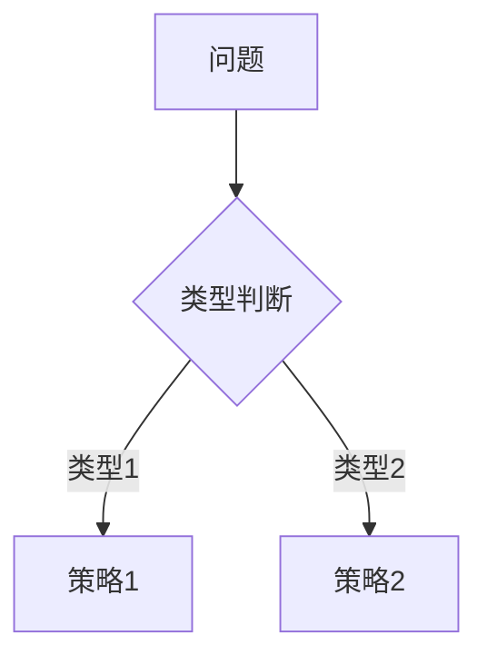
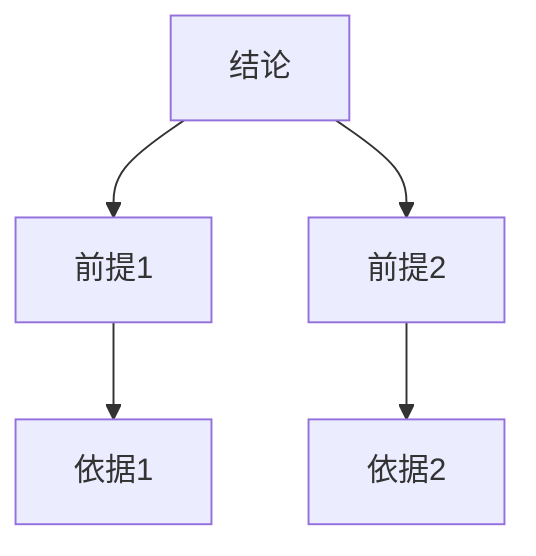

# 全面深化推进计划

**创建日期**: 2025年12月4日
**最后更新**: 2025年12月4日
**状态**: 📋 执行中

---

## 📋 执行摘要

本文档制定FormalMath项目的全面深化推进计划，确保所有文档达到以下标准：

1. **实质内容**：每章节≥500字，详细展开，理论依据，实际案例
2. **权威对标**：对标Wikipedia、国际大学课程、中小学课程标准
3. **概念完整性**：定义、属性、外延、内涵、关系等完整
4. **思维表征**：思维导图、概念多维矩阵、决策树、证明树、关系图等
5. **论证逻辑**：充分的论证过程，逻辑关系清晰
6. **关联性**：主题子主题之间的论证逻辑关系图

---

## 🎯 一、深化标准与要求

### 1.1 内容质量标准

**实质内容要求**：

- **每章节≥500字**：确保每个章节都有充分的实质内容
- **详细展开**：概念、理论、方法都要详细展开
- **理论依据**：提供理论依据和学术支持
- **实际案例**：包含具体的实际案例和应用
- **权威参考**：参考Wikipedia、学术文献、课程标准

**概念完整性要求**：

- **定义**：清晰准确的概念定义
- **属性**：概念的属性和特征
- **外延**：概念的外延和范围
- **内涵**：概念的内涵和本质
- **关系**：与其他概念的关系

### 1.2 思维表征要求

**必须包含的思维表征方式**：

1. **思维导图**：知识结构的可视化
2. **概念多维矩阵**：概念的多维度对比
3. **决策树**：问题分类和策略选择
4. **证明树**：论证和证明的逻辑结构
5. **关系图**：概念之间的关系网络
6. **推理路径**：推理和论证的路径
7. **知识图谱**：知识的整体结构

### 1.3 权威对标要求

**对标资源**：

- **Wikipedia**：概念定义、历史背景、理论基础
- **国际大学课程**：MIT、Stanford、Cambridge等
- **中小学课程标准**：中国、美国、新加坡、芬兰等
- **学术文献**：经典文献和最新研究
- **权威机构**：NCTM、ICME等

---

## 📊 二、当前状态分析

### 2.1 已完成深化文档（12个）

1. LIDA认知架构：535行
2. 数学思维发展：566行
3. 欧洲中世纪数学：533行
4. 中国宋元数学：513行
5. 古阿拉伯数学：506行
6. 18世纪数学：514行
7. 传统教学方法：519行
8. 关系矩阵：530行
9. 特征矩阵：524行
10. 数学认知能力发展：519行
11. 神经符号学习：555行
12. 多维对比矩阵：545行

### 2.2 待深化文档（约18个）

**优先级P0（最高优先级）**：

- 依赖网络：212行
- 古中国数学：215行
- 数学语义层次结构：216行
- 关联网络：217行
- 21世纪数学：218行
- 推理路径：222行

**优先级P1（高优先级）**：

- 数学教育目标：230行
- 数学教育发展：230行
- 分类树：232行
- 数学分支分类：233行
- 古印度数学：234行
- 新加坡数学教育：236行
- 学习路径：237行

---

## 🔄 三、深化执行计划

### 3.1 第一阶段：核心文档深化（优先级P0）

**目标**：深化6个核心文档，确保达到500行以上标准

**文档列表**：

1. **依赖网络**（212行 → 500+行）
   - 添加：图论基础、网络分析、实际应用案例
   - 思维表征：依赖关系图、网络拓扑图、学习路径图
   - 对标：Wikipedia图论、网络分析课程

2. **古中国数学**（215行 → 500+行）
   - 添加：历史背景、重要数学家、数学成就、现代意义
   - 思维表征：历史时间线、数学家关系图、成就对比矩阵
   - 对标：Wikipedia中国数学史、国际数学史课程

3. **数学语义层次结构**（216行 → 500+行）
   - 添加：语义理论、层次分析、应用案例
   - 思维表征：语义层次图、概念关系图、语义网络
   - 对标：语义学理论、形式化语义课程

4. **关联网络**（217行 → 500+行）
   - 添加：网络理论、关联分析、应用案例
   - 思维表征：关联网络图、关系矩阵、知识图谱
   - 对标：网络科学、图论应用

5. **21世纪数学**（218行 → 500+行）
   - 添加：现代发展、前沿领域、重要突破
   - 思维表征：发展时间线、领域关系图、突破对比矩阵
   - 对标：现代数学发展、前沿数学研究

6. **推理路径**（222行 → 500+行）
   - 添加：推理理论、路径分析、应用案例
   - 思维表征：推理路径图、决策树、证明树
   - 对标：逻辑推理、证明理论

### 3.2 第二阶段：重要文档深化（优先级P1）

**目标**：深化7个重要文档，确保达到500行以上标准

**文档列表**：

1. **数学教育目标**（230行 → 500+行）
2. **数学教育发展**（230行 → 500+行）
3. **分类树**（232行 → 500+行）
4. **数学分支分类**（233行 → 500+行）
5. **古印度数学**（234行 → 500+行）
6. **新加坡数学教育**（236行 → 500+行）
7. **学习路径**（237行 → 500+行）

### 3.3 第三阶段：思维表征整合

**目标**：为所有文档添加思维表征方式

**思维表征类型**：

1. **思维导图**：知识结构可视化
2. **概念多维矩阵**：多维度对比分析
3. **决策树**：问题分类和策略选择
4. **证明树**：论证逻辑结构
5. **关系图**：概念关系网络
6. **推理路径**：推理过程可视化
7. **知识图谱**：整体知识结构

### 3.4 第四阶段：关联性建立

**目标**：建立文档之间的关联性和逻辑关系

**关联性类型**：

1. **主题关联**：相关主题之间的关联
2. **子主题关联**：子主题之间的关联
3. **论证逻辑**：论证逻辑关系图
4. **依赖关系**：文档之间的依赖关系
5. **引用关系**：文档之间的引用关系

---

## 📐 四、深化内容模板

### 4.1 标准章节结构

```markdown
## 📋 一、概述

### 1.1 概念定义（对标Wikipedia）

**定义**：[清晰准确的定义]

**属性**：
- 属性1：[详细说明]
- 属性2：[详细说明]

**外延**：[概念的范围和应用]

**内涵**：[概念的本质和核心]

**关系**：[与其他概念的关系]

### 1.2 理论基础

**理论来源**：[理论来源和依据]

**学术支持**：[学术文献支持]

**国际标准**：[国际标准和规范]

### 1.3 历史发展

**历史背景**：[历史背景和发展]

**重要人物**：[重要人物和贡献]

**发展脉络**：[发展的时间线]

### 1.4 现代意义

**理论意义**：[理论意义和价值]

**实践意义**：[实践意义和应用]

**教育价值**：[教育价值和意义]
```

### 4.2 思维表征模板

```markdown
## 🗺️ 二、思维表征

### 2.1 思维导图：知识结构

```mermaid
mindmap
  root(([主题]))
    [分支1]
      [子分支1.1]
      [子分支1.2]
    [分支2]
      [子分支2.1]
      [子分支2.2]
```

### 2.2 概念多维矩阵

| 维度1 | 维度2 | 维度3 | 维度4 |
|------|------|------|------|
| 特征1 | 特征2 | 特征3 | 特征4 |

### 2.3 决策树：问题分类



### 2.4 证明树：论证结构



### 2.5 关系图：概念关系


```

---

## 🌐 五、权威对标资源

### 5.1 Wikipedia资源

**数学概念**：
- 数学基础概念
- 数学史
- 数学分支
- 数学方法

**教育理论**：
- 教育理论
- 教学方法
- 学习理论

### 5.2 国际大学课程

**MIT**：
- Mathematics courses
- Computer Science courses

**Stanford**：
- Mathematics courses
- Education courses

**Cambridge**：
- Mathematics courses
- Education courses

### 5.3 中小学课程标准

**中国**：
- 义务教育数学课程标准
- 普通高中数学课程标准

**美国**：
- Common Core State Standards
- NCTM Standards

**新加坡**：
- Singapore Mathematics Curriculum

**芬兰**：
- Finnish National Core Curriculum

---

## 📈 六、执行进度跟踪

### 6.1 第一阶段进度

- [ ] 依赖网络（212行 → 500+行）
- [ ] 古中国数学（215行 → 500+行）
- [ ] 数学语义层次结构（216行 → 500+行）
- [ ] 关联网络（217行 → 500+行）
- [ ] 21世纪数学（218行 → 500+行）
- [ ] 推理路径（222行 → 500+行）

### 6.2 第二阶段进度

- [ ] 数学教育目标（230行 → 500+行）
- [ ] 数学教育发展（230行 → 500+行）
- [ ] 分类树（232行 → 500+行）
- [ ] 数学分支分类（233行 → 500+行）
- [ ] 古印度数学（234行 → 500+行）
- [ ] 新加坡数学教育（236行 → 500+行）
- [ ] 学习路径（237行 → 500+行）

### 6.3 第三阶段进度

- [ ] 为所有文档添加思维表征方式
- [ ] 建立思维表征标准模板
- [ ] 验证思维表征效果

### 6.4 第四阶段进度

- [ ] 建立文档关联性
- [ ] 创建论证逻辑关系图
- [ ] 完善文档引用关系

---

## 🎯 七、质量检查标准

### 7.1 内容质量检查

- [ ] 每章节≥500字
- [ ] 有理论依据
- [ ] 有实际案例
- [ ] 有权威参考
- [ ] 概念定义完整

### 7.2 思维表征检查

- [ ] 包含思维导图
- [ ] 包含概念多维矩阵
- [ ] 包含决策树
- [ ] 包含证明树
- [ ] 包含关系图

### 7.3 关联性检查

- [ ] 主题关联清晰
- [ ] 子主题关联明确
- [ ] 论证逻辑完整
- [ ] 引用关系准确

---

## 📚 八、参考资源清单

### 8.1 Wikipedia资源

- Mathematics (Wikipedia)
- Mathematical logic (Wikipedia)
- Graph theory (Wikipedia)
- Category theory (Wikipedia)
- Mathematical education (Wikipedia)

### 8.2 国际课程资源

- MIT Mathematics Courses
- Stanford Mathematics Courses
- Cambridge Mathematics Courses
- Common Core State Standards
- NCTM Standards

### 8.3 学术文献资源

- 经典数学文献
- 教育理论文献
- 认知科学文献
- 数学史文献

---

**创建日期**: 2025年12月4日
**最后更新**: 2025年12月4日
**状态**: 📋 执行中
