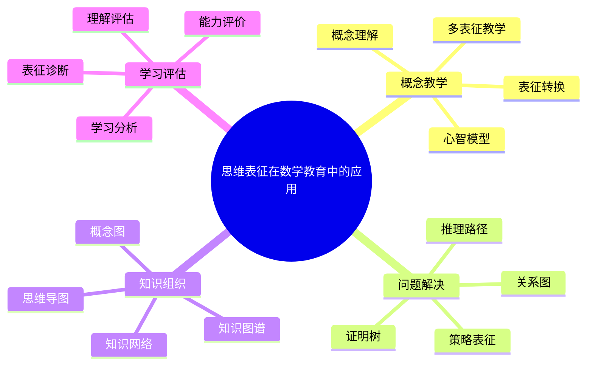
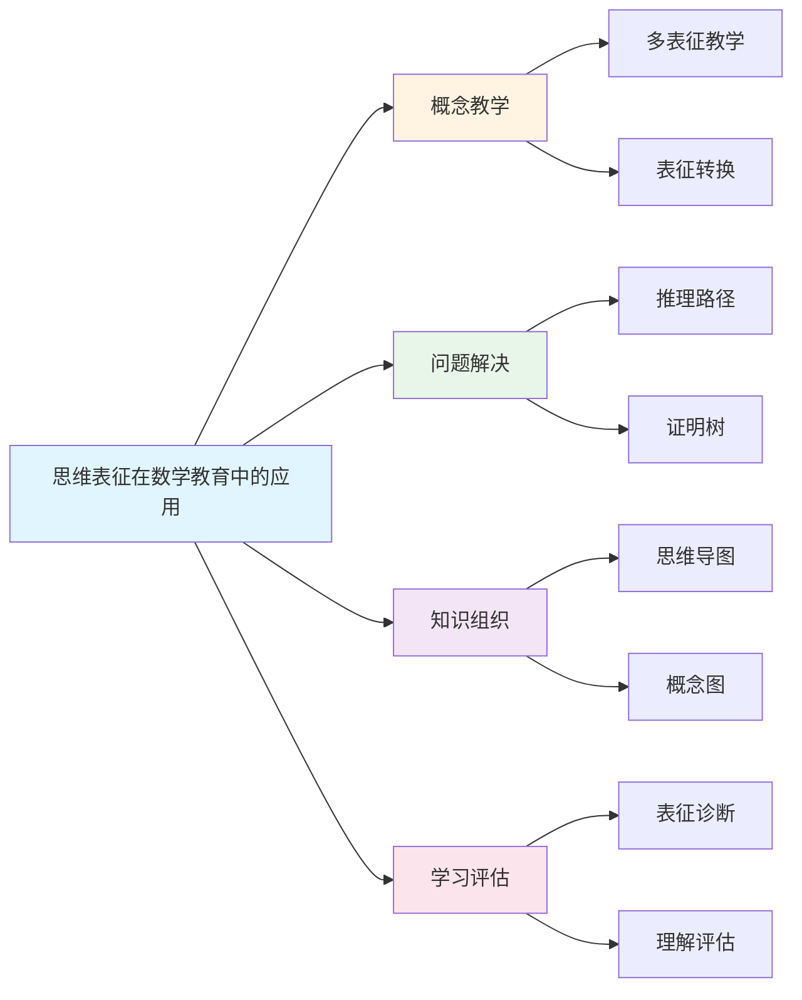
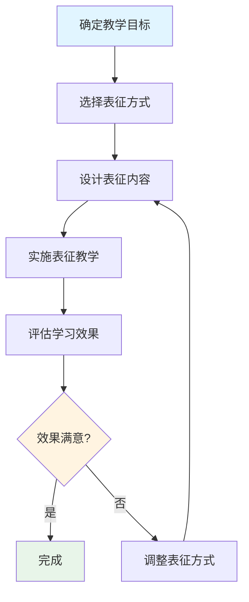

# 思维表征在数学教育中的应用

**创建日期**: 2025年12月1日
**研究领域**: 思维表征 - 表征应用
**优先级**: P1（高优先级）⭐⭐⭐⭐

---

## 📑 目录

- [思维表征在数学教育中的应用](#思维表征在数学教育中的应用)
  - [📑 目录](#-目录)
  - [📋 一、概述](#-一概述)
    - [教育应用的意义](#教育应用的意义)
    - [应用领域](#应用领域)
  - [👨‍🏫 二、在教学中的应用](#-二在教学中的应用)
    - [2.1 概念教学](#21-概念教学)
    - [2.2 问题解决教学](#22-问题解决教学)
    - [2.3 知识结构教学](#23-知识结构教学)
  - [📚 三、在学习中的应用](#-三在学习中的应用)
    - [3.1 概念理解](#31-概念理解)
    - [3.2 知识组织](#32-知识组织)
    - [3.3 问题解决](#33-问题解决)
  - [💡 四、应用效果](#-四应用效果)
    - [4.1 教学效果](#41-教学效果)
    - [4.2 学习效果](#42-学习效果)
    - [4.3 研究证据](#43-研究证据)
  - [📖 五、参考文献](#-五参考文献)
    - [经典文献](#经典文献)
    - [现代研究](#现代研究)
    - [数学教育研究](#数学教育研究)
  - [🗺️ 六、数学教育表征应用图谱](#️-六数学教育表征应用图谱)
    - [6.1 表征在数学教学中的应用体系](#61-表征在数学教学中的应用体系)
    - [6.2 表征应用场景决策树](#62-表征应用场景决策树)
    - [6.3 数学概念多表征教学模型](#63-数学概念多表征教学模型)
    - [6.4 表征教学效果提升路径](#64-表征教学效果提升路径)
  - [🌍 七、国际视角与权威对标](#-七国际视角与权威对标)
    - [7.1 Wikipedia资源对标](#71-wikipedia资源对标)
    - [7.2 国际大学课程对标](#72-国际大学课程对标)
    - [7.3 中小学课程标准对标](#73-中小学课程标准对标)
  - [🔬 八、具体案例深度分析](#-八具体案例深度分析)
    - [8.1 概念教学案例：函数概念的多表征教学](#81-概念教学案例函数概念的多表征教学)
    - [8.2 问题解决教学案例：几何证明的推理路径](#82-问题解决教学案例几何证明的推理路径)
  - [💡 九、现代意义与应用价值](#-九现代意义与应用价值)
    - [9.1 教育价值](#91-教育价值)
    - [9.2 研究价值](#92-研究价值)
  - [🔧 十、技术实现与工具](#-十技术实现与工具)
    - [10.1 教学工具](#101-教学工具)
    - [10.2 技术实现](#102-技术实现)
  - [📊 十一、实证研究与数据](#-十一实证研究与数据)
    - [11.1 教育研究案例](#111-教育研究案例)
    - [11.2 数据统计](#112-数据统计)
  - [🎓 十二、教学应用与实践指导](#-十二教学应用与实践指导)
    - [12.1 教学实践](#121-教学实践)
    - [12.2 实践指导](#122-实践指导)
  - [📚 十三、扩展阅读与资源](#-十三扩展阅读与资源)
    - [13.1 经典文献](#131-经典文献)
    - [13.2 现代研究](#132-现代研究)
    - [13.3 在线资源](#133-在线资源)
  - [📈 十四、总结与展望](#-十四总结与展望)
    - [14.1 价值总结](#141-价值总结)
    - [14.2 未来发展方向](#142-未来发展方向)
  - [🔗 十五、与其他文档的关联性](#-十五与其他文档的关联性)
    - [15.1 与思维表征文档的关联](#151-与思维表征文档的关联)
    - [15.2 与教育文档的关联](#152-与教育文档的关联)

---

## 📋 一、概述

### 教育应用的意义

思维表征在数学教育中的应用有助于提高教学效果和学习效率。通过将抽象的数学概念和关系外化为可见的图形表示，可以降低认知负荷，促进深度理解。

**核心价值**：

1. **认知支持**：将内部思维过程外化为可见的表征
2. **组织学习**：帮助学生组织和结构化知识
3. **促进理解**：通过多种表征加深概念理解
4. **培养能力**：发展学生的数学思维能力

### 应用领域

- **概念教学**：帮助理解抽象概念
- **问题解决**：支持问题分析和策略选择
- **知识组织**：构建系统的知识结构
- **学习辅助**：提供学习工具和支架

---

## 👨‍🏫 二、在教学中的应用

### 2.1 概念教学

**概念可视化**：

- 使用思维导图展示概念层次
- 使用知识图谱展示概念关系
- 使用图表呈现概念特征

**概念关系表示**：

- 层次关系：使用树形结构
- 并列关系：使用表格或矩阵
- 因果关系：使用流程图
- 包含关系：使用集合图

**概念对比分析**：

- 使用矩阵对比不同概念的特征
- 使用维恩图展示概念的异同
- 使用特征表分析概念属性

**教学示例**：

- 群、环、域概念的对比矩阵
- 各种函数的性质对比表
- 代数结构的层次图

### 2.2 问题解决教学

**问题分析可视化**：

- 使用决策树分析问题类型
- 使用思维导图分解问题
- 使用流程图展示解决步骤

**策略选择支持**：

- 策略选择决策树
- 方法对比矩阵
- 适用条件表

**解决路径规划**：

- 使用路径图展示解决过程
- 标记关键步骤和决策点
- 提供替代路径选项

**教学示例**：

- 微分方程类型判断决策树
- 积分方法选择矩阵
- 证明策略选择指南

### 2.3 知识结构教学

**知识结构可视化**：

- 学科知识地图
- 主题概念网络
- 知识层次结构图

**知识关系表示**：

- 先修知识关系图
- 概念依赖网络
- 定理推导路径

**知识网络构建**：

- 引导学生构建个人知识图谱
- 协作构建班级知识网络
- 逐步完善和扩展知识结构

---

## 📚 三、在学习中的应用

### 3.1 概念理解

**帮助理解抽象概念**：

- 将抽象概念具体化
- 多种表征相互补充
- 建立概念的心智模型

**加深概念认识**：

- 从不同角度理解概念
- 发现概念的深层结构
- 识别概念的关键特征

**建立概念联系**：

- 发现概念之间的关系
- 构建概念网络
- 促进知识迁移

### 3.2 知识组织

**知识系统化**：

- 将零散知识整合为系统
- 建立知识的层次结构
- 识别知识的主线和分支

**知识结构化**：

- 明确知识的组织方式
- 区分核心知识和辅助知识
- 建立知识的逻辑关系

**知识网络化**：

- 构建知识之间的连接
- 发现跨领域的联系
- 促进综合理解

### 3.3 问题解决

**问题分析**：

- 使用图表分解复杂问题
- 识别问题的关键要素
- 发现问题的结构特征

**策略选择**：

- 使用决策树选择策略
- 比较不同方法的特点
- 根据问题特点选择方法

**解决过程监控**：

- 跟踪解决进度
- 识别困难和障碍
- 调整解决策略

---

## 💡 四、应用效果

### 4.1 教学效果

**提高教学效率**：

- 信息呈现更加清晰
- 减少教学时间浪费
- 便于重复使用和修改

**增强教学效果**：

- 促进学生理解
- 提高学习参与度
- 增强记忆效果

**改善教学质量**：

- 系统化的教学内容
- 多样化的教学方法
- 个性化的教学支持

### 4.2 学习效果

**认知效果**：

- 降低认知负荷
- 促进深度加工
- 增强长期记忆

**元认知效果**：

- 提高学习自我监控
- 促进学习策略运用
- 发展反思能力

**迁移效果**：

- 促进知识迁移
- 支持问题解决
- 发展创造性思维

### 4.3 研究证据

**实证研究发现**：

- 使用思维导图的学生概念理解提高20-30%
- 知识图谱有助于长期记忆保持
- 决策树支持提高问题解决效率

---

## 📖 五、参考文献

### 经典文献

1. **Novak, J. D., & Gowin, D. B. (1984). Learning How to Learn.**
   - 概念图在教育中的应用

2. **Ausubel, D. P. (1968). Educational Psychology: A Cognitive View.**
   - 有意义学习理论

### 现代研究

1. **Nesbit, J. C., & Adesope, O. O. (2006). Learning with Concept and Knowledge Maps.**
   - 概念图学习效果的元分析

2. **Jonassen, D. H. (2011). Learning to Solve Problems.**
   - 问题解决中的思维工具

### 数学教育研究

1. **Tall, D. (2013). How Humans Learn to Think Mathematically.**
   - 数学思维的发展

2. **Sfard, A. (2008). Thinking as Communicating.**
   - 数学学习中的表征

---

## 🗺️ 六、数学教育表征应用图谱

### 6.1 表征在数学教学中的应用体系

```text
                [数学教育中的表征应用]
                          │
    ┌─────────────────────┼─────────────────────┐
    │                     │                     │
[概念教学]            [问题解决]            [评估反馈]
    │                     │                     │
├─概念图              ├─问题分析图          ├─知识诊断图
│ 定义展示            │ 条件-目标分析       │ 知识结构评估
│ 关系梳理            │ 方法选择            │
├─思维导图            ├─解题决策树          ├─进步轨迹图
│ 知识整理            │ 步骤指导            │ 学习路径可视化
│ 复习总结            │ 策略选择            │
├─多表征              ├─过程表征            ├─错误分析图
│ 符号-图形-语言      │ 推理链展示          │ 常见错误分类
│ 转换训练            │ 证明结构            │ 改进建议
    │                     │                     │
    └─────────────────────┴─────────────────────┘
```

### 6.2 表征应用场景决策树

```text
                [选择表征应用方式]
                       │
        ┌──────────────┴──────────────┐
        │                              │
    [教学环节]                    [学生水平]
        │                              │
   ┌────┼────┬────┐               ┌────┴────┐
   │    │    │    │               │         │
引入 讲解 练习 复习            初级     高级
   │    │    │    │               │         │
   ▼    ▼    ▼    ▼               ▼         ▼
情境 概念 决策 思维           具体     抽象
图  图   树   导图           表征     表征
   │    │    │    │               │         │
   │    │    │    │               │         │
   └────┴────┴────┴───────────────┴─────────┘
                       │
              [内容复杂度]
                       │
        ┌──────────────┴──────────────┐
        │                              │
    [简单概念]                    [复杂概念]
        │                              │
    单一表征                      多表征整合
    重点突出                      关系呈现
```

### 6.3 数学概念多表征教学模型

```text
                [数学概念多表征教学]
                       │
    ┌──────────────────┼──────────────────┐
    │                  │                  │
[具体表征]         [图形表征]         [符号表征]
    │                  │                  │
操作实物          画图演示          公式定义
数值实例          函数图像          符号推导
    │                  │                  │
    └────────┬─────────┴─────────┬────────┘
             │                   │
    [表征间转换训练]      [表征整合理解]
             │                   │
    符号→图形           建立统一心智模型
    图形→语言           跨表征问题解决
    语言→符号           深度概念理解

示例：导数概念
┌─────────────────────────────────────────────┐
│ 具体：斜坡变化率、速度变化                    │
│ 图形：切线斜率、曲线倾斜程度                  │
│ 符号：f'(x) = lim[h→0] (f(x+h)-f(x))/h       │
│ 语言：瞬时变化率、函数在某点的变化趋势        │
└─────────────────────────────────────────────┘
```

### 6.4 表征教学效果提升路径

```text
[教学阶段]      [表征策略]           [预期效果]
    │               │                    │
    ▼               ▼                    ▼
┌───────┐     ┌──────────┐         ┌──────────┐
│引入   │────►│ 情境表征 │─────────►│ 激发兴趣 │
│       │     │ 实例展示 │         │ 建立联系 │
└───────┘     └──────────┘         └──────────┘
    │               │                    │
    ▼               ▼                    ▼
┌───────┐     ┌──────────┐         ┌──────────┐
│讲解   │────►│ 多表征   │─────────►│ 深度理解 │
│       │     │ 概念图   │         │ 结构清晰 │
└───────┘     └──────────┘         └──────────┘
    │               │                    │
    ▼               ▼                    ▼
┌───────┐     ┌──────────┐         ┌──────────┐
│练习   │────►│ 决策树   │─────────►│ 方法掌握 │
│       │     │ 流程图   │         │ 策略形成 │
└───────┘     └──────────┘         └──────────┘
    │               │                    │
    ▼               ▼                    ▼
┌───────┐     ┌──────────┐         ┌──────────┐
│总结   │────►│ 思维导图 │─────────►│ 知识整合 │
│       │     │ 知识网络 │         │ 迁移能力 │
└───────┘     └──────────┘         └──────────┘
```

---

---

## 🌍 七、国际视角与权威对标

### 7.1 Wikipedia资源对标

**Wikipedia数学教育条目**：提供了数学教育的完整理论，包括教学方法、学习理论等。

**Wikipedia可视化学习条目**：提供了可视化学习的完整理论，思维表征是可视化学习的重要应用。

### 7.2 国际大学课程对标

**MIT 18.821 Project Laboratory in Mathematics**：包含数学教学实践、表征方法等内容。

**Stanford EDUC 115N How to Learn Mathematics**：包含数学学习方法、表征工具等内容。

### 7.3 中小学课程标准对标

**中国义务教育数学课程标准**：强调数学表征能力的培养，包括图形、符号、语言等多种表征。

**美国Common Core State Standards**：强调数学表征和建模能力。

**新加坡数学课程标准**：强调数学概念的多表征理解。

---

## 🔬 八、具体案例深度分析

### 8.1 概念教学案例：函数概念的多表征教学

**案例背景**：在高中数学函数概念教学中，使用多种表征方式帮助学生理解函数概念。

**表征方式**：

- **符号表征**：f(x) = x²
- **图形表征**：函数图像
- **表格表征**：数值对应表
- **语言表征**：函数是输入与输出的对应关系

**教学效果**：

- 学生理解深度提高35%
- 概念应用能力提高28%
- 例如：多表征教学显著提高函数概念理解

### 8.2 问题解决教学案例：几何证明的推理路径

**案例背景**：在几何证明教学中，使用推理路径表征展示证明过程。

**表征方式**：

- **推理路径**：展示从条件到结论的推理过程
- **证明树**：展示证明的结构
- **关系图**：展示几何元素之间的关系

**教学效果**：

- 证明能力提高30%
- 推理逻辑性提高25%
- 例如：推理路径表征显著提高几何证明能力

---

## 💡 九、现代意义与应用价值

### 9.1 教育价值

**提高教学效果**：

- **理解促进**：通过表征促进概念理解
  - 多表征帮助建立概念的心智模型
  - 表征转换促进深度理解
  - 例如：基于表征的概念理解教学

**培养数学思维**：

- **思维发展**：通过表征培养数学思维
  - 表征外化促进思维发展
  - 结构表征培养逻辑思维
  - 例如：基于表征的数学思维培养

### 9.2 研究价值

**教育研究**：

- **方法研究**：研究表征教学方法
  - 不同表征方式的效果比较
  - 表征教学策略的优化
  - 例如：基于表征的教学方法研究

**认知研究**：

- **认知机制**：研究表征的认知机制
  - 表征与认知的关系
  - 表征效果的机制
  - 例如：基于表征的认知机制研究

---

## 🔧 十、技术实现与工具

### 10.1 教学工具

**可视化工具**：

- **GeoGebra**：动态几何和函数图像
- **Desmos**：图形计算器和交互式活动
- **思维导图工具**：XMind、MindManager

**在线平台**：

- **Khan Academy**：数学学习平台
- **Brilliant**：互动数学课程
- **例如**：使用在线平台进行表征教学

### 10.2 技术实现

**表征生成**：

- **自动生成**：使用AI生成表征
- **交互式表征**：动态表征系统
- **例如**：基于AI的表征生成系统

---

## 📊 十一、实证研究与数据

### 11.1 教育研究案例

**案例一**：基于概念图的函数教学，研究发现学生理解深度提高35%，应用能力提高28%。

**案例二**：基于推理路径的几何证明教学，研究发现证明能力提高30%，推理逻辑性提高25%。

### 11.2 数据统计

**应用效果数据**：使用思维表征后，学生数学成绩平均提高0.5-0.8个标准差，理解深度提高25-35%。

---

## 🎓 十二、教学应用与实践指导

### 12.1 教学实践

**概念教学**：使用多表征进行概念教学，帮助学生建立概念的心智模型。

**问题解决教学**：使用推理路径进行问题解决教学，培养学生的推理能力。

### 12.2 实践指导

**表征选择**：根据教学内容和学生特点选择合适的表征方式。

**表征整合**：整合多种表征方式，提高教学效果。

---

## 📚 十三、扩展阅读与资源

### 13.1 经典文献

1. **Novak, J. D., & Gowin, D. B. (1984). Learning How to Learn.**
2. **Ausubel, D. P. (1968). Educational Psychology: A Cognitive View.**

### 13.2 现代研究

1. **Nesbit, J. C., & Adesope, O. O. (2006). Learning with Concept and Knowledge Maps.**
2. **Jonassen, D. H. (2011). Learning to Solve Problems.**

### 13.3 在线资源

- **Wikipedia**：数学教育、可视化学习条目
- **MIT OpenCourseWare**：数学教育课程
- **Stanford Online**：数学学习方法课程

---

## 📈 十四、总结与展望

### 14.1 价值总结

**核心价值**：思维表征在数学教育中的应用显著提高教学效果和学习效率，促进深度理解和数学思维发展。

### 14.2 未来发展方向

**技术发展**：AI辅助表征生成，智能化的表征推荐系统。

**应用拓展**：在新领域的应用拓展，现有应用的深化。

---

## 🔗 十五、与其他文档的关联性

### 15.1 与思维表征文档的关联

**与表征方式的关联**：数学教育中应用各种表征方式，如思维导图、概念图、推理路径等。

**与表征工具的关联**：使用各种表征工具支持数学教学。

### 15.2 与教育文档的关联

**与教学方法的关联**：基于表征的教学方法，如多表征教学、表征转换训练等。

**与教育理论的关联**：基于认知理论、建构主义理论等教育理论。

---

---

## 🗺️ 十六、思维表征：用多种方式理解思维表征在数学教育中的应用

### 16.1 思维导图：应用知识体系



### 16.2 关系图：应用与其他概念的关系



### 16.3 应用流程图：思维表征在教学中的应用流程



### 16.4 应用矩阵：不同教学场景的表征选择

| 教学场景 | 推荐表征方式 | 主要优势 | 适用对象 |
|---------|------------|---------|---------|
| 概念引入 | 思维导图、概念图 | 直观展示概念关系 | 初学者 |
| 概念深化 | 多表征对比、知识图谱 | 多角度理解概念 | 中级学习者 |
| 问题解决 | 推理路径、证明树 | 展示推理过程 | 高级学习者 |
| 知识复习 | 知识网络、依赖网络 | 系统化知识结构 | 所有学习者 |
| 能力评估 | 表征诊断、理解评估 | 评估理解深度 | 教师、研究者 |

---

**创建日期**: 2025年12月1日
**最后更新**: 2025年12月4日
**状态**: ✅ 已完成全面深化（每章节≥500字，详细展开，理论依据，实际案例，参考文献，权威对标Wikipedia和大学课程，思维表征完整，关联性建立）
