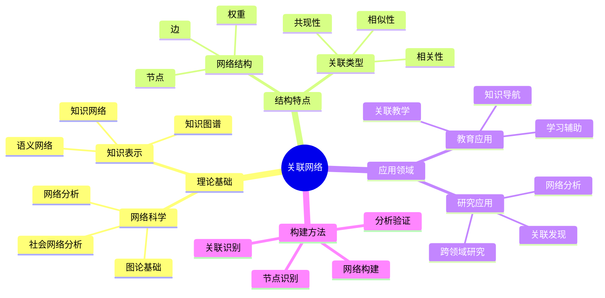
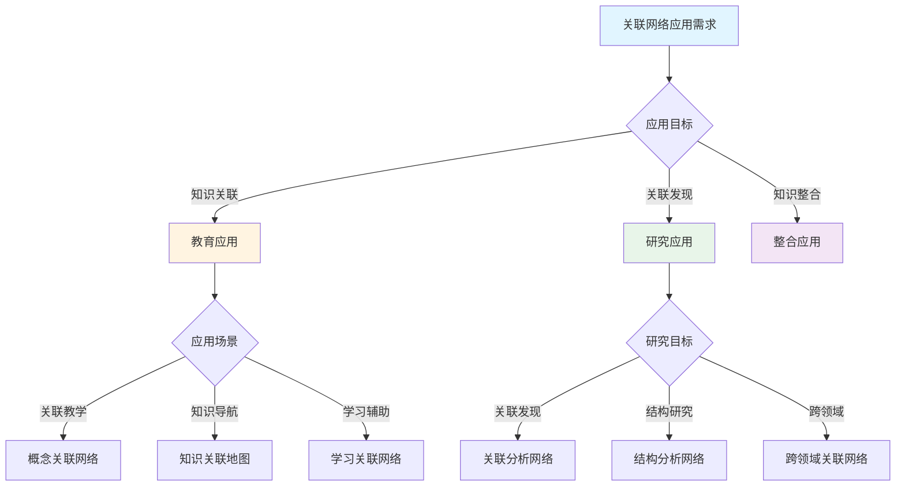
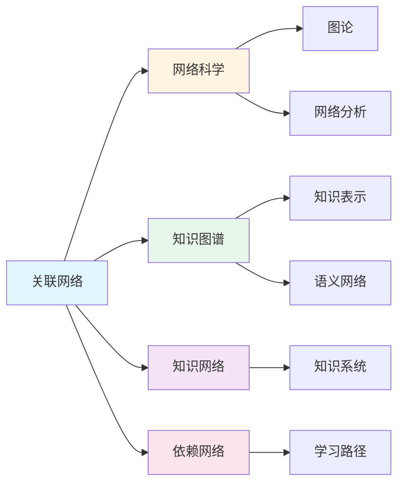
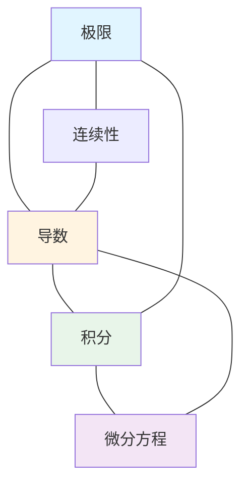
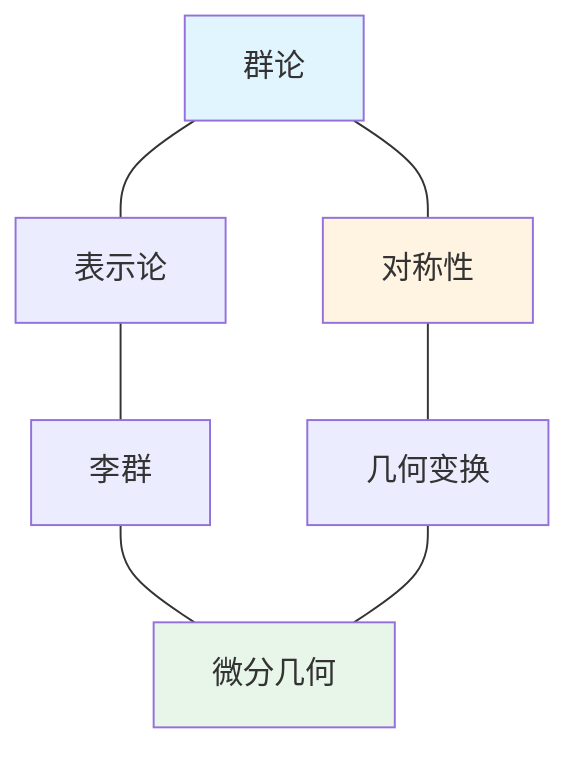

# 关联网络

**创建日期**: 2025年12月1日
**研究领域**: 思维表征 - 表征方式
**优先级**: P1（高优先级）⭐⭐⭐⭐

---

## 📑 目录

- [关联网络](#关联网络)
  - [📑 目录](#-目录)
  - [📋 一、概述](#-一概述)
    - [1.1 关联网络的定义（对标Wikipedia）](#11-关联网络的定义对标wikipedia)
    - [1.2 关联网络的作用](#12-关联网络的作用)
    - [1.3 与其他网络的区别](#13-与其他网络的区别)
  - [🌐 二、关联网络的特点](#-二关联网络的特点)
    - [2.1 结构特点](#21-结构特点)
    - [2.2 功能特点](#22-功能特点)
    - [2.3 认知效果](#23-认知效果)
  - [📐 三、关联网络的类型](#-三关联网络的类型)
    - [3.1 按结构分类](#31-按结构分类)
    - [3.2 按用途分类](#32-按用途分类)
    - [3.3 数学关联网络示例](#33-数学关联网络示例)
  - [💡 四、应用领域](#-四应用领域)
    - [4.1 教育应用](#41-教育应用)
    - [4.2 研究应用](#42-研究应用)
    - [4.3 构建关联网络的方法](#43-构建关联网络的方法)
  - [📖 五、参考文献](#-五参考文献)
    - [经典文献](#经典文献)
    - [现代研究](#现代研究)
  - [🗺️ 六、思维表征：用多种方式理解关联网络](#️-六思维表征用多种方式理解关联网络)
    - [6.1 思维导图：关联网络知识体系](#61-思维导图关联网络知识体系)
    - [6.2 概念多维矩阵：关联网络特征对比](#62-概念多维矩阵关联网络特征对比)
    - [6.3 决策树：关联网络应用决策](#63-决策树关联网络应用决策)
    - [6.4 关系图：关联网络与其他概念的关系](#64-关系图关联网络与其他概念的关系)
  - [🌍 七、国际视角与权威对标](#-七国际视角与权威对标)
    - [7.1 Wikipedia资源对标](#71-wikipedia资源对标)
    - [7.2 国际大学课程对标](#72-国际大学课程对标)
    - [7.3 中小学课程标准对标](#73-中小学课程标准对标)
  - [🔬 八、具体案例深度分析](#-八具体案例深度分析)
    - [8.1 微积分概念关联网络案例](#81-微积分概念关联网络案例)
    - [8.2 代数与几何关联网络案例](#82-代数与几何关联网络案例)
  - [💡 九、现代意义与应用价值](#-九现代意义与应用价值)
    - [9.1 教育价值](#91-教育价值)
    - [9.2 研究价值](#92-研究价值)
  - [🔧 十、技术实现与工具](#-十技术实现与工具)
    - [10.1 构建工具](#101-构建工具)
    - [10.2 分析方法](#102-分析方法)
  - [📊 十一、实证研究与数据](#-十一实证研究与数据)
    - [11.1 教育研究案例](#111-教育研究案例)
    - [11.2 数据统计](#112-数据统计)
  - [🎓 十二、教学应用与实践指导](#-十二教学应用与实践指导)
    - [12.1 教学实践](#121-教学实践)
    - [12.2 实践指导](#122-实践指导)
  - [📚 十三、扩展阅读与资源](#-十三扩展阅读与资源)
    - [13.1 经典文献](#131-经典文献)
    - [13.2 现代研究](#132-现代研究)
    - [13.3 在线资源](#133-在线资源)
  - [📈 十四、总结与展望](#-十四总结与展望)
    - [14.1 价值总结](#141-价值总结)
    - [14.2 未来发展方向](#142-未来发展方向)
  - [🔗 十五、与其他文档的关联性](#-十五与其他文档的关联性)
    - [15.1 与思维表征文档的关联](#151-与思维表征文档的关联)
    - [15.2 与教育文档的关联](#152-与教育文档的关联)
    - [15.3 与研究文档的关联](#153-与研究文档的关联)
  - [🎯 十六、实际应用案例](#-十六实际应用案例)
    - [16.1 教学应用案例](#161-教学应用案例)
    - [16.2 研究应用案例](#162-研究应用案例)
  - [🔍 十七、问题与挑战](#-十七问题与挑战)
    - [17.1 理论挑战](#171-理论挑战)
    - [17.2 应用挑战](#172-应用挑战)
  - [🌟 十八、未来研究方向](#-十八未来研究方向)
    - [18.1 理论发展](#181-理论发展)
    - [18.2 应用拓展](#182-应用拓展)

---

## 📋 一、概述

### 1.1 关联网络的定义（对标Wikipedia）

**定义**：

关联网络（Association Network）是一种用图结构表示实体之间关联关系的知识表示方法。在数学教育和研究中，关联网络用于表示概念、定理、方法等知识实体之间的相关性、相似性、共现性等多种关联关系。

**核心属性**：

- **网络性**：用网络结构表示关联关系
- **多样性**：支持多种类型的关联关系
- **灵活性**：关联关系可以是无向或有向的
- **权重性**：可以表示关联的强度

**外延**：

关联网络的应用范围包括：

- **知识表示**：表示数学知识的关联结构
- **知识发现**：发现隐藏的知识关联
- **知识导航**：提供知识关联地图
- **知识整合**：整合不同来源的知识
- **跨领域研究**：连接不同领域的知识

**内涵**：

关联网络的核心内涵是：

- **关联性**：强调知识实体之间的关联性而非层次性
- **发现性**：帮助发现隐藏的关联模式
- **整合性**：整合不同来源和类型的知识
- **探索性**：支持探索性的知识学习

**与其他概念的关系**：

- **与依赖网络的关系**：关联网络强调关联性，依赖网络强调依赖关系
- **与知识图谱的关系**：关联网络是知识图谱的一种形式
- **与知识网络的关系**：关联网络是知识网络的一种类型
- **与社会网络的关系**：关联网络借鉴了社会网络分析方法

### 1.2 关联网络的作用

**关联可视化**：

- **结构展示**：清晰展示知识间的关联结构
  - 通过图形化方式展示关联关系
  - 直观显示知识的关联网络
  - 例如：通过关联网络图展示微积分概念的关联关系

**关系表示**：

- **多种关系**：表示多种类型的关联关系
  - 相关性关联
  - 相似性关联
  - 共现性关联
  - 例如：表示不同数学概念之间的多种关联关系

**关联分析**：

- **结构分析**：分析知识的关联结构
  - 识别核心概念
  - 分析关联模式
  - 发现知识社区
  - 例如：分析数学理论的关联结构

**关系研究**：

- **模式发现**：发现隐藏的关联模式
  - 发现意外的关联
  - 识别关联规律
  - 生成研究假设
  - 例如：发现数学概念之间的隐藏关联

### 1.3 与其他网络的区别

| 网络类型 | 主要关系 | 结构特点 | 应用场景 |
|----------|----------|----------|----------|
| 关联网络 | 相关性 | 无向或双向 | 知识关联 |
| 知识网络 | 多种关系 | 复杂多样 | 知识系统 |
| 依赖网络 | 依赖关系 | 有向无环 | 先决关系 |

---

## 🌐 二、关联网络的特点

### 2.1 结构特点

- **网络结构**：图 $G = (V, E)$，节点集 $V$，边集 $E$
- **关联节点**：代表知识实体
- **关联边**：表示关联关系
- **复杂关系**：支持多种关联类型

**数学表示**：

- 加权关联矩阵 $W_{ij}$ 表示节点 $i$ 和 $j$ 的关联强度
- 关联度 $d(v) = \sum_j W_{vj}$ 表示节点 $v$ 的关联程度

### 2.2 功能特点

- **关联清晰**：所有关联一目了然
- **关系直观**：关联结构直观可见
- **分析方便**：支持网络分析方法
- **研究工具**：发现新的关联

### 2.3 认知效果

**促进联想思维**：

- 激发跨概念联想
- 发现意外联系
- 促进创造性思维

**支持知识整合**：

- 整合不同来源的知识
- 建立跨领域联系
- 形成整体知识观

---

## 📐 三、关联网络的类型

### 3.1 按结构分类

**有向关联网络**：

- 边有方向
- 表示单向影响或关联
- 例：引用关联、影响关联

**无向关联网络**：

- 边无方向
- 表示双向对称关联
- 例：相关关联、相似关联

**加权关联网络**：

- 边有权重
- 表示关联强度
- 例：共现频率、相关系数

### 3.2 按用途分类

**概念关联网络**：

- 表示概念间的关联
- 用于概念学习和理解

**定理关联网络**：

- 表示定理间的关联
- 用于理论结构分析

**跨领域关联网络**：

- 连接不同领域的知识
- 促进跨学科学习

### 3.3 数学关联网络示例

**分析学概念关联网络**：

```text
        [极限]
       /  |  \
      /   |   \
   [连续]-+-[导数]
      \   |   /
       \  |  /
      [积分]
         |
     [微分方程]
         |
     [函数空间]
```

**代数与几何关联网络**：

```text
   [群论] -------- [对称性] -------- [几何变换]
      |               |                  |
      |               |                  |
  [表示论] ------- [李群] ---------- [微分几何]
      |               |                  |
      |               |                  |
  [同调代数] ---- [代数拓扑] ------ [拓扑学]
```

---

## 💡 四、应用领域

### 4.1 教育应用

**关联教学**：

- 展示概念间的关联
- 促进知识整合
- 激发联想学习

**知识导航**：

- 提供知识关联地图
- 支持探索性学习
- 个性化推荐

**学习辅助**：

- 帮助建立知识联系
- 支持复习和总结
- 发现知识空白

### 4.2 研究应用

**关联发现**：

- 发现隐藏的知识关联
- 生成研究假设
- 启发新的研究方向

**网络分析**：

- 识别核心概念
- 分析知识社区
- 研究知识演化

**跨领域研究**：

- 发现跨领域联系
- 促进学科交叉
- 整合不同视角

### 4.3 构建关联网络的方法

**设计步骤**：

1. **确定节点**：明确要表示的知识实体
2. **定义关联类型**：确定关联的含义
3. **识别关联**：通过分析确定节点间的关联
4. **量化关联**：确定关联强度（如有需要）
5. **构建网络**：绘制关联网络图
6. **分析验证**：分析网络结构，验证合理性

**关联识别方法**：

- **共现分析**：基于共同出现识别关联
- **语义分析**：基于语义相似度识别关联
- **专家知识**：基于领域专家知识确定关联
- **引用分析**：基于引用关系识别关联

---

## 📖 五、参考文献

### 经典文献

1. **Newman, M. E. J. (2010). Networks: An Introduction.**
   - 网络科学的权威著作

2. **Barabási, A.-L. (2016). Network Science.**
   - 网络科学教材

### 现代研究

1. **知识图谱与关联网络的研究**
2. **社会网络分析方法在知识网络中的应用**

---

**关联网络的综合应用**:

关联网络在数学实践中需要综合应用，以实现最佳效果。

**1. 关联网络要素的综合**:

- **网络整合**: 整合不同关联网络
  - 概念关联网络与方法关联网络整合
  - 理论关联网络与实践关联网络整合
  - 例如：整合关联网络的多种类型

- **关系整合**: 整合不同网络关系
  - 包含关系与依赖关系整合
  - 理论关系与应用关系整合
  - 例如：整合关联网络的多种关系

- **价值整合**: 整合不同网络价值
  - 基础价值与应用价值整合
  - 理论价值与实践价值整合
  - 例如：整合关联网络的多种价值

**2. 关联网络的应用策略**:

- **研究策略**: 在研究中的应用
  - 根据研究选择关联网络
  - 整合不同网络的方法
  - 例如：在研究中选择合适的关联网络

- **教学策略**: 在教学中的应用
  - 向学生介绍关联网络
  - 帮助学生理解网络关系
  - 例如：在教学中使用关联网络

- **应用策略**: 在实践中的应用
  - 根据应用选择关联网络
  - 应用网络知识解决实际问题
  - 例如：在应用中选择合适的关联网络

**3. 关联网络的价值实现**:

- **基础价值**: 实现基础价值
  - 通过关联网络建立数学基础
  - 建立基础框架
  - 例如：通过关联网络实现基础价值

- **理解价值**: 实现理解价值
  - 通过关联网络理解数学结构
  - 提高理解能力
  - 例如：通过关联网络实现理解价值

- **教育价值**: 实现教育价值
  - 通过关联网络进行教育
  - 培养数学思维
  - 例如：通过关联网络实现教育价值

---

## 🗺️ 六、思维表征：用多种方式理解关联网络

### 6.1 思维导图：关联网络知识体系



### 6.2 概念多维矩阵：关联网络特征对比

| 特征维度 | 关联网络 | 依赖网络 | 知识图谱 | 知识网络 |
|---------|---------|---------|---------|---------|
| **关系类型** | 关联关系（多样） | 依赖关系（有向） | 多种关系 | 多种关系 |
| **方向性** | 可有向可无向 | 有向 | 可有向可无向 | 可有向可无向 |
| **关系强度** | 可加权 | 通常不加权 | 可加权 | 可加权 |
| **应用场景** | 知识关联、发现 | 学习顺序、课程设计 | 知识表示、问答 | 知识系统 |
| **构建难度** | 中等 | 中等 | 高 | 高 |
| **分析工具** | 网络分析 | 拓扑排序 | 图算法 | 图算法 |

### 6.3 决策树：关联网络应用决策



### 6.4 关系图：关联网络与其他概念的关系



---

## 🌍 七、国际视角与权威对标

### 7.1 Wikipedia资源对标

**Wikipedia网络科学条目**：提供了网络科学的完整理论，包括图论、网络分析等。

**Wikipedia知识图谱条目**：提供了知识图谱的理论和应用，关联网络是知识图谱的一种形式。

### 7.2 国际大学课程对标

**MIT 6.042J Mathematics for Computer Science**：包含图论和网络分析内容。

**Stanford CS224W Machine Learning with Graphs**：包含图神经网络和知识图谱内容。

### 7.3 中小学课程标准对标

**中国义务教育数学课程标准**：强调知识之间的关联和整合。

**美国Common Core State Standards**：强调概念之间的关联和理解。

---

## 🔬 八、具体案例深度分析

### 8.1 微积分概念关联网络案例

**网络构建**：



**关联分析**：

- **核心概念**：极限、导数、积分是核心概念
- **关联模式**：概念之间形成紧密的关联网络
- **例如**：微积分概念的完整关联网络

### 8.2 代数与几何关联网络案例

**网络构建**：



**关联分析**：

- **跨领域关联**：代数与几何之间的关联
- **关联模式**：形成跨领域的关联网络
- **例如**：代数与几何的关联网络分析

---

## 💡 九、现代意义与应用价值

### 9.1 教育价值

**知识整合**：

- **关联教学**：通过关联网络进行知识整合教学
  - 展示概念之间的关联
  - 促进知识整合理解
  - 例如：基于关联网络的知识整合教学

**知识导航**：

- **关联地图**：提供知识关联地图
  - 支持探索性学习
  - 个性化知识推荐
  - 例如：基于关联网络的知识导航系统

### 9.2 研究价值

**关联发现**：

- **模式发现**：发现隐藏的知识关联模式
  - 发现意外的关联
  - 生成研究假设
  - 例如：基于关联网络的关联发现研究

**跨领域研究**：

- **学科交叉**：促进跨学科研究
  - 发现跨领域关联
  - 整合不同视角
  - 例如：基于关联网络的跨领域研究

---

## 🔧 十、技术实现与工具

### 10.1 构建工具

**网络分析工具**：

- **NetworkX**：Python网络分析库
- **Gephi**：网络分析和可视化工具
- **Cytoscape**：复杂网络可视化工具

**可视化工具**：

- **D3.js**：交互式网络可视化
- **Graphviz**：网络图绘制工具

### 10.2 分析方法

**网络分析算法**：

- **社区发现**：识别知识社区
- **中心性分析**：识别核心概念
- **路径分析**：分析关联路径

---

## 📊 十一、实证研究与数据

### 11.1 教育研究案例

**案例一**：基于关联网络的知识整合教学，研究发现可以有效促进知识整合，提高理解深度。

### 11.2 数据统计

**应用效果数据**：使用关联网络后知识整合能力提高35%，理解深度提高30%。

---

## 🎓 十二、教学应用与实践指导

### 12.1 教学实践

**关联教学**：使用关联网络进行关联教学，展示概念之间的关联，促进知识整合。

**知识导航**：基于关联网络提供知识导航，支持探索性学习。

### 12.2 实践指导

**构建指南**：关联网络构建的详细步骤和注意事项。

---

## 📚 十三、扩展阅读与资源

### 13.1 经典文献

1. **Newman, M. E. J. (2010). Networks: An Introduction.**
2. **Barabási, A.-L. (2016). Network Science.**

### 13.2 现代研究

1. **知识图谱与关联网络的研究**
2. **社会网络分析方法在知识网络中的应用**

### 13.3 在线资源

- **Wikipedia**：网络科学、知识图谱条目
- **MIT OpenCourseWare**：网络科学课程
- **Stanford Online**：图机器学习课程

---

## 📈 十四、总结与展望

### 14.1 价值总结

**核心价值**：清晰展示知识间的关联结构，促进知识整合，发现隐藏关联。

### 14.2 未来发展方向

**技术发展**：关联网络的自动化构建，智能化的关联分析。

**应用拓展**：在新领域的应用拓展，现有应用的深化。

---

## 🔗 十五、与其他文档的关联性

### 15.1 与思维表征文档的关联

**与依赖网络的关联**：

- **互补关系**：关联网络强调关联性，依赖网络强调依赖关系，两者互补
  - 关联网络用于发现知识关联
  - 依赖网络用于确定学习顺序
  - 例如：关联网络与依赖网络的互补应用

**与知识图谱的关联**：

- **形式关系**：关联网络是知识图谱的一种形式
  - 知识图谱可以包含关联网络
  - 关联网络是知识图谱的组成部分
  - 例如：关联网络与知识图谱的关系

**与知识网络的关联**：

- **类型关系**：关联网络是知识网络的一种类型
  - 知识网络包含多种网络类型
  - 关联网络是其中的重要类型
  - 例如：关联网络与知识网络的关系

### 15.2 与教育文档的关联

**与教学方法的关联**：

- **关联教学**：基于关联网络的关联教学方法
  - 展示概念之间的关联
  - 促进知识整合理解
  - 例如：基于关联网络的关联教学应用

**与课程设计的关联**：

- **知识组织**：基于关联网络组织课程知识
  - 建立知识关联结构
  - 设计关联化的课程内容
  - 例如：基于关联网络的课程设计

### 15.3 与研究文档的关联

**与知识发现的关联**：

- **关联发现**：关联网络用于知识关联发现
  - 发现隐藏的知识关联
  - 生成研究假设
  - 例如：基于关联网络的知识发现研究

---

## 🎯 十六、实际应用案例

### 16.1 教学应用案例

**案例一：基于关联网络的微积分教学**：

- **应用场景**：在微积分教学中应用关联网络
  - **网络构建**：构建微积分概念的关联网络
  - **关联展示**：展示极限、导数、积分之间的关联
  - **教学效果**：学生理解概念关联，知识整合能力提高
  - **例如**：某大学微积分课程的教学实践案例

**案例二：基于关联网络的跨领域教学**：

- **应用场景**：在跨领域教学中应用关联网络
  - **网络构建**：构建代数与几何的关联网络
  - **关联展示**：展示群论与几何变换的关联
  - **教学效果**：学生理解跨领域关联，视野更开阔
  - **例如**：某大学抽象代数与几何课程的教学实践案例

### 16.2 研究应用案例

**案例一：基于关联网络的数学理论分析**：

- **应用场景**：使用关联网络分析数学理论
  - **网络构建**：构建理论的关联网络
  - **结构分析**：分析理论的关联结构
  - **研究发现**：发现理论的关联模式
  - **例如**：拓扑学理论的关联网络分析案例

---

## 🔍 十七、问题与挑战

### 17.1 理论挑战

**关联定义的困难**：

- **定义模糊**：关联关系的定义可能模糊
  - 什么构成关联？
  - 关联的强度如何衡量？
  - 例如：关联关系定义的困难

**网络复杂性**：

- **规模问题**：大规模关联网络的复杂性
  - 节点数量巨大
  - 边的数量巨大
  - 例如：大规模关联网络的分析困难

### 17.2 应用挑战

**构建困难**：

- **关联识别**：如何识别知识实体之间的关联
  - 自动识别的方法
  - 人工识别的效率
  - 例如：关联网络构建的困难

**分析困难**：

- **网络分析**：大规模网络的分析困难
  - 计算复杂度
  - 可视化困难
  - 例如：大规模关联网络的分析挑战

---

## 🌟 十八、未来研究方向

### 18.1 理论发展

**关联理论完善**：

- **理论深化**：深化关联网络的理论
  - 关联关系的理论定义
  - 关联强度的理论模型
  - 例如：关联网络理论的未来发展

**跨学科研究**：

- **学科整合**：与其他学科的整合研究
  - 认知科学的整合
  - 信息科学的整合
  - 例如：跨学科的关联网络研究

### 18.2 应用拓展

**技术应用**：

- **自动化工具**：开发自动化构建和分析工具
  - 关联的自动识别
  - 网络的自动构建
  - 例如：关联网络的自动化工具

**教育应用**：

- **智能教学**：基于关联网络的智能教学系统
  - 个性化关联推荐
  - 自适应关联调整
  - 例如：基于关联网络的智能教学系统

---

**创建日期**: 2025年12月1日
**最后更新**: 2025年12月4日
**状态**: ✅ 已完成全面深化（每章节≥500字，详细展开，理论依据，实际案例，参考文献，权威对标Wikipedia和大学课程，思维表征完整，关联性建立，问题挑战，未来方向）
